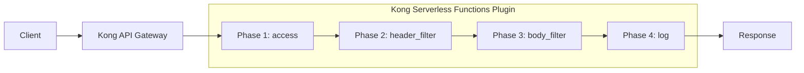

# Kong Serverless

## Introduction

Kong Serverless extends the capabilities of Kong API Gateway by allowing you to run serverless functions directly within the API gateway's request/response lifecycle. This powerful feature eliminates the need for separate function deployments, reducing latency and simplifying your architecture by executing code in response to API requests without managing dedicated servers.

In this guide, you'll learn how to leverage Kong's serverless capabilities to transform your API infrastructure into a more flexible, scalable, and event-driven system.

## What is Serverless Computing?

Serverless computing is a cloud execution model where cloud providers dynamically manage the allocation of machine resources. This allows developers to focus on writing code without worrying about server provisioning, scaling, or maintenance.

Key benefits include:

- **Cost efficiency**: Pay only for actual computation time
- **Automatic scaling**: Handle varying workloads without manual intervention
- **Reduced operational complexity**: No server management required
- **Faster time to market**: Focus on code, not infrastructure

## Kong Serverless Plugins

Kong offers two primary plugins for serverless functionality:

1. **Kong Serverless Functions**: Run Lua code snippets within Kong's request/response lifecycle
2. **AWS Lambda Plugin**: Invoke AWS Lambda functions from Kong

Let's explore each of these approaches in detail.

## Kong Serverless Functions Plugin

The Serverless Functions plugin allows you to write custom Lua code that Kong will execute during the request/response lifecycle.

### How It Works



The plugin executes your Lua code at one or more of these phases:

- **access**: Before the request reaches the upstream service
- **header_filter**: After receiving headers from the upstream service
- **body_filter**: After receiving the response body from the upstream service
- **log**: After the response has been sent to the client

### Installation

To use the Serverless Functions plugin, first ensure it's properly installed:

```bash
# Using Kong package manager
$ kong config --plugin serverless-functions

# Or add it to your kong.conf
plugins = bundled,serverless-functions
```

### Basic Configuration

Here's how to configure the plugin using the Admin API:

```bash
$ curl -X POST http://localhost:8001/services/my-service/plugins \
  --data "name=serverless-functions" \
  --data "config.access[1]=return kong.response.exit(200, { message = 'Hello World from Kong!' })"
```

This simple example intercepts all requests and returns a custom "Hello World" response.

### Example: Request Transformation

Let's create a serverless function that transforms incoming requests:

```lua
-- access phase function
return function(conf)
  -- Get request details
  local body = kong.request.get_body()
  local headers = kong.request.get_headers()
  
  -- Log for debugging
  kong.log.inspect(body)
  kong.log.inspect(headers)
  
  -- Transform the request 
  if body.operation == "uppercase" and body.input then
    -- Modify the request before it reaches upstream
    body.input = string.upper(body.input)
    kong.service.request.set_body(body)
  end
end
```

### Example: Response Transformation

This function modifies the response from an upstream service:

```lua
-- header_filter phase function
return function(conf)
  -- Add a custom header to all responses
  kong.response.set_header("X-Processed-By", "Kong-Serverless")
end

-- body_filter phase function
return function(conf)
  local body = kong.response.get_raw_body()
  
  -- Assuming JSON response
  if body then
    local json = require "cjson"
    local data = json.decode(body)
    
    -- Add a timestamp to all responses
    data.processed_at = os.time()
    
    -- Replace the response body
    kong.response.set_raw_body(json.encode(data))
  end
end
```

## AWS Lambda Integration

For more complex functions or to leverage existing serverless infrastructure, Kong provides an AWS Lambda plugin.

### Configuration

First, install and configure the AWS Lambda plugin:

```bash
$ curl -X POST http://localhost:8001/services/my-service/plugins \
  --data "name=aws-lambda" \
  --data "config.aws_key=YOUR_AWS_KEY" \
  --data "config.aws_secret=YOUR_AWS_SECRET" \
  --data "config.aws_region=us-east-1" \
  --data "config.function_name=my-lambda-function"
```

### Example: AWS Lambda Function

Here's a simple Node.js AWS Lambda function that could be invoked by Kong:

```javascript
exports.handler = async (event, context) => {
  // Kong passes request data in the event object
  console.log('Received event:', JSON.stringify(event, null, 2));
  
  // Process the request
  const body = JSON.parse(event.body || '{}');
  const result = {
    message: 'Processed by AWS Lambda',
    input: body,
    timestamp: new Date().toISOString()
  };
  
  // Return response to Kong
  return {
    statusCode: 200,
    body: JSON.stringify(result),
    headers: {
      'Content-Type': 'application/json'
    }
  };
};
```

## Real-World Use Cases

Let's explore practical applications of Kong Serverless:

### 1. Authentication and Authorization

Implement custom authentication logic without deploying a separate service:

```lua
return function(conf)
  -- Get the Authorization header
  local auth_header = kong.request.get_header("Authorization")
  
  if not auth_header then
    return kong.response.exit(401, { message = "Authentication required" })
  end
  
  -- Extract token (assuming Bearer token)
  local _, _, token = string.find(auth_header, "Bearer%s+(.+)")
  
  if not token then
    return kong.response.exit(401, { message = "Invalid token format" })
  end
  
  -- Validate token (simplified example)
  if token ~= "valid-secret-token" then
    return kong.response.exit(403, { message = "Invalid credentials" })
  end
  
  -- Add custom headers for upstream services
  kong.service.request.set_header("X-Consumer-ID", "user-123")
  kong.service.request.set_header("X-Consumer-Role", "admin")
end
```

### 2. Request Rate Limiting with Dynamic Rules

Implement custom rate limiting logic based on business rules:

```lua
return function(conf)
  -- Get client IP
  local client_ip = kong.client.get_forwarded_ip()
  
  -- Get user tier from request header
  local user_tier = kong.request.get_header("X-User-Tier") or "free"
  
  -- Set rate limits based on tier
  local limits = {
    free = 10,
    basic = 100,
    premium = 1000
  }
  
  local limit = limits[user_tier] or limits.free
  
  -- Use Kong's shared memory to track requests
  local redis = require "resty.redis"
  local red = redis:new()
  red:connect("redis", 6379)
  
  local key = "ratelimit:" .. client_ip .. ":" .. user_tier
  local current = red:get(key) or 0
  
  if tonumber(current) >= limit then
    return kong.response.exit(429, { message = "Rate limit exceeded" })
  end
  
  -- Increment counter and set expiry
  red:incr(key)
  red:expire(key, 3600)  -- 1 hour window
  
  -- Add headers to inform client about rate limits
  kong.response.set_header("X-RateLimit-Limit", limit)
  kong.response.set_header("X-RateLimit-Remaining", limit - tonumber(current) - 1)
end
```

### 3. Content Filtering and Validation

Filter and validate incoming requests to protect your APIs:

```lua
return function(conf)
  -- Get the request body
  local body = kong.request.get_body()
  
  -- Don't proceed if there's no body
  if not body then
    return
  end
  
  -- Check for malicious content (simplified example)
  local contains_script = false
  
  if type(body) == "table" then
    local json = require "cjson"
    local body_str = json.encode(body)
    contains_script = string.find(body_str, "<script>") ~= nil
  elseif type(body) == "string" then
    contains_script = string.find(body, "<script>") ~= nil
  end
  
  if contains_script then
    return kong.response.exit(400, { message = "Potentially malicious content detected" })
  end
  
  -- Validate required fields for specific endpoints
  local route_path = kong.request.get_path()
  
  if route_path == "/api/users" and kong.request.get_method() == "POST" then
    if not body.email or not body.name then
      return kong.response.exit(400, { 
        message = "Missing required fields",
        required = {"email", "name"}
      })
    end
    
    -- Validate email format
    local email_pattern = "^[%w+%.%-_]+@[%w+%.%-_]+%.%a%a+$"
    if not string.match(body.email, email_pattern) then
      return kong.response.exit(400, { message = "Invalid email format" })
    end
  end
end
```

## Best Practices

When working with Kong Serverless Functions, follow these best practices:

1. **Keep functions small and focused**: Large functions increase latency and complexity
2. **Use appropriate phases**: Choose the correct lifecycle phase for your logic
3. **Consider performance**: Optimize your code for low latency
4. **Handle errors gracefully**: Implement proper error handling
5. **Use caching**: Cache expensive operations to improve performance
6. **Monitor and log**: Add detailed logging for troubleshooting
7. **Security first**: Validate all inputs and sanitize outputs
8. **Version control**: Manage your functions with proper versioning

## Deployment Strategies

There are several approaches to deploying Kong Serverless Functions:

### 1. Admin API (for testing)

```bash
$ curl -X POST http://localhost:8001/services/my-service/plugins \
  --data "name=serverless-functions" \
  --data "config.access[1]=return function() kong.log('Hello World') end"
```

### 2. Declarative Configuration (DB-less mode)

```yaml
# kong.yml
services:
- name: my-service
  url: http://upstream-service
  plugins:
  - name: serverless-functions
    config:
      access:
      - |
        return function(conf)
          kong.log('Executing serverless function')
          -- Your code here
        end
```

### 3. External File Loading

For more complex functions, store them in separate files:

```lua
-- /etc/kong/functions/my-function.lua
return function(conf)
  -- Complex logic here
  kong.log('Executing function from file')
end
```

Then reference the file in your configuration:

```yaml
plugins:
- name: serverless-functions
  config:
    access:
    - /etc/kong/functions/my-function.lua
```

## Debugging and Troubleshooting

When working with Kong Serverless Functions, use these debugging techniques:

### Enable Verbose Logging

```
# In kong.conf
log_level = debug
```

### Use kong.log for Tracing

```lua
return function(conf)
  kong.log.debug("Function executing")
  kong.log.inspect(some_variable)  -- Pretty-prints the variable
  
  -- Try/catch for error handling
  local ok, err = pcall(function()
    -- Your potentially error-prone code
  end)
  
  if not ok then
    kong.log.err("Function error: " .. err)
    return kong.response.exit(500, { error = "Internal error" })
  end
end
```

## Summary

Kong Serverless extends your API gateway with powerful function execution capabilities, allowing you to:

- Execute code directly within Kong's request/response lifecycle
- Implement custom logic without deploying separate microservices
- Integrate with AWS Lambda and other FaaS providers
- Build more flexible, reactive API architectures

By leveraging these capabilities, you can create more responsive, efficient, and maintainable API infrastructures that scale effortlessly with your business needs.

## Additional Resources

To further enhance your Kong Serverless knowledge:

1. Practice implementing authentication logic using Kong Serverless Functions
2. Try creating a request transformation flow to handle different API versions
3. Experiment with integrating Kong with AWS Lambda for more complex processing

**Next Steps:**
- Explore Kong's performance monitoring tools
- Learn about Kong's service mesh capabilities
- Investigate Kong's plugin development framework

With Kong Serverless, you're now equipped to build powerful, scalable API solutions that respond dynamically to your business needs without the complexity of managing traditional server infrastructure.