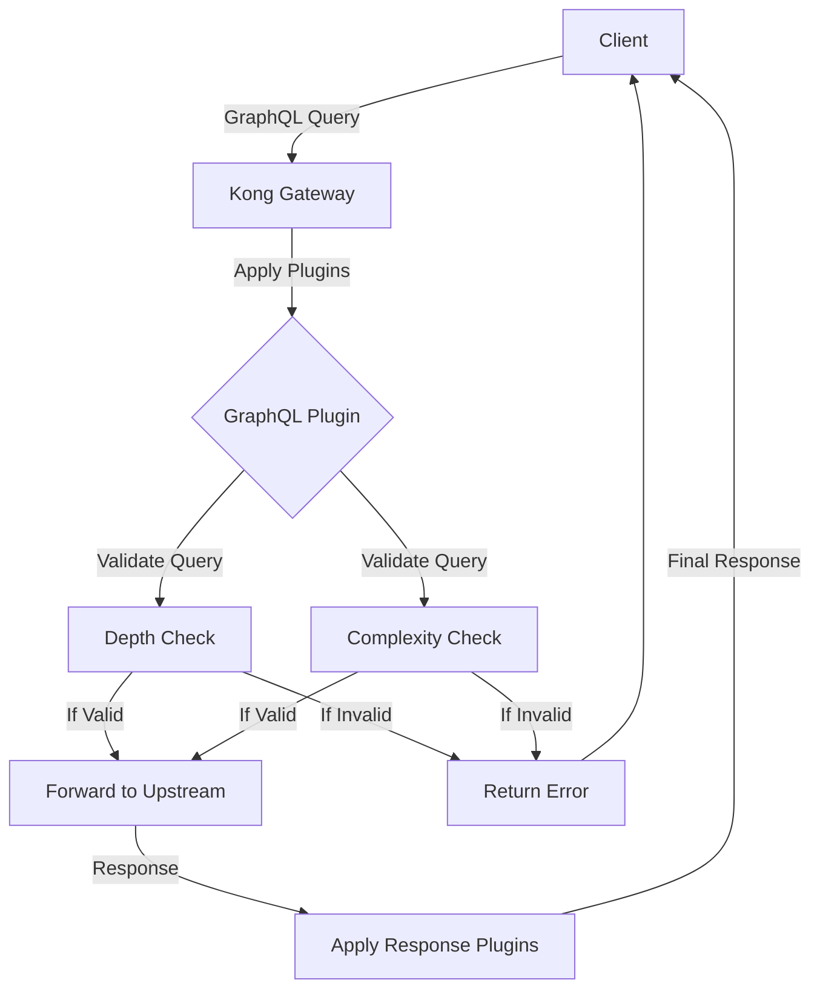

# Kong GraphQL

## Introduction

Kong GraphQL is a powerful plugin that extends Kong API Gateway with GraphQL capabilities, allowing you to proxy and manage GraphQL requests through your Kong infrastructure. GraphQL has become increasingly popular for APIs because it enables clients to request exactly the data they need, reducing over-fetching and under-fetching of data common in REST APIs.

This guide will walk you through understanding, implementing, and optimizing GraphQL services using Kong Gateway.

## What is GraphQL?

Before diving into Kong's GraphQL features, let's understand what GraphQL is:

GraphQL is a query language for APIs and a runtime for executing those queries against your data. Unlike REST, which defines endpoints that return fixed data structures, GraphQL provides a more flexible approach:

- Clients can specify exactly which data they need
- Multiple resources can be retrieved in a single request
- The API evolves without versioning

Here's a simple GraphQL query example:

```graphql
{
  user(id: "123") {
    name
    email
    posts {
      title
      published
    }
  }
}
```

This single query retrieves a user and their posts in one request, asking only for the specific fields needed.

## Kong GraphQL Plugin Overview

The Kong GraphQL plugin allows you to:

1. Proxy GraphQL requests to upstream GraphQL servers
2. Apply rate limiting, authentication, and other Kong plugins to GraphQL APIs
3. Cache GraphQL query responses
4. Transform and validate GraphQL requests
5. Monitor GraphQL-specific metrics

## Setting Up Kong GraphQL

### Prerequisites

- Kong Gateway installed and running
- Basic understanding of Kong configuration
- Access to a GraphQL server (or you can use our example)

### Installation

The GraphQL plugin is a premium feature available in Kong Enterprise, but a basic version is also available through Kong's plugin hub.

For Kong Enterprise users, the plugin is bundled with your installation. For open-source users, you'll need to install it separately:

```bash
luarocks install kong-plugin-graphql
```

Then add it to your `kong.conf` file:

```
plugins = bundled,graphql
```

Restart Kong to apply the changes:

```bash
kong restart
```

### Basic Configuration

Let's set up a simple GraphQL proxy service:

1. First, create a Kong service pointing to your GraphQL upstream:

```bash
curl -X POST http://localhost:8001/services \
  --data "name=graphql-example" \
  --data "url=http://example-graphql-server.com/graphql"
```

2. Create a route for this service:

```bash
curl -X POST http://localhost:8001/services/graphql-example/routes \
  --data "paths[]=/graphql"
```

3. Enable the GraphQL plugin on the service:

```bash
curl -X POST http://localhost:8001/services/graphql-example/plugins \
  --data "name=graphql"
```

Now, your Kong Gateway is ready to proxy GraphQL requests to your upstream GraphQL server!

## Advanced Features

### Query Depth Limiting

GraphQL allows deeply nested queries that could potentially overload your server. Kong GraphQL plugin can limit query depth:

```bash
curl -X POST http://localhost:8001/services/graphql-example/plugins \
  --data "name=graphql" \
  --data "config.max_depth=10"
```

This configuration limits GraphQL queries to a maximum nesting depth of 10.

### Query Complexity Limiting

Beyond depth, Kong can calculate the complexity of a GraphQL query and reject those that exceed your limits:

```bash
curl -X POST http://localhost:8001/services/graphql-example/plugins \
  --data "name=graphql" \
  --data "config.max_complexity=100"
```

### GraphQL Introspection Control

Introspection allows clients to query the schema of your GraphQL API. While useful during development, you might want to disable it in production:

```bash
curl -X POST http://localhost:8001/services/graphql-example/plugins \
  --data "name=graphql" \
  --data "config.disable_introspection=true"
```

### Response Caching

Kong's caching plugin works great with GraphQL when configured properly:

```bash
curl -X POST http://localhost:8001/services/graphql-example/plugins \
  --data "name=proxy-cache" \
  --data "config.strategy=memory" \
  --data "config.cache_ttl=300" \
  --data "config.content_type=application/json" \
  --data "config.cache_control=true"
```

This setup caches GraphQL responses for 5 minutes, improving performance for repeated queries.

## Real-World Example: Building a GraphQL API Gateway

Let's put everything together to create a complete GraphQL API gateway that combines multiple services.

### Scenario

Imagine we have:
- A user service with GraphQL at `http://users-service/graphql`
- A product service with GraphQL at `http://products-service/graphql`
- We want to expose them through Kong with proper security

### Implementation Steps

1. Create services for each backend:

```bash
# Users Service
curl -X POST http://localhost:8001/services \
  --data "name=users-graphql" \
  --data "url=http://users-service/graphql"

# Products Service  
curl -X POST http://localhost:8001/services \
  --data "name=products-graphql" \
  --data "url=http://products-service/graphql"
```

2. Create routes for each service:

```bash
curl -X POST http://localhost:8001/services/users-graphql/routes \
  --data "paths[]=/api/users/graphql"

curl -X POST http://localhost:8001/services/products-graphql/routes \
  --data "paths[]=/api/products/graphql"
```

3. Apply the GraphQL plugin to both services with appropriate limits:

```bash
curl -X POST http://localhost:8001/services/users-graphql/plugins \
  --data "name=graphql" \
  --data "config.max_depth=8" \
  --data "config.max_complexity=50"

curl -X POST http://localhost:8001/services/products-graphql/plugins \
  --data "name=graphql" \
  --data "config.max_depth=8" \
  --data "config.max_complexity=50"
```

4. Add authentication using the key-auth plugin:

```bash
curl -X POST http://localhost:8001/services/users-graphql/plugins \
  --data "name=key-auth"

curl -X POST http://localhost:8001/services/products-graphql/plugins \
  --data "name=key-auth"
```

5. Add rate limiting to prevent abuse:

```bash
curl -X POST http://localhost:8001/services/users-graphql/plugins \
  --data "name=rate-limiting" \
  --data "config.minute=60" \
  --data "config.hour=1000"

curl -X POST http://localhost:8001/services/products-graphql/plugins \
  --data "name=rate-limiting" \
  --data "config.minute=60" \
  --data "config.hour=1000"
```

Now you have a secure, rate-limited GraphQL API gateway that proxies requests to multiple backend services!

### Client Usage Example

Clients can now query your GraphQL services with an API key:

```bash
curl -X POST http://kong-gateway:8000/api/users/graphql \
  -H "apikey: YOUR_API_KEY" \
  -H "Content-Type: application/json" \
  --data '{"query": "{ user(id: \"123\") { name email } }"}'
```

## GraphQL Request Flow in Kong

Let's visualize how Kong processes GraphQL requests:



## Performance Optimization Tips

1. **Implement Query Caching**: Use Kong's proxy-cache plugin for frequently executed queries.

2. **Use Request Transformation**: For common queries, transform simple HTTP GET requests into full GraphQL queries on the gateway side.

3. **Monitor GraphQL Performance**: Enable the Prometheus plugin to track GraphQL-specific metrics:

```bash
curl -X POST http://localhost:8001/services/graphql-example/plugins \
  --data "name=prometheus"
```

4. **Implement Query Batching**: Allow multiple queries to be sent in a single request to reduce network overhead.

5. **Consider Persisted Queries**: For production environments, use persisted queries where clients send query IDs instead of full query strings.

## Troubleshooting Common Issues

### Issue: GraphQL Requests Failing with 400 Errors

- Check if your query is properly formatted JSON
- Ensure the GraphQL syntax is correct
- Verify the query doesn't exceed depth or complexity limits

### Issue: High Latency on GraphQL Requests

- Implement caching as described above
- Check if upstream GraphQL service is performing well
- Consider query optimization or limiting requested fields

### Issue: Authentication Failures

- Ensure authentication headers are correctly passed to Kong
- Check if the authentication plugin is properly configured
- Verify the API key or credentials are valid

## Summary

Kong GraphQL extends Kong Gateway with powerful GraphQL capabilities, allowing you to:

- Securely proxy GraphQL requests to upstream services
- Apply rate limiting and depth restrictions to prevent abuse
- Cache GraphQL responses for improved performance
- Monitor and optimize GraphQL traffic

By implementing Kong GraphQL, you can bring the benefits of Kong's API management features to your GraphQL services, ensuring they are secure, observable, and scalable.

## Additional Resources

- [Kong Enterprise Documentation](https://docs.konghq.com/enterprise/)
- [GraphQL Official Documentation](https://graphql.org/learn/)
- [Kong GraphQL Plugin Repository](https://github.com/Kong/kong-plugin-graphql)

## Practice Exercises

1. Set up a basic Kong GraphQL proxy to a public GraphQL API like GitHub's API.
2. Implement depth limiting and observe how it affects complex queries.
3. Configure caching for GraphQL queries and measure the performance improvement.
4. Create a security layer with authentication and rate limiting for your GraphQL API.
5. Use Kong's request transformer plugin to modify GraphQL queries before they reach the upstream.