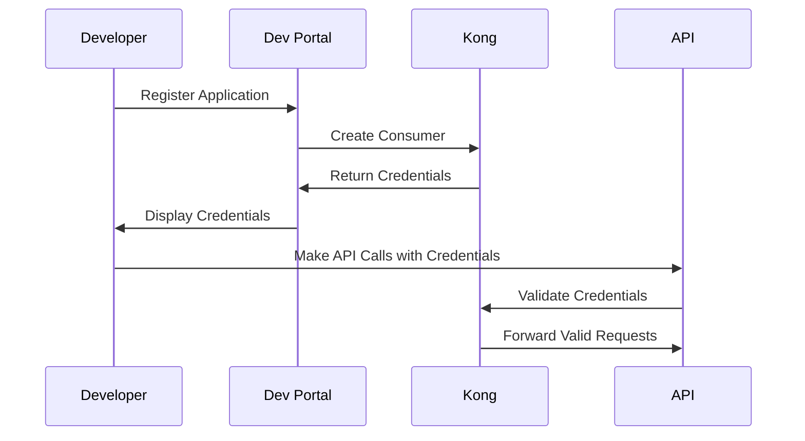

# Kong Dev Portal

## Introduction

The Kong Developer Portal (Dev Portal) is a powerful feature of Kong Gateway that allows organizations to create a customized portal for API consumers. It serves as a centralized hub where developers can discover, explore, and consume your APIs. The Dev Portal bridges the gap between API providers and consumers by offering comprehensive documentation, interactive API testing capabilities, and streamlined developer onboarding.

In today's API-driven ecosystem, providing a polished developer experience is crucial for API adoption and success. The Kong Dev Portal addresses this need by giving API providers tools to create an attractive, functional interface for their APIs while providing API consumers with everything they need to successfully integrate with your services.

## Key Features of Kong Dev Portal

### 1. API Documentation

The Dev Portal enables you to create and publish comprehensive documentation for your APIs. This documentation can include:

- OpenAPI (Swagger) specifications
- Markdown documentation
- Custom pages with HTML/CSS/JavaScript
- Interactive API consoles for testing

### 2. Developer Onboarding

Streamline the onboarding process for API consumers with:

- Self-service registration
- Application creation and management
- API key generation and management
- OAuth2 client credentials management

### 3. Analytics and Monitoring

Track how developers are using your APIs with:

- Developer activity dashboards
- API usage metrics
- Registration and engagement statistics

### 4. Customization

Tailor the portal to match your brand with:

- Custom themes and styling
- Personalized layouts
- Custom domains
- Localization options

## Getting Started with Kong Dev Portal

Let's walk through setting up and configuring the Kong Dev Portal:

### Prerequisites

- Kong Gateway Enterprise installed and running
- Admin access to Kong Gateway
- Basic understanding of Kong concepts (Services, Routes)

### Step 1: Enable the Dev Portal

First, you need to enable the Dev Portal in your Kong configuration. Edit your `kong.conf` file:

```
portal = on
portal_auth = basic-auth
portal_auto_approve = on
```

Restart Kong to apply the changes:

```bash
$ kong restart
```

### Step 2: Create Your First Portal

You can create and manage your Dev Portal using Kong Manager or the Admin API.

Using the Admin API:

```bash
# Enable the Dev Portal for a workspace
$ curl -X PATCH http://localhost:8001/workspaces/default \
  --data "config.portal=true"
```

### Step 3: Customizing Your Portal

#### Adding Documentation

The Dev Portal supports Markdown files for documentation. Create a file named `getting-started.md`:

```markdown
# Getting Started

This guide will help you start using our API.

## Authentication

All API requests require authentication using an API key.
```

You can upload this file via the Kong Manager UI or using the Admin API:

```bash
$ curl -X POST http://localhost:8001/files \
  -F "file=@getting-started.md" \
  -F "path=content/documentation/getting-started.md"
```

#### Setting Up OpenAPI Specifications

The Dev Portal can automatically generate API reference documentation from OpenAPI specifications:

```bash
$ curl -X POST http://localhost:8001/files \
  -F "file=@openapi.yaml" \
  -F "path=specs/user-api.yaml"
```

#### Customizing the Theme

You can customize the look and feel of your Dev Portal by modifying CSS files:

```css
/* custom.css */
:root {
  --theme-primary-color: #2c3e50;
  --theme-secondary-color: #3498db;
}

.header {
  background-color: var(--theme-primary-color);
  color: white;
}
```

Upload your custom CSS:

```bash
$ curl -X POST http://localhost:8001/files \
  -F "file=@custom.css" \
  -F "path=themes/default/custom.css"
```

## Developer Portal Authentication

Kong Dev Portal supports multiple authentication methods to secure your portal:

### Basic Authentication

The simplest authentication method:

```
portal_auth = basic-auth
```

### Key Authentication

For API key-based authentication:

```
portal_auth = key-auth
```

### OIDC Authentication

For integration with OAuth 2.0/OpenID Connect providers:

```
portal_auth = openid-connect
portal_auth_conf = { \
  "issuer": "https://auth.example.com/", \
  "client_id": "your-client-id", \
  "client_secret": "your-client-secret", \
  "consumer_claim": "sub" \
}
```

## Managing Developer Access

Kong Dev Portal offers several features for managing developer access:

### Developer Registration

Developers can self-register through the portal. You can control this process with:

```
portal_auto_approve = off  # Require manual approval
```

### Managing Developers via the Admin API

```bash
# List all developers
$ curl http://localhost:8001/developers

# Approve a developer
$ curl -X PATCH http://localhost:8001/developers/john.doe@example.com \
  --data "status=approved"
```

## Application Registration

Developers can register applications that will use your APIs:



## Customizing Portal Content

Let's look at how to create custom pages and content:

### Custom Pages

Create a file named `custom-page.md`:

```markdown
---
title: Custom Page
---

# Welcome to our custom page

This is a custom page in our developer portal.

<div className="custom-component">
  This is a custom component.
</div>
```

Upload this file:

```bash
$ curl -X POST http://localhost:8001/files \
  -F "file=@custom-page.md" \
  -F "path=content/pages/custom-page.md"
```

### Custom Layouts

You can create custom layouts using the `partials` feature:

```html
<!-- header.html -->
<header>
  <div className="logo">
    
  </div>
  <nav>
    <ul>
      <li><a href="$url/documentation">Documentation</a></li>
      <li><a href="$url/apis">APIs</a></li>
      <li><a href="$url/support">Support</a></li>
    </ul>
  </nav>
</header>
```

Upload the partial:

```bash
$ curl -X POST http://localhost:8001/files \
  -F "file=@header.html" \
  -F "path=partials/header.html"
```

## Example: Creating a Complete API Documentation Page

Let's put everything together to create a complete API documentation page:

1. First, create your OpenAPI specification file (`user-api.yaml`):

```yaml
openapi: 3.0.0
info:
  title: User Management API
  version: 1.0.0
  description: API for managing user accounts
paths:
  /users:
    get:
      summary: List all users
      responses:
        '200':
          description: A list of users
          content:
            application/json:
              schema:
                type: array
                items:
                  $ref: '#/components/schemas/User'
    post:
      summary: Create a new user
      requestBody:
        required: true
        content:
          application/json:
            schema:
              $ref: '#/components/schemas/NewUser'
      responses:
        '201':
          description: User created
components:
  schemas:
    User:
      type: object
      properties:
        id:
          type: string
        username:
          type: string
        email:
          type: string
    NewUser:
      type: object
      required:
        - username
        - email
        - password
      properties:
        username:
          type: string
        email:
          type: string
        password:
          type: string
```

2. Create a documentation page (`user-api.md`):

```markdown
---
title: User Management API
---

# User Management API

The User Management API allows you to create, read, update, and delete user accounts in our system.

## Authentication

All endpoints require authentication using an API key. Include your API key in the `apikey` header:

```bash
curl -H "apikey: your-api-key" https://api.example.com/users
```

## Rate Limiting

This API is rate limited to 100 requests per minute.

### Example: Creating a new user

Request:

```bash
curl -X POST https://api.example.com/users \
  -H "apikey: your-api-key" \
  -H "Content-Type: application/json" \
  -d '{
    "username": "johndoe",
    "email": "john.doe@example.com",
    "password": "s3cur3p@ssw0rd"
  }'
```

Response:

```json
{
  "id": "usr_123abc",
  "username": "johndoe",
  "email": "john.doe@example.com",
  "created_at": "2023-07-21T14:30:00Z"
}
```

## Error Handling

The API uses standard HTTP status codes and returns error details in the response body:

```json
{
  "error": "validation_error",
  "message": "Email is not valid",
  "details": {
    "field": "email",
    "constraint": "format"
  }
}
```
```

3. Upload both files to your Dev Portal:

```bash
$ curl -X POST http://localhost:8001/files \
  -F "file=@user-api.yaml" \
  -F "path=specs/user-api.yaml"

$ curl -X POST http://localhost:8001/files \
  -F "file=@user-api.md" \
  -F "path=content/documentation/user-api.md"
```

## Deploying Your Dev Portal to Production

When deploying to production, consider these best practices:

1. **Use HTTPS**: Always secure your Dev Portal with SSL/TLS
   ```
   portal_gui_protocol = https
   portal_gui_host = developers.example.com
   ```

2. **Configure Email**: Set up email for developer registrations and notifications
   ```
   portal_invite_email = on
   portal_reset_password_email = on
   portal_emails_from = no-reply@example.com
   portal_emails_reply_to = support@example.com
   ```

3. **Backup Your Portal Content**: Regularly backup your portal files
   ```bash
   $ curl http://localhost:8001/files | jq > portal_backup.json
   ```

4. **Monitor Portal Usage**: Keep track of developer and portal activity
   ```bash
   $ curl http://localhost:8001/workspaces/default/dashboard | jq
   ```

## Advanced Topics

### Integrating with CI/CD

You can automate the deployment of your Dev Portal content using CI/CD pipelines:

```bash
#!/bin/bash
# Example script for updating Dev Portal in CI/CD

# Upload OpenAPI specifications
for spec in specs/*.yaml; do
  filename=$(basename $spec)
  curl -X POST $KONG_ADMIN_URL/files \
    -F "file=@$spec" \
    -F "path=specs/$filename"
done

# Upload documentation
for doc in docs/*.md; do
  filename=$(basename $doc)
  curl -X POST $KONG_ADMIN_URL/files \
    -F "file=@$doc" \
    -F "path=content/documentation/$filename"
done
```

### Custom Plugins for Dev Portal

You can extend the Dev Portal functionality using custom plugins. For example, a feedback plugin:

```javascript
// feedback.js
(function() {
  const feedbackForm = document.createElement('div');
  feedbackForm.className = 'feedback-form';
  feedbackForm.innerHTML = `
    <h3>Was this helpful?</h3>
    <button class="thumbs-up">👍</button>
    <button class="thumbs-down">👎</button>
  `;
  
  document.querySelector('.documentation-content').appendChild(feedbackForm);
  
  // Add event listeners for feedback buttons
  feedbackForm.querySelector('.thumbs-up').addEventListener('click', function() {
    // Send positive feedback
    fetch('/feedback', {
      method: 'POST',
      body: JSON.stringify({ page: window.location.pathname, rating: 'positive' })
    });
    alert('Thank you for your feedback!');
  });
  
  feedbackForm.querySelector('.thumbs-down').addEventListener('click', function() {
    // Show feedback form for negative ratings
    const reason = prompt('How can we improve this page?');
    if (reason) {
      fetch('/feedback', {
        method: 'POST',
        body: JSON.stringify({ page: window.location.pathname, rating: 'negative', reason })
      });
      alert('Thank you for your feedback!');
    }
  });
})();
```

Upload this JavaScript file:

```bash
$ curl -X POST http://localhost:8001/files \
  -F "file=@feedback.js" \
  -F "path=assets/js/feedback.js"
```

Then reference it in your portal configuration.

## Summary

The Kong Developer Portal is a powerful tool for API providers to create engaging, interactive documentation for their APIs. By following the steps in this guide, you can:

1. Set up and configure your own Dev Portal
2. Customize the appearance and content to match your brand
3. Provide comprehensive API documentation using OpenAPI specifications
4. Manage developer access and application registration
5. Deploy your portal to production with security best practices

A well-designed Dev Portal enhances the developer experience, increases API adoption, and reduces support overhead by providing clear, accessible documentation and self-service capabilities.

## Additional Resources

- Kong Dev Portal [Official Documentation](https://docs.konghq.com/enterprise/latest/developer-portal/)
- [OpenAPI Specification](https://swagger.io/specification/)
- [Markdown Guide](https://www.markdownguide.org/basic-syntax/)

## Exercises

1. Set up a basic Dev Portal with Kong Gateway Enterprise
2. Create documentation for a sample API using OpenAPI and Markdown
3. Customize the Dev Portal theme to match a specified brand
4. Implement a custom application registration workflow
5. Create a CI/CD pipeline to automatically update Dev Portal content

By completing these exercises, you'll gain practical experience with all aspects of the Kong Dev Portal and be able to create an effective, professional API portal for your own APIs.