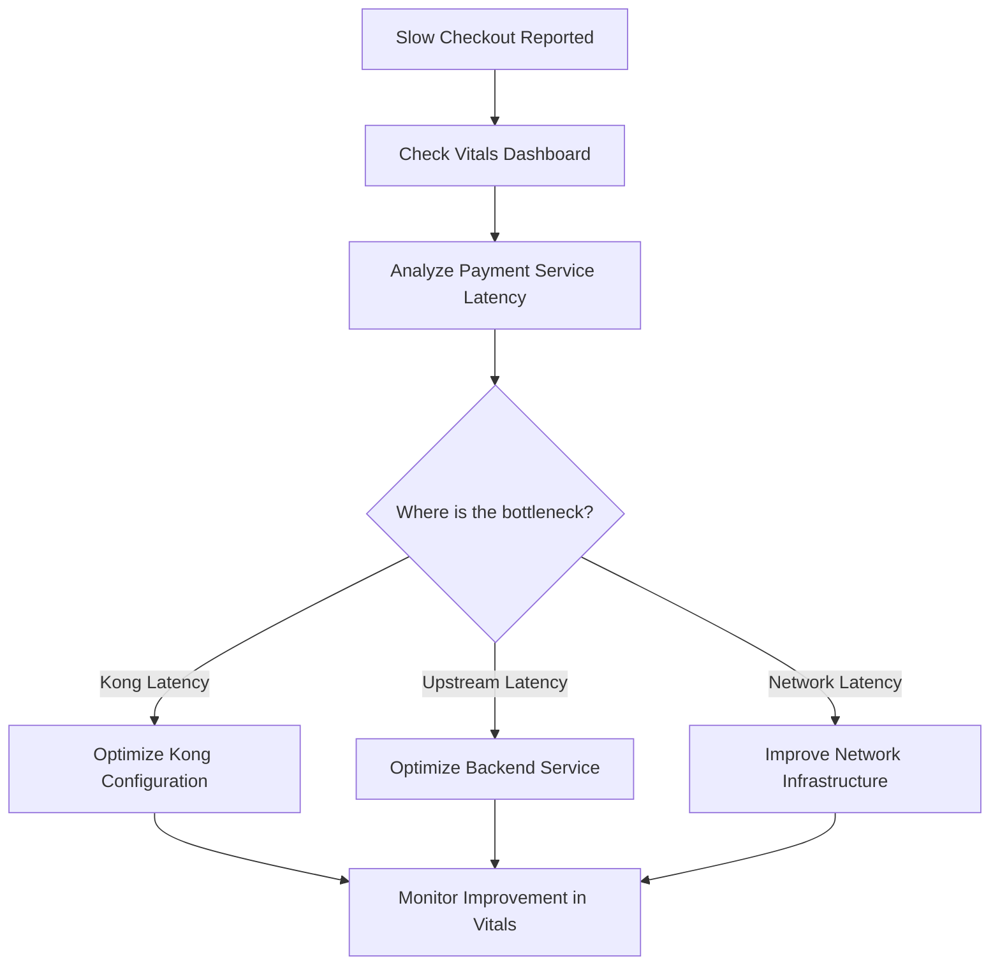

# Kong Vitals

## Introduction

Kong Vitals is a powerful monitoring and analytics feature available in Kong Enterprise that provides real-time visibility into the health and performance of your API gateway. By collecting and visualizing key metrics about your API traffic, Kong Vitals helps you understand usage patterns, identify performance bottlenecks, and make data-driven decisions to optimize your API infrastructure.

Think of Kong Vitals as a health monitoring system for your APIs - just as a doctor monitors vital signs to assess a patient's health, Kong Vitals tracks essential metrics to evaluate the health of your API ecosystem.

## Understanding Kong Vitals

### What is Kong Vitals?

Kong Vitals is a built-in analytics platform that automatically collects, processes, and displays metrics about the traffic flowing through your Kong API gateway. These metrics provide insights into:

- Request volume and patterns
- Response status codes
- Latency information
- Most used services and routes
- Consumer activity
- Potential issues and anomalies

### Why Use Kong Vitals?

For beginners working with APIs, monitoring is often an afterthought. However, having visibility into your API traffic is crucial for:

1. **Performance Optimization**: Identify slow endpoints and optimize them
2. **Troubleshooting**: Quickly detect and resolve issues
3. **Capacity Planning**: Understand traffic patterns to scale appropriately
4. **Security Monitoring**: Detect unusual activity that might indicate security threats
5. **Business Intelligence**: Gain insights into API usage to inform product decisions

## Setting Up Kong Vitals

Kong Vitals comes pre-configured in Kong Enterprise, but you need to ensure it's properly enabled. Let's walk through the basic setup:

### Prerequisites

- Kong Enterprise installed and running
- Admin access to the Kong Manager interface or Admin API

### Enabling Kong Vitals

You can enable Kong Vitals through the Kong configuration file (`kong.conf`):

```bash
# Add this to your kong.conf file
vitals = on
```

Alternatively, you can use an environment variable:

```bash
export KONG_VITALS=on
```

After changing the configuration, restart Kong to apply the changes:

```bash
kong restart
```

### Verifying Vitals is Active

To check if Vitals is running properly, you can make a request to the Admin API:

```bash
curl -X GET http://localhost:8001/vitals/status
```

Expected output:

```json
{
  "vitals_status": "enabled",
  "vitals_metrics": {
    "cluster": "enabled",
    "node": "enabled"
  }
}
```

## Key Metrics Provided by Kong Vitals

Kong Vitals collects and displays several categories of metrics. Let's explore the most important ones:

### 1. Traffic Metrics

These metrics show the volume and patterns of requests flowing through your Kong gateway:

- **Total Requests**: Number of API requests processed
- **Request Rate**: Requests per second over time
- **Status Codes**: Distribution of HTTP status codes (2xx, 4xx, 5xx)

### 2. Performance Metrics

These metrics help you understand the responsiveness of your APIs:

- **Latency**: Time taken to process requests
- **Upstream Latency**: Time taken by your backend services to respond
- **Kong Latency**: Processing time added by Kong itself

### 3. Consumer Metrics

These metrics provide insights about API consumers:

- **Top Consumers**: Most active API consumers
- **Consumer Requests**: Request volume by consumer
- **Consumer Errors**: Error rates by consumer

### 4. Service and Route Metrics

These metrics help you understand which parts of your API are most used:

- **Top Services**: Most frequently accessed services
- **Top Routes**: Most frequently accessed routes
- **Service Health**: Error rates and latency by service

## Accessing Kong Vitals Dashboard

Kong Vitals data can be accessed in two primary ways:

### 1. Kong Manager UI

The easiest way to view Vitals data is through the Kong Manager interface:

1. Log in to Kong Manager (typically at `http://localhost:8002`)
2. Navigate to the "Vitals" section in the main menu
3. Explore the different dashboards and visualizations

### 2. Vitals API

You can also access Vitals data programmatically through the Admin API:

```bash
# Get overview of vitals data
curl -X GET http://localhost:8001/vitals

# Get specific metrics for the last hour
curl -X GET http://localhost:8001/vitals/reports/status-code-families?interval=hour
```

Example API response for status codes:

```json
{
  "meta": {
    "level": "cluster",
    "metric": "status_code_families",
    "interval": "hour",
    "start": 1649876400,
    "end": 1649880000
  },
  "data": [
    {
      "timestamp": 1649876400,
      "values": {
        "2xx": 8562,
        "4xx": 127,
        "5xx": 14
      }
    },
    {
      "timestamp": 1649877300,
      "values": {
        "2xx": 9145,
        "4xx": 86,
        "5xx": 3
      }
    }
  ]
}
```

## Practical Applications of Kong Vitals

Let's explore some real-world scenarios where Kong Vitals provides valuable insights:

### Scenario 1: Identifying API Performance Issues

Imagine you're running an e-commerce platform and customers report slow checkout experiences. Using Kong Vitals, you can:

1. Check the latency metrics for your payment service
2. Identify specific routes with high latency
3. Determine if the issue is in Kong (Kong latency) or in your backend service (upstream latency)
4. Take appropriate action to optimize the slow components



### Scenario 2: Traffic Capacity Planning

As your API usage grows, you need to plan for increased capacity. Kong Vitals helps you:

1. Analyze traffic patterns over time (daily, weekly, monthly)
2. Identify peak usage periods
3. Plan scaling strategies based on actual usage data
4. Measure the impact of scaling efforts

### Scenario 3: Security Monitoring

Unusual API traffic patterns can indicate security threats. With Kong Vitals, you can:

1. Establish baseline traffic patterns
2. Set up alerts for unusual spikes in requests
3. Monitor for increases in error rates
4. Identify suspicious consumer behavior (e.g., a single consumer suddenly making many requests)

## Advanced Kong Vitals Features

As you become more comfortable with basic monitoring, Kong Vitals offers more advanced capabilities:

### Data Visualization

Kong Vitals provides various visualization options:

- Line charts for time-series data
- Bar charts for comparing metrics across services
- Heat maps for identifying patterns
- Tables for detailed data analysis

### Custom Time Ranges

You can analyze data over different time periods:

- Last hour for real-time monitoring
- Last day for identifying recent trends
- Last week or month for long-term pattern analysis

### Data Export

Export Vitals data for further analysis:

```bash
# Export data to a CSV file
curl -X GET http://localhost:8001/vitals/reports/status-code-families?interval=day -H "Accept: text/csv" > status_codes.csv
```

## Best Practices for Using Kong Vitals

To get the most value from Kong Vitals, follow these best practices:

1. **Set Baselines**: Understand what "normal" looks like for your APIs
2. **Create Dashboards**: Set up customized views for different stakeholders
3. **Implement Alerts**: Configure alerts for abnormal conditions
4. **Regular Reviews**: Schedule periodic reviews of trends and patterns
5. **Combine with Logging**: Use Vitals alongside detailed logging for comprehensive monitoring
6. **Response Planning**: Develop response plans for common issues identified through Vitals

## Code Example: Working with the Vitals API

Let's create a simple Node.js script that fetches Vitals data and generates a basic report:

```javascript
const axios = require('axios');
const fs = require('fs');

// Configuration
const KONG_ADMIN_URL = 'http://localhost:8001';
const REPORT_FILE = 'vitals_report.txt';

async function generateVitalsReport() {
  try {
    // Get status code metrics
    const statusResponse = await axios.get(
      `${KONG_ADMIN_URL}/vitals/reports/status-code-families?interval=hour`
    );
    
    // Get latency metrics
    const latencyResponse = await axios.get(
      `${KONG_ADMIN_URL}/vitals/reports/latency?interval=hour`
    );
    
    // Get top services
    const servicesResponse = await axios.get(
      `${KONG_ADMIN_URL}/vitals/reports/top-services?interval=hour`
    );
    
    // Generate report
    let report = '=== KONG VITALS REPORT ===

';
    report += `Generated: ${new Date().toISOString()}

`;
    
    // Add status code summary
    report += '== STATUS CODES ==
';
    const latestStatusData = statusResponse.data.data[statusResponse.data.data.length - 1];
    report += `Timestamp: ${new Date(latestStatusData.timestamp * 1000).toISOString()}
`;
    report += `2xx Responses: ${latestStatusData.values['2xx'] || 0}
`;
    report += `4xx Responses: ${latestStatusData.values['4xx'] || 0}
`;
    report += `5xx Responses: ${latestStatusData.values['5xx'] || 0}

`;
    
    // Add latency summary
    report += '== LATENCY (ms) ==
';
    const latestLatencyData = latencyResponse.data.data[latencyResponse.data.data.length - 1];
    report += `Avg Kong Latency: ${latestLatencyData.values.kong_latency_avg || 0}
`;
    report += `Avg Upstream Latency: ${latestLatencyData.values.upstream_latency_avg || 0}
`;
    report += `Avg Total Latency: ${latestLatencyData.values.latency_avg || 0}

`;
    
    // Add top services
    report += '== TOP SERVICES ==
';
    const topServices = servicesResponse.data.data[servicesResponse.data.data.length - 1].values;
    Object.keys(topServices).forEach((service, index) => {
      report += `${index + 1}. ${service}: ${topServices[service]} requests
`;
    });
    
    // Write report to file
    fs.writeFileSync(REPORT_FILE, report);
    console.log(`Report generated: ${REPORT_FILE}`);
    
  } catch (error) {
    console.error('Error generating Vitals report:', error.message);
  }
}

// Run the report generator
generateVitalsReport();
```

Running this script will create a text report with key metrics from Kong Vitals.

## Limitations and Considerations

While Kong Vitals is powerful, it's important to understand its limitations:

1. **Storage**: Vitals data is stored in memory and has a limited retention period
2. **Performance Impact**: Collecting detailed metrics can have a small performance impact
3. **Enterprise Only**: Kong Vitals is only available in Kong Enterprise, not in the community edition
4. **Granularity**: Some metrics may not be as detailed as specialized monitoring tools

## Integrating Kong Vitals with External Systems

For more advanced monitoring, you can integrate Kong Vitals with external systems:

### Prometheus Integration

Kong offers a Prometheus plugin that can expose Vitals metrics to Prometheus:

```bash
# Configure the Prometheus plugin
curl -X POST http://localhost:8001/plugins \
  --data "name=prometheus" \
  --data "config.status_code_metrics=true" \
  --data "config.latency_metrics=true" \
  --data "config.upstream_health_metrics=true"
```

### ELK Stack Integration

You can also send Kong logs to the ELK stack (Elasticsearch, Logstash, Kibana) and correlate them with Vitals metrics for deeper insights.

## Summary

Kong Vitals is an essential tool for monitoring the health and performance of your API gateway. By providing real-time insights into traffic patterns, latency, errors, and usage, it helps you ensure your APIs are performing optimally and reliably.

Key takeaways from this guide:

1. Kong Vitals offers comprehensive API monitoring with minimal configuration
2. It provides insights into traffic, performance, consumers, and services
3. The data can be accessed through the Kong Manager UI or the Admin API
4. Real-world applications include performance troubleshooting, capacity planning, and security monitoring
5. Best practices include establishing baselines and combining Vitals with other monitoring tools

## Additional Resources and Exercises

### Exercises

1. **Basic Setup**: Enable Kong Vitals on your Kong Enterprise instance and verify it's collecting data
2. **Dashboard Exploration**: Create a custom dashboard in Kong Manager focusing on your most critical services
3. **Alert Configuration**: Set up alerts for when error rates exceed a certain threshold
4. **Report Generation**: Extend the provided Node.js script to generate weekly reports and email them to stakeholders
5. **Integration Project**: Integrate Kong Vitals with Grafana for advanced visualization

### Further Learning

- Kong Enterprise Documentation
- API Monitoring Best Practices
- Introduction to Observability for APIs
- Performance Tuning for API Gateways

By mastering Kong Vitals, you'll gain valuable insights into your API ecosystem and be better equipped to maintain high-performing, reliable APIs for your users.