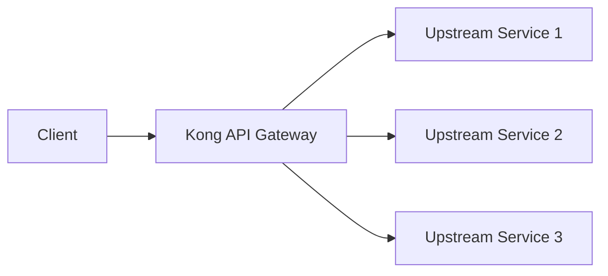

# Kong Docker

## Introduction

Kong is a popular open-source API gateway and microservices management layer that helps you control, secure, and monitor your APIs. Docker provides containerization capabilities that make software deployment consistent and portable. In this guide, we'll explore how to deploy Kong using Docker, combining the power of these two technologies to create a robust API management solution.

Kong's Docker deployment offers several advantages:
- Simplified installation process
- Consistent environment across development and production
- Easy scaling and management
- Reduced configuration overhead

Let's dive into the process of deploying Kong with Docker!

## Prerequisites

Before we begin, make sure you have:

- [Docker](https://www.docker.com/get-started) installed on your system
- Basic familiarity with terminal/command line operations
- Basic understanding of APIs and API gateways
- A text editor for configuration files

## Kong Architecture Overview

Kong acts as a layer between your clients and your upstream APIs/microservices:



When deployed with Docker, the Kong container manages all incoming API requests, applying policies like authentication, rate limiting, and transformations before proxying requests to your backend services.

## Getting Started with Kong Docker

### Step 1: Create a Docker Network

First, let's create a custom Docker network to allow our Kong containers to communicate with each other:

```bash
docker network create kong-net
```

### Step 2: Start a Database (PostgreSQL)

Kong needs a database to store its configuration. Let's run a PostgreSQL container:

```bash
docker run -d --name kong-database \
  --network=kong-net \
  -p 5432:5432 \
  -e "POSTGRES_USER=kong" \
  -e "POSTGRES_DB=kong" \
  -e "POSTGRES_PASSWORD=kongpass" \
  postgres:13
```

### Step 3: Prepare the Kong Database

Run the Kong database migrations:

```bash
docker run --rm \
  --network=kong-net \
  -e "KONG_DATABASE=postgres" \
  -e "KONG_PG_HOST=kong-database" \
  -e "KONG_PG_USER=kong" \
  -e "KONG_PG_PASSWORD=kongpass" \
  kong:latest kong migrations bootstrap
```

### Step 4: Start Kong

Now, let's run the Kong container:

```bash
docker run -d --name kong \
  --network=kong-net \
  -e "KONG_DATABASE=postgres" \
  -e "KONG_PG_HOST=kong-database" \
  -e "KONG_PG_USER=kong" \
  -e "KONG_PG_PASSWORD=kongpass" \
  -e "KONG_PROXY_ACCESS_LOG=/dev/stdout" \
  -e "KONG_ADMIN_ACCESS_LOG=/dev/stdout" \
  -e "KONG_PROXY_ERROR_LOG=/dev/stderr" \
  -e "KONG_ADMIN_ERROR_LOG=/dev/stderr" \
  -e "KONG_ADMIN_LISTEN=0.0.0.0:8001, 0.0.0.0:8444 ssl" \
  -p 8000:8000 \
  -p 8443:8443 \
  -p 8001:8001 \
  -p 8444:8444 \
  kong:latest
```

Let's understand the ports:
- 8000: Kong proxy port for HTTP traffic
- 8443: Kong proxy port for HTTPS traffic
- 8001: Kong Admin API port for HTTP traffic
- 8444: Kong Admin API port for HTTPS traffic

### Step 5: Verify the Installation

Verify that Kong is running by checking the Admin API:

```bash
curl -i http://localhost:8001/
```

You should receive a response like this:

```
HTTP/1.1 200 OK
Access-Control-Allow-Origin: *
Content-Type: application/json; charset=utf-8
Date: Sun, 09 Mar 2025 14:32:16 GMT
Server: kong/3.4.1
Transfer-Encoding: chunked

{
  "plugins": {
    "enabled_in_cluster": [],
    "available_on_server": {
      "response-transformer": true,
      "cors": true,
      ...
    }
  },
  "tagline": "Welcome to Kong",
  "version": "3.4.1",
  ...
}
```

## Running Kong in DB-less Mode

For simpler deployments, Kong can run without a database using declarative configuration:

### Step 1: Create a Configuration File

Create a file named `kong.yml` with the following content:

```yaml
_format_version: "3.0"
_transform: false

services:
  - name: example-service
    url: http://mockbin.org
    routes:
      - name: example-route
        paths:
          - "/example"
```

### Step 2: Run Kong in DB-less Mode

```bash
docker run -d --name kong-dbless \
  -v "$(pwd)/kong.yml:/usr/local/kong/declarative/kong.yml" \
  -e "KONG_DATABASE=off" \
  -e "KONG_DECLARATIVE_CONFIG=/usr/local/kong/declarative/kong.yml" \
  -e "KONG_PROXY_ACCESS_LOG=/dev/stdout" \
  -e "KONG_ADMIN_ACCESS_LOG=/dev/stdout" \
  -e "KONG_PROXY_ERROR_LOG=/dev/stderr" \
  -e "KONG_ADMIN_ERROR_LOG=/dev/stderr" \
  -e "KONG_ADMIN_LISTEN=0.0.0.0:8001, 0.0.0.0:8444 ssl" \
  -p 8000:8000 \
  -p 8443:8443 \
  -p 8001:8001 \
  -p 8444:8444 \
  kong:latest
```

### Step 3: Test the Example Service

Test the configuration by accessing the route:

```bash
curl -i http://localhost:8000/example
```

You should be proxied to the mockbin.org service.

## Using Docker Compose for Kong Deployment

Docker Compose simplifies managing multi-container applications. Let's create a `docker-compose.yml` file for Kong:

```yaml
version: '3'

networks:
  kong-net:
    external: false

services:
  #######################################
  # Postgres: The database used by Kong
  #######################################
  kong-database:
    image: postgres:13
    container_name: kong-database
    networks:
      - kong-net
    environment:
      POSTGRES_USER: kong
      POSTGRES_DB: kong
      POSTGRES_PASSWORD: kongpass
    ports:
      - "5432:5432"
    healthcheck:
      test: ["CMD", "pg_isready", "-U", "kong"]
      interval: 5s
      timeout: 5s
      retries: 5

  #######################################
  # Kong database migration
  #######################################
  kong-migration:
    image: kong:latest
    command: kong migrations bootstrap
    networks:
      - kong-net
    environment:
      KONG_DATABASE: postgres
      KONG_PG_HOST: kong-database
      KONG_PG_USER: kong
      KONG_PG_PASSWORD: kongpass
    depends_on:
      - kong-database

  #######################################
  # Kong: The API Gateway
  #######################################
  kong:
    image: kong:latest
    container_name: kong
    networks:
      - kong-net
    environment:
      KONG_DATABASE: postgres
      KONG_PG_HOST: kong-database
      KONG_PG_USER: kong
      KONG_PG_PASSWORD: kongpass
      KONG_PROXY_ACCESS_LOG: /dev/stdout
      KONG_ADMIN_ACCESS_LOG: /dev/stdout
      KONG_PROXY_ERROR_LOG: /dev/stderr
      KONG_ADMIN_ERROR_LOG: /dev/stderr
      KONG_ADMIN_LISTEN: 0.0.0.0:8001, 0.0.0.0:8444 ssl
    ports:
      - "8000:8000"
      - "8443:8443"
      - "8001:8001"
      - "8444:8444"
    depends_on:
      - kong-migration

  #######################################
  # Konga: Kong Admin UI
  #######################################
  konga:
    image: pantsel/konga:latest
    container_name: konga
    networks:
      - kong-net
    environment:
      NODE_ENV: production
      DB_ADAPTER: postgres
      DB_HOST: kong-database
      DB_USER: kong
      DB_PASSWORD: kongpass
      DB_DATABASE: konga
    ports:
      - "1337:1337"
    depends_on:
      - kong-database
```

Start all services with:

```bash
docker-compose up -d
```

Now you have Kong running with a database and Konga (a GUI admin interface) for easier management.

## Configuring Services and Routes

Once Kong is running, you can configure services and routes using the Admin API:

### Adding a Service

```bash
curl -i -X POST \
  --url http://localhost:8001/services/ \
  --data 'name=example-service' \
  --data 'url=http://mockbin.org'
```

Expected response:

```
HTTP/1.1 201 Created
Content-Type: application/json
{
  "id": "a5fb8d9b-a99d-40e9-9d35-72d42a37d36e",
  "name": "example-service",
  "protocol": "http",
  "host": "mockbin.org",
  "port": 80,
  "path": null,
  ...
}
```

### Adding a Route

```bash
curl -i -X POST \
  --url http://localhost:8001/services/example-service/routes \
  --data 'name=example-route' \
  --data 'paths[]=/example'
```

Expected response:

```
HTTP/1.1 201 Created
Content-Type: application/json
{
  "id": "d35165e2-d03e-461a-bdeb-dad0a112abfe",
  "name": "example-route",
  "protocols": ["http", "https"],
  "paths": ["/example"],
  "service": {
    "id": "a5fb8d9b-a99d-40e9-9d35-72d42a37d36e"
  },
  ...
}
```

### Testing the Route

```bash
curl -i http://localhost:8000/example
```

The request should be proxied to mockbin.org, and you'll see the response.

## Enabling Kong Plugins

One of Kong's powerful features is its plugin system. Let's add a rate limiting plugin:

```bash
curl -i -X POST \
  --url http://localhost:8001/services/example-service/plugins \
  --data 'name=rate-limiting' \
  --data 'config.minute=5' \
  --data 'config.policy=local'
```

Expected response:

```
HTTP/1.1 201 Created
Content-Type: application/json
{
  "id": "ec1a1f6f-2aa4-4e58-93ff-b56368f19b27",
  "name": "rate-limiting",
  "service": {
    "id": "a5fb8d9b-a99d-40e9-9d35-72d42a37d36e"
  },
  "enabled": true,
  "config": {
    "minute": 5,
    "policy": "local",
    ...
  },
  ...
}
```

Now, if you make more than 5 requests to `/example` in a minute, you'll receive a 429 Too Many Requests response.

## Customizing the Kong Docker Image

For advanced use cases, you might need to create a custom Kong image with additional plugins or configurations:

Create a Dockerfile:

```Dockerfile
FROM kong:latest

# Install custom plugins
USER root
RUN luarocks install kong-plugin-myplugin

# Add custom configuration
COPY kong.conf /etc/kong/kong.conf

USER kong
```

Build the custom image:

```bash
docker build -t custom-kong .
```

Use the custom image in your Docker Compose file by changing the image name:

```yaml
kong:
  image: custom-kong
  # rest of the configuration
```

## Advanced Kong Docker Configuration

### Setting Up Environment Variables

Kong can be configured through environment variables:

```bash
docker run -d --name kong \
  -e "KONG_DATABASE=postgres" \
  -e "KONG_PG_HOST=kong-database" \
  -e "KONG_LOG_LEVEL=debug" \
  -e "KONG_PROXY_LISTEN=0.0.0.0:8000, 0.0.0.0:8443 ssl" \
  -e "KONG_ADMIN_LISTEN=0.0.0.0:8001, 0.0.0.0:8444 ssl" \
  -e "KONG_NGINX_WORKER_PROCESSES=2" \
  kong:latest
```

### Using Custom Configuration Files

You can mount a custom `kong.conf` file:

```bash
docker run -d --name kong \
  -v "$(pwd)/kong.conf:/etc/kong/kong.conf" \
  kong:latest
```

Example `kong.conf` content:

```
database = postgres
pg_host = kong-database
log_level = notice
plugins = bundled,custom-plugin
```

### Setting Up HTTPS

To use HTTPS with Kong, you'll need SSL certificates:

```bash
docker run -d --name kong \
  -v "$(pwd)/ssl:/etc/kong/ssl" \
  -e "KONG_SSL_CERT=/etc/kong/ssl/server.crt" \
  -e "KONG_SSL_CERT_KEY=/etc/kong/ssl/server.key" \
  kong:latest
```

## Best Practices for Kong Docker Deployment

1. **Use Volume Mounts for Persistence**: Mount volumes for logs and configuration to prevent data loss during container restarts.

2. **Implement Health Checks**: Add health checks to your Docker Compose file to ensure Kong and its database are healthy.

3. **Use Environment-Specific Configuration**: Create different configuration files for development, testing, and production environments.

4. **Secure the Admin API**: Restrict access to the Admin API by using firewall rules or a reverse proxy.

5. **Monitor Kong**: Set up monitoring for Kong containers using tools like Prometheus and Grafana.

6. **Implement Proper Logging**: Configure logging to facilitate debugging and monitoring.

7. **Use Docker Compose for Local Development**: Docker Compose simplifies local development and testing.

8. **Consider Kong Enterprise**: For production deployments with advanced features, consider Kong Enterprise.

## Troubleshooting

### Common Issues and Solutions

1. **Kong can't connect to the database**:
   - Check if the database container is running
   - Verify the network configuration
   - Ensure the database credentials are correct

   ```bash
   docker logs kong-database
   docker logs kong
   ```

2. **Admin API is not accessible**:
   - Verify that the Admin API port is exposed
   - Check that the Admin API is configured to listen on the correct interface

   ```bash
   docker exec -it kong sh -c "netstat -tlnp"
   ```

3. **Plugin not loading**:
   - Ensure the plugin is installed correctly
   - Check if the plugin is enabled in the Kong configuration

   ```bash
   docker exec -it kong kong config init -p /tmp/
   docker exec -it kong cat /tmp/kong.conf.default | grep plugins
   ```

## Summary

In this guide, we've covered:

- Setting up Kong with Docker
- Using Docker Compose for easier management
- Configuring Kong services, routes, and plugins
- Customizing Kong Docker images
- Advanced configuration options
- Best practices for Kong Docker deployment
- Troubleshooting common issues

Kong with Docker provides a powerful, flexible, and scalable solution for API management. By containerizing your API gateway, you gain the benefits of both technologies—Kong's robust API management capabilities and Docker's simplified deployment and scaling.

## Additional Resources

- [Kong Official Documentation](https://docs.konghq.com/)
- [Kong Docker Hub Page](https://hub.docker.com/_/kong)
- [Kong GitHub Repository](https://github.com/Kong/kong)

## Practice Exercises

1. Set up Kong with Docker using the DB-less mode and configure a service and route.
2. Add at least two different plugins to a Kong service (e.g., rate-limiting and key-auth).
3. Create a custom Docker image for Kong that includes a custom plugin.
4. Configure Kong with HTTPS using self-signed certificates.
5. Set up a complete API gateway with Kong, including authentication, rate limiting, and request transformation.