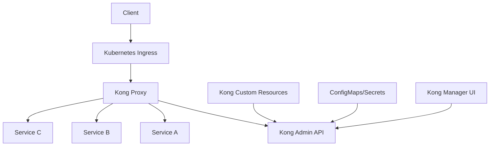

# Kong Kubernetes

## Introduction

Kong is a popular open-source API gateway that helps you manage, secure, and observe your APIs and microservices. When combined with Kubernetes, Kong provides a powerful solution for API management in container orchestration environments. This guide will walk you through the fundamentals of deploying Kong on Kubernetes, configuring its components, and using it to manage API traffic in your cluster.

## What is Kong?

Kong acts as a gateway (or proxy) for your API requests, sitting between clients and your services. It processes incoming API requests, applies policies like authentication or rate limiting, and forwards them to the appropriate backend services.

Key features of Kong include:

- **Traffic Control**: Load balancing, routing, health checks
- **Security**: Authentication, authorization, IP filtering
- **Observability**: Logging, monitoring, analytics
- **Extensibility**: Plugin architecture for custom functionality
- **Performance**: Low latency, high throughput

When deployed on Kubernetes, Kong integrates seamlessly with the container orchestration platform, allowing you to manage API configurations using Kubernetes native resources.

## Kong Architecture on Kubernetes

Let's understand how Kong fits into a Kubernetes environment:



The main components include:

1. **Kong Proxy**: Handles incoming API traffic
2. **Kong Admin API**: Provides configuration management
3. **Kong Custom Resources**: Kubernetes-native way to configure Kong
4. **Kong Manager**: UI for administering Kong (optional)
5. **Kong Database**: Stores Kong configuration (optional for DB-less mode)

## Deployment Options

Kong offers multiple deployment modes on Kubernetes:

### 1. DB-less Mode

In DB-less mode, Kong stores its configuration as Kubernetes resources rather than in a separate database. This approach is simpler to deploy and aligns well with Kubernetes' declarative approach.

### 2. Database Mode

In this mode, Kong uses PostgreSQL or Cassandra to store its configuration. This option is better for complex setups or when migrating from non-Kubernetes Kong deployments.

### 3. Kong Enterprise

Kong Enterprise includes additional features like developer portal, advanced security, and enterprise support.

## Prerequisites

Before deploying Kong on Kubernetes, ensure you have:

- A running Kubernetes cluster (v1.19+)
- `kubectl` installed and configured
- Helm 3 (if using Helm for deployment)
- Basic understanding of Kubernetes concepts

## Installing Kong on Kubernetes

Let's explore the most common method - using Helm to deploy Kong in DB-less mode.

### Using Helm

First, add the Kong Helm repository:

```bash
helm repo add kong https://charts.konghq.com
helm repo update
```

Now, create a values file `kong-values.yaml`:

```yaml
env:
  database: "off" # Use DB-less mode
  
admin:
  enabled: true
  http:
    enabled: true
    servicePort: 8001
    containerPort: 8001

proxy:
  enabled: true
  type: LoadBalancer

ingressController:
  enabled: true
  installCRDs: true
```

Install Kong:

```bash
helm install kong kong/kong -n kong --create-namespace -f kong-values.yaml
```

Check if Kong is running:

```bash
kubectl get pods -n kong
```

Expected output:
```
NAME                            READY   STATUS    RESTARTS   AGE
kong-kong-5c48b6c688-xvthz      2/2     Running   0          3m
```

### Using YAML Manifests

Alternatively, you can deploy Kong using YAML manifests:

```bash
# Create Kong namespace
kubectl create namespace kong

# Apply Kong manifests
kubectl apply -f https://raw.githubusercontent.com/Kong/kubernetes-ingress-controller/main/deploy/single/all-in-one-dbless.yaml
```

## Configuring Kong Gateway

Once Kong is installed, you can configure it using Kubernetes custom resources.

### Kong Ingress

Let's create a simple Kong Ingress to route traffic to a service:

```yaml
apiVersion: networking.k8s.io/v1
kind: Ingress
metadata:
  name: example-ingress
  namespace: default
  annotations:
    kubernetes.io/ingress.class: "kong"
spec:
  rules:
  - host: api.example.com
    http:
      paths:
      - path: /
        pathType: Prefix
        backend:
          service:
            name: example-service
            port:
              number: 80
```

Save this as `kong-ingress.yaml` and apply it:

```bash
kubectl apply -f kong-ingress.yaml
```

### Plugins with KongPlugin Custom Resource

Kong's power comes from its plugins. Here's how to add a rate limiting plugin:

```yaml
apiVersion: configuration.konghq.com/v1
kind: KongPlugin
metadata:
  name: rate-limiting
  namespace: default
config:
  minute: 5
  limit_by: ip
  policy: local
plugin: rate-limiting
```

Then, apply the plugin to your Ingress:

```yaml
apiVersion: networking.k8s.io/v1
kind: Ingress
metadata:
  name: example-ingress
  annotations:
    kubernetes.io/ingress.class: "kong"
    konghq.com/plugins: "rate-limiting"
spec:
  # ... rest of your Ingress specification
```

### Kong Consumer

To implement authentication, you'll need to create Kong Consumers:

```yaml
apiVersion: configuration.konghq.com/v1
kind: KongConsumer
metadata:
  name: example-user
  annotations:
    kubernetes.io/ingress.class: kong
username: example-user
credentials:
- example-key-auth
```

## Example: Securing APIs with Kong on Kubernetes

Let's walk through a complete example of securing an API with Kong's key authentication plugin.

### 1. Deploy a Sample API Service

First, deploy a sample API service:

```yaml
apiVersion: apps/v1
kind: Deployment
metadata:
  name: sample-api
spec:
  replicas: 1
  selector:
    matchLabels:
      app: sample-api
  template:
    metadata:
      labels:
        app: sample-api
    spec:
      containers:
      - name: sample-api
        image: httpbin
        ports:
        - containerPort: 80
---
apiVersion: v1
kind: Service
metadata:
  name: sample-api
spec:
  selector:
    app: sample-api
  ports:
  - port: 80
    targetPort: 80
```

Apply this configuration:

```bash
kubectl apply -f sample-api.yaml
```

### 2. Create a Key Authentication Plugin

```yaml
apiVersion: configuration.konghq.com/v1
kind: KongPlugin
metadata:
  name: key-auth
plugin: key-auth
```

Apply the plugin:

```bash
kubectl apply -f key-auth-plugin.yaml
```

### 3. Create a Kong Consumer and API Key

```yaml
apiVersion: configuration.konghq.com/v1
kind: KongConsumer
metadata:
  name: client-app
username: client-app
---
apiVersion: configuration.konghq.com/v1
kind: KongConsumerAuth
metadata:
  name: client-app-key
consumerRef: client-app
type: key-auth
config:
  key: my-secret-api-key
```

Apply these configurations:

```bash
kubectl apply -f consumer.yaml
```

### 4. Create an Ingress with Authentication

```yaml
apiVersion: networking.k8s.io/v1
kind: Ingress
metadata:
  name: secure-api
  annotations:
    kubernetes.io/ingress.class: "kong"
    konghq.com/plugins: "key-auth"
spec:
  rules:
  - host: secure-api.example.com
    http:
      paths:
      - path: /
        pathType: Prefix
        backend:
          service:
            name: sample-api
            port:
              number: 80
```

Apply the ingress:

```bash
kubectl apply -f secure-ingress.yaml
```

### 5. Test the Secured API

Without API key:

```bash
curl -i http://kong-proxy-address/api

# Expected output:
# HTTP/1.1 401 Unauthorized
# {"message":"No API key found in request"}
```

With API key:

```bash
curl -i http://kong-proxy-address/api -H "apikey: my-secret-api-key"

# Expected output:
# HTTP/1.1 200 OK
# ... API response ...
```

## Advanced Kong Kubernetes Configurations

### Implementing Canary Deployments

Kong allows you to implement advanced traffic splitting for canary deployments:

```yaml
apiVersion: configuration.konghq.com/v1
kind: KongIngress
metadata:
  name: canary
route:
  protocols:
  - http
  - https
  paths:
  - /
  methods:
  - GET
  - POST
  regex_priority: 0
  strip_path: true
upstream:
  slots: 10
  hash_on: none
  hash_fallback: none
  healthchecks:
    active:
      concurrency: 10
      healthy:
        http_statuses:
        - 200
        interval: 5
        successes: 5
      http_path: /
      timeout: 1
      unhealthy:
        http_failures: 5
        http_statuses:
        - 500
        interval: 5
        tcp_failures: 0
        timeouts: 0
```

### Cross-Namespace Routing

Kong can route traffic between different namespaces:

```yaml
apiVersion: networking.k8s.io/v1
kind: Ingress
metadata:
  name: cross-namespace-ingress
  annotations:
    kubernetes.io/ingress.class: "kong"
spec:
  rules:
  - host: api.example.com
    http:
      paths:
      - path: /service-a
        pathType: Prefix
        backend:
          service:
            name: service-a
            port:
              number: 80
      - path: /service-b
        pathType: Prefix
        backend:
          service:
            name: service-b.other-namespace.svc.cluster.local
            port:
              number: 80
```

## Monitoring Kong on Kubernetes

Kong provides built-in metrics that can be scraped by Prometheus. To enable Prometheus metrics:

```yaml
env:
  database: "off"
  role: "control_plane"
  proxy_access_log: "/dev/stdout"
  admin_access_log: "/dev/stdout"
  proxy_error_log: "/dev/stderr"
  admin_error_log: "/dev/stderr"
  admin_gui_access_log: "/dev/stdout"
  admin_gui_error_log: "/dev/stderr"
  portal_api_access_log: "/dev/stdout"
  portal_api_error_log: "/dev/stderr"
  status_access_log: "off"
  status_error_log: "/dev/stderr"
  log_level: notice

enterprise:
  enabled: false
  vitals:
    enabled: true
  
prometheus:
  enabled: true
```

Then, set up a ServiceMonitor for Prometheus Operator:

```yaml
apiVersion: monitoring.coreos.com/v1
kind: ServiceMonitor
metadata:
  name: kong-serviceMonitor
  namespace: monitoring
spec:
  selector:
    matchLabels:
      app.kubernetes.io/name: kong
  namespaceSelector:
    matchNames:
    - kong
  endpoints:
  - port: metrics
    interval: 10s
```

## Troubleshooting Kong on Kubernetes

### Check Kong Logs

```bash
kubectl logs -n kong deployment/kong-kong
```

### Verify Kong Configuration

```bash
kubectl exec -it -n kong deployment/kong-kong -- kong config parse
```

### Test Kong Proxy

```bash
export PROXY_IP=$(kubectl get -o jsonpath="{.status.loadBalancer.ingress[0].ip}" service -n kong kong-kong-proxy)
curl -i $PROXY_IP
```

### Common Issues

1. **Plugin configuration errors**: Check plugin syntax and required fields
2. **Route not matching**: Verify host, paths, and methods
3. **Service connectivity issues**: Check if Kong can reach your services

## Best Practices

1. **Use DB-less mode** when possible for GitOps compatibility
2. **Implement rate limiting** to protect your services
3. **Set up proper monitoring** with Prometheus and Grafana
4. **Use namespaces** to separate Kong configurations
5. **Implement strict security policies** with Kong plugins
6. **Keep Kong updated** to benefit from security patches and new features
7. **Use Helm** for easier upgrades and configuration management

## Summary

Kong on Kubernetes provides a powerful solution for managing API traffic in containerized environments. With its plugin architecture and Kubernetes-native approach, Kong enables you to implement advanced API management features like authentication, rate limiting, and traffic control.

In this guide, we've covered:

- Basic Kong architecture on Kubernetes
- Deployment options and installation methods
- Configuration using Kubernetes custom resources
- Implementing security with Kong plugins
- Advanced traffic control features
- Monitoring and troubleshooting techniques

By following these practices, you can build a robust API management solution that scales with your Kubernetes infrastructure.

## Additional Resources

- [Kong for Kubernetes Official Documentation](https://docs.konghq.com/kubernetes-ingress-controller/latest/)
- [Kong Plugins Documentation](https://docs.konghq.com/hub/)
- [Kong Kubernetes Ingress Controller GitHub Repository](https://github.com/Kong/kubernetes-ingress-controller)

## Exercises

1. Deploy Kong on a local Kubernetes cluster (Minikube or Kind)
2. Configure JWT authentication for a sample API
3. Implement rate limiting and monitor the effects with Prometheus
4. Create a canary deployment using Kong's traffic splitting capabilities
5. Build a custom plugin and deploy it to Kong on Kubernetes