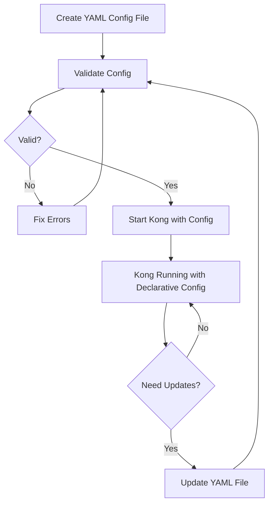

# Kong Declarative Config

## Introduction

Kong Gateway is a popular open-source API gateway that helps manage and secure your APIs. When deploying Kong, you have two primary configuration methods: the traditional database-backed mode and the newer declarative configuration approach. This guide focuses on the declarative configuration method, which allows you to define your entire Kong configuration in a single YAML file.

Declarative configuration offers several advantages for beginners and experienced developers alike:

- **Version control**: Your entire gateway configuration can be stored in a Git repository
- **Reproducible deployments**: The same configuration can be deployed across different environments
- **Simplified operations**: No database dependency for basic deployments
- **GitOps friendly**: Fits well with modern CI/CD practices

Let's explore how to use Kong's declarative configuration effectively.

## Understanding Kong Declarative Config

At its core, Kong declarative configuration (or "DB-less mode") allows you to specify all your routes, services, plugins, and other Kong entities in a structured YAML file. Kong then reads this configuration file during startup or when triggered to reload.

### Key Concepts

1. **Kong Configuration Format**: A standardized YAML structure that Kong understands
2. **DB-less Mode**: Running Kong without a database dependency
3. **Config Loading**: How Kong processes the declarative configuration
4. **Entities**: The different components you can configure (services, routes, plugins, etc.)

## Basic Structure of a Declarative Config File

A Kong declarative configuration file follows a specific structure:

```yaml
_format_version: "3.0"
_transform: true

services:
  - name: example-service
    url: http://example.com
    routes:
      - name: example-route
        paths:
          - /example
    plugins:
      - name: rate-limiting
        config:
          minute: 5
          policy: local

consumers:
  - username: example-user
    keyauth_credentials:
      - key: example-key
```

The file starts with metadata fields:
- `_format_version`: Specifies the Kong configuration format version
- `_transform`: Enables automatic transformation of configuration data

The rest of the file consists of different Kong entities like services, routes, plugins, and consumers.

## Step-by-Step Configuration

Let's build a declarative configuration file step by step:

### 1. Setting Up the Basic Structure

Start with the format version and transform flag:

```yaml
_format_version: "3.0"
_transform: true
```

### 2. Defining Services

Services represent your upstream APIs or microservices:

```yaml
services:
  - name: user-service
    url: http://user-api:8000
    retries: 5
    connect_timeout: 60000
    write_timeout: 60000
    read_timeout: 60000
```

### 3. Adding Routes

Routes determine how requests are sent to your services:

```yaml
services:
  - name: user-service
    url: http://user-api:8000
    routes:
      - name: user-api-route
        paths:
          - /users
        strip_path: true
        preserve_host: false
        protocols:
          - http
          - https
```

### 4. Configuring Plugins

Plugins add functionality like security, analytics, or rate limiting:

```yaml
services:
  - name: user-service
    url: http://user-api:8000
    routes:
      - name: user-api-route
        paths:
          - /users
    plugins:
      - name: key-auth
        config:
          key_names:
            - apikey
      - name: rate-limiting
        config:
          minute: 10
          policy: local
```

### 5. Adding Consumers and Credentials

Consumers represent API users with associated credentials:

```yaml
consumers:
  - username: mobile-app
    custom_id: app-123
    keyauth_credentials:
      - key: mobile-app-key
  - username: partner-service
    keyauth_credentials:
      - key: partner-service-key
```

## Practical Examples

Let's look at some real-world examples of Kong declarative configuration.

### Example 1: Simple API Gateway

This example shows a basic setup with authentication and rate limiting:

```yaml
_format_version: "3.0"
_transform: true

services:
  - name: product-service
    url: http://product-api:3000
    routes:
      - name: product-route
        paths:
          - /products
    plugins:
      - name: key-auth
      - name: rate-limiting
        config:
          minute: 5
          policy: local

  - name: order-service
    url: http://order-api:3000
    routes:
      - name: order-route
        paths:
          - /orders
    plugins:
      - name: key-auth
      - name: rate-limiting
        config:
          minute: 3
          policy: local

consumers:
  - username: frontend-app
    keyauth_credentials:
      - key: front-end-key
  - username: mobile-app
    keyauth_credentials:
      - key: mobile-app-key
```

### Example 2: Microservices with Advanced Routing

This example demonstrates more complex routing patterns:

```yaml
_format_version: "3.0"
_transform: true

services:
  - name: user-service
    url: http://user-service:8000
    routes:
      - name: user-api-v1
        paths:
          - /api/v1/users
        strip_path: false
      - name: user-api-v2
        paths:
          - /api/v2/users
        strip_path: false
        plugins:
          - name: request-transformer
            config:
              add:
                headers:
                  - "X-API-Version: v2"

  - name: legacy-service
    url: http://legacy-api:8080
    routes:
      - name: legacy-redirect
        paths:
          - /legacy
        plugins:
          - name: response-transformer
            config:
              add:
                headers:
                  - "X-Legacy-API: true"
```

### Example 3: Security-Focused Configuration

This example showcases security-related plugins:

```yaml
_format_version: "3.0"
_transform: true

services:
  - name: payment-service
    url: https://payment-api:443
    routes:
      - name: payment-route
        paths:
          - /payments
    plugins:
      - name: key-auth
      - name: ip-restriction
        config:
          allow:
            - 192.168.1.0/24
            - 10.0.0.0/8
      - name: cors
        config:
          origins:
            - https://trusted-app.example.com
          methods:
            - GET
            - POST
          headers:
            - Authorization
            - Content-Type
          credentials: true
          max_age: 3600
      - name: bot-detection
```

## Working with Declarative Config Files

Now that you understand how to create a declarative config file, let's see how to use it with Kong.

### Loading Config on Startup

To start Kong with a declarative configuration file:

```bash
kong start -c kong.conf --declarative-config kong.yaml
```

Make sure your `kong.conf` file has `database = off` to enable DB-less mode.

### Updating Configuration

To update your configuration without restarting Kong, use the Admin API:

```bash
curl -X POST http://localhost:8001/config \
  -H "Content-Type: application/json" \
  -d '{"config":"'"$(cat kong.yaml)"'"}'
```

### Validating Your Configuration

You can validate your YAML file before applying it:

```bash
kong config parse kong.yaml
```

This command parses the file and reports any errors without applying the changes.

## Visualizing Kong Declarative Configuration Flow



## Best Practices

Here are some recommended practices for working with Kong declarative configuration:

1. **Use version control** for your configuration files
2. **Validate configurations** before applying them
3. **Use environment-specific files** for different deployments (dev, staging, production)
4. **Organize large configurations** into multiple files and combine them during deployment
5. **Document your configuration** with comments in the YAML file
6. **Keep sensitive information separate** using environment variables or secrets management
7. **Test configuration changes** in a non-production environment first

## Troubleshooting Common Issues

### Configuration Not Applying

If your configuration doesn't seem to apply:
- Ensure Kong is running in DB-less mode (`database = off` in kong.conf)
- Check for YAML syntax errors
- Verify the format version is correct
- Look for duplicate entity names (service names, routes, etc.)

### Invalid Configuration Format

If you see errors about invalid configuration:
- Check your indentation (YAML is sensitive to spaces)
- Ensure all required fields are present
- Validate plugin configurations match the expected schema
- Make sure entity references are correct

### Performance Issues

If you experience performance issues:
- Keep your configuration file reasonably sized
- Consider splitting large configurations
- Monitor Kong's memory usage
- Be cautious with complex plugin configurations

## Summary

Kong declarative configuration provides a powerful way to manage your API gateway setup without a database dependency. By defining your entire configuration in a single YAML file, you gain benefits like version control, reproducible deployments, and simplified operations.

In this guide, we explored:
- The basic structure of Kong declarative config files
- How to define services, routes, plugins, and consumers
- Real-world examples for different use cases
- How to apply and update configurations
- Best practices and troubleshooting tips

This approach aligns well with modern infrastructure-as-code principles and can significantly simplify your Kong deployment process.

## Additional Resources

- [Kong DB-less Mode Documentation](https://docs.konghq.com/gateway/latest/production/deployment-topologies/db-less-and-declarative-config/)
- [Kong Configuration Format](https://docs.konghq.com/gateway/latest/reference/db-less-and-declarative-config/)
- [Kong Plugins Documentation](https://docs.konghq.com/hub/)

## Exercises

1. Create a declarative configuration file for a simple API that forwards requests to two different backend services based on the URL path.
2. Extend your configuration to add rate limiting and API key authentication.
3. Update your configuration to include a request transformer plugin that adds custom headers to requests.
4. Create a more complex routing setup that handles different API versions with appropriate transformations.
5. Design a declarative configuration for a production-like environment with multiple services and comprehensive security measures.