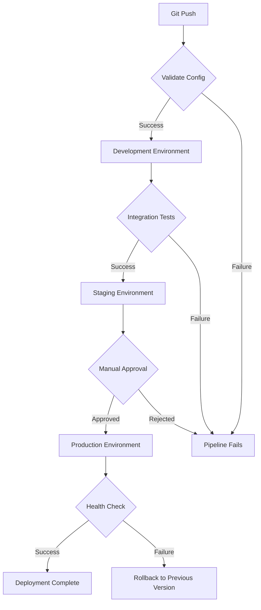

# Kong CI/CD

## Introduction

Continuous Integration and Continuous Deployment (CI/CD) is a crucial aspect of modern software development that automates the process of building, testing, and deploying applications. When working with Kong, the popular open-source API Gateway, implementing a robust CI/CD pipeline ensures that your API configurations are consistently and reliably deployed across environments.

In this guide, we'll explore how to integrate Kong into your CI/CD workflows, enabling you to automate the deployment and management of your API gateway infrastructure. This approach helps eliminate manual configuration errors, ensures consistent API management across environments, and accelerates your delivery pipeline.

## Understanding Kong in CI/CD Context

Before diving into implementation details, let's understand what makes Kong particularly well-suited for CI/CD workflows:

1. **Declarative Configuration**: Kong supports declarative configuration through YAML or JSON files, making it ideal for version control and automated deployment.

2. **Kong Decks and CLI Tools**: Tools like `deck` (Kong's configuration management utility) allow you to export, import, and synchronize configurations across environments.

3. **Plugin-based Architecture**: Kong's modular design makes it easy to version and deploy specific functionality incrementally.

4. **API-driven Management**: Kong's Admin API enables programmatic control of all aspects of the gateway.

## Setting Up a Basic Kong CI/CD Pipeline

Let's walk through creating a basic CI/CD pipeline for Kong using GitHub Actions as our CI/CD platform.

### Step 1: Organize Your Kong Configuration as Code

First, create a repository structure to store your Kong configurations:

```
kong-config/
├── kong.yaml       # Main Kong declarative configuration
├── services/       # Service-specific configurations
│   ├── auth.yaml
│   ├── payments.yaml
│   └── users.yaml
├── plugins/        # Plugin configurations
│   ├── rate-limiting.yaml
│   ├── key-auth.yaml
│   └── cors.yaml
└── consumers/      # Consumer configurations
    ├── internal-apps.yaml
    └── partners.yaml
```

Here's an example of what your `kong.yaml` file might look like:

```yaml
_format_version: "2.1"
_transform: true

services:
  - name: user-service
    url: http://user-api:8000
    routes:
      - name: user-routes
        paths:
          - /users
    plugins:
      - name: rate-limiting
        config:
          minute: 5
          policy: local

  - name: auth-service
    url: http://auth-api:8000
    routes:
      - name: auth-routes
        paths:
          - /auth
    plugins:
      - name: key-auth
```

### Step 2: Create a GitHub Actions Workflow

Create a workflow file in your repository at `.github/workflows/kong-deploy.yml`:

```yaml
name: Deploy Kong Configuration

on:
  push:
    branches: [ main ]
    paths:
      - 'kong-config/**'
  pull_request:
    branches: [ main ]
    paths:
      - 'kong-config/**'

jobs:
  validate:
    runs-on: ubuntu-latest
    steps:
      - uses: actions/checkout@v3
      
      - name: Install Kong Deck
        run: |
          curl -sL https://github.com/kong/deck/releases/download/v1.16.0/deck_1.16.0_linux_amd64.tar.gz -o deck.tar.gz
          tar -xf deck.tar.gz
          sudo mv deck /usr/local/bin/
      
      - name: Validate Kong Configuration
        run: deck validate -s kong-config/kong.yaml
  
  deploy-dev:
    needs: validate
    runs-on: ubuntu-latest
    if: github.event_name == 'push'
    steps:
      - uses: actions/checkout@v3
      
      - name: Install Kong Deck
        run: |
          curl -sL https://github.com/kong/deck/releases/download/v1.16.0/deck_1.16.0_linux_amd64.tar.gz -o deck.tar.gz
          tar -xf deck.tar.gz
          sudo mv deck /usr/local/bin/
      
      - name: Deploy to Development
        run: |
          deck sync --kong-addr ${{ secrets.KONG_DEV_ADMIN_URL }} \
                   --headers "kong-admin-token:${{ secrets.KONG_DEV_ADMIN_TOKEN }}" \
                   -s kong-config/kong.yaml
```

### Step 3: Set Up Environment-Specific Variables

In your GitHub repository, add the following secrets:

- `KONG_DEV_ADMIN_URL`: The URL of your development Kong admin API (e.g., `http://kong-dev:8001`)
- `KONG_DEV_ADMIN_TOKEN`: Authentication token for your Kong admin API

For production environments, you would add additional jobs with their own secrets.

## Implementing Multi-Environment Deployments

A production-grade Kong CI/CD pipeline typically includes multiple environments:



Let's enhance our workflow to support this multi-environment approach:

```yaml
name: Kong CI/CD Pipeline

on:
  push:
    branches: [ main ]
    paths:
      - 'kong-config/**'
  pull_request:
    branches: [ main ]
    paths:
      - 'kong-config/**'

jobs:
  validate:
    runs-on: ubuntu-latest
    steps:
      - uses: actions/checkout@v3
      
      - name: Install Kong Deck
        run: |
          curl -sL https://github.com/kong/deck/releases/download/v1.16.0/deck_1.16.0_linux_amd64.tar.gz -o deck.tar.gz
          tar -xf deck.tar.gz
          sudo mv deck /usr/local/bin/
      
      - name: Validate Kong Configuration
        run: deck validate -s kong-config/kong.yaml
  
  deploy-dev:
    needs: validate
    runs-on: ubuntu-latest
    if: github.event_name == 'push'
    steps:
      - uses: actions/checkout@v3
      
      - name: Install Kong Deck
        run: |
          curl -sL https://github.com/kong/deck/releases/download/v1.16.0/deck_1.16.0_linux_amd64.tar.gz -o deck.tar.gz
          tar -xf deck.tar.gz
          sudo mv deck /usr/local/bin/
      
      - name: Deploy to Development
        run: |
          deck sync --kong-addr ${{ secrets.KONG_DEV_ADMIN_URL }} \
                   --headers "kong-admin-token:${{ secrets.KONG_DEV_ADMIN_TOKEN }}" \
                   -s kong-config/kong.yaml
      
      - name: Verify Deployment
        run: |
          # Wait for changes to apply
          sleep 10
          # Simple health check
          curl -s ${{ secrets.KONG_DEV_PROXY_URL }}/status | grep "ok"
  
  deploy-staging:
    needs: deploy-dev
    runs-on: ubuntu-latest
    steps:
      - uses: actions/checkout@v3
      
      - name: Install Kong Deck
        run: |
          curl -sL https://github.com/kong/deck/releases/download/v1.16.0/deck_1.16.0_linux_amd64.tar.gz -o deck.tar.gz
          tar -xf deck.tar.gz
          sudo mv deck /usr/local/bin/
      
      - name: Deploy to Staging
        run: |
          deck sync --kong-addr ${{ secrets.KONG_STAGING_ADMIN_URL }} \
                   --headers "kong-admin-token:${{ secrets.KONG_STAGING_ADMIN_TOKEN }}" \
                   -s kong-config/kong.yaml
  
  deploy-prod:
    needs: deploy-staging
    runs-on: ubuntu-latest
    environment: production  # Requires manual approval
    steps:
      - uses: actions/checkout@v3
      
      - name: Install Kong Deck
        run: |
          curl -sL https://github.com/kong/deck/releases/download/v1.16.0/deck_1.16.0_linux_amd64.tar.gz -o deck.tar.gz
          tar -xf deck.tar.gz
          sudo mv deck /usr/local/bin/
      
      - name: Backup Current Production Config
        run: |
          deck dump --kong-addr ${{ secrets.KONG_PROD_ADMIN_URL }} \
                   --headers "kong-admin-token:${{ secrets.KONG_PROD_ADMIN_TOKEN }}" \
                   -o kong-prod-backup.yaml
      
      - name: Deploy to Production
        run: |
          deck sync --kong-addr ${{ secrets.KONG_PROD_ADMIN_URL }} \
                   --headers "kong-admin-token:${{ secrets.KONG_PROD_ADMIN_TOKEN }}" \
                   -s kong-config/kong.yaml
      
      - name: Verify Production Deployment
        id: verify
        run: |
          # Wait for changes to apply
          sleep 15
          # Verify critical endpoints
          if curl -s ${{ secrets.KONG_PROD_PROXY_URL }}/health | grep -q "healthy"; then
            echo "Deployment verified successfully"
            exit 0
          else
            echo "Deployment verification failed"
            exit 1
          fi
      
      - name: Rollback if Verification Failed
        if: failure() && steps.verify.outcome == 'failure'
        run: |
          echo "Rolling back to previous configuration..."
          deck sync --kong-addr ${{ secrets.KONG_PROD_ADMIN_URL }} \
                  --headers "kong-admin-token:${{ secrets.KONG_PROD_ADMIN_TOKEN }}" \
                  -s kong-prod-backup.yaml
```

## Advanced Kong CI/CD Patterns

### Pattern 1: Canary Deployments

Canary deployments let you release changes to a small subset of users before full deployment:

```yaml
- name: Configure Canary Route
  run: |
    # Create a canary route that directs 10% of traffic to the new service
    curl -X POST ${{ secrets.KONG_PROD_ADMIN_URL }}/routes \
         -H "kong-admin-token: ${{ secrets.KONG_PROD_ADMIN_TOKEN }}" \
         -d "name=user-service-canary" \
         -d "service.name=user-service-v2" \
         -d "paths[]=/users" \
         -d "tags[]=canary"
    
    # Add canary plugin to control traffic percentage
    curl -X POST ${{ secrets.KONG_PROD_ADMIN_URL }}/plugins \
         -H "kong-admin-token: ${{ secrets.KONG_PROD_ADMIN_TOKEN }}" \
         -d "name=canary" \
         -d "config.percentage=10" \
         -d "route.name=user-service-canary"
```

### Pattern 2: Blue-Green Deployments

Blue-green deployments maintain two identical environments, switching traffic between them:

```yaml
- name: Execute Blue-Green Switch
  run: |
    # Update the upstream target weights to shift traffic
    curl -X PATCH ${{ secrets.KONG_PROD_ADMIN_URL }}/upstreams/api-backend/targets \
         -H "kong-admin-token: ${{ secrets.KONG_PROD_ADMIN_TOKEN }}" \
         -d "target=blue-backend.example.com:8000" \
         -d "weight=0"
    
    curl -X PATCH ${{ secrets.KONG_PROD_ADMIN_URL }}/upstreams/api-backend/targets \
         -H "kong-admin-token: ${{ secrets.KONG_PROD_ADMIN_TOKEN }}" \
         -d "target=green-backend.example.com:8000" \
         -d "weight=100"
```

## Best Practices for Kong CI/CD

### 1. Use Declarative Configuration

Always use declarative configuration (`kong.yaml`) instead of imperative API calls:

```yaml
_format_version: "2.1"
services:
  - name: product-service
    url: http://product-api:8000
    plugins:
      - name: rate-limiting
        config:
          minute: 100
          policy: redis
          redis_host: redis.example.com
          redis_port: 6379
    routes:
      - name: products-route
        paths:
          - /products
```

### 2. Implement Configuration Drift Detection

Regularly check for configuration drift between your Git repository and running Kong instances:

```yaml
- name: Check for Configuration Drift
  run: |
    # Dump current Kong configuration
    deck dump --kong-addr ${{ secrets.KONG_PROD_ADMIN_URL }} \
              --headers "kong-admin-token:${{ secrets.KONG_PROD_ADMIN_TOKEN }}" \
              -o current-kong.yaml
    
    # Compare with source of truth
    deck diff -s kong-config/kong.yaml -s current-kong.yaml
```

### 3. Integrate with API Testing

Add automated tests to verify your API gateway functionality:

```yaml
- name: Run API Tests
  run: |
    # Run integration tests against deployed Kong gateway
    newman run tests/kong-api-tests.json \
      --env-var "gateway_url=${{ secrets.KONG_STAGING_PROXY_URL }}" \
      --reporters cli,junit \
      --reporter-junit-export results/api-tests.xml
```

### 4. Implement Secrets Management

Never hardcode sensitive values in your Kong configurations. Use environment variables and secrets management:

```yaml
- name: Deploy with Templated Config
  run: |
    # Replace environment variables in template
    envsubst < kong-config/kong-template.yaml > kong-config/kong.yaml
    
    # Deploy the configuration
    deck sync --kong-addr ${{ secrets.KONG_PROD_ADMIN_URL }} \
             --headers "kong-admin-token:${{ secrets.KONG_PROD_ADMIN_TOKEN }}" \
             -s kong-config/kong.yaml
```

## Real-World Example: E-commerce API Management

Let's look at a complete example for an e-commerce platform:

```yaml
_format_version: "2.1"
_transform: true

services:
  - name: products-service
    url: http://products-api:8000
    routes:
      - name: products-route
        paths:
          - /products
        methods:
          - GET
          - POST
        plugins:
          - name: rate-limiting
            config:
              minute: 60
              policy: local
          - name: key-auth
            config:
              key_names:
                - apikey
                
  - name: orders-service
    url: http://orders-api:8000
    routes:
      - name: orders-route
        paths:
          - /orders
        plugins:
          - name: jwt
            config:
              claims_to_verify:
                - exp
          - name: cors
            config:
              origins:
                - https://store.example.com
              methods:
                - GET
                - POST
                - PUT
              headers:
                - Authorization
                - Content-Type
              exposed_headers:
                - X-Auth-Token
              credentials: true
              max_age: 3600

consumers:
  - username: mobile-app
    keyauth_credentials:
      - key: MOBILE_APP_SECRET_KEY
  
  - username: partner-website
    jwt_secrets:
      - algorithm: HS256
        key: PARTNER_JWT_SECRET
```

The corresponding CI/CD pipeline would validate and deploy this configuration across environments, ensuring consistent API management for the e-commerce platform.

## Summary

Implementing CI/CD for Kong provides several benefits:

- **Consistent Configuration**: Ensures your Kong Gateway behaves the same way across all environments
- **Version Control**: Tracks changes to your API configurations over time
- **Automated Testing**: Validates changes before they reach production
- **Reduced Human Error**: Eliminates manual configuration mistakes
- **Faster Deployments**: Accelerates the delivery of API changes

By following the patterns and practices outlined in this guide, you can build a robust Kong CI/CD pipeline that enhances your API management capabilities and supports your organization's development workflow.

## Additional Resources

To further explore Kong CI/CD:

- Kong Deck documentation: https://docs.konghq.com/deck/
- Kong Gateway Admin API: https://docs.konghq.com/gateway/latest/admin-api/
- Kong Gateway deployment options: https://docs.konghq.com/gateway/latest/production/deployment-topologies/
- GitHub Actions documentation: https://docs.github.com/en/actions

## Exercises

1. Create a simple Kong configuration file with one service and route.
2. Set up a basic GitHub Actions workflow to validate the configuration.
3. Extend the workflow to deploy to a development environment.
4. Implement a configuration drift check to ensure your Kong instance matches your code.
5. Design a canary deployment strategy for releasing a new version of an API through Kong.