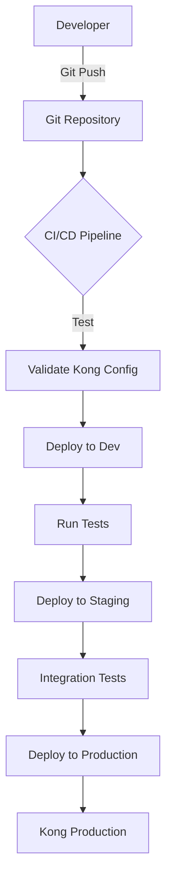

# Kong Infrastructure as Code

## Introduction

Infrastructure as Code (IaC) is a modern approach to managing and provisioning infrastructure through machine-readable definition files rather than manual processes. When applied to Kong API Gateway, IaC allows developers and operations teams to define, deploy, and manage Kong configurations in a consistent, version-controlled, and repeatable manner.

In this guide, we'll explore how to implement Infrastructure as Code practices with Kong, enabling you to automate the deployment and configuration of your API gateway infrastructure. This approach not only increases reliability but also improves collaboration between development and operations teams.

## Why Use Infrastructure as Code with Kong?

Before diving into implementation details, let's understand the benefits of using IaC with Kong:

1. **Version Control** - Store Kong configurations in Git repositories for history tracking
2. **Consistency** - Ensure identical environments across development, testing, and production
3. **Automation** - Reduce manual errors through automated deployments
4. **Documentation** - Self-documenting infrastructure with code as the source of truth
5. **Scalability** - Easily replicate Kong configurations across different environments
6. **Auditing** - Track changes to infrastructure over time

## Tools for Kong IaC

Several tools can help implement Infrastructure as Code for Kong:

### 1. decK

[decK](https://docs.konghq.com/deck/) is Kong's official CLI tool for declarative configuration management. It allows you to define your Kong configuration in YAML files and synchronize them with your Kong instances.

### 2. Terraform

[Terraform](https://www.terraform.io/) with the [Kong Provider](https://registry.terraform.io/providers/Kong/kong/latest/docs) allows you to manage Kong resources as part of your broader infrastructure code.

### 3. Kubernetes with Kong Ingress Controller

For Kubernetes users, the Kong Ingress Controller allows you to define Kong configurations using Kubernetes custom resources.

## Getting Started with decK

Let's start with decK, which is the simplest way to implement IaC for Kong.

### Installation

```bash
# MacOS
brew tap kong/deck
brew install deck

# Linux
curl -sL https://github.com/kong/deck/releases/latest/download/deck_Linux_x86_64.tar.gz | tar -xz -C /tmp
sudo cp /tmp/deck /usr/local/bin/
```

### Basic Workflow

The typical workflow with decK involves:

1. Exporting your existing Kong configuration
2. Storing the configuration in version control
3. Making changes to the configuration files
4. Validating the changes
5. Applying the changes to your Kong instance

Let's walk through these steps:

#### 1. Export Your Kong Configuration

```bash
deck dump --kong-addr http://localhost:8001 -o kong.yaml
```

This will create a `kong.yaml` file with your current Kong configuration.

#### 2. Example Kong Configuration File

Here's what a basic Kong configuration file might look like:

```yaml
_format_version: "1.1"
services:
- name: example-service
  url: http://example.com
  routes:
  - name: example-route
    paths:
    - "/example"
  plugins:
  - name: rate-limiting
    config:
      minute: 5
      policy: local
```

#### 3. Validate Your Configuration

Before applying changes, you can validate your configuration:

```bash
deck validate -s kong.yaml
```

Output:
```
2023/08/15 14:23:45 validating using deck version 1.14.0
2023/08/15 14:23:45 verification completed successfully
```

#### 4. Apply the Configuration

```bash
deck sync --kong-addr http://localhost:8001 -s kong.yaml
```

Output:
```
2023/08/15 14:24:10 syncing using deck version 1.14.0
2023/08/15 14:24:10 creating service example-service
2023/08/15 14:24:10 creating route example-route
2023/08/15 14:24:10 creating plugin rate-limiting
2023/08/15 14:24:10 Summary:
2023/08/15 14:24:10 Created: 3
2023/08/15 14:24:10 Updated: 0
2023/08/15 14:24:10 Deleted: 0
```

### Managing Multiple Environments

For larger deployments, you'll want to manage multiple environments:

```
kong/
├── environments/
│   ├── development/
│   │   └── kong.yaml
│   ├── staging/
│   │   └── kong.yaml
│   └── production/
│       └── kong.yaml
└── shared/
    └── plugins/
        ├── cors.yaml
        └── rate-limiting.yaml
```

You can use decK's `--state` flag to specify different configuration files for different environments.

## Terraform with Kong

For teams already using Terraform, the Kong provider offers a powerful way to manage Kong as part of your infrastructure code.

### Setup Terraform Provider

```hcl
terraform {
  required_providers {
    kong = {
      source = "kong/kong"
      version = ">=5.0.0"
    }
  }
}

provider "kong" {
  kong_admin_uri = "http://localhost:8001"
}
```

### Define Kong Resources

Here's an example of defining Kong resources in Terraform:

```hcl
resource "kong_service" "example_service" {
  name = "example-service"
  protocol = "http"
  host = "example.com"
  port = 80
  path = "/api"
}

resource "kong_route" "example_route" {
  name = "example-route"
  protocols = ["http", "https"]
  paths = ["/example"]
  service_id = kong_service.example_service.id
}

resource "kong_plugin" "rate_limiting" {
  name = "rate-limiting"
  service_id = kong_service.example_service.id
  config_json = jsonencode({
    minute = 5
    policy = "local"
  })
}
```

### Apply Your Configuration

```bash
terraform init
terraform plan
terraform apply
```

## Kong Ingress Controller with Kubernetes

For Kubernetes users, the Kong Ingress Controller provides native integration for managing Kong through Kubernetes resources.

### Custom Resource Definitions

Kong Ingress Controller introduces several custom resources:

- `KongPlugin`: Define Kong plugins
- `KongConsumer`: Define Kong consumers
- `KongIngress`: Extend Ingress resources with Kong-specific configurations

### Example KongPlugin Resource

```yaml
apiVersion: configuration.konghq.com/v1
kind: KongPlugin
metadata:
  name: rate-limiting
plugin: rate-limiting
config:
  minute: 5
  policy: local
```

### Example Ingress with Kong Annotations

```yaml
apiVersion: networking.k8s.io/v1
kind: Ingress
metadata:
  name: example-ingress
  annotations:
    konghq.com/plugins: rate-limiting
spec:
  rules:
  - host: example.com
    http:
      paths:
      - path: /example
        pathType: Prefix
        backend:
          service:
            name: example-service
            port:
              number: 80
```

## CI/CD Integration

To fully realize the benefits of Infrastructure as Code, integrate your Kong configurations into your CI/CD pipeline:



### Example GitHub Actions Workflow

```yaml
name: Kong IaC Pipeline

on:
  push:
    branches: [ main ]
    paths:
    - 'kong/**'

jobs:
  validate:
    runs-on: ubuntu-latest
    steps:
    - uses: actions/checkout@v2
    
    - name: Setup deck
      run: |
        curl -sL https://github.com/kong/deck/releases/latest/download/deck_Linux_x86_64.tar.gz | tar -xz
        sudo mv deck /usr/local/bin/
    
    - name: Validate Kong config
      run: deck validate -s kong/environments/production/kong.yaml
  
  deploy:
    needs: validate
    runs-on: ubuntu-latest
    steps:
    - uses: actions/checkout@v2
    
    - name: Setup deck
      run: |
        curl -sL https://github.com/kong/deck/releases/latest/download/deck_Linux_x86_64.tar.gz | tar -xz
        sudo mv deck /usr/local/bin/
    
    - name: Deploy to Kong
      run: |
        deck sync --kong-addr ${{ secrets.KONG_ADMIN_URL }} -s kong/environments/production/kong.yaml
```

## Best Practices

Follow these best practices when implementing Kong IaC:

1. **Modularize Configurations**: Split configurations into logical modules
2. **Use Variables**: Parameterize your configurations for different environments
3. **Store Secrets Securely**: Never commit sensitive information to your repository
4. **Test Changes Before Applying**: Always validate configurations before deploying
5. **Use Consistent Naming Conventions**: Establish naming standards for all resources
6. **Document Your Infrastructure**: Add comments explaining the purpose of resources
7. **Implement Change Approval Processes**: Use pull requests to review changes

## Practical Example: Building a Complete API Setup

Let's put everything together in a comprehensive example that sets up multiple services with different plugins:

### Using decK

```yaml
_format_version: "1.1"
services:
- name: user-service
  url: http://user-api:8000
  routes:
  - name: user-routes
    paths:
    - "/users"
  plugins:
  - name: key-auth
    config:
      key_names:
      - "apikey"
  - name: rate-limiting
    config:
      minute: 60
      policy: local

- name: product-service
  url: http://product-api:8000
  routes:
  - name: product-routes
    paths:
    - "/products"
  plugins:
  - name: key-auth
    config:
      key_names:
      - "apikey"
  - name: cors
    config:
      origins:
      - "*"
      methods:
      - GET
      - POST
      - PUT
      headers:
      - Accept
      - Content-Type
      
consumers:
- username: mobile-app
  keyauth_credentials:
  - key: mobile-app-key-123

- username: partner-service
  keyauth_credentials:
  - key: partner-service-key-456
```

Apply this configuration with:

```bash
deck sync --kong-addr http://localhost:8001 -s complete-api.yaml
```

## Troubleshooting Common Issues

### Issue: Configuration Drift

Problem: Manual changes in the Kong Admin UI cause differences from your IaC files.

Solution: Regularly run `deck diff` to identify and reconcile differences:

```bash
deck diff --kong-addr http://localhost:8001 -s kong.yaml
```

### Issue: Dependency Ordering

Problem: Resources with dependencies fail to create in the correct order.

Solution: Use built-in dependency management in your IaC tool (like Terraform's depends_on) or create separate configuration files that you apply in sequence.

### Issue: Plugin Configuration Errors

Problem: Complex plugin configurations may have validation errors.

Solution: Use `deck validate` to check configurations before applying:

```bash
deck validate -s kong.yaml
```

## Summary

Infrastructure as Code provides a powerful methodology for managing Kong API Gateway deployments. By treating Kong configurations as code, you can achieve consistency, automation, and better collaboration across your organization.

In this guide, we've covered:

- The benefits of using IaC with Kong
- Tools for implementing Kong IaC (decK, Terraform, Kong Ingress Controller)
- Step-by-step implementation examples
- CI/CD integration
- Best practices and troubleshooting tips

By adopting these practices, you'll be able to manage Kong more efficiently, with fewer errors and greater confidence in your API infrastructure.

## Additional Resources

- [Kong's Official decK Documentation](https://docs.konghq.com/deck/)
- [Terraform Kong Provider Documentation](https://registry.terraform.io/providers/Kong/kong/latest/docs)
- [Kong Ingress Controller Documentation](https://docs.konghq.com/kubernetes-ingress-controller/)
- [Kong API Gateway Documentation](https://docs.konghq.com/)

## Exercises

1. **Basic decK Setup**: Export your existing Kong configuration using decK and commit it to a Git repository.

2. **Multiple Environments**: Create configuration files for development, staging, and production environments with appropriate differences.

3. **CI/CD Pipeline**: Implement a basic CI/CD pipeline that validates and applies Kong configurations.

4. **Advanced Plugins**: Extend the examples to include more complex plugins like JWT authentication or request transformation.

5. **Migration Plan**: Create a plan to migrate an existing manually-configured Kong installation to use Infrastructure as Code.