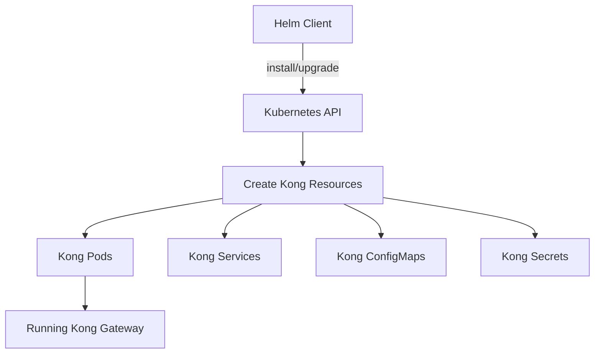

# Kong Helm

## Introduction

Kong is a popular open-source API gateway that helps manage, secure, and observe API traffic between your services. When deploying Kong in a Kubernetes environment, Helm provides a powerful and flexible way to manage the installation and configuration. Helm is a package manager for Kubernetes that allows you to define, install, and upgrade complex Kubernetes applications through "charts" - pre-configured Kubernetes resources.

In this tutorial, we'll explore how to deploy Kong API Gateway using Helm charts, making it accessible for developers who are just getting started with Kong and Kubernetes.

## Prerequisites

Before we begin, make sure you have:

- A Kubernetes cluster up and running
- Helm CLI installed (version 3.x)
- `kubectl` configured to communicate with your cluster
- Basic understanding of Kubernetes concepts

## Understanding Kong Helm Charts

Kong offers official Helm charts that simplify deploying various Kong configurations in Kubernetes. These charts are essentially bundles of YAML templates that define the necessary Kubernetes resources.



The Kong Helm repository contains charts for:

- **kong**: The main chart for deploying Kong Gateway
- **kong-ingress-controller**: For deploying Kong Ingress Controller
- **kong-enterprise**: For deploying Kong Enterprise Edition

## Getting Started with Kong Helm

### Step 1: Add the Kong Helm Repository

First, let's add the Kong Helm repository to your Helm configuration:

```bash
helm repo add kong https://charts.konghq.com
helm repo update
```

### Step 2: Explore Available Charts and Versions

You can see the available Kong charts by running:

```bash
helm search repo kong
```

Output should look something like:

```
NAME                    CHART VERSION   APP VERSION     DESCRIPTION
kong/kong               2.16.2          3.0.0           The Cloud-Native API Gateway
kong/kong-operator      0.5.1           0.11.0          Kong Operator for Kubernetes
```

### Step 3: Inspect Default Values

Before deploying, it's a good idea to understand the default configuration values:

```bash
helm show values kong/kong > kong-values.yaml
```

This creates a local file `kong-values.yaml` with all configurable options and their default values.

## Basic Kong Deployment

For a basic Kong Gateway deployment without database (DB-less mode):

```bash
helm install my-kong kong/kong --set ingressController.enabled=true
```

This command:
1. Names your release "my-kong"
2. Uses the Kong Helm chart from the Kong repository
3. Enables the ingress controller component

You'll see output confirming the deployment, including how to access the Kong admin API and proxy.

## Customizing Kong Deployment

### Creating a Custom Values File

For a more customized installation, create a values file called `custom-values.yaml`:

```yaml
# custom-values.yaml
image:
  repository: kong
  tag: "3.0"

env:
  database: "off"  # DB-less mode
  
admin:
  enabled: true
  http:
    enabled: true
    servicePort: 8001
    containerPort: 8001

proxy:
  enabled: true
  type: LoadBalancer
  http:
    enabled: true
    servicePort: 80
    containerPort: 8000
  tls:
    enabled: true
    servicePort: 443
    containerPort: 8443

ingressController:
  enabled: true
  installCRDs: false
```

Now deploy Kong with these custom values:

```bash
helm install my-kong kong/kong -f custom-values.yaml
```

### Step 4: Verify the Deployment

Check if all Kong resources are running:

```bash
kubectl get all -l app.kubernetes.io/name=kong
```

You should see Kong pods, services, and deployments running in your cluster.

## Kong Enterprise Deployment

For Kong Enterprise deployments, you'll need to set up license secrets first:

```bash
kubectl create secret generic kong-enterprise-license --from-file=license=<path-to-license-file>
```

Then create a values file for Kong Enterprise:

```yaml
# enterprise-values.yaml
enterprise:
  enabled: true
  license_secret: kong-enterprise-license
  
image:
  repository: kong/kong-gateway
  tag: "3.0.0.0"

env:
  database: "postgres"
  
postgresql:
  enabled: true
  auth:
    username: kong
    password: kong
    database: kong
```

And deploy:

```bash
helm install kong-enterprise kong/kong -f enterprise-values.yaml
```

## Common Configuration Options

Here are some common configuration options you might want to modify:

### Enabling Plugins

Kong plugins can be enabled in the values file:

```yaml
# plugins-values.yaml
env:
  plugins: bundled,custom-plugin

# For DB-less mode, configure plugins in Kong's declarative config
dblessConfig:
  configMap: kong-dbless-config
```

### Scaling Kong

Configure resource requests and limits:

```yaml
# scaling-values.yaml
resources:
  requests:
    cpu: 100m
    memory: 128Mi
  limits:
    cpu: 250m
    memory: 256Mi

replicaCount: 3

autoscaling:
  enabled: true
  minReplicas: 2
  maxReplicas: 5
  targetCPUUtilizationPercentage: 80
```

## Upgrading Kong

To upgrade Kong to a newer version or change its configuration:

```bash
# Update repository first
helm repo update

# Upgrade the deployment
helm upgrade my-kong kong/kong -f custom-values.yaml
```

## Troubleshooting

### Common Issues

1. **Pods not starting**:
   ```bash
   kubectl describe pod -l app.kubernetes.io/name=kong
   kubectl logs -l app.kubernetes.io/name=kong
   ```

2. **Services not accessible**:
   ```bash
   kubectl get svc -l app.kubernetes.io/name=kong
   ```

3. **Configuration issues**:
   Check the Kong container logs for configuration errors:
   ```bash
   kubectl logs -l app.kubernetes.io/name=kong -c kong
   ```

## Practical Example: Setting Up an API Gateway

Let's walk through a complete example of deploying Kong as an API gateway for a microservices application.

### Step 1: Deploy Kong with Ingress Controller

```bash
cat <<EOF > kong-gateway.yaml
ingressController:
  enabled: true
  installCRDs: true

proxy:
  type: LoadBalancer

env:
  database: "off"
EOF

helm install kong-gateway kong/kong -f kong-gateway.yaml
```

### Step 2: Define a Service and Ingress

```yaml
# example-service.yaml
apiVersion: v1
kind: Service
metadata:
  name: example-service
spec:
  selector:
    app: example-app
  ports:
  - port: 80
    targetPort: 8080
---
apiVersion: networking.k8s.io/v1
kind: Ingress
metadata:
  name: example-ingress
  annotations:
    konghq.com/strip-path: "true"
spec:
  ingressClassName: kong
  rules:
  - http:
      paths:
      - path: /api
        pathType: Prefix
        backend:
          service:
            name: example-service
            port:
              number: 80
```

Apply this configuration:

```bash
kubectl apply -f example-service.yaml
```

### Step 3: Add a Rate Limiting Plugin

Using Kong's Custom Resources:

```yaml
# rate-limit.yaml
apiVersion: configuration.konghq.com/v1
kind: KongPlugin
metadata:
  name: rate-limiting
config:
  minute: 5
  policy: local
plugin: rate-limiting
---
apiVersion: networking.k8s.io/v1
kind: Ingress
metadata:
  name: example-ingress
  annotations:
    konghq.com/strip-path: "true"
    konghq.com/plugins: rate-limiting
spec:
  ingressClassName: kong
  rules:
  - http:
      paths:
      - path: /api
        pathType: Prefix
        backend:
          service:
            name: example-service
            port:
              number: 80
```

Apply this configuration:

```bash
kubectl apply -f rate-limit.yaml
```

Now, your API exposed at `/api` will be rate-limited to 5 requests per minute.

## Uninstalling Kong

To remove Kong from your cluster:

```bash
helm uninstall my-kong
```

Note that this won't remove persistent volumes or custom resources. To clean those up:

```bash
kubectl delete pvc -l app.kubernetes.io/name=kong
kubectl delete customresourcedefinitions -l app.kubernetes.io/name=kong
```

## Summary

In this tutorial, we've covered:

- The basics of Kong Helm charts
- How to deploy Kong API Gateway using Helm
- Customizing Kong deployments with values files
- Deploying Kong Enterprise
- Managing Kong configurations
- Practical examples of setting up and configuring Kong
- Troubleshooting common issues

Helm makes deploying and managing Kong on Kubernetes much simpler, allowing you to focus on configuring your API gateway rather than dealing with the complexities of Kubernetes resources.

## Additional Resources

- [Kong Helm Charts GitHub Repository](https://github.com/Kong/charts)
- [Kong API Gateway Documentation](https://docs.konghq.com/)
- [Helm Documentation](https://helm.sh/docs/)

## Exercises

1. Deploy Kong in DB-less mode and configure it to serve as an API gateway for a sample application.
2. Add a JWT authentication plugin to secure your API endpoints.
3. Set up Kong with a database backend (PostgreSQL) instead of DB-less mode.
4. Configure HTTPS for your Kong proxy with a self-signed certificate.
5. Implement a blue-green deployment strategy for Kong using Helm.