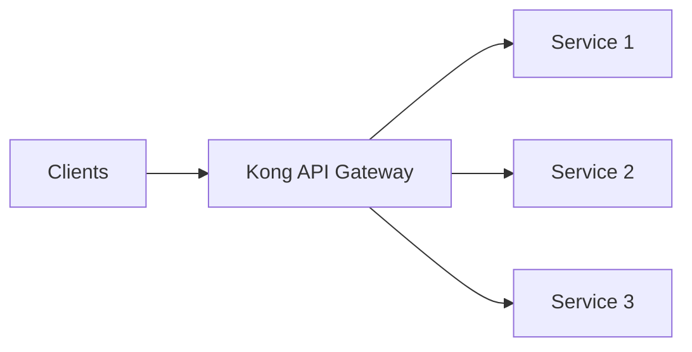

# Deploying Kong on AWS

## Introduction

Kong is a popular open-source API gateway that helps manage, secure, and scale API traffic. When combined with Amazon Web Services (AWS), Kong provides a powerful solution for handling API requests in cloud environments. This guide will walk you through deploying Kong on AWS, configuring it to work with your services, and optimizing it for production use.

## What is Kong?

Kong acts as a gateway (or proxy) for your APIs, sitting between your clients and your services. It processes API requests, applying policies like authentication, rate limiting, and logging before forwarding them to your backend services.



## Why Deploy Kong on AWS?

AWS provides a robust infrastructure for hosting Kong, with benefits including:

- **Scalability**: Easily scale Kong with AWS auto-scaling groups
- **High Availability**: Deploy across multiple Availability Zones
- **Integration**: Connect with other AWS services like RDS, DynamoDB, Lambda
- **Managed Services**: Option to use AWS managed services to reduce operational overhead

## Prerequisites

Before you start deploying Kong on AWS, ensure you have:

- An AWS account with appropriate permissions
- Basic understanding of AWS services (EC2, VPC, RDS)
- Familiarity with Kong concepts (Routes, Services, Plugins)
- AWS CLI configured on your local machine

## Deployment Options

There are several ways to deploy Kong on AWS:

1. **EC2 Instances**: Manual deployment on EC2 instances
2. **AWS Elastic Beanstalk**: Simplified deployment using Elastic Beanstalk
3. **Amazon ECS/EKS**: Container-based deployment using Docker
4. **AWS CloudFormation**: Infrastructure as code deployment

For beginners, we'll focus on the EC2 instance approach first, then briefly cover the others.

## Option 1: Deploying Kong on EC2 Instances

### Step 1: Create a VPC with Public and Private Subnets

First, let's set up our networking environment:

```bash
# Create a VPC
aws ec2 create-vpc --cidr-block 10.0.0.0/16 --tag-specifications 'ResourceType=vpc,Tags=[{Key=Name,Value=kong-vpc}]'

# Create public subnet
aws ec2 create-subnet --vpc-id vpc-XXXXXXXX --cidr-block 10.0.1.0/24 --availability-zone us-east-1a --tag-specifications 'ResourceType=subnet,Tags=[{Key=Name,Value=kong-public-1a}]'

# Create private subnet
aws ec2 create-subnet --vpc-id vpc-XXXXXXXX --cidr-block 10.0.2.0/24 --availability-zone us-east-1a --tag-specifications 'ResourceType=subnet,Tags=[{Key=Name,Value=kong-private-1a}]'
```

### Step 2: Launch an EC2 Instance for Kong

Next, launch an EC2 instance in the public subnet:

```bash
aws ec2 run-instances \
  --image-id ami-0c55b159cbfafe1f0 \  # Amazon Linux 2 AMI
  --count 1 \
  --instance-type t3.medium \
  --key-name your-key-pair \
  --security-group-ids sg-XXXXXXXX \
  --subnet-id subnet-XXXXXXXX \
  --tag-specifications 'ResourceType=instance,Tags=[{Key=Name,Value=kong-gateway}]'
```

### Step 3: Install Kong on the EC2 Instance

Connect to your EC2 instance and install Kong:

```bash
# Connect to your instance
ssh -i your-key-pair.pem ec2-user@your-instance-ip

# Install Kong dependencies
sudo amazon-linux-extras install epel
sudo yum update -y
sudo yum install -y wget

# Download Kong
wget https://download.konghq.com/gateway-2.x-amazon-linux-2/Packages/kong-2.8.0.aws.amd64.rpm

# Install Kong
sudo yum install -y kong-2.8.0.aws.amd64.rpm
```

### Step 4: Set Up a Database for Kong

Kong requires a database to store its configuration. Let's use PostgreSQL:

```bash
# Install PostgreSQL
sudo amazon-linux-extras install postgresql13
sudo yum install -y postgresql postgresql-server
sudo postgresql-setup initdb

# Start PostgreSQL
sudo systemctl enable postgresql
sudo systemctl start postgresql

# Create Kong database and user
sudo su - postgres
psql -c "CREATE USER kong WITH PASSWORD 'kong';"
psql -c "CREATE DATABASE kong OWNER kong;"
exit
```

### Step 5: Configure Kong

Now, let's configure Kong to use our PostgreSQL database:

```bash
# Create Kong configuration
sudo cp /etc/kong/kong.conf.default /etc/kong/kong.conf
sudo vi /etc/kong/kong.conf
```

Update the following parameters in the Kong configuration file:

```
database = postgres
pg_host = localhost
pg_port = 5432
pg_user = kong
pg_password = kong
pg_database = kong
```

### Step 6: Initialize and Start Kong

Now we can initialize the Kong database and start the service:

```bash
# Initialize Kong database
sudo kong migrations bootstrap -c /etc/kong/kong.conf

# Start Kong
sudo kong start -c /etc/kong/kong.conf
```

### Step 7: Verify Kong Installation

Verify that Kong is running correctly:

```bash
# Check Kong status
curl -i http://localhost:8001/status

# Expected output
HTTP/1.1 200 OK
Content-Type: application/json
...

{
  "database": {
    "reachable": true
  },
  "server": {
    "connections_accepted": 1,
    "connections_active": 1,
    "connections_handled": 1,
    "connections_reading": 0,
    "connections_writing": 1,
    "connections_waiting": 0,
    "total_requests": 1
  }
}
```

## Option 2: Deploying Kong with AWS Elastic Beanstalk

For a more managed approach, AWS Elastic Beanstalk simplifies the deployment process:

1. First, create a `Dockerrun.aws.json` file:

```json
{
  "AWSEBDockerrunVersion": "1",
  "Image": {
    "Name": "kong:latest",
    "Update": "true"
  },
  "Ports": [
    {
      "ContainerPort": 8000,
      "HostPort": 80
    },
    {
      "ContainerPort": 8001,
      "HostPort": 8001
    }
  ],
  "Volumes": [
    {
      "HostDirectory": "/var/app/current/kong.conf",
      "ContainerDirectory": "/etc/kong/kong.conf"
    }
  ]
}
```

2. Create a Kong configuration file `kong.conf` with your settings

3. Use the Elastic Beanstalk CLI to deploy:

```bash
# Initialize Elastic Beanstalk application
eb init kong-app --platform docker --region us-east-1

# Create an environment
eb create kong-env --single --instance-type t3.medium

# Deploy the application
eb deploy
```

## Option 3: Deploying Kong on Amazon ECS/EKS

For container-based deployments, you can use Amazon ECS (Elastic Container Service) or EKS (Elastic Kubernetes Service):

### ECS Deployment (Basic Steps)

1. Create a task definition:

```bash
aws ecs register-task-definition --cli-input-json file://kong-task-definition.json
```

2. Create an ECS cluster:

```bash
aws ecs create-cluster --cluster-name kong-cluster
```

3. Create a service:

```bash
aws ecs create-service \
  --cluster kong-cluster \
  --service-name kong-service \
  --task-definition kong:1 \
  --desired-count 2 \
  --launch-type FARGATE \
  --network-configuration "awsvpcConfiguration={subnets=[subnet-XXXXXXXX,subnet-YYYYYYYY],securityGroups=[sg-ZZZZZZZZ],assignPublicIp=ENABLED}"
```

## Configuring Kong on AWS

Once Kong is deployed, you can configure it through the Admin API:

### Adding a Service

```bash
curl -i -X POST http://localhost:8001/services \
  --data name=example-service \
  --data url='http://example.com'

# Expected output
HTTP/1.1 201 Created
Content-Type: application/json
...

{
  "host": "example.com",
  "created_at": 1631234567,
  "connect_timeout": 60000,
  "id": "3b9ab123-1234-5678-9abc-def123456789",
  "protocol": "http",
  "name": "example-service",
  "read_timeout": 60000,
  "port": 80,
  "path": null,
  "updated_at": 1631234567,
  "retries": 5,
  "write_timeout": 60000,
  "tags": null,
  "client_certificate": null
}
```

### Adding a Route

```bash
curl -i -X POST http://localhost:8001/services/example-service/routes \
  --data 'paths[]=/example' \
  --data name=example-route

# Expected output
HTTP/1.1 201 Created
Content-Type: application/json
...

{
  "id": "cb3c1234-1234-5678-9abc-def123456789",
  "path_handling": "v0",
  "paths": [
    "/example"
  ],
  "destinations": null,
  "headers": null,
  "protocols": [
    "http",
    "https"
  ],
  "methods": null,
  "snis": null,
  "service": {
    "id": "3b9ab123-1234-5678-9abc-def123456789"
  },
  "name": "example-route",
  "strip_path": true,
  "preserve_host": false,
  "regex_priority": 0,
  "updated_at": 1631234567,
  "created_at": 1631234567,
  "tags": null,
  "https_redirect_status_code": 426
}
```

### Adding a Plugin

Let's add a rate limiting plugin:

```bash
curl -i -X POST http://localhost:8001/services/example-service/plugins \
  --data name=rate-limiting \
  --data config.minute=5 \
  --data config.policy=local

# Expected output
HTTP/1.1 201 Created
Content-Type: application/json
...

{
  "created_at": 1631234567,
  "config": {
    "minute": 5,
    "policy": "local",
    "fault_tolerant": true,
    "hide_client_headers": false,
    "redis_timeout": 2000,
    "redis_database": 0,
    "redis_password": null,
    "limit_by": "consumer",
    "second": null,
    "hour": null,
    "day": null,
    "month": null,
    "year": null,
    "redis_host": null,
    "redis_port": 6379
  },
  "id": "871a1234-1234-5678-9abc-def123456789",
  "service": {
    "id": "3b9ab123-1234-5678-9abc-def123456789"
  },
  "name": "rate-limiting",
  "consumer": null,
  "route": null,
  "enabled": true,
  "protocols": [
    "grpc",
    "grpcs",
    "http",
    "https"
  ],
  "tags": null
}
```

## Scaling Kong on AWS

To handle increased traffic, you can scale Kong horizontally:

### Manual Scaling with EC2

Simply launch more EC2 instances with Kong and place them behind a load balancer:

```bash
# Create a load balancer
aws elbv2 create-load-balancer \
  --name kong-lb \
  --subnets subnet-XXXXXXXX subnet-YYYYYYYY \
  --security-groups sg-ZZZZZZZZ \
  --type application

# Create a target group
aws elbv2 create-target-group \
  --name kong-targets \
  --protocol HTTP \
  --port 8000 \
  --vpc-id vpc-XXXXXXXX \
  --health-check-path /status \
  --health-check-port 8001

# Register Kong instances with the target group
aws elbv2 register-targets \
  --target-group-arn arn:aws:elasticloadbalancing:us-east-1:123456789012:targetgroup/kong-targets/1234567890abcdef \
  --targets Id=i-XXXXXXXX Id=i-YYYYYYYY
```

### Auto Scaling with EC2 Auto Scaling Groups

For automatic scaling:

1. Create a launch template for Kong instances
2. Set up an Auto Scaling group
3. Configure scaling policies based on metrics like CPU utilization or request count

```bash
# Create a launch template
aws ec2 create-launch-template \
  --launch-template-name kong-launch-template \
  --version-description "Initial version" \
  --launch-template-data file://kong-launch-template.json

# Create an Auto Scaling group
aws autoscaling create-auto-scaling-group \
  --auto-scaling-group-name kong-asg \
  --launch-template LaunchTemplateName=kong-launch-template,Version='$Latest' \
  --min-size 2 \
  --max-size 10 \
  --desired-capacity 2 \
  --vpc-zone-identifier "subnet-XXXXXXXX,subnet-YYYYYYYY" \
  --target-group-arns arn:aws:elasticloadbalancing:us-east-1:123456789012:targetgroup/kong-targets/1234567890abcdef

# Create scaling policies
aws autoscaling put-scaling-policy \
  --auto-scaling-group-name kong-asg \
  --policy-name kong-scale-out \
  --policy-type TargetTrackingScaling \
  --target-tracking-configuration file://scale-out-policy.json
```

## Best Practices for Kong on AWS

When deploying Kong on AWS, follow these best practices:

1. **High Availability**
   - Deploy Kong across multiple Availability Zones
   - Use an external database service like Amazon RDS
   - Implement proper health checks

2. **Security**
   - Use security groups to restrict access to Kong
   - Enable HTTPS for all endpoints
   - Use IAM roles instead of hardcoded credentials
   - Implement network ACLs for additional security

3. **Performance**
   - Choose appropriate instance types based on your traffic
   - Enable connection pooling
   - Configure Kong caching appropriately
   - Monitor performance metrics

4. **Operational Excellence**
   - Use Infrastructure as Code (IaC) for deployments
   - Implement proper logging and monitoring
   - Set up automated backups for the database
   - Create a CI/CD pipeline for Kong configuration

## Real-World Example: Microservices API Gateway

Let's implement a real-world example where Kong serves as an API gateway for a microservices architecture on AWS:

1. First, set up three backend services:

```bash
# Service 1: User Service
curl -i -X POST http://localhost:8001/services \
  --data name=user-service \
  --data url='http://user-service.internal:3000'

# Service 2: Product Service
curl -i -X POST http://localhost:8001/services \
  --data name=product-service \
  --data url='http://product-service.internal:3000'

# Service 3: Order Service
curl -i -X POST http://localhost:8001/services \
  --data name=order-service \
  --data url='http://order-service.internal:3000'
```

2. Create routes for each service:

```bash
# User Service Routes
curl -i -X POST http://localhost:8001/services/user-service/routes \
  --data 'paths[]=/api/users' \
  --data name=user-route

# Product Service Routes
curl -i -X POST http://localhost:8001/services/product-service/routes \
  --data 'paths[]=/api/products' \
  --data name=product-route

# Order Service Routes
curl -i -X POST http://localhost:8001/services/order-service/routes \
  --data 'paths[]=/api/orders' \
  --data name=order-route
```

3. Add authentication with a key-auth plugin:

```bash
# Add key-auth plugin to all routes
curl -i -X POST http://localhost:8001/plugins \
  --data name=key-auth \
  --data config.key_names=apikey

# Create a consumer
curl -i -X POST http://localhost:8001/consumers \
  --data username=example-user

# Create an API key for the consumer
curl -i -X POST http://localhost:8001/consumers/example-user/key-auth \
  --data key=your-api-key
```

4. Add rate limiting for specific routes:

```bash
# Add rate limiting to the order service
curl -i -X POST http://localhost:8001/services/order-service/plugins \
  --data name=rate-limiting \
  --data config.minute=10 \
  --data config.policy=local
```

5. Test the configuration:

```bash
# Test API call with authentication
curl -i -X GET http://kong-lb-1234567890.us-east-1.elb.amazonaws.com/api/users \
  -H "apikey: your-api-key"

# Expected output
HTTP/1.1 200 OK
...
{"users": [...]}
```

## Troubleshooting Common Issues

Here are some common issues you might encounter when deploying Kong on AWS:

### 1. Connection Refused to Admin API

**Problem**: Cannot connect to Kong Admin API.
**Solution**: Check security groups and ensure port 8001 is open.

```bash
# Verify Kong is running
sudo systemctl status kong

# Check security group rules
aws ec2 describe-security-groups --group-ids sg-XXXXXXXX
```

### 2. Database Connection Issues

**Problem**: Kong cannot connect to the database.
**Solution**: Check database credentials and network connectivity.

```bash
# Test database connection
PGPASSWORD=kong psql -h localhost -U kong -d kong -c "SELECT 1"

# Check Kong logs
sudo tail -f /usr/local/kong/logs/error.log
```

### 3. Performance Degradation

**Problem**: Kong is responding slowly.
**Solution**: Check resource utilization and consider scaling.

```bash
# Check system resources
top

# Monitor Kong metrics
curl -s http://localhost:8001/status | jq
```

## Summary

In this guide, we've covered:

1. Introduction to Kong and its benefits in AWS environments
2. Multiple deployment options for Kong on AWS
   - EC2 instances
   - Elastic Beanstalk
   - ECS/EKS
3. Basic configuration of Kong services, routes, and plugins
4. Scaling strategies for Kong on AWS
5. Best practices for production deployments
6. A real-world microservices example
7. Troubleshooting common issues

By following this guide, you should now have a solid understanding of how to deploy and manage Kong on AWS for your API management needs.

## Additional Resources

- [Kong Documentation](https://docs.konghq.com/)
- [AWS EC2 Documentation](https://docs.aws.amazon.com/ec2/)
- [AWS Elastic Beanstalk Documentation](https://docs.aws.amazon.com/elasticbeanstalk/)
- [AWS ECS Documentation](https://docs.aws.amazon.com/ecs/)

## Exercises

1. Deploy Kong on a t2.micro EC2 instance and configure it to proxy requests to a simple API.
2. Implement JWT authentication for your Kong gateway.
3. Set up a rate limiting plugin and test it by sending multiple requests in quick succession.
4. Create a CloudFormation template to automate the deployment of Kong with a PostgreSQL database.
5. Configure Kong to work with AWS services like Lambda or API Gateway as upstream services.