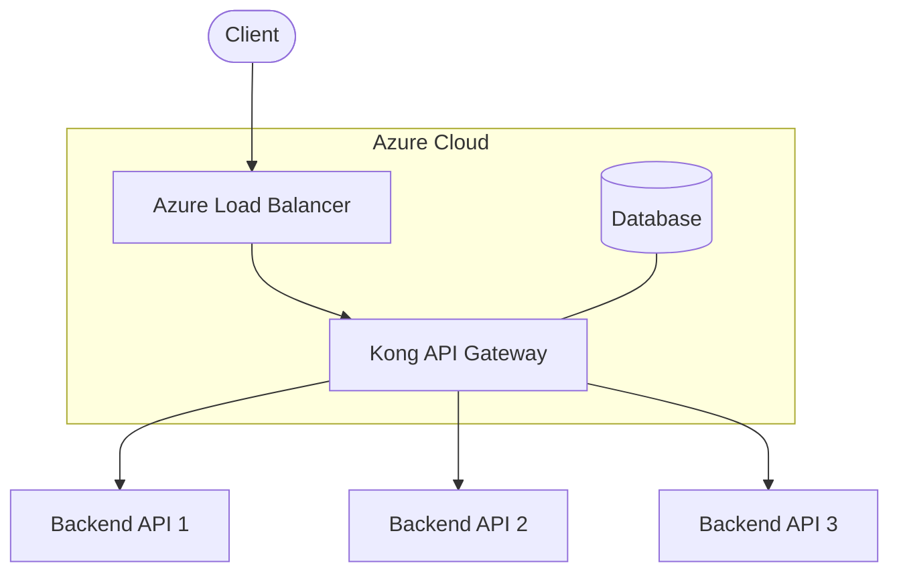
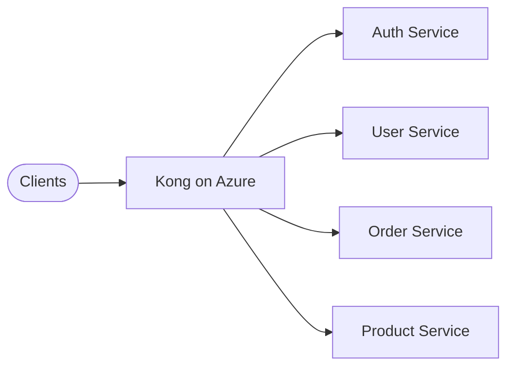

# Kong API Gateway Deployment on Azure

## Introduction

Kong is a popular, open-source API gateway that helps you manage, secure, and scale your APIs. Microsoft Azure is a cloud computing platform that provides a wide range of services for building, deploying, and managing applications. Combining these two powerful technologies allows you to create a robust API management solution in the cloud.

In this guide, you'll learn how to deploy Kong API Gateway on Azure, configure it properly, and understand the best practices for production environments. Whether you're building your first API or scaling an existing one, this guide will help you leverage the power of Kong on Azure's cloud infrastructure.

## Prerequisites

Before we begin deploying Kong on Azure, make sure you have:

- An active Azure account
- Basic knowledge of API concepts
- Familiarity with terminal/command-line operations
- Azure CLI installed (optional, but recommended)

## Understanding Kong Architecture

Kong follows a microservices architecture and consists of several components:



The key components are:

1. **Kong Gateway**: The core component that handles API requests and responses
2. **Database**: Stores Kong's configuration (PostgreSQL or Cassandra)
3. **Admin API**: Used to configure and manage Kong
4. **Plugins**: Extensions that add functionality to Kong

## Deployment Options on Azure

There are several ways to deploy Kong on Azure:

### 1. Virtual Machines (IaaS)

Deploying Kong on Azure VMs gives you full control over the environment.

#### Step-by-Step VM Deployment

1. **Create a VM in Azure**:

```bash
az group create --name kong-resource-group --location eastus
az vm create \
  --resource-group kong-resource-group \
  --name kong-vm \
  --image UbuntuLTS \
  --admin-username azureuser \
  --generate-ssh-keys
```

2. **Install Kong on the VM**:

```bash
# SSH into your VM
ssh azureuser@<your-vm-ip>

# Install Kong dependencies
sudo apt-get update
sudo apt-get install -y apt-transport-https curl lsb-core

# Add Kong's package repository
curl -Lo kong.deb "https://download.konghq.com/gateway-2.x-ubuntu-$(lsb_release -sc)/pool/all/k/kong/kong_2.8.0_amd64.deb"

# Install Kong
sudo dpkg -i kong.deb
```

3. **Configure Kong**:

```bash
# Copy the configuration template
sudo cp /etc/kong/kong.conf.default /etc/kong/kong.conf

# Edit the configuration
sudo nano /etc/kong/kong.conf
```

In the configuration file, uncomment and set these important parameters:

```
database = postgres
pg_host = <your-database-host>
pg_port = 5432
pg_user = kong
pg_password = <your-password>
pg_database = kong
```

4. **Initialize the database**:

```bash
sudo kong migrations bootstrap
```

5. **Start Kong**:

```bash
sudo kong start
```

### 2. Azure Kubernetes Service (AKS)

For production environments, deploying Kong on AKS provides better scalability and resilience.

#### Deploying Kong on AKS

1. **Create an AKS cluster**:

```bash
az aks create \
  --resource-group kong-resource-group \
  --name kong-cluster \
  --node-count 2 \
  --enable-addons monitoring \
  --generate-ssh-keys
```

2. **Connect to the cluster**:

```bash
az aks get-credentials --resource-group kong-resource-group --name kong-cluster
```

3. **Deploy Kong using Helm**:

```bash
# Add the Kong Helm repository
helm repo add kong https://charts.konghq.com
helm repo update

# Install Kong
helm install kong kong/kong --set ingressController.installCRDs=false
```

4. **Verify the deployment**:

```bash
kubectl get all -l app.kubernetes.io/name=kong
```

Here's the expected output:

```
NAME                         READY   STATUS    RESTARTS   AGE
pod/kong-kong-7d6dc9b678-mtwsc   1/1     Running   0          3m

NAME                     TYPE           CLUSTER-IP      EXTERNAL-IP      PORT(S)                     AGE
service/kong-kong-proxy  LoadBalancer   10.0.166.244    <external-ip>    80:31929/TCP,443:31408/TCP  3m

NAME                            READY   UP-TO-DATE   AVAILABLE   AGE
deployment.apps/kong-kong       1/1     1            1           3m

NAME                                   DESIRED   CURRENT   READY   AGE
replicaset.apps/kong-kong-7d6dc9b678   1         1         1       3m
```

### 3. Azure Container Instances (ACI)

For development or testing environments, you can use Azure Container Instances:

```bash
az container create \
  --resource-group kong-resource-group \
  --name kong-container \
  --image kong:latest \
  --dns-name-label kong-api-gateway \
  --ports 8000 8001 8443 8444 \
  --environment-variables \
    KONG_DATABASE=off \
    KONG_PROXY_ACCESS_LOG=/dev/stdout \
    KONG_ADMIN_ACCESS_LOG=/dev/stdout \
    KONG_PROXY_ERROR_LOG=/dev/stderr \
    KONG_ADMIN_ERROR_LOG=/dev/stderr \
    KONG_ADMIN_LISTEN="0.0.0.0:8001, 0.0.0.0:8444 ssl"
```

## Configuring Kong on Azure

Once Kong is deployed, you need to configure it to manage your APIs.

### Setting Up a Service and Route

The Admin API allows you to configure Kong. Let's add a service and route:

```bash
# Add a service (your API backend)
curl -i -X POST \
  --url http://<kong-admin-api>/services/ \
  --data 'name=example-service' \
  --data 'url=http://example.com'

# Add a route to the service
curl -i -X POST \
  --url http://<kong-admin-api>/services/example-service/routes \
  --data 'paths[]=/example' \
  --data 'name=example-route'
```

Now any requests to `/example` will be routed to `http://example.com`.

### Enabling Kong Plugins

Kong's power comes from its plugins. Here's how to enable the rate-limiting plugin:

```bash
curl -i -X POST \
  --url http://<kong-admin-api>/services/example-service/plugins/ \
  --data 'name=rate-limiting' \
  --data 'config.minute=5' \
  --data 'config.policy=local'
```

This limits calls to the example service to 5 requests per minute.

## Kong Integration with Azure Services

### Azure Database for PostgreSQL

Instead of managing your own database, use Azure's managed PostgreSQL:

1. **Create a PostgreSQL server**:

```bash
az postgres server create \
  --resource-group kong-resource-group \
  --name kong-postgres \
  --location eastus \
  --admin-user kongadmin \
  --admin-password <your-password> \
  --sku-name GP_Gen5_2 \
  --version 11
```

2. **Create a database for Kong**:

```bash
az postgres db create \
  --resource-group kong-resource-group \
  --server-name kong-postgres \
  --name kong
```

3. **Configure Kong to use Azure PostgreSQL**:

Update your Kong configuration to use the Azure PostgreSQL instance:

```
pg_host = kong-postgres.postgres.database.azure.com
pg_user = kongadmin@kong-postgres
pg_password = <your-password>
pg_database = kong
pg_ssl = on
```

### Azure Application Insights

Monitor your Kong deployment with Application Insights:

1. **Create an Application Insights resource**:

```bash
az monitor app-insights component create \
  --app kong-insights \
  --location eastus \
  --resource-group kong-resource-group
```

2. **Install the Kong OpenTelemetry plugin**:

```bash
curl -i -X POST \
  --url http://<kong-admin-api>/plugins/ \
  --data 'name=opentelemetry' \
  --data 'config.endpoint=<your-application-insights-endpoint>' \
  --data 'config.resource_attributes.service.name=kong'
```

## Best Practices for Kong on Azure

### Security Best Practices

1. **Use Azure VNet Integration**:
   Place Kong in a virtual network to isolate it from the public internet.

2. **Enable SSL/TLS**:
   Configure Kong to use HTTPS with certificates from Azure Key Vault:

```bash
# Store certificate in Key Vault
az keyvault certificate create \
  --vault-name kong-keyvault \
  --name kong-cert \
  --policy @cert-policy.json

# Configure Kong to use the certificate
ssl_cert = /path/to/cert.pem
ssl_cert_key = /path/to/key.pem
```

3. **Use Azure Managed Identities**:
   Configure Kong to authenticate with other Azure services without storing credentials.

### Scalability

1. **Enable autoscaling** when using AKS:

```bash
kubectl autoscale deployment kong-kong \
  --cpu-percent=70 \
  --min=2 \
  --max=10
```

2. **Use Azure Front Door** for global distribution:
   Set up Azure Front Door to route traffic to Kong instances in multiple regions.

## Troubleshooting Common Issues

### Database Connection Problems

If Kong cannot connect to the database:

1. Check if the database firewall allows connections from Kong:

```bash
az postgres server firewall-rule create \
  --resource-group kong-resource-group \
  --server-name kong-postgres \
  --name AllowKongServers \
  --start-ip-address <kong-ip> \
  --end-ip-address <kong-ip>
```

2. Verify connection string and credentials in Kong's configuration.

### API Gateway Not Accessible

If you can't access the Kong API Gateway:

1. Check if Kong is running:

```bash
kubectl get pods -l app.kubernetes.io/name=kong
```

2. Check the service and endpoints:

```bash
kubectl describe service kong-kong-proxy
kubectl get endpoints kong-kong-proxy
```

3. Check Network Security Group (NSG) rules:

```bash
az network nsg rule list --resource-group kong-resource-group --nsg-name kong-nsg
```

## Real-World Use Cases

### API Management for Microservices

Imagine you have multiple microservices running on Azure. Kong can:

- Provide a unified entry point for all services
- Handle authentication and authorization
- Apply rate limiting to prevent abuse
- Transform and validate requests/responses



### Implementing an API Marketplace

Using Kong on Azure, you can create an API marketplace where:

1. Developers register and publish APIs
2. Consumers can discover and subscribe to APIs
3. Kong handles API keys, rate limiting, and analytics
4. Azure handles billing and scaling

## Summary

In this guide, we've explored how to deploy Kong API Gateway on Microsoft Azure using different approaches (VMs, AKS, and ACI). We've covered:

- Basic Kong architecture and components
- Step-by-step deployment instructions
- Integration with Azure managed services
- Security and scalability best practices
- Troubleshooting common issues
- Real-world applications

Kong on Azure provides a powerful, scalable solution for API management that can grow with your needs, from simple applications to complex microservices architectures.

## Additional Resources

- [Kong Documentation](https://docs.konghq.com/)
- [Azure Kubernetes Service Documentation](https://docs.microsoft.com/en-us/azure/aks/)
- [Kong Helm Chart](https://github.com/Kong/charts)

## Exercises

1. Deploy Kong on Azure using one of the methods described in this guide.
2. Configure Kong to proxy requests to a simple API.
3. Enable at least two Kong plugins (e.g., rate-limiting and key-authentication).
4. Create a monitoring dashboard for your Kong deployment using Azure Monitor.
5. Implement a CI/CD pipeline that updates your Kong configuration when your APIs change.