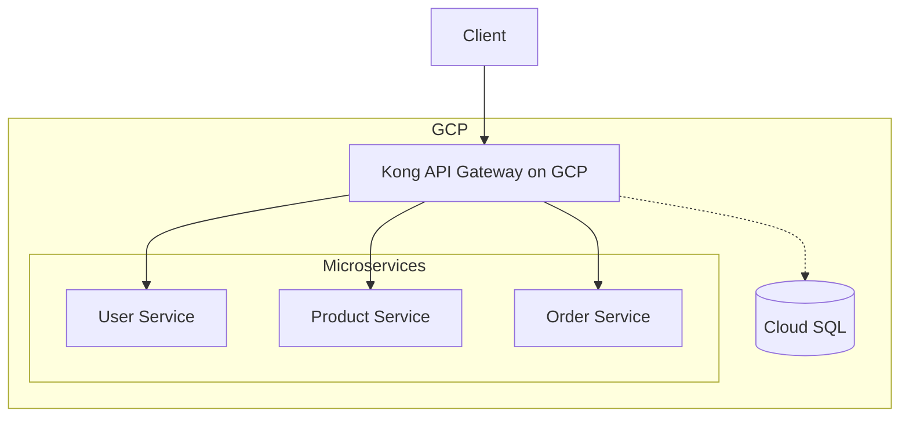

# Deploying Kong Gateway on Google Cloud Platform

## Introduction

Kong Gateway is a popular, open-source API gateway and microservices management layer that runs in front of any RESTful API. As applications grow more complex and distributed, an API gateway becomes essential for managing traffic, enforcing security, and monitoring performance.

This guide will walk you through deploying Kong Gateway on Google Cloud Platform (GCP), allowing you to leverage both the powerful features of Kong and the scalability of GCP's infrastructure.

## Prerequisites

Before we begin, make sure you have:

- A Google Cloud Platform account
- Basic familiarity with GCP Console
- `gcloud` CLI installed and configured
- Basic understanding of API gateways and microservices
- Docker knowledge (for container-based deployments)

## Deployment Options

There are several ways to deploy Kong on GCP:

1. Compute Engine VMs
2. Google Kubernetes Engine (GKE)
3. Cloud Run (for DB-less mode)

Let's explore each option in detail.

## Option 1: Deploying Kong on Compute Engine

### Step 1: Create a Compute Engine VM Instance

First, let's create a VM instance where Kong will be installed:

```bash
gcloud compute instances create kong-gateway \
  --machine-type=e2-medium \
  --image-family=debian-11 \
  --image-project=debian-cloud \
  --boot-disk-size=20GB \
  --tags=http-server,https-server
```

### Step 2: Configure Firewall Rules

Create firewall rules to allow traffic to Kong's admin and proxy ports:

```bash
gcloud compute firewall-rules create allow-kong-proxy \
  --allow tcp:8000,tcp:8443 \
  --description="Allow Kong proxy traffic" \
  --target-tags=http-server

gcloud compute firewall-rules create allow-kong-admin \
  --allow tcp:8001,tcp:8444 \
  --description="Allow Kong admin API traffic" \
  --target-tags=http-server
```

### Step 3: Install Kong

SSH into your VM instance:

```bash
gcloud compute ssh kong-gateway
```

Install Kong using APT (for Debian):

```bash
# Add the Kong repository
curl -Lo kong.deb "https://download.konghq.com/gateway-2.x-debian-$(lsb_release -sc)/pool/all/k/kong/kong_2.8.1_amd64.deb"

# Install Kong dependencies
sudo apt-get update
sudo apt-get install -y libpcre3 perl zlib1g-dev

# Install Kong
sudo dpkg -i kong.deb
```

### Step 4: Configure and Start Kong

Create a configuration file:

```bash
sudo mkdir -p /etc/kong
sudo cp /etc/kong/kong.conf.default /etc/kong/kong.conf
```

Edit the configuration file:

```bash
sudo nano /etc/kong/kong.conf
```

Uncomment and set the following parameters:

```
database = postgres
pg_host = localhost
pg_user = kong
pg_password = kong
pg_database = kong
```

If you're using DB-less mode:

```
database = off
declarative_config = /etc/kong/kong.yml
```

Start Kong:

```bash
sudo kong start
```

Verify Kong is running:

```bash
curl -i http://localhost:8001/status
```

## Option 2: Deploying Kong on Google Kubernetes Engine (GKE)

### Step 1: Create a GKE Cluster

```bash
gcloud container clusters create kong-cluster \
  --num-nodes=3 \
  --machine-type=e2-standard-2 \
  --zone=us-central1-a
```

### Step 2: Deploy Kong using Helm

Add Kong's Helm repository:

```bash
helm repo add kong https://charts.konghq.com
helm repo update
```

Create a values file (`values.yaml`):

```yaml
# values.yaml
env:
  database: "off"

ingressController:
  enabled: true
  installCRDs: false

proxy:
  type: LoadBalancer
  
admin:
  enabled: true
  http:
    enabled: true
  type: LoadBalancer
```

Install Kong:

```bash
helm install kong kong/kong -f values.yaml
```

### Step 3: Verify the Deployment

Check that all pods are running:

```bash
kubectl get pods
```

Get the external IP addresses:

```bash
kubectl get svc
```

You'll see an external IP for both the proxy and admin services. You can use these to access Kong.

## Option 3: Deploying Kong on Cloud Run (DB-less mode)

### Step 1: Create a Dockerfile

Create a `Dockerfile`:

```dockerfile
FROM kong:2.8-alpine

USER root

COPY kong.yml /usr/local/kong/declarative/kong.yml

ENV KONG_DATABASE=off
ENV KONG_DECLARATIVE_CONFIG=/usr/local/kong/declarative/kong.yml
ENV KONG_PROXY_ACCESS_LOG=/dev/stdout
ENV KONG_ADMIN_ACCESS_LOG=/dev/stdout
ENV KONG_PROXY_ERROR_LOG=/dev/stderr
ENV KONG_ADMIN_ERROR_LOG=/dev/stderr
ENV KONG_ADMIN_LISTEN=0.0.0.0:8001, 0.0.0.0:8444 ssl

EXPOSE 8000 8443 8001 8444
```

Create a minimal `kong.yml` configuration file:

```yaml
_format_version: "2.1"
_transform: true

services:
  - name: example-service
    url: https://mockbin.org
    routes:
      - name: example-route
        paths:
          - /example
```

### Step 2: Build and Push the Docker Image

```bash
# Build the image
docker build -t gcr.io/[PROJECT_ID]/kong-gateway:latest .

# Push to Google Container Registry
docker push gcr.io/[PROJECT_ID]/kong-gateway:latest
```

### Step 3: Deploy to Cloud Run

```bash
gcloud run deploy kong-gateway \
  --image gcr.io/[PROJECT_ID]/kong-gateway:latest \
  --platform managed \
  --allow-unauthenticated \
  --port=8000 \
  --min-instances=1
```

## Configuring Kong on GCP

No matter which deployment option you choose, you'll need to configure Kong to suit your needs. Let's look at some common configuration tasks.

### Adding a Service and Route

When Kong is running, you can add services and routes through the Admin API:

```bash
# Add a service
curl -i -X POST http://KONG_ADMIN_IP:8001/services \
  --data name=example-service \
  --data url='http://mockbin.org'

# Add a route
curl -i -X POST http://KONG_ADMIN_IP:8001/services/example-service/routes \
  --data 'paths[]=/example' \
  --data name=example-route
```

### Adding Plugins

Kong's power comes from its plugin ecosystem. Here's how to add rate limiting:

```bash
curl -i -X POST http://KONG_ADMIN_IP:8001/services/example-service/plugins \
  --data name=rate-limiting \
  --data config.minute=5 \
  --data config.policy=local
```

### Setting Up Kong with a Database on GCP

For production deployments, you might want to use a database. Here's how to set up Kong with Cloud SQL:

1. Create a Cloud SQL instance:

```bash
gcloud sql instances create kong-database \
  --database-version=POSTGRES_13 \
  --tier=db-g1-small \
  --region=us-central1
```

2. Create a database and user:

```bash
gcloud sql databases create kong --instance=kong-database
gcloud sql users create kong --instance=kong-database --password=kong-password
```

3. Update Kong configuration to point to your Cloud SQL instance:

```
database = postgres
pg_host = [CLOUD_SQL_IP]
pg_user = kong
pg_password = kong-password
pg_database = kong
```

## Monitoring Kong on GCP

### Cloud Monitoring Integration

Set up Cloud Monitoring for your Kong deployment:

1. Install the Cloud Monitoring agent on your VM:

```bash
curl -sSO https://dl.google.com/cloudagents/add-monitoring-agent-repo.sh
sudo bash add-monitoring-agent-repo.sh
sudo apt-get update
sudo apt-get install -y stackdriver-agent
sudo service stackdriver-agent start
```

2. Configure custom metrics for Kong by creating a configuration file:

```bash
sudo nano /etc/stackdriver/collectd.d/kong.conf
```

Add the following content:

```
LoadPlugin "curl_json"

<Plugin curl_json>
  <URL "http://localhost:8001/status">
    Instance "kong"
    <Key "server/connections_active">
      Type "gauge"
    </Key>
    <Key "server/connections_accepted">
      Type "counter"
    </Key>
    <Key "server/connections_handled">
      Type "counter"
    </Key>
  </URL>
</Plugin>
```

3. Restart the agent:

```bash
sudo service stackdriver-agent restart
```

### Using Kong Prometheus Plugin

For more detailed metrics, use the Prometheus plugin:

```bash
curl -i -X POST http://KONG_ADMIN_IP:8001/plugins \
  --data name=prometheus
```

Then configure Cloud Monitoring to scrape these metrics.

## Real-World Example: Building an API Gateway for a Microservices Architecture

Let's walk through a practical example of setting up Kong on GCP for a microservices architecture.

### Scenario

You have three microservices:
- User Service: Handles user authentication and profiles
- Product Service: Manages product information
- Order Service: Processes customer orders

### Step 1: Deploy the microservices on GCP

This could be on GKE, Compute Engine, or Cloud Run. For this example, let's assume they're running on GKE with the following internal service endpoints:
- User Service: `user-service.default.svc.cluster.local:8080`
- Product Service: `product-service.default.svc.cluster.local:8080`
- Order Service: `order-service.default.svc.cluster.local:8080`

### Step 2: Configure Kong to route to these services

```bash
# Add User Service
curl -i -X POST http://KONG_ADMIN_IP:8001/services \
  --data name=user-service \
  --data url='http://user-service.default.svc.cluster.local:8080'

curl -i -X POST http://KONG_ADMIN_IP:8001/services/user-service/routes \
  --data 'paths[]=/api/users' \
  --data name=user-route

# Add Product Service
curl -i -X POST http://KONG_ADMIN_IP:8001/services \
  --data name=product-service \
  --data url='http://product-service.default.svc.cluster.local:8080'

curl -i -X POST http://KONG_ADMIN_IP:8001/services/product-service/routes \
  --data 'paths[]=/api/products' \
  --data name=product-route

# Add Order Service
curl -i -X POST http://KONG_ADMIN_IP:8001/services \
  --data name=order-service \
  --data url='http://order-service.default.svc.cluster.local:8080'

curl -i -X POST http://KONG_ADMIN_IP:8001/services/order-service/routes \
  --data 'paths[]=/api/orders' \
  --data name=order-route
```

### Step 3: Add authentication

```bash
# Add JWT plugin to all routes
curl -i -X POST http://KONG_ADMIN_IP:8001/plugins \
  --data name=jwt \
  --data config.claims_to_verify=exp
```

### Step 4: Add rate limiting

```bash
# Add rate limiting globally
curl -i -X POST http://KONG_ADMIN_IP:8001/plugins \
  --data name=rate-limiting \
  --data config.minute=60 \
  --data config.policy=local
```

### Step 5: Add request transformation

```bash
# Add a header to all requests
curl -i -X POST http://KONG_ADMIN_IP:8001/plugins \
  --data name=request-transformer \
  --data config.add.headers=X-Gateway-Timestamp:$(date +%s)
```

This setup provides a fully-functional API gateway that:
- Routes traffic to the appropriate microservice
- Enforces JWT authentication
- Implements rate limiting
- Adds custom headers to requests

## Architecture Diagram



## Troubleshooting Kong on GCP

### Common Issues and Solutions

1. **Kong is not starting properly**

Check the logs:
```bash
sudo journalctl -u kong
```

2. **Cannot connect to Admin API**

Verify firewall rules:
```bash
gcloud compute firewall-rules list
```

3. **Database connectivity issues**

Check if Kong can reach the database:
```bash
sudo kong health
```

4. **Performance issues**

Review resources allocated to your VM or GKE cluster and consider scaling:
```bash
gcloud compute instances set-machine-type kong-gateway --machine-type=e2-standard-4
```

## Best Practices for Kong on GCP

1. **Use Managed Services**: Leverage GCP's managed services like Cloud SQL and GKE for easier maintenance.

2. **Implement High Availability**: Deploy Kong in multiple zones for high availability.

3. **Secure Admin API**: Restrict access to the Admin API by using firewall rules or a separate internal network.

4. **Regular Backups**: Set up automated backups for your Kong database.

5. **Monitoring and Alerting**: Use Cloud Monitoring to keep track of Kong's performance and set up alerts.

6. **Infrastructure as Code**: Use Terraform or Deployment Manager to provision and manage your Kong infrastructure.

7. **Update Regularly**: Keep Kong updated to the latest stable version to benefit from security patches and new features.

## Summary

In this guide, we've covered deploying Kong API Gateway on Google Cloud Platform using different methods: Compute Engine, GKE, and Cloud Run. We've also explored configuration options, monitoring strategies, and a real-world example of using Kong as an API gateway for microservices.

Kong on GCP provides a powerful solution for managing APIs and microservices, offering features like:
- Traffic routing and load balancing
- Authentication and authorization
- Rate limiting and request transformation
- Monitoring and analytics
- Plugin extensibility

By following the steps and best practices outlined in this guide, you can deploy and manage a robust API gateway solution on Google Cloud Platform.

## Additional Resources

- [Kong Official Documentation](https://docs.konghq.com/)
- [Kong Plugins](https://docs.konghq.com/hub/)
- [GCP Documentation](https://cloud.google.com/docs)
- [Kong Forum](https://discuss.konghq.com/)

## Exercises

1. Deploy Kong on GCP using one of the methods described in this guide.
2. Configure Kong to route traffic to a sample API.
3. Add authentication to your API using the JWT plugin.
4. Set up rate limiting for your API.
5. Configure monitoring for your Kong deployment using Cloud Monitoring.
6. Create a declarative configuration file for Kong DB-less mode.
7. Deploy Kong with a custom plugin.