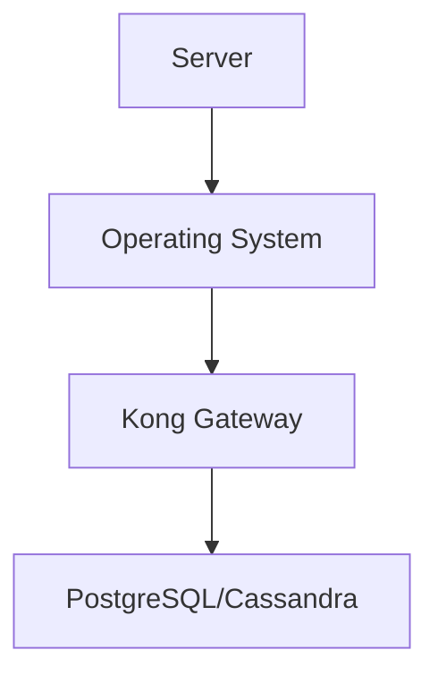
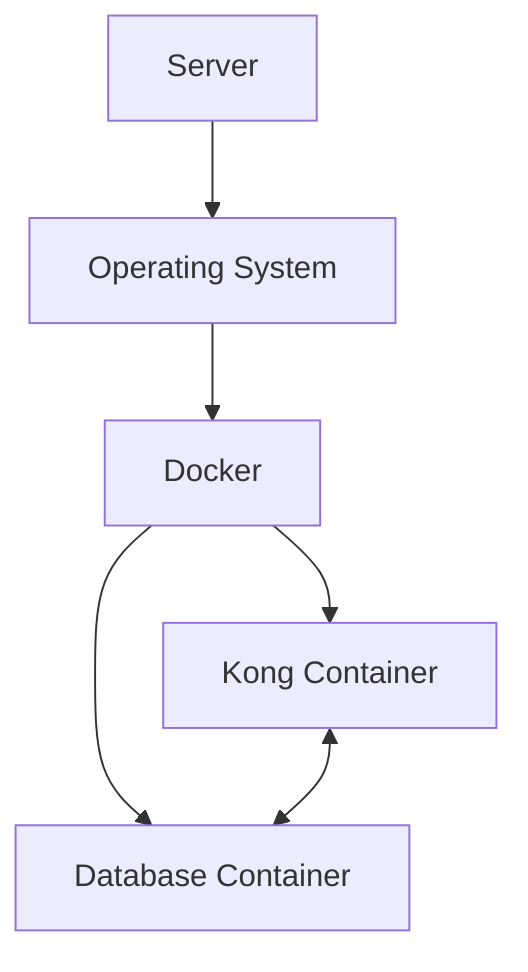
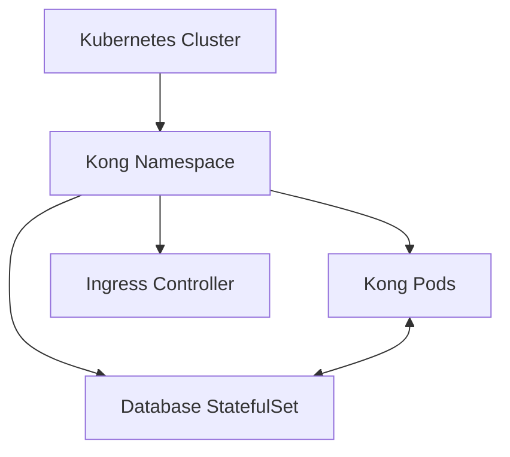
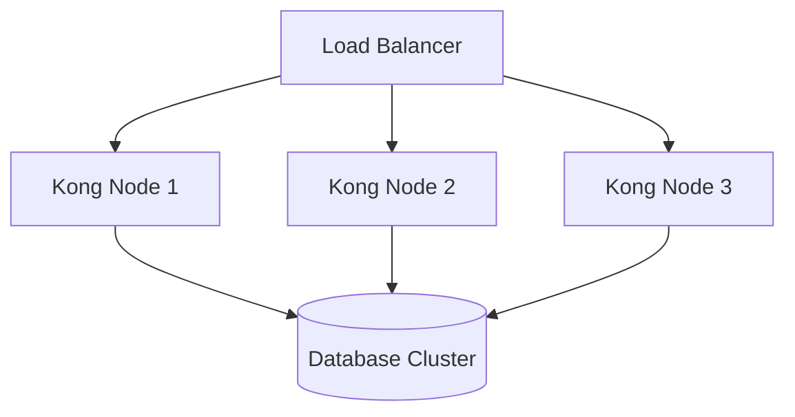

# Kong On-Premises

## Introduction

Kong is a powerful, open-source API gateway that manages communications between clients and services. While Kong offers cloud-based solutions, many organizations require on-premises deployments for enhanced security, compliance, or infrastructure requirements. This guide explores how to deploy Kong in your own data center or private infrastructure.

On-premises deployment gives you complete control over your API gateway infrastructure, allowing you to:

- Maintain data sovereignty and comply with regulations
- Integrate with existing on-site infrastructure
- Customize your deployment for specific performance needs
- Avoid cloud vendor lock-in

## Prerequisites

Before deploying Kong on-premises, ensure you have:

- A Linux-based server environment (CentOS, Ubuntu, Debian, RHEL)
- Administrative (root) access to your servers
- Basic understanding of networking concepts
- Familiarity with database systems (PostgreSQL recommended)
- Docker and Docker Compose (optional, for containerized deployments)

## Deployment Options

Kong offers several options for on-premises deployment:

### 1. Traditional Installation

Installing Kong directly on your servers is the most straightforward approach.



### 2. Containerized Deployment

Using Docker containers provides better isolation and portability.



### 3. Kubernetes Deployment

For complex, scalable environments, deploying Kong on Kubernetes offers advanced orchestration capabilities.



## Step-by-Step Installation Guide

Let's walk through a traditional installation on Ubuntu:

### Step 1: Prepare Your Environment

First, update your package lists:

```bash
$ sudo apt update
$ sudo apt upgrade -y

# Output:
# Reading package lists... Done
# Building dependency tree... Done
# ...
```

### Step 2: Install PostgreSQL

Kong requires a database for configuration storage:

```bash
$ sudo apt install postgresql -y
$ sudo systemctl enable postgresql
$ sudo systemctl start postgresql

# Output:
# Created symlink /etc/systemd/system/multi-user.target.wants/postgresql.service → /lib/systemd/system/postgresql.service
```

Create a Kong user and database:

```bash
$ sudo -u postgres psql
postgres=# CREATE USER kong WITH PASSWORD 'kong_password';
postgres=# CREATE DATABASE kong OWNER kong;
postgres=# \q

# Output:
# CREATE ROLE
# CREATE DATABASE
```

### Step 3: Install Kong

Add the Kong repository and install:

```bash
$ curl -Lo kong.deb "https://download.konghq.com/gateway-2.x-ubuntu-$(lsb_release -cs)/pool/all/k/kong/kong_2.8.1_amd64.deb"
$ sudo apt install -y ./kong.deb

# Output:
# Selecting previously unselected package kong.
# Unpacking kong (2.8.1) ...
# Setting up kong (2.8.1) ...
# ...
```

### Step 4: Configure Kong

Create a configuration file:

```bash
$ sudo cp /etc/kong/kong.conf.default /etc/kong/kong.conf
$ sudo vi /etc/kong/kong.conf
```

Update the following settings:

```
database = postgres
pg_host = 127.0.0.1
pg_port = 5432
pg_user = kong
pg_password = kong_password
pg_database = kong
```

Initialize the database:

```bash
$ sudo kong migrations bootstrap -c /etc/kong/kong.conf

# Output:
# migrating core for database kong
# core migrated up to: 000_base (executed)
# ...
# migrations: completed
```

### Step 5: Start Kong

```bash
$ sudo kong start -c /etc/kong/kong.conf

# Output:
# Kong started
```

Verify Kong is running:

```bash
$ curl -i http://localhost:8001/

# Output:
# HTTP/1.1 200 OK
# Access-Control-Allow-Origin: *
# Content-Type: application/json; charset=utf-8
# ...
# {
#   "plugins": { ... },
#   "tagline": "Welcome to Kong",
#   "version": "2.8.1"
# }
```

## Containerized Deployment with Docker Compose

For easier setup and management, Docker Compose is an excellent option:

### Step 1: Create a Docker Compose File

Create a file named `docker-compose.yml`:

```yaml
version: '3'

networks:
  kong-net:
    driver: bridge

services:
  kong-database:
    image: postgres:13
    container_name: kong-database
    networks:
      - kong-net
    ports:
      - "5432:5432"
    environment:
      POSTGRES_USER: kong
      POSTGRES_DB: kong
      POSTGRES_PASSWORD: kong_password
    volumes:
      - kong_data:/var/lib/postgresql/data
    healthcheck:
      test: ["CMD", "pg_isready", "-U", "kong"]
      interval: 5s
      timeout: 5s
      retries: 5

  kong-migrations:
    image: kong:2.8
    container_name: kong-migrations
    depends_on:
      - kong-database
    networks:
      - kong-net
    environment:
      KONG_DATABASE: postgres
      KONG_PG_HOST: kong-database
      KONG_PG_USER: kong
      KONG_PG_PASSWORD: kong_password
    command: kong migrations bootstrap

  kong:
    image: kong:2.8
    container_name: kong
    depends_on:
      - kong-database
      - kong-migrations
    networks:
      - kong-net
    ports:
      - "8000:8000"  # Proxy
      - "8443:8443"  # Proxy SSL
      - "8001:8001"  # Admin API
      - "8444:8444"  # Admin API SSL
    environment:
      KONG_DATABASE: postgres
      KONG_PG_HOST: kong-database
      KONG_PG_USER: kong
      KONG_PG_PASSWORD: kong_password
      KONG_PROXY_ACCESS_LOG: /dev/stdout
      KONG_ADMIN_ACCESS_LOG: /dev/stdout
      KONG_PROXY_ERROR_LOG: /dev/stderr
      KONG_ADMIN_ERROR_LOG: /dev/stderr
      KONG_ADMIN_LISTEN: 0.0.0.0:8001, 0.0.0.0:8444 ssl
    healthcheck:
      test: ["CMD", "kong", "health"]
      interval: 10s
      timeout: 10s
      retries: 10

volumes:
  kong_data:
```

### Step 2: Start the Containers

```bash
$ docker-compose up -d

# Output:
# Creating network "kong_kong-net" with driver "bridge"
# Creating volume "kong_kong_data" with default driver
# Creating kong-database ... done
# Creating kong-migrations ... done
# Creating kong ... done
```

### Step 3: Verify the Installation

```bash
$ curl -i http://localhost:8001/

# Output:
# HTTP/1.1 200 OK
# Access-Control-Allow-Origin: *
# Content-Type: application/json; charset=utf-8
# ...
# {
#   "plugins": { ... },
#   "tagline": "Welcome to Kong",
#   "version": "2.8.1"
# }
```

## Kong On-Premises Enterprise Edition

For organizations requiring additional features, Kong offers an Enterprise Edition with enhanced capabilities:

- Advanced rate limiting and traffic control
- Developer portal for API documentation
- Role-based access control (RBAC)
- Enhanced monitoring and analytics
- Professional support options

Enterprise deployment follows similar steps but requires a valid license from Kong Inc.

## Configuring Your First API Gateway

Once Kong is up and running, let's configure a simple API gateway:

### Step 1: Add a Service

A Service represents an external API or microservice:

```bash
$ curl -i -X POST http://localhost:8001/services \
  --data name=example-service \
  --data url='https://httpbin.org'

# Output:
# HTTP/1.1 201 Created
# ...
# {
#   "host": "httpbin.org",
#   "created_at": 1677836409,
#   "connect_timeout": 60000,
#   "id": "a1a76d88-25f4-4bc5-8c74-7dbc8b5fc09a",
#   "protocol": "https",
#   "name": "example-service",
#   ...
# }
```

### Step 2: Add a Route

Routes define how clients access your services:

```bash
$ curl -i -X POST http://localhost:8001/services/example-service/routes \
  --data 'paths[]=/test' \
  --data name=example-route

# Output:
# HTTP/1.1 201 Created
# ...
# {
#   "paths": [
#     "/test"
#   ],
#   "id": "cf2e5927-7389-4f60-88f0-3b3c38b8c7df",
#   "name": "example-route",
#   ...
# }
```

### Step 3: Test Your Configuration

```bash
$ curl -i http://localhost:8000/test/get

# Output:
# HTTP/1.1 200 OK
# ...
# {
#   "args": {},
#   "headers": {
#     "Accept": "*/*",
#     "Host": "localhost",
#     "User-Agent": "curl/7.68.0",
#     ...
#   },
#   "origin": "172.17.0.1",
#   "url": "https://localhost/get"
# }
```

## High Availability Setup

For production environments, a high-availability setup is recommended:



Key considerations for high availability:

1. Use multiple Kong nodes for redundancy
2. Implement database clustering (PostgreSQL with replication)
3. Utilize load balancers to distribute traffic
4. Configure proper health checks
5. Implement automated failover mechanisms

## Performance Tuning

Optimize Kong's performance for your specific workload:

1. **Worker processes**: Adjust `nginx_worker_processes` based on CPU cores
2. **Connection pool**: Configure database connection pools appropriately
3. **Memory limits**: Set proper memory limits for Kong containers
4. **Rate limiting**: Implement rate limiting to prevent resource exhaustion
5. **Caching**: Enable response caching for frequently accessed resources

Example configuration tuning:

```
nginx_worker_processes = auto     # Automatically set based on available cores
nginx_worker_connections = 2048   # Increase connection limit
mem_cache_size = 128m            # Increase memory cache size
```

## Monitoring and Logging

Proper monitoring is crucial for on-premises deployments:

### Standard Logging

Kong logs can be configured in the `kong.conf` file:

```
proxy_access_log = /var/log/kong/access.log
proxy_error_log = /var/log/kong/error.log
admin_access_log = /var/log/kong/admin_access.log
admin_error_log = /var/log/kong/admin_error.log
```

### Integration with Monitoring Tools

Kong can be integrated with:

- Prometheus for metrics collection
- Grafana for visualization
- ELK Stack (Elasticsearch, Logstash, Kibana) for log analysis
- Datadog for comprehensive monitoring

Example Prometheus metrics configuration:

```bash
$ curl -i -X POST http://localhost:8001/plugins \
  --data name=prometheus

# Output:
# HTTP/1.1 201 Created
# ...
# {
#   "config": {},
#   "enabled": true,
#   "id": "2f39fc14-7eef-4d5f-887d-e2c277c4ad3c",
#   "name": "prometheus",
#   ...
# }
```

## Security Best Practices

Secure your Kong on-premises deployment with these recommendations:

1. **Network Isolation**: Place Kong in a private network with controlled access
2. **HTTPS Everywhere**: Configure SSL/TLS for all Kong endpoints
3. **Access Control**: Implement strong authentication for Admin API
4. **Rate Limiting**: Apply rate limiting to prevent DoS attacks
5. **Regular Updates**: Keep Kong and dependencies updated
6. **Audit Logs**: Enable comprehensive logging for security events

Example SSL configuration:

```
ssl_cert = /path/to/certificate.crt
ssl_cert_key = /path/to/certificate.key
admin_ssl_cert = /path/to/admin_certificate.crt
admin_ssl_cert_key = /path/to/admin_certificate.key
```

## Upgrading Kong On-Premises

Keep your Kong deployment updated with these steps:

1. **Backup**: Create a backup of your configuration and database
2. **Test**: Perform upgrades in a test environment first
3. **Rolling Upgrades**: Update one node at a time to minimize downtime
4. **Database Migrations**: Run migrations before starting new Kong versions
5. **Verification**: Test functionality after upgrading

Example upgrade process:

```bash
# Stop Kong
$ sudo kong stop

# Install new version
$ sudo apt install -y ./kong-new-version.deb

# Run migrations
$ sudo kong migrations up -c /etc/kong/kong.conf

# Finish migrations
$ sudo kong migrations finish -c /etc/kong/kong.conf

# Start Kong
$ sudo kong start -c /etc/kong/kong.conf
```

## Troubleshooting Common Issues

### Database Connection Problems

If Kong cannot connect to the database:

```bash
$ sudo cat /usr/local/kong/logs/error.log
# Output: [error] 12#0: *1 connect() failed (111: Connection refused) while connecting to upstream

# Solution: Check database connectivity
$ psql -h localhost -U kong -d kong
```

### Admin API Not Accessible

If the Admin API is not responding:

```bash
# Check if Kong is running
$ sudo kong health
# Output: Kong is not running

# Solution: Start Kong
$ sudo kong start -c /etc/kong/kong.conf
```

### High CPU/Memory Usage

For performance issues:

```bash
# Check Kong resource usage
$ top -p $(pgrep -f "nginx.*kong")

# Solution: Adjust worker processes and connections
# Edit /etc/kong/kong.conf and modify:
# nginx_worker_processes = 2
```

## Summary

Kong on-premises deployment offers organizations complete control over their API gateway infrastructure. In this guide, we've covered:

- Installation options for Kong on your own infrastructure
- Step-by-step deployment instructions for different scenarios
- Configuration of services and routes
- High availability setup recommendations
- Performance tuning and monitoring best practices
- Security considerations and upgrading procedures

By deploying Kong on-premises, you gain enhanced security, compliance capabilities, and integration with your existing infrastructure while maintaining the powerful API management features that Kong offers.

## Additional Resources

- Kong Documentation: [Kong Installation Guide](https://docs.konghq.com/gateway/latest/install/)
- Kong GitHub Repository: [kong/kong](https://github.com/Kong/kong)
- Community Forum: [Kong Nation](https://discuss.konghq.com/)

## Practice Exercises

1. Set up Kong using Docker Compose and create a service that proxies to a public API
2. Configure rate limiting and request transformation plugins
3. Implement a high availability setup with multiple Kong nodes
4. Create a monitoring dashboard for Kong using Prometheus and Grafana
5. Develop a backup and restore strategy for your Kong deployment