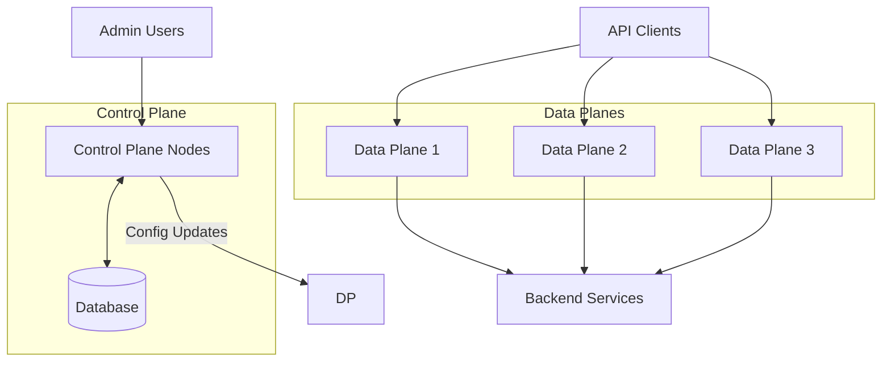
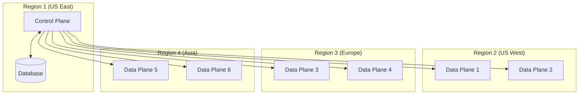

# Kong Hybrid Mode

## Introduction

Kong Hybrid mode represents a deployment architecture that splits Kong Gateway nodes into two roles: Control Plane (CP) and Data Plane (DP). This separation provides significant advantages for distributed architectures, high-availability deployments, and multi-datacenter setups.

In this guide, you'll learn what Kong Hybrid mode is, why it's beneficial, and how to set it up step by step.

## What is Kong Hybrid Mode?

Kong Hybrid mode creates a distributed Kong Gateway deployment where:

- **Control Plane nodes** handle the Admin API, configuration management, and cluster-wide coordination
- **Data Plane nodes** handle the actual API traffic and execute the configurations received from the Control Plane

This architecture allows you to:

1. Scale your gateway infrastructure across multiple regions
2. Simplify management of distributed gateways
3. Enhance security by restricting admin access to Control Plane nodes
4. Improve performance by optimizing each node type for its specific role



## Why Use Kong Hybrid Mode?

Traditional Kong Gateway deployments use the same node type for both administration and processing API traffic. While simple, this approach has limitations:

- Every node requires database access
- Admin API is exposed on all nodes (potential security risk)
- Difficult to manage across different regions or datacenters

Kong Hybrid mode addresses these issues by:

1. **Improved Security**: Admin API is only available on Control Plane nodes
2. **Simplified Operations**: Manage all nodes from a centralized Control Plane
3. **Database Independence**: Data Plane nodes don't need direct database access
4. **Reduced Latency**: Data Planes can be deployed closer to your users
5. **Increased Resilience**: Control Plane issues don't affect Data Plane operations

## Setting Up Kong Hybrid Mode

Let's walk through the process of setting up a basic Kong Hybrid deployment.

### Prerequisites

Before starting, ensure you have:

- Kong Gateway Enterprise or Kong Gateway (OSS) version 2.0+
- A PostgreSQL database for the Control Plane
- Systems that meet Kong's [recommended hardware requirements](https://docs.konghq.com/gateway/latest/production/deployment-topologies/hybrid-mode/)
- Network connectivity between all nodes

### Step 1: Set Up the Control Plane

First, let's configure the Kong Control Plane node. Create a `kong.conf` file with the following settings:

```
# Basic Configuration
database = postgres
pg_host = <your-database-host>
pg_user = <your-database-user>
pg_password = <your-database-password>
pg_database = kong

# Hybrid Mode Configuration
role = control_plane
cluster_cert = /path/to/cluster.crt
cluster_cert_key = /path/to/cluster.key
cluster_listen = 0.0.0.0:8005
```

Next, generate the certificates for secure communication:

```bash
kong hybrid gen_cert /path/to/cluster
```

This will create the `cluster.crt` and `cluster.key` files. Keep these safe as you'll need them for the Data Plane configuration.

Now start the Control Plane:

```bash
kong start -c /path/to/kong.conf
```

The Control Plane should now be running and ready to accept connections from Data Plane nodes.

### Step 2: Set Up the Data Plane

For each Data Plane node, create a `kong.conf` file with these settings:

```
# Hybrid Mode Configuration
role = data_plane
database = off
cluster_cert = /path/to/cluster.crt
cluster_cert_key = /path/to/cluster.key
cluster_control_plane = <control-plane-ip>:8005
```

Ensure you've copied the same certificate files (`cluster.crt` and `cluster.key`) from the Control Plane to each Data Plane node.

Start the Data Plane:

```bash
kong start -c /path/to/kong.conf
```

### Step 3: Verify the Connection

To verify that the Data Plane has successfully connected to the Control Plane, check the Control Plane logs:

```bash
tail -f /usr/local/kong/logs/error.log
```

You should see messages indicating successful connections from your Data Plane nodes.

You can also use the Admin API on the Control Plane to see connected Data Planes:

```bash
curl http://<control-plane-ip>:8001/clustering/data-planes
```

Example output:

```json
{
  "data": [
    {
      "id": "3dd414f9-1701-439f-ae3d-beaa92626485",
      "hostname": "data-plane-1",
      "ip": "192.168.1.101",
      "last_seen": 1615471718,
      "config_hash": "a9a166c59873245db8f1a747ba9a80a7",
      "ttl": 3000
    }
  ],
  "next": null
}
```

## Working with Kong Hybrid Mode

Now that you have a working Hybrid setup, let's explore how to use it effectively.

### Managing APIs and Plugins

With Hybrid mode, all configuration changes must be made through the Control Plane's Admin API. The Data Plane nodes will automatically receive these configurations.

For example, to create a new service:

```bash
curl -X POST http://<control-plane-ip>:8001/services \
  --data name=example-service \
  --data url=http://example.com
```

To add a route to this service:

```bash
curl -X POST http://<control-plane-ip>:8001/services/example-service/routes \
  --data name=example-route \
  --data paths[]=/example
```

Once configured, these changes will propagate to all connected Data Plane nodes automatically.

### Real-World Example: Multi-Region Deployment

Let's look at a practical example of Kong Hybrid mode in a multi-region deployment:



In this setup:

1. A centralized Control Plane in US East manages the configuration
2. Data Plane nodes in multiple regions handle local API traffic
3. Users in each region get low-latency access to APIs
4. Administrators manage everything from a single point

This architecture provides:
- Lower latency for end users
- Simplified global management
- Better fault isolation
- Reduced cross-region data transfer costs

### Monitoring Hybrid Deployments

Monitoring is crucial for hybrid deployments. Key metrics to watch include:

1. **Control Plane Status**: Uptime and resource utilization
2. **Data Plane Connectivity**: Check if Data Planes are connected and in sync
3. **Configuration Propagation**: Time taken for changes to reach all Data Planes
4. **API Traffic Metrics**: Requests, latency, and error rates per Data Plane

Kong provides status endpoints that help monitor your deployment:

```bash
# Check Data Plane status
curl http://<control-plane-ip>:8001/clustering/data-planes

# Check Control Plane status
curl http://<control-plane-ip>:8001/status
```

## Advanced Configuration

As you become more comfortable with Kong Hybrid mode, you can explore advanced configurations:

### High Availability Control Plane

For production environments, set up multiple Control Plane nodes behind a load balancer:

```
# On additional Control Plane nodes
role = control_plane
database = postgres
pg_host = <your-database-host>
pg_user = <your-database-user>
pg_password = <your-database-password>
pg_database = kong
cluster_cert = /path/to/cluster.crt
cluster_cert_key = /path/to/cluster.key
cluster_listen = 0.0.0.0:8005
```

### Data Plane Certificate Rotation

To rotate certificates without downtime:

1. Generate new certificates on the Control Plane
2. Update the Control Plane configuration to use both old and new certificates
3. Gradually update Data Planes to use the new certificates
4. Remove the old certificates from the Control Plane configuration

### Custom Data Plane Configuration

You can customize certain aspects of Data Plane nodes while maintaining centralized control:

```
# On Data Plane nodes
role = data_plane
database = off
cluster_cert = /path/to/cluster.crt
cluster_cert_key = /path/to/cluster.key
cluster_control_plane = <control-plane-ip>:8005
# Custom settings
proxy_access_log = /custom/path/to/access.log
proxy_error_log = /custom/path/to/error.log
nginx_worker_processes = 8
```

## Common Issues and Troubleshooting

Here are some common issues you might encounter with Kong Hybrid mode:

### Data Plane Can't Connect to Control Plane

If your Data Plane can't connect to the Control Plane, check:

1. Network connectivity between the nodes
2. Firewall rules allowing traffic on port 8005
3. Certificate paths and permissions
4. Time synchronization between nodes

Error logs to look for:

```
[error] 17#0: *1 SSL_do_handshake() failed (SSL: error:1416F086) 
```

This usually indicates a certificate issue. Ensure both nodes have the same certificate files.

### Configuration Not Updating on Data Planes

If configuration changes don't propagate:

1. Check the Control Plane logs for errors
2. Verify Data Plane connectivity status
3. Restart the Data Plane if needed

### Performance Tuning

If you experience performance issues:

1. Increase `nginx_worker_processes` based on available CPU cores
2. Adjust `nginx_worker_connections` for high-traffic scenarios
3. Optimize the `mem_cache_size` setting for your workload

## Summary

Kong Hybrid mode provides a powerful way to deploy and manage Kong Gateway across distributed environments. By separating Control Plane and Data Plane functions, you gain security, scalability, and operational benefits.

In this guide, you've learned:

- The core concepts of Kong Hybrid mode
- How to set up basic Control Plane and Data Plane nodes
- Managing APIs and plugins in a Hybrid deployment
- Real-world deployment scenarios
- Advanced configuration options and troubleshooting

This deployment model is particularly valuable for organizations with multi-region requirements, security concerns, or those looking to optimize their API gateway infrastructure for scale.

## Additional Resources

To deepen your understanding of Kong Hybrid mode, consider exploring:

- [Kong's Official Hybrid Mode Documentation](https://docs.konghq.com/gateway/latest/production/deployment-topologies/hybrid-mode/)
- [Kong Enterprise Features that enhance Hybrid deployments](https://konghq.com/products/kong-enterprise)
- [Kong's Kubernetes Ingress Controller with Hybrid mode](https://docs.konghq.com/kubernetes-ingress-controller/latest/concepts/deployment/)

## Exercises

To practice your Kong Hybrid mode skills:

1. Set up a local Hybrid deployment using Docker or virtual machines
2. Configure a service and route on the Control Plane and verify it works on the Data Plane
3. Simulate a Control Plane failure and observe how the Data Plane continues to function
4. Implement a certificate rotation process for your Hybrid deployment
5. Create a monitoring dashboard for your Hybrid deployment using Prometheus and Grafana