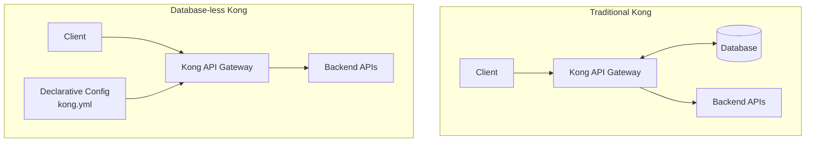

# Kong Database-less Mode

## Introduction

Kong API Gateway traditionally relies on a database (PostgreSQL or Cassandra) to store its configuration. However, for many deployment scenarios, maintaining a separate database introduces complexity, additional points of failure, and infrastructure overhead. Kong's **Database-less** mode offers a simpler alternative that's perfect for container environments, edge deployments, and CI/CD pipelines.

In database-less mode, Kong uses declarative configuration files to define routes, services, plugins, and consumers instead of storing this information in a database. This approach aligns with infrastructure-as-code practices and simplifies deployments significantly.

## Why Choose Database-less Mode?

Database-less mode offers several advantages:

- **Simplified deployments**: No database infrastructure to maintain
- **Immutable infrastructure**: Configuration is versioned with your application code
- **Faster startup**: Kong doesn't need to connect to a database
- **Reduced operational complexity**: Fewer components to monitor and maintain
- **GitOps-friendly**: Configuration can be stored in version control

However, it also comes with some limitations:

- No dynamic admin API for configuration changes (read-only Admin API)
- Configuration changes require reloading or restarting Kong
- Some advanced plugins might require a database

## Setting Up Kong in Database-less Mode

### Prerequisites

- Kong Gateway installed (version 1.1+)
- Basic understanding of API gateway concepts

### Step 1: Configure Kong for Database-less Mode

First, we need to modify the Kong configuration file (`kong.conf`) to specify that we're running in database-less mode:

```bash
# In kong.conf
database = off
declarative_config = /path/to/kong.yml
```

Alternatively, you can use environment variables:

```bash
export KONG_DATABASE=off
export KONG_DECLARATIVE_CONFIG=/path/to/kong.yml
```

### Step 2: Create a Declarative Configuration File

Create a YAML file (commonly named `kong.yml`) that defines your Kong configuration:

```yaml
_format_version: "2.1"
_transform: true

services:
  - name: example-service
    url: http://example.com
    routes:
      - name: example-route
        paths:
          - /example
    plugins:
      - name: rate-limiting
        config:
          minute: 5
          policy: local

consumers:
  - username: example-user
    keyauth_credentials:
      - key: example-key
```

This example creates:
- A service pointing to `http://example.com`
- A route that forwards requests from `/example` to the service
- A rate-limiting plugin that limits requests to 5 per minute
- A consumer with an API key for authentication

### Step 3: Start Kong

Start Kong with your configuration:

```bash
kong start
```

Kong will load the configuration from your declarative file and apply it at startup.

## Working with Declarative Configuration

### Configuration Structure

A declarative configuration file follows this general structure:

```yaml
_format_version: "2.1"  # Required version identifier
_transform: true        # Optional: enables config transformations

# Core entities
services: []            # List of Kong services
routes: []              # List of standalone routes (not linked to services)
plugins: []             # List of global plugins
consumers: []           # List of consumers
upstreams: []           # List of upstream services
certificates: []        # List of certificates
ca_certificates: []     # List of CA certificates
```

### Defining Services and Routes

Services represent your backend APIs, while routes determine how requests are forwarded to those services:

```yaml
services:
  - name: user-service
    url: http://user-api:8000
    routes:
      - name: user-api-route
        paths:
          - /users
        methods:
          - GET
          - POST
    plugins:
      - name: key-auth
```

### Adding Plugins

Plugins can be applied at different levels:

```yaml
# Global plugin (applies to all requests)
plugins:
  - name: cors
    config:
      origins: ["*"]
      methods: ["GET", "POST"]

services:
  - name: payments-service
    url: http://payments-api:8000
    plugins:
      # Service-level plugin (applies to all routes of this service)
      - name: rate-limiting
        config:
          minute: 10
    routes:
      - name: payment-route
        paths:
          - /payments
        plugins:
          # Route-level plugin (applies only to this route)
          - name: request-transformer
            config:
              add:
                headers: ["X-Route: payment"]
```

### Managing Consumers and Credentials

For API authentication, you'll need to define consumers and their credentials:

```yaml
consumers:
  - username: mobile-app
    tags: ["app"]
    plugins:
      # Consumer-specific plugin
      - name: rate-limiting
        config:
          minute: 100
    keyauth_credentials:
      - key: mobile-app-key
  
  - username: partner-service
    jwt_secrets:
      - key: "partner-service"
        secret: "shared-secret"
```

## Updating Configurations

In database-less mode, Kong offers two approaches to update configurations:

### Method 1: Full Reload

Replace the entire configuration and reload Kong:

1. Update your YAML file
2. Run: `kong reload`

This causes Kong to reload with the new configuration.

### Method 2: Declarative Config Update (Kong 2.0+)

You can update the running configuration without a full reload:

```bash
curl -X POST http://localhost:8001/config \
  -H "Content-Type: application/json" \
  -d @kong.yml
```

## Real-World Example: Microservices API Gateway

Let's configure Kong as a gateway for a microservices application with authentication, rate limiting, and monitoring:

```yaml
_format_version: "2.1"
_transform: true

# Global plugins
plugins:
  - name: prometheus
    config:
      status_code_metrics: true
  - name: cors
    config:
      origins: ["*"]
      methods: ["GET", "POST", "PUT", "DELETE"]
      headers: ["Content-Type", "Authorization"]
      max_age: 3600

# Services
services:
  - name: authentication-service
    url: http://auth-service:3000
    routes:
      - name: auth-route
        paths:
          - /auth
        strip_path: true
    plugins:
      - name: rate-limiting
        config:
          minute: 20
          policy: local

  - name: product-service
    url: http://product-service:8080
    routes:
      - name: products-route
        paths:
          - /products
        strip_path: true
    plugins:
      - name: key-auth
        config:
          hide_credentials: true
      - name: rate-limiting
        config:
          minute: 60
          policy: local

  - name: order-service
    url: http://order-service:8080
    routes:
      - name: orders-route
        paths:
          - /orders
        strip_path: true
    plugins:
      - name: key-auth
      - name: acl
        config:
          allow: ["admin", "sales"]

# Consumers
consumers:
  - username: mobile-app
    keyauth_credentials:
      - key: "mobile-app-key"
    acls:
      - group: "sales"

  - username: admin-panel
    keyauth_credentials:
      - key: "admin-secret-key"
    acls:
      - group: "admin"
```

This configuration:
1. Sets up global Prometheus monitoring and CORS headers
2. Creates three services with different routes and security policies
3. Applies rate limiting to prevent abuse
4. Defines two consumers with different access levels

## Deployment Strategies

### Docker Deployment

For containerized environments, you can build a custom Kong image with your configuration:

```dockerfile
FROM kong:2.8

COPY kong.yml /usr/local/kong/declarative/kong.yml
ENV KONG_DATABASE=off
ENV KONG_DECLARATIVE_CONFIG=/usr/local/kong/declarative/kong.yml

EXPOSE 8000 8443 8001 8444
```

### Kubernetes Deployment

In Kubernetes, you can use ConfigMaps to manage your Kong configuration:

```yaml
apiVersion: v1
kind: ConfigMap
metadata:
  name: kong-dbless-config
data:
  kong.yml: |
    _format_version: "2.1"
    services:
      - name: example-service
        url: http://example-svc.default.svc.cluster.local:8000
        routes:
          - name: example
            paths:
              - /example
```

Then reference this ConfigMap in your Kong deployment:

```yaml
env:
  - name: KONG_DATABASE
    value: "off"
  - name: KONG_DECLARATIVE_CONFIG
    value: "/etc/kong/kong.yml"
volumeMounts:
  - name: kong-dbless-config
    mountPath: /etc/kong
volumes:
  - name: kong-dbless-config
    configMap:
      name: kong-dbless-config
```

## Visualizing Database-less Architecture

Here's a diagram showing how database-less Kong works compared to traditional DB-backed Kong:



## Best Practices

1. **Version Control**: Store your declarative configuration files in git
2. **Environment Variables**: Use environment variable substitution for environment-specific values
3. **Validation**: Test your configuration before deployment:
   ```bash
   kong config parse kong.yml
   ```
4. **Modularization**: Split large configurations into multiple files using the `include` directive
5. **CI/CD Integration**: Incorporate Kong configuration testing into your CI/CD pipeline
6. **Monitoring**: Even without a database, ensure you monitor Kong's health and performance

## Troubleshooting

### Common Issues

1. **Invalid Configuration Syntax**
   
   If Kong fails to start with an error related to the configuration file:
   
   ```bash
   kong config parse kong.yml -v
   ```
   
   This will validate your configuration and show detailed errors.

2. **Changes Not Applied**
   
   If your changes don't seem to take effect, verify Kong has fully reloaded:
   
   ```bash
   curl http://localhost:8001/
   ```
   
   Check the configuration_hash to see if it matches your new configuration.

3. **Route Not Matching**
   
   If requests aren't being properly routed, test the admin API:
   
   ```bash
   curl http://localhost:8001/routes
   ```

## Summary

Kong's database-less mode offers a simpler, more infrastructure-as-code friendly approach to API gateway deployment. By using declarative configuration files instead of a database, you can:

- Simplify your infrastructure
- Integrate configuration with your CI/CD pipeline
- Version control your API gateway configuration
- Deploy Kong in resource-constrained environments

While it comes with some limitations compared to the database-backed mode, database-less Kong is ideal for containerized deployments, edge computing scenarios, and environments where operational simplicity is prioritized.

## Additional Resources

- [Kong Documentation on DB-less Mode](https://docs.konghq.com/gateway/latest/production/deployment-topologies/db-less-and-declarative-config/)
- [Declarative Configuration Format](https://docs.konghq.com/gateway/latest/reference/db-less-and-declarative-config/)
- [Kong Docker Hub](https://hub.docker.com/_/kong)

## Exercises

1. Create a declarative configuration for a simple API gateway that routes traffic to two different backend services.
2. Implement rate limiting and key authentication for your API gateway.
3. Deploy Kong in database-less mode using Docker.
4. Update your configuration to add a new service without restarting Kong.
5. Implement path-based routing with request transformation.