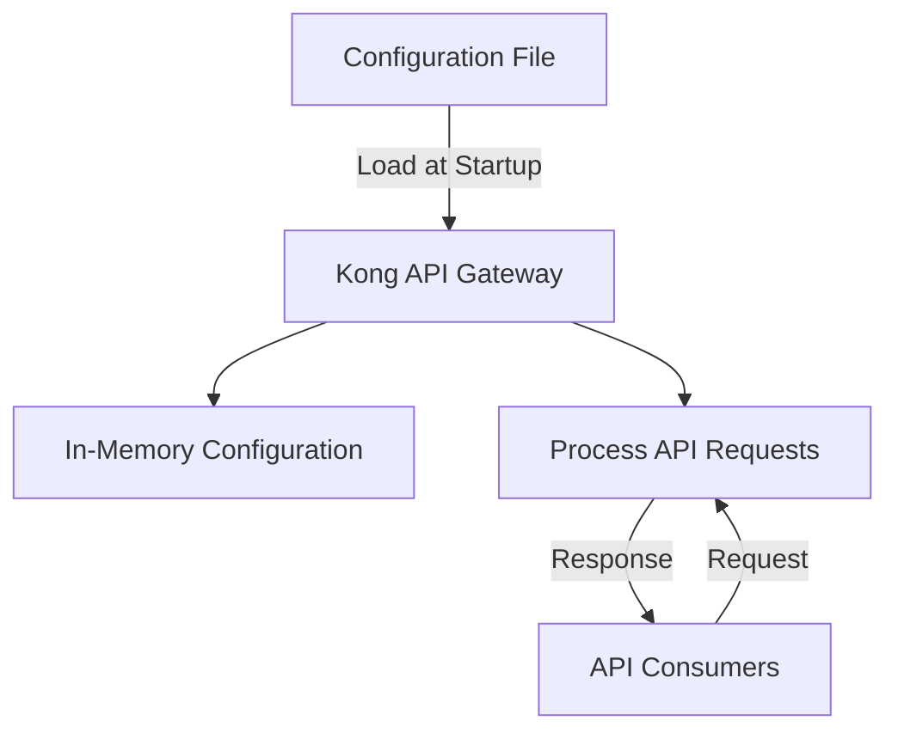

# Kong DB-less Mode

## Introduction

Kong is a popular, open-source API Gateway that helps manage API traffic, implement security policies, and orchestrate complex microservice architectures. Traditionally, Kong relied on a database (PostgreSQL or Cassandra) to store its configuration. However, with the introduction of **DB-less mode**, Kong can now operate without a database dependency, simplifying deployments and improving performance.

DB-less mode allows Kong to load its configuration from a declarative YAML or JSON file, rather than from a database. This approach brings several advantages, especially for containerized environments, CI/CD pipelines, and GitOps workflows.

## Why Use Kong DB-less Mode?

DB-less mode offers several benefits:

1. **Simplified Architecture**: Eliminate database dependencies and reduce infrastructure complexity
2. **GitOps Compatible**: Store configuration as code in version control
3. **Immutable Infrastructure**: Support for immutable deployment patterns
4. **Faster Startup**: Reduced bootstrap time without database connection and migrations
5. **Reduced Operational Overhead**: No database to maintain, backup, or scale

## How DB-less Mode Works

In DB-less mode, Kong stores its configuration in memory after loading it from a declarative configuration file. This approach enables Kong to start faster and operate with predictable performance characteristics.



## Getting Started with Kong DB-less Mode

### Prerequisites

Before getting started, ensure you have:

- Kong Gateway installed (version 1.1 or later)
- Basic understanding of API gateway concepts
- Configuration file in YAML or JSON format

### Step 1: Install Kong

If you haven't installed Kong yet, follow these installation steps based on your platform:

```bash
# For Debian/Ubuntu
$ curl -Lo kong.deb "https://download.konghq.com/gateway-2.x-ubuntu-$(lsb_release -cs)/pool/all/k/kong/kong_2.8.1_amd64.deb"
$ sudo apt install -y ./kong.deb

# For Docker
$ docker pull kong/kong:2.8
```

### Step 2: Create a Declarative Configuration File

Create a file named `kong.yml` with your API gateway configuration:

```yaml
_format_version: "2.1"
_transform: true

services:
  - name: example-service
    url: http://example.com
    routes:
      - name: example-route
        paths:
          - /example
    plugins:
      - name: rate-limiting
        config:
          minute: 5
          policy: local
```

This configuration defines:
- A service pointing to `http://example.com`
- A route that forwards requests from `/example` to the service
- A rate limiting plugin that restricts clients to 5 requests per minute

### Step 3: Start Kong in DB-less Mode

Launch Kong with the declarative configuration:

```bash
# Point Kong to your configuration file
$ export KONG_DATABASE=off
$ export KONG_DECLARATIVE_CONFIG=kong.yml
$ kong start

# Or using Docker
$ docker run -d --name kong \
  -v $(pwd)/kong.yml:/kong/declarative/kong.yml \
  -e "KONG_DATABASE=off" \
  -e "KONG_DECLARATIVE_CONFIG=/kong/declarative/kong.yml" \
  -e "KONG_PROXY_ACCESS_LOG=/dev/stdout" \
  -e "KONG_ADMIN_ACCESS_LOG=/dev/stdout" \
  -e "KONG_PROXY_ERROR_LOG=/dev/stderr" \
  -e "KONG_ADMIN_ERROR_LOG=/dev/stderr" \
  -p 8000:8000 \
  -p 8443:8443 \
  -p 8001:8001 \
  -p 8444:8444 \
  kong/kong:2.8
```

### Step 4: Verify Your Configuration

Test that your API gateway is properly forwarding requests:

```bash
$ curl -i http://localhost:8000/example

HTTP/1.1 200 OK
Content-Type: text/html; charset=UTF-8
Content-Length: 1256
Connection: keep-alive
Server: gunicorn/19.9.0
Date: Sun, 09 Mar 2025 10:15:32 GMT
Access-Control-Allow-Origin: *
Access-Control-Allow-Credentials: true
X-Kong-Upstream-Latency: 35
X-Kong-Proxy-Latency: 12
Via: kong/2.8.1

<!DOCTYPE html>
<html>
<head>
    <title>Example Domain</title>
    <!-- Content from example.com -->
</head>
...
```

## Advanced Configuration

### Hot Reloading Configuration

Kong allows you to update your configuration without restarting the gateway using the Admin API:

```bash
# Update configuration
$ curl -X POST http://localhost:8001/config \
  -H "Content-Type: application/json" \
  -d @kong.json

# Or with declarative configuration format
$ curl -X POST http://localhost:8001/config \
  -F "config=@kong.yml"
```

### Environment Variables in Configuration

You can use environment variables in your configuration file for added flexibility:

```yaml
_format_version: "2.1"
services:
  - name: ${SERVICE_NAME}
    url: ${SERVICE_URL}
    routes:
      - name: main-route
        paths:
          - /${SERVICE_PATH}
```

Then export these variables before starting Kong:

```bash
$ export SERVICE_NAME=my-api
$ export SERVICE_URL=http://internal-api.example.com
$ export SERVICE_PATH=api
$ kong start
```

### Multi-Environment Setup

For different environments (development, staging, production), create separate configuration files:

```
/config/
  ├── kong.dev.yml
  ├── kong.staging.yml
  └── kong.prod.yml
```

Then specify the appropriate file when starting Kong:

```bash
$ export KONG_DATABASE=off
$ export KONG_DECLARATIVE_CONFIG=/config/kong.prod.yml
$ kong start
```

## Real-World Example: Authentication and Rate Limiting

Let's build a practical example with authentication and rate limiting for a microservice architecture:

```yaml
_format_version: "2.1"
_transform: true

services:
  - name: user-service
    url: http://user-service:3000
    routes:
      - name: user-api
        paths:
          - /users
    plugins:
      - name: key-auth
      - name: rate-limiting
        config:
          minute: 60
          policy: local

  - name: order-service
    url: http://order-service:3000
    routes:
      - name: order-api
        paths:
          - /orders
    plugins:
      - name: key-auth
      - name: rate-limiting
        config:
          minute: 30
          policy: local

consumers:
  - username: mobile-app
    keyauth_credentials:
      - key: MOBILE-APP-SECRET-KEY
  
  - username: partner-service
    keyauth_credentials:
      - key: PARTNER-SERVICE-KEY
```

In this example:
1. We define two services: a user service and an order service
2. Both services require API key authentication
3. Different rate limits are applied to each service
4. Two consumers are defined with their respective API keys

To test this configuration:

```bash
# Request without authentication fails
$ curl -i http://localhost:8000/users
HTTP/1.1 401 Unauthorized
...

# Request with correct authentication succeeds
$ curl -i http://localhost:8000/users \
  -H "apikey: MOBILE-APP-SECRET-KEY"
HTTP/1.1 200 OK
...
```

## Performance Considerations

When operating Kong in DB-less mode, keep these performance considerations in mind:

1. **Memory Usage**: All configuration is stored in memory, so ensure your server has sufficient RAM
2. **Configuration Size**: Very large configurations (thousands of services/routes) may impact startup time
3. **Request Latency**: DB-less mode typically offers lower latency since it doesn't need database queries
4. **Hot Reloads**: Frequent configuration reloads on large configs can cause temporary performance impacts

## Limitations of DB-less Mode

While DB-less mode offers many advantages, it does have some limitations:

1. **No Dynamic Plugins**: Plugins that dynamically create or modify entities (like OAuth2) have limited functionality
2. **Limited Admin API**: Some Admin API endpoints are read-only or unavailable
3. **No Clustering**: Kong clustering features require a database
4. **Manual Propagation**: Configuration changes must be manually propagated to all Kong nodes

## Best Practices

To get the most out of Kong DB-less mode:

1. **Version Control**: Store your Kong configuration files in Git
2. **CI/CD Integration**: Automate testing and deployment of configuration changes
3. **Environment Variables**: Use environment variables for environment-specific values
4. **Monitoring**: Set up monitoring for Kong to track performance and errors
5. **Regular Backups**: Keep backups of your configuration files
6. **Gradual Deployment**: Deploy configuration changes to a subset of nodes first

## Summary

Kong DB-less mode provides a simplified approach to API gateway deployment by eliminating database dependencies. It's particularly well-suited for containerized environments, GitOps workflows, and situations where you want to treat infrastructure configuration as code.

By loading configuration from a declarative file, DB-less mode offers faster startup times, reduced operational complexity, and better alignment with modern deployment practices. While it has some limitations compared to database-backed deployments, the benefits make it an excellent choice for many use cases.

## Additional Resources

- [Kong DB-less Official Documentation](https://docs.konghq.com/gateway/latest/production/deployment-topologies/db-less-and-declarative-config/)
- [Kong Configuration Format](https://docs.konghq.com/gateway/latest/reference/db-less-and-declarative-config/)
- [Kong Admin API Reference](https://docs.konghq.com/gateway/latest/admin-api/)

## Exercises

1. Create a DB-less configuration for securing a set of microservices with different authentication methods.
2. Implement a configuration that includes request transformation and response modification.
3. Build a CI/CD pipeline that validates and deploys Kong configuration changes.
4. Create a monitoring solution that alerts on Kong issues in a DB-less deployment.
5. Design a blue/green deployment strategy for Kong configuration updates.