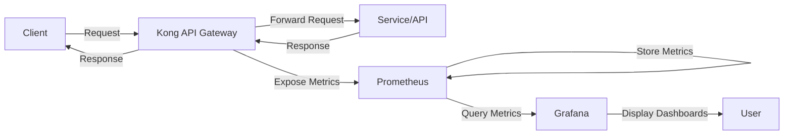

# Kong Prometheus Integration

## Introduction

Monitoring is a critical aspect of maintaining healthy API infrastructures. Kong, a popular API gateway, offers seamless integration with Prometheus, an open-source monitoring and alerting toolkit. This integration allows you to collect, store, and visualize metrics from your Kong API Gateway, giving you valuable insights into the performance and health of your APIs.

In this guide, we'll explore the Kong Prometheus integration, how to set it up, and how to leverage it for monitoring your API infrastructure effectively.

## What is Prometheus?

Prometheus is an open-source systems monitoring and alerting toolkit originally built at SoundCloud. It focuses on:

- **Time-series data**: Metrics with timestamps
- **Multi-dimensional data model**: Metrics with key-value pairs
- **PromQL**: A powerful query language for data analysis
- **Pull-based architecture**: Prometheus scrapes metrics from targets
- **No reliance on distributed storage**: Autonomous single server nodes

## Why Integrate Kong with Prometheus?

Integrating Kong with Prometheus provides several benefits:

1. **Real-time monitoring**: Track API performance and health metrics in real-time
2. **Troubleshooting**: Quickly identify and resolve issues affecting API performance
3. **Capacity planning**: Make informed decisions about infrastructure scaling
4. **Alerting**: Set up alerts for potential issues before they impact users
5. **Visualization**: Create dashboards to visualize API metrics (often with Grafana)

## Prerequisites

Before setting up the Kong Prometheus integration, ensure you have:

- Kong Gateway installed and running
- Basic familiarity with Kong configuration
- Prometheus installed or access to a Prometheus instance
- (Optional) Grafana for visualization

## Setting Up Kong Prometheus Plugin

### Step 1: Enable the Prometheus Plugin

Kong provides a Prometheus plugin that exposes metrics in a format that Prometheus can scrape. To enable it globally (across all services):

```bash
curl -X POST http://localhost:8001/plugins/ \
  --data "name=prometheus"
```

Alternatively, you can enable it for specific services or routes:

```bash
# For a specific service
curl -X POST http://localhost:8001/services/your-service/plugins/ \
  --data "name=prometheus"

# For a specific route
curl -X POST http://localhost:8001/routes/your-route/plugins/ \
  --data "name=prometheus"
```

### Step 2: Verify the Plugin Installation

After enabling the plugin, verify it's working correctly by accessing the metrics endpoint:

```bash
curl http://localhost:8001/metrics
```

You should see output similar to:

```
# HELP kong_datastore_reachable Datastore reachable from Kong, 0 is unreachable
# TYPE kong_datastore_reachable gauge
kong_datastore_reachable 1

# HELP kong_http_status HTTP status codes
# TYPE kong_http_status counter
kong_http_status{code="200"} 5
kong_http_status{code="404"} 1

# HELP kong_latency Latency added by Kong, total request time and upstream latency
# TYPE kong_latency histogram
kong_latency_bucket{type="kong",le="1"} 1
kong_latency_bucket{type="kong",le="2"} 2
...
```

### Step 3: Configure Prometheus to Scrape Kong Metrics

Add Kong as a scrape target in your Prometheus configuration file (`prometheus.yml`):

```yaml
scrape_configs:
  - job_name: 'kong'
    scrape_interval: 5s
    static_configs:
      - targets: ['kong-admin:8001']
```

Replace `kong-admin:8001` with the address and port of your Kong Admin API.

### Step 4: Restart Prometheus

Restart Prometheus to apply the configuration changes:

```bash
# For systemd-based systems
sudo systemctl restart prometheus

# For Docker installations
docker restart prometheus
```

## Key Metrics Available

The Kong Prometheus plugin exposes several important metrics:

1. **HTTP Status Codes**: Count of responses by status code
2. **Latency Metrics**:
   - Kong latency (time spent in Kong)
   - Upstream latency (time spent in the upstream service)
   - Total request latency
3. **Bandwidth**: Total bytes transferred
4. **Connections**: Number of active connections
5. **Database**: Database reachability and performance metrics
6. **nginx**: Metrics related to the underlying nginx instance

## Creating a Basic Visualization Dashboard

While you can query these metrics directly in Prometheus, many users prefer to create dashboards in Grafana. Here's a simple PromQL query to get you started:

```
# Request volume by status code over time
sum by (status_code) (rate(kong_http_status{job="kong"}[5m]))

# 95th percentile latency
histogram_quantile(0.95, sum(rate(kong_latency_bucket{type="request"}[5m])) by (le))
```

## Advanced Configuration

### Custom Metrics

You can customize which metrics are exposed through the Prometheus plugin by specifying them in the plugin configuration:

```bash
curl -X POST http://localhost:8001/plugins/ \
  --data "name=prometheus" \
  --data "config.status_code_metrics=true" \
  --data "config.latency_metrics=true" \
  --data "config.upstream_health_metrics=true" \
  --data "config.bandwidth_metrics=true" \
  --data "config.unique_users_metrics=true"
```

### Metric Labels

You can add custom labels to metrics for better organization:

```bash
curl -X POST http://localhost:8001/plugins/ \
  --data "name=prometheus" \
  --data "config.labels[].name=environment" \
  --data "config.labels[].value=production"
```

## Kong Prometheus Integration Architecture

The following diagram illustrates how Kong, Prometheus, and Grafana work together:



## Practical Example: Monitoring API Traffic

Let's create a practical example to monitor traffic through a specific API route.

### 1. Create a Service and Route

```bash
# Create a service
curl -X POST http://localhost:8001/services/ \
  --data "name=example-service" \
  --data "url=http://example.com"

# Create a route
curl -X POST http://localhost:8001/services/example-service/routes \
  --data "name=example-route" \
  --data "paths[]=/example"
```

### 2. Enable Prometheus Plugin for the Route

```bash
curl -X POST http://localhost:8001/routes/example-route/plugins/ \
  --data "name=prometheus"
```

### 3. Generate Some Traffic

```bash
for i in {1..50}; do 
  curl -s http://localhost:8000/example > /dev/null
  sleep 0.1
done
```

### 4. Query the Metrics in Prometheus

In the Prometheus UI, enter the following query to see the traffic on your example route:

```
sum(kong_http_status{route="example-route"}) by (code)
```

This will show you the count of responses grouped by status code for your example route.

## Troubleshooting

### Metrics Not Showing Up

If metrics aren't appearing in Prometheus:

1. Verify the Prometheus plugin is enabled:
   ```bash
   curl http://localhost:8001/plugins/
   ```

2. Check if the metrics endpoint is accessible:
   ```bash
   curl http://localhost:8001/metrics
   ```

3. Ensure Prometheus is correctly configured to scrape Kong:
   ```bash
   curl http://prometheus:9090/api/v1/targets
   ```

### Error in Plugin Configuration

If you encounter errors when configuring the plugin:

```bash
# Get detailed information about the plugin configuration
curl -X GET http://localhost:8001/plugins/

# Remove the problematic plugin
curl -X DELETE http://localhost:8001/plugins/{plugin-id}
```

## Best Practices

1. **Start with global metrics**: Enable the Prometheus plugin globally first, then add specific metrics for critical services.

2. **Use meaningful labels**: Add labels like `environment`, `service_name`, and `team` to make metrics more meaningful.

3. **Set up alerts**: Configure Prometheus alerts for critical thresholds, such as high error rates or latency spikes.

4. **Combine with logging**: Use the Kong File Log plugin alongside Prometheus for comprehensive monitoring.

5. **Retention planning**: Configure appropriate data retention periods in Prometheus based on your needs and resources.

## Summary

The Kong Prometheus integration provides powerful monitoring capabilities for your API infrastructure. By collecting and analyzing metrics from Kong, you can gain valuable insights into API performance, troubleshoot issues faster, and make data-driven decisions about infrastructure scaling.

In this guide, we covered:

- Setting up the Kong Prometheus plugin
- Configuring Prometheus to scrape Kong metrics
- Understanding the key metrics available
- Creating visualizations and dashboards
- Implementing a practical monitoring example
- Troubleshooting common issues
- Best practices for Kong Prometheus integration

## Additional Resources

- [Kong Prometheus Plugin Documentation](https://docs.konghq.com/hub/kong-inc/prometheus/)
- [Prometheus Documentation](https://prometheus.io/docs/introduction/overview/)
- [Grafana Documentation](https://grafana.com/docs/)

## Exercises

1. Enable the Prometheus plugin on a Kong service and set up a Grafana dashboard to visualize the service's performance.

2. Create a Prometheus alert that triggers when the error rate (status codes 5xx) exceeds 5% over a 5-minute period.

3. Extend the basic monitoring setup to include upstream health checks and visualize the results.

4. Compare the performance of different Kong-managed APIs using Prometheus metrics and identify potential bottlenecks.