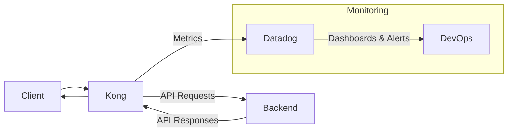

# Kong Datadog Integration

## Introduction

Kong is a popular, open-source API gateway that helps you manage, secure, and observe your APIs. Datadog is a monitoring and analytics platform that provides visibility into your application's performance. Integrating Kong with Datadog allows you to monitor the health, performance, and usage patterns of your APIs in real-time.

This guide will walk you through setting up the Kong Datadog integration, explain key concepts, and provide practical examples to help you get the most out of this powerful combination.

## Prerequisites

Before getting started, make sure you have:

- A running Kong instance (version 2.0.0 or later)
- A Datadog account
- Basic familiarity with Kong plugins
- Your Datadog API key

## How Kong and Datadog Work Together

The Kong Datadog plugin sends metrics from Kong to your Datadog account, allowing you to:

- Monitor API traffic and performance
- Set up alerts for unusual activity
- Create dashboards to visualize API usage
- Track errors and latency issues



## Setting Up Kong Datadog Plugin

### Step 1: Install the Plugin

If you're using Kong Gateway Enterprise, the Datadog plugin is already included. For open-source Kong Gateway, you may need to install it:

```bash
# Using luarocks
luarocks install kong-plugin-datadog
```

Then add the plugin to your `kong.conf` file:

```plaintext
plugins = bundled,datadog
```

Restart Kong after making these changes:

```bash
kong restart
```

### Step 2: Configure the Plugin

You can enable the Datadog plugin globally or for specific services or routes.

#### Global Configuration

To enable the plugin globally (affecting all APIs):

```bash
curl -X POST http://kong:8001/plugins/ \
    --data "name=datadog" \
    --data "config.host=localhost" \
    --data "config.port=8125" \
    --data "config.metrics=request_count,request_size,response_size,latency,status_count,unique_users,request_per_user,upstream_latency" \
    --data "config.prefix=kong"
```

#### Service-Specific Configuration

To enable the plugin for a specific service:

```bash
curl -X POST http://kong:8001/services/your-service/plugins/ \
    --data "name=datadog" \
    --data "config.host=localhost" \
    --data "config.port=8125" \
    --data "config.metrics=request_count,latency,status_count" \
    --data "config.prefix=kong.your-service"
```

### Step 3: Configure Datadog Agent

Make sure your Datadog Agent is properly configured to receive metrics:

1. Install the Datadog Agent on your Kong server
2. Configure the Agent to listen for DogStatsD metrics:

```yaml
# In datadog.yaml
use_dogstatsd: true
dogstatsd_port: 8125
```

3. Restart the Datadog Agent:

```bash
sudo systemctl restart datadog-agent
```

## Metrics and Dimensions

The Kong Datadog plugin can track several metrics:

| Metric | Description |
|--------|-------------|
| `request_count` | Total number of requests |
| `request_size` | Size of requests |
| `response_size` | Size of responses |
| `latency` | Time between a request coming to Kong and response being sent to client |
| `upstream_latency` | Time between request being sent by Kong to upstream and response being received |
| `status_count` | HTTP status code returned |
| `unique_users` | Unique users who made requests |
| `request_per_user` | Requests made by each user |

Each metric can include these dimensions (tags):

- `service`: Name of the Kong service
- `route`: Name of the Kong route
- `consumer`: Username of the Kong consumer
- `status`: HTTP status code

## Setting Up Datadog Dashboards

Once metrics are flowing into Datadog, you can create dashboards to visualize your API performance.

### Sample Dashboard Configuration

Here's a JSON snippet for a basic Kong dashboard that you can import into Datadog:

```json
{
  "title": "Kong API Gateway Overview",
  "layout_type": "ordered",
  "widgets": [
    {
      "definition": {
        "title": "Total Requests",
        "type": "timeseries",
        "requests": [
          {
            "q": "sum:kong.request_count{*}.as_count()",
            "display_type": "line"
          }
        ]
      }
    },
    {
      "definition": {
        "title": "Requests by Status Code",
        "type": "timeseries",
        "requests": [
          {
            "q": "sum:kong.status_count{*} by {status}.as_count()",
            "display_type": "bars"
          }
        ]
      }
    },
    {
      "definition": {
        "title": "Average Latency",
        "type": "timeseries",
        "requests": [
          {
            "q": "avg:kong.latency{*}",
            "display_type": "line"
          }
        ]
      }
    }
  ]
}
```

## Alert Configuration

Set up alerts in Datadog to notify you when there are issues with your APIs:

### Error Rate Alert

```plaintext
sum(last_5m):sum:kong.status_count{status:5xx}.as_count() / sum:kong.request_count{*}.as_count() * 100 > 5
```

This alert triggers when more than 5% of requests result in 5xx errors over the last 5 minutes.

### Latency Alert

```plaintext
avg(last_5m):avg:kong.latency{*} > 500
```

This alert triggers when the average latency exceeds 500ms over the last 5 minutes.

## Practical Examples

### Example 1: Monitoring API Usage Patterns

Let's say you want to track which of your APIs is most heavily used during business hours vs. after hours.

1. Configure the Datadog plugin for all your services:

```bash
# For each service
curl -X POST http://kong:8001/services/service-name/plugins/ \
    --data "name=datadog" \
    --data "config.metrics=request_count" \
    --data "config.tags=environment:production,time_of_day:business_hours" \
    --data "config.prefix=kong"
```

2. Create a query in Datadog to visualize this data:

```plaintext
sum:kong.request_count{*} by {service}.rollup(3600)
```

### Example 2: Troubleshooting API Performance

If users report slow performance, you can use the Datadog integration to identify bottlenecks:

1. Create a dashboard with these metrics:
   - Kong latency (time in Kong)
   - Upstream latency (time in your backend services)
   - Request count by service and route

2. Use the following Datadog query to find slow endpoints:

```plaintext
top(avg:kong.upstream_latency{*} by {route}, 10, 'mean', 'desc')
```

This returns the 10 routes with the highest average upstream latency.

### Example 3: Rate Limiting Visualization

If you're using Kong's rate limiting plugin along with Datadog, you can track when rate limits are being reached:

1. Enable the rate limiting plugin:

```bash
curl -X POST http://kong:8001/services/your-service/plugins/ \
    --data "name=rate-limiting" \
    --data "config.minute=100" \
    --data "config.policy=local"
```

2. Set up a Datadog monitor to alert when rate limits are consistently being approached:

```plaintext
max(last_10m):sum:kong.status_count{status:429}.as_count() > 10
```

This alerts you when more than 10 rate limit errors (HTTP 429) occur in a 10-minute window.

## Troubleshooting

### Common Issues

#### Metrics Not Appearing in Datadog

1. Verify the Datadog plugin is properly configured in Kong:

```bash
curl -X GET http://kong:8001/plugins
```

2. Check that the Datadog Agent is running:

```bash
sudo datadog-agent status
```

3. Ensure your Datadog API key is correctly set:

```bash
sudo datadog-agent config get api_key
```

#### High Cardinality Issues

If you're sending too many unique tag combinations to Datadog, you might face cardinality limits. Consider limiting the metrics or dimensions you send.

## Summary

The Kong Datadog integration provides powerful monitoring capabilities for your API gateway. By following this guide, you've learned how to:

- Set up the Kong Datadog plugin
- Configure metrics and dimensions to track
- Create dashboards and alerts in Datadog
- Troubleshoot common issues
- Implement practical monitoring solutions for real-world scenarios

With this integration in place, you gain valuable insights into your API's performance and usage patterns, helping you maintain reliable and efficient API services.

## Additional Resources

- [Kong Plugin Documentation](https://docs.konghq.com/hub/kong-inc/datadog/)
- [Datadog API Documentation](https://docs.datadoghq.com/api/)
- [Datadog Kong Integration](https://docs.datadoghq.com/integrations/kong/)

## Exercises

1. Set up the Kong Datadog plugin on a test Kong instance and verify metrics are being sent to Datadog.
2. Create a custom dashboard in Datadog that displays the top 5 most used routes in your Kong gateway.
3. Configure alerts for when latency exceeds acceptable thresholds for critical APIs.
4. Track the correlation between API traffic volumes and error rates to identify potential scaling issues.