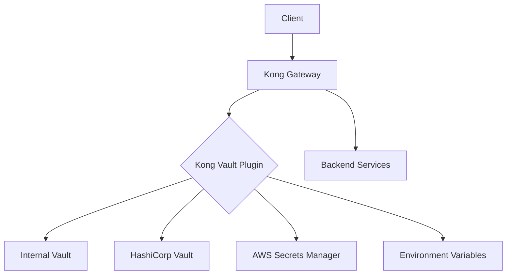

# Kong Vault

## Introduction

Kong Vault is a powerful secrets management solution integrated with Kong API Gateway that helps you securely store, access, and rotate sensitive data such as API keys, credentials, and certificates. Kong Vault enables you to centralize your secrets management while maintaining tight access controls, eliminating the need to hardcode sensitive information in your configurations.

In this guide, you'll learn how to set up and use Kong Vault to securely manage sensitive data in your Kong API Gateway environment.

## What is Kong Vault?

Kong Vault is a secrets management solution that works with the Kong API Gateway to provide:

- Secure storage of sensitive information
- Encryption of data at rest and in transit
- Access control based on Kong's authentication mechanisms
- Integration with external vault providers like HashiCorp Vault
- Automatic rotation of secrets
- Centralized management of all secrets

## Prerequisites

Before getting started with Kong Vault, ensure you have:

- Kong Gateway installed (version 2.8 or later)
- Basic familiarity with Kong configuration
- Admin access to your Kong instance

## Setting Up Kong Vault

### 1. Enable the Kong Vault Plugin

First, you need to enable the Kong Vault plugin in your Kong configuration file (`kong.conf`):

```
plugins = bundled,vault
```

If you're using environment variables:

```
export KONG_PLUGINS=bundled,vault
```

Restart Kong to apply the changes:

```bash
kong restart
```

### 2. Configure Kong Vault

Kong Vault can be configured globally or for specific services/routes. Here's how to configure it globally:

```bash
curl -X POST http://localhost:8001/vault/config \
  --data "prefix=vault" \
  --data "vault_type=env" \
  --data "description=My Vault Configuration"
```

This sets up Kong Vault to use environment variables as the storage backend. Other supported backends include:

- `env`: Environment variables
- `kong`: Kong's internal database
- `hashicorp`: HashiCorp Vault
- `aws`: AWS Secrets Manager

## Using Kong Vault

### Storing Secrets

Let's store a database password in Kong Vault:

```bash
curl -X POST http://localhost:8001/vault/secrets \
  --data "name=db_password" \
  --data "value=super-secure-password" \
  --data "tags=database,production"
```

Response:

```json
{
  "id": "5e8f3a2d-c846-4f27-b9e6-74f4e44ef706",
  "name": "db_password",
  "prefix": "vault",
  "vault_type": "env",
  "tags": ["database", "production"],
  "created_at": 1647432871,
  "updated_at": 1647432871
}
```

### Retrieving Secrets

To retrieve a secret:

```bash
curl -X GET http://localhost:8001/vault/secrets/db_password
```

Response:

```json
{
  "id": "5e8f3a2d-c846-4f27-b9e6-74f4e44ef706",
  "name": "db_password",
  "value": "super-secure-password",
  "prefix": "vault",
  "vault_type": "env",
  "tags": ["database", "production"],
  "created_at": 1647432871,
  "updated_at": 1647432871
}
```

### Using Secrets in Kong Configuration

You can reference Kong Vault secrets in your Kong configurations using the `{vault://}` syntax. For example, when configuring a service that requires authentication:

```bash
curl -X POST http://localhost:8001/services/my-api/plugins \
  --data "name=basic-auth" \
  --data "config.username=admin" \
  --data "config.password={vault://db_password}"
```

Kong will automatically resolve the reference to the actual secret value when needed.

## Real-World Example: Securing Database Credentials

Let's walk through a complete example of using Kong Vault to secure database credentials for a service.

### 1. Store the credentials in Kong Vault

```bash
# Store username
curl -X POST http://localhost:8001/vault/secrets \
  --data "name=db_user" \
  --data "value=api_user" \
  --data "tags=database,credentials"

# Store password
curl -X POST http://localhost:8001/vault/secrets \
  --data "name=db_pass" \
  --data "value=complex-password-123" \
  --data "tags=database,credentials"
```

### 2. Configure a Kong Service

```bash
# Create a service
curl -X POST http://localhost:8001/services \
  --data "name=user-database" \
  --data "url=postgres://localhost:5432/users"

# Create a route
curl -X POST http://localhost:8001/services/user-database/routes \
  --data "name=user-api" \
  --data "paths[]=/users"
```

### 3. Apply a plugin that uses the credentials

```bash
curl -X POST http://localhost:8001/services/user-database/plugins \
  --data "name=postgres-auth" \
  --data "config.username={vault://db_user}" \
  --data "config.password={vault://db_pass}"
```

Now your Kong service is configured with securely stored credentials that aren't exposed in your configuration files.

## Secret Rotation

Kong Vault makes it easy to rotate secrets without downtime:

```bash
curl -X PATCH http://localhost:8001/vault/secrets/db_pass \
  --data "value=new-complex-password-456"
```

Kong will automatically use the new password for all subsequent requests, without requiring service restarts or redeployment.

## Advanced Features

### Vault References in Kong Declarative Configuration

If you're using Kong's declarative configuration (YAML/JSON), you can include vault references:

```yaml
_format_version: "2.1"
services:
  - name: payment-service
    url: https://payment.example.com
    plugins:
      - name: key-auth
        config:
          key_names:
            - apikey
          key: "{vault://payment_api_key}"
```

### Using HashiCorp Vault as Backend

For enterprise environments, you can configure Kong Vault to use HashiCorp Vault as the backend:

```bash
curl -X POST http://localhost:8001/vault/config \
  --data "prefix=hcv" \
  --data "vault_type=hashicorp" \
  --data "config.host=vault.example.com" \
  --data "config.port=8200" \
  --data "config.token=s.token123" \
  --data "config.mount=kong" \
  --data "description=HashiCorp Vault Integration"
```

Then you can store and retrieve secrets using this configuration:

```bash
curl -X POST http://localhost:8001/vault/secrets \
  --data "prefix=hcv" \
  --data "name=api_key" \
  --data "value=abcd1234"
```

## Monitoring and Debugging

You can check the status of your Kong Vault configuration:

```bash
curl -X GET http://localhost:8001/vault/config
```

And list all secrets (names only, not values):

```bash
curl -X GET http://localhost:8001/vault/secrets
```

## Kong Vault Architecture

Here's a diagram showing how Kong Vault integrates with Kong Gateway:



## Security Best Practices

When using Kong Vault, follow these best practices:

1. **Limit access** to the Vault Admin API
2. **Enable encryption** for Kong's database
3. **Regularly rotate** credentials and secrets
4. **Use HashiCorp Vault** or cloud provider solutions for production environments
5. **Implement least privilege** access controls
6. **Audit access** to secrets regularly
7. **Use SSL/TLS** for all Kong Admin API communications

## Summary

Kong Vault provides a secure way to manage sensitive information in your Kong API Gateway environment. By centralizing secrets management, you can:

- Eliminate hardcoded credentials in your configurations
- Easily rotate secrets without downtime
- Maintain tight access controls on sensitive information
- Integrate with enterprise-grade vault systems like HashiCorp Vault

By following the guidelines in this tutorial, you can significantly improve the security posture of your API infrastructure.

## Additional Resources

- [Kong Vault Official Documentation](https://docs.konghq.com/hub/kong-inc/vault/)
- [HashiCorp Vault Integration Guide](https://docs.konghq.com/gateway/latest/kong-enterprise/secrets-management/vault-integration/)
- [Secrets Management Best Practices](https://konghq.com/blog/secrets-management-best-practices/)

## Exercises

1. Set up Kong Vault using environment variables as the backend.
2. Store API keys for three different services in Kong Vault.
3. Configure a Kong service to use a secret from Kong Vault.
4. Practice rotating a secret and verify that the service continues to function correctly.
5. If available, configure Kong Vault to use HashiCorp Vault as the backend.