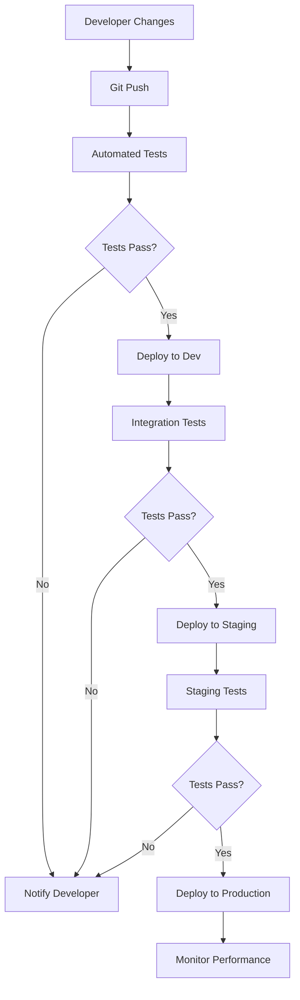

# Kong CI/CD Tools

## Introduction

Modern API development requires reliable, consistent deployment processes that can keep pace with rapid development cycles. Kong, a popular API gateway, offers several tools and approaches that integrate seamlessly with Continuous Integration and Continuous Deployment (CI/CD) pipelines.

In this guide, you'll learn how to implement automation for your Kong API Gateway configurations using CI/CD tools. This approach helps eliminate manual configuration errors, ensures consistency across environments, and accelerates the deployment of API changes.

## What is Kong API Gateway?

Before diving into CI/CD integration, let's briefly understand what Kong is:

Kong is an open-source API gateway that sits in front of your APIs, providing features like:

- Request routing
- Authentication
- Rate limiting
- Analytics
- Plugin ecosystem for extending functionality

Kong can be deployed as a standalone gateway or in Kubernetes environments, making it versatile for various architectures.

## Why Use CI/CD with Kong?

Implementing CI/CD for Kong configurations offers several benefits:

1. **Version Control**: Store Kong configurations as code (Infrastructure as Code)
2. **Automation**: Eliminate error-prone manual steps
3. **Consistency**: Ensure identical configurations across development, testing, and production
4. **Testing**: Validate changes before deployment
5. **Auditability**: Track who changed what and when
6. **Rollbacks**: Quickly revert to previous configurations if issues arise

## Key Kong CI/CD Tools

### 1. decK: Declarative Configuration for Kong

decK is an official tool from Kong that enables a GitOps approach to managing Kong configurations.

#### Installation

```bash
# MacOS
brew install kong/tap/deck

# Linux
curl -sL https://github.com/kong/deck/releases/latest/download/deck_linux_amd64.tar.gz | tar -xz -C /tmp
sudo cp /tmp/deck /usr/local/bin/
```

#### Basic Usage

Export existing Kong configuration:

```bash
deck dump --kong-addr http://localhost:8001 -o kong.yaml
```

This generates a YAML file containing your Kong configuration:

```yaml
_format_version: "1.1"
services:
- name: example-service
  url: http://example.com
  routes:
  - name: example-route
    paths:
    - /example
    strip_path: true
```

Apply configuration to Kong:

```bash
deck sync --kong-addr http://localhost:8001 -s kong.yaml
```

#### decK in CI/CD Pipeline

Here's how to integrate decK in a GitHub Actions workflow:

```yaml
name: Kong CI/CD

on:
  push:
    branches: [ main ]
    paths:
      - 'kong/**'

jobs:
  deploy-kong-config:
    runs-on: ubuntu-latest
    steps:
      - uses: actions/checkout@v3
      
      - name: Install decK
        run: |
          curl -sL https://github.com/kong/deck/releases/latest/download/deck_linux_amd64.tar.gz | tar -xz
          sudo mv deck /usr/local/bin/
      
      - name: Validate Kong configuration
        run: deck validate -s kong/kong.yaml
      
      - name: Deploy to Kong
        if: success()
        run: deck sync --kong-addr ${{ secrets.KONG_ADMIN_URL }} -s kong/kong.yaml
```

### 2. Inso CLI: API Testing and Validation

Inso CLI is part of the Kong Insomnia ecosystem and helps test APIs as part of your CI/CD pipeline.

#### Installation

```bash
# npm
npm install -g insomnia-inso

# yarn
yarn global add insomnia-inso
```

#### Running API Tests

Assuming you have Insomnia test suites exported:

```bash
# Run all test suites
inso run test "My API Tests"

# Run specific test
inso run test "My API Tests/Authentication Tests"
```

#### Inso in CI/CD Pipeline

```yaml
name: API Testing

on:
  pull_request:
    branches: [ main ]

jobs:
  api-tests:
    runs-on: ubuntu-latest
    steps:
      - uses: actions/checkout@v3
      
      - name: Setup Node.js
        uses: actions/setup-node@v3
        with:
          node-version: '16'
      
      - name: Install Inso CLI
        run: npm install -g insomnia-inso
      
      - name: Run API Tests
        run: inso run test "My API Tests" --env "Testing"
```

### 3. Kong Kubernetes Ingress Controller with GitOps

For Kubernetes environments, Kong provides a Kubernetes Ingress Controller that integrates with GitOps tools like Flux or ArgoCD.

#### Example Kong Ingress Resource

```yaml
apiVersion: networking.k8s.io/v1
kind: Ingress
metadata:
  name: example-ingress
  annotations:
    konghq.com/strip-path: "true"
    konghq.com/plugins: rate-limiting
spec:
  ingressClassName: kong
  rules:
  - host: api.example.com
    http:
      paths:
      - path: /v1
        pathType: Prefix
        backend:
          service:
            name: example-service
            port:
              number: 80
```

#### Kong Plugin Custom Resource

```yaml
apiVersion: configuration.konghq.com/v1
kind: KongPlugin
metadata:
  name: rate-limiting
config:
  minute: 5
  policy: local
plugin: rate-limiting
```

## Building CI/CD Workflows for Kong

Let's design a complete CI/CD workflow for Kong configurations:



### Step-by-Step Implementation

#### 1. Version Control Setup

Store Kong configurations in a Git repository with this structure:

```
kong-config/
├── environments/
│   ├── dev/
│   │   └── kong.yaml
│   ├── staging/
│   │   └── kong.yaml
│   └── prod/
│       └── kong.yaml
├── plugins/
│   ├── rate-limiting.yaml
│   └── jwt-auth.yaml
└── services/
    ├── auth-service.yaml
    └── product-service.yaml
```

#### 2. Validation Pipeline

Create a pipeline that validates configuration changes before merging:

```yaml
# .github/workflows/validate.yml
name: Validate Kong Configuration

on:
  pull_request:
    paths:
      - 'kong-config/**'

jobs:
  validate:
    runs-on: ubuntu-latest
    steps:
      - uses: actions/checkout@v3
      
      - name: Install decK
        run: |
          curl -sL https://github.com/kong/deck/releases/latest/download/deck_linux_amd64.tar.gz | tar -xz
          sudo mv deck /usr/local/bin/
      
      - name: Validate Dev Config
        run: deck validate -s kong-config/environments/dev/kong.yaml
      
      - name: Validate Staging Config
        run: deck validate -s kong-config/environments/staging/kong.yaml
      
      - name: Validate Prod Config
        run: deck validate -s kong-config/environments/prod/kong.yaml
```

#### 3. Deployment Pipeline

Create deployment workflows for each environment:

```yaml
# .github/workflows/deploy.yml
name: Deploy Kong Configuration

on:
  push:
    branches:
      - main
    paths:
      - 'kong-config/environments/dev/**'
      - 'kong-config/environments/staging/**'
      - 'kong-config/environments/prod/**'

jobs:
  deploy-dev:
    runs-on: ubuntu-latest
    steps:
      - uses: actions/checkout@v3
      
      - name: Install decK
        run: |
          curl -sL https://github.com/kong/deck/releases/latest/download/deck_linux_amd64.tar.gz | tar -xz
          sudo mv deck /usr/local/bin/
      
      - name: Deploy to Dev
        run: |
          deck sync --kong-addr ${{ secrets.DEV_KONG_ADMIN_URL }} \
            -s kong-config/environments/dev/kong.yaml
  
  # Similar jobs for staging and production with appropriate conditions
```

## Advanced Kong CI/CD Patterns

### Blue-Green Deployments

Kong supports blue-green deployments for zero-downtime updates:

```bash
# Deploy to "blue" environment
deck sync --kong-addr http://kong-blue:8001 -s kong-new.yaml

# Test "blue" environment
# Run your tests against the blue environment

# Switch traffic from "green" to "blue"
# This could be done by updating a load balancer or DNS
```

### Canary Releases

Implement canary releases using Kong's traffic splitting capabilities:

```yaml
# In your Kong configuration
routes:
  - name: api-canary
    paths:
      - /api
    service: api-service-v2
    plugins:
      - name: canary
        config:
          percentage: 10  # Send 10% of traffic to v2
```

### Automated Rollbacks

Implement automated rollbacks if issues are detected:

```yaml
# In your deployment pipeline
- name: Monitor for errors
  run: |
    ./monitor-errors.sh
    if [ $? -ne 0 ]; then
      deck sync --kong-addr ${{ secrets.KONG_ADMIN_URL }} -s kong-previous.yaml
      exit 1
    fi
```

## Common CI/CD Strategies for Kong

### Strategy 1: Environment Promotion

Move configurations through environments progressively:

1. Developer works on local environment
2. Changes are pushed to development
3. Once verified, promoted to staging
4. Finally deployed to production

### Strategy 2: Feature Branches

Use branch-based deployments:

1. Create feature branch for Kong changes
2. Automated deployment to ephemeral environment
3. Testing in isolated environment
4. Merge to main when approved
5. Deploy to permanent environments

## Practical Example: Complete CI/CD Pipeline for a Microservice API

Let's implement a complete example for a fictional product API:

### 1. Kong Configuration (kong.yaml)

```yaml
_format_version: "1.1"
services:
  - name: products-api
    url: http://products-service:8080
    routes:
      - name: products-route
        paths:
          - /products
    plugins:
      - name: rate-limiting
        config:
          minute: 60
          policy: local
      - name: key-auth
        config:
          key_names:
            - apikey
```

### 2. GitHub Actions Pipeline (.github/workflows/kong-deploy.yml)

```yaml
name: Kong API Gateway CI/CD

on:
  push:
    branches: [ main ]
    paths:
      - 'kong/**'
  pull_request:
    branches: [ main ]
    paths:
      - 'kong/**'

jobs:
  validate:
    runs-on: ubuntu-latest
    steps:
      - uses: actions/checkout@v3
      
      - name: Install decK
        run: |
          curl -sL https://github.com/kong/deck/releases/latest/download/deck_linux_amd64.tar.gz | tar -xz
          sudo mv deck /usr/local/bin/
      
      - name: Validate Kong configuration
        run: deck validate -s kong/kong.yaml

  deploy-dev:
    needs: validate
    if: github.event_name == 'push' && github.ref == 'refs/heads/main'
    runs-on: ubuntu-latest
    steps:
      - uses: actions/checkout@v3
      
      - name: Install decK
        run: |
          curl -sL https://github.com/kong/deck/releases/latest/download/deck_linux_amd64.tar.gz | tar -xz
          sudo mv deck /usr/local/bin/
      
      - name: Deploy to Dev
        run: |
          deck sync --kong-addr ${{ secrets.DEV_KONG_ADMIN_URL }} \
            -s kong/kong.yaml
      
      - name: Verify Deployment
        run: |
          # Wait for changes to propagate
          sleep 5
          
          # Test the API gateway configuration
          curl -i -X GET ${{ secrets.DEV_API_URL }}/products \
            -H "apikey: ${{ secrets.DEV_API_KEY }}"
          
          # Check for expected status code
          STATUS=$(curl -s -o /dev/null -w "%{http_code}" \
            ${{ secrets.DEV_API_URL }}/products \
            -H "apikey: ${{ secrets.DEV_API_KEY }}")
          
          if [ $STATUS -ne 200 ]; then
            echo "Verification failed! Got status $STATUS"
            exit 1
          fi
```

## Best Practices for Kong CI/CD

1. **Keep Configurations Simple**: Break down complex configurations into manageable pieces
2. **Environment Variables**: Use environment-specific variables for endpoints, credentials, etc.
3. **Test Thoroughly**: Test all aspects of your API gateway before deploying
4. **Implement Monitoring**: Set up alerts for any Kong-related issues
5. **Documentation**: Keep documentation up-to-date with configuration changes
6. **Access Control**: Restrict who can make changes to Kong in production
7. **Regular Audits**: Periodically review Kong configurations for security issues

## Troubleshooting Common Issues

### Issue: Configuration Not Applying

**Solution**: Check Admin API access and permissions. Verify your Kong admin URL is correct and accessible from your CI/CD runner.

### Issue: Plugins Not Working

**Solution**: Verify the plugin is installed and enabled in Kong. Check plugin configuration syntax.

### Issue: Pipeline Failures

**Solution**: Run decK in verbose mode to see detailed error information:

```bash
deck sync --kong-addr http://localhost:8001 -s kong.yaml -v
```

## Summary

Integrating Kong with CI/CD pipelines transforms how you manage API gateways:

1. You've learned how to use decK for declarative Kong configuration
2. You've seen how to implement automated testing with Inso CLI
3. You've explored Kubernetes integration with Kong Ingress Controller
4. You've built comprehensive CI/CD workflows for different environments

By implementing these practices, you ensure consistent, reliable API gateway configurations that can evolve alongside your applications.

## Additional Resources

- [Kong decK Official Documentation](https://docs.konghq.com/deck/)
- [Kong Kubernetes Ingress Controller Documentation](https://docs.konghq.com/kubernetes-ingress-controller/)
- [Kong Plugin Hub](https://docs.konghq.com/hub/)
- [Kong Enterprise Documentation](https://docs.konghq.com/enterprise/)

## Exercises

1. Create a basic Kong configuration for a simple API and set up a GitHub Actions workflow to deploy it
2. Implement a blue-green deployment strategy for a Kong configuration
3. Set up automated tests for your API endpoints that run before deploying Kong changes
4. Create a canary deployment for a new version of an API using Kong's traffic splitting functionality
5. Design a Kong configuration that includes rate limiting, authentication, and request transformation plugins