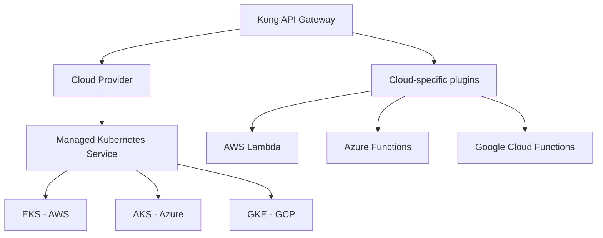

# Kong Cloud Providers

## Introduction

Kong is a popular open-source API gateway that helps manage, secure, and scale your APIs. When working with cloud environments, Kong offers various integrations with major cloud providers to streamline API management across your cloud infrastructure. This guide explores how Kong integrates with different cloud providers, allowing you to leverage Kong's powerful features while maintaining compatibility with your chosen cloud platform.

Kong cloud provider integrations enable you to:
- Deploy Kong in cloud environments
- Integrate with cloud-native services
- Leverage cloud infrastructure for scaling and high availability
- Use cloud authentication mechanisms
- Monitor and log API traffic using cloud tools

## Supported Cloud Providers

Kong integrates with all major cloud providers, offering specialized plugins and deployment options for each:

### Amazon Web Services (AWS)

AWS is one of the most widely used cloud platforms, and Kong provides robust integration options for AWS services.

#### AWS Lambda Integration

Kong's AWS Lambda plugin allows you to proxy requests to AWS Lambda functions, enabling serverless API backends:

```javascript
// Kong plugin configuration example
{
  "name": "aws-lambda",
  "config": {
    "aws_key": "YOUR_AWS_KEY",
    "aws_secret": "YOUR_AWS_SECRET",
    "aws_region": "us-east-1",
    "function_name": "my-lambda-function",
    "timeout": 60000,
    "keepalive": 60000
  }
}
```

With this configuration, requests to your Kong API gateway will be forwarded to the specified Lambda function, and the response will be returned to the client.

#### AWS IAM Authentication

Kong can authenticate API consumers using AWS IAM credentials:

```javascript
// Kong AWS IAM authentication plugin configuration
{
  "name": "aws-lambda-iam-auth",
  "config": {
    "aws_account_id": "YOUR_AWS_ACCOUNT_ID",
    "aws_region": "us-east-1",
    "validate_request_body": true,
    "require_iam_auth": true
  }
}
```

This allows your APIs to leverage AWS's identity management system for authentication.

### Microsoft Azure

Kong offers several integration points with Microsoft Azure cloud services.

#### Azure Functions Integration

Similar to AWS Lambda, Kong can proxy requests to Azure Functions:

```javascript
// Kong Azure Functions plugin configuration
{
  "name": "azure-functions",
  "config": {
    "appname": "my-function-app",
    "functionname": "my-function",
    "hostkey": "YOUR_AZURE_FUNCTION_HOST_KEY",
    "timeout": 10000
  }
}
```

#### Azure Active Directory Integration

Kong can authenticate users with Azure Active Directory:

```javascript
// Kong Azure AD plugin configuration
{
  "name": "openid-connect",
  "config": {
    "issuer": "https://login.microsoftonline.com/YOUR_TENANT_ID/v2.0",
    "client_id": "YOUR_CLIENT_ID",
    "client_secret": "YOUR_CLIENT_SECRET",
    "auth_methods": ["authorization_code", "bearer"],
    "scopes": ["openid", "profile"]
  }
}
```

### Google Cloud Platform (GCP)

Kong integrates with various GCP services to enhance API management capabilities.

#### Google Cloud Functions

Kong can route API requests to Google Cloud Functions:

```javascript
// Kong GCF plugin configuration
{
  "name": "gcp-functions",
  "config": {
    "project_id": "my-gcp-project",
    "region": "us-central1",
    "function_name": "my-cloud-function",
    "service_account": "my-service-account@my-gcp-project.iam.gserviceaccount.com",
    "timeout": 10000
  }
}
```

#### GCP Service Account Authentication

Kong can use GCP service accounts for authentication:

```javascript
// Kong GCP auth plugin configuration
{
  "name": "gcp-iam-auth",
  "config": {
    "gcp_service_account": "my-service-account@my-gcp-project.iam.gserviceaccount.com",
    "key_file": "/path/to/service-account-key.json"
  }
}
```

## Deployment Options

Kong can be deployed on cloud providers in multiple ways:

### Kubernetes Deployments

Using Kong Kubernetes Ingress Controller (KIC) is a popular deployment option across all major cloud providers:

```yaml
# Example Kong deployment on Kubernetes
apiVersion: apps/v1
kind: Deployment
metadata:
  name: kong
spec:
  replicas: 3
  selector:
    matchLabels:
      app: kong
  template:
    metadata:
      labels:
        app: kong
    spec:
      containers:
      - name: kong
        image: kong:latest
        ports:
        - containerPort: 8000
        - containerPort: 8443
        - containerPort: 8001
        - containerPort: 8444
        env:
        - name: KONG_DATABASE
          value: "off"
        - name: KONG_DECLARATIVE_CONFIG
          value: /kong/declarative/kong.yaml
        volumeMounts:
        - name: kong-config
          mountPath: /kong/declarative
      volumes:
      - name: kong-config
        configMap:
          name: kong-config
```

### Containerized Deployments

Kong can also be deployed using container services like AWS ECS, Azure Container Instances, or Google Cloud Run:

```bash
# Example Docker run command for Kong
docker run -d --name kong \
  -e "KONG_DATABASE=off" \
  -e "KONG_DECLARATIVE_CONFIG=/kong/declarative/kong.yaml" \
  -v "$(pwd)/kong.yaml:/kong/declarative/kong.yaml" \
  -p 8000:8000 \
  -p 8443:8443 \
  -p 8001:8001 \
  -p 8444:8444 \
  kong:latest
```

### Managed Services

All three major cloud providers offer managed Kubernetes services (EKS, AKS, GKE) that simplify Kong deployments:



## Cloud-Specific Features

### Scaling and High Availability

Kong can leverage cloud providers' auto-scaling capabilities to handle variable loads:

```yaml
# Example Kubernetes HPA for Kong
apiVersion: autoscaling/v2
kind: HorizontalPodAutoscaler
metadata:
  name: kong-hpa
spec:
  scaleTargetRef:
    apiVersion: apps/v1
    kind: Deployment
    name: kong
  minReplicas: 2
  maxReplicas: 10
  metrics:
  - type: Resource
    resource:
      name: cpu
      target:
        type: Utilization
        averageUtilization: 70
```

### Cloud Storage for Configuration

Kong can use cloud storage services to store and load configurations:

```bash
# Example using AWS S3 for Kong configuration
$ aws s3 cp kong.yaml s3://my-kong-config/
$ kubectl create secret generic kong-config-secret \
    --from-literal=aws-access-key=YOUR_ACCESS_KEY \
    --from-literal=aws-secret-key=YOUR_SECRET_KEY
```

### Cloud Monitoring Integration

Kong can integrate with cloud monitoring tools:

```javascript
// Example Kong Prometheus plugin configuration
{
  "name": "prometheus",
  "config": {
    "status_code_metrics": true,
    "latency_metrics": true,
    "bandwidth_metrics": true,
    "upstream_health_metrics": true
  }
}
```

## Step-by-Step Implementation Guide

Let's implement a simple Kong API gateway on AWS with Lambda integration:

### 1. Deploy Kong on AWS EKS

First, create an EKS cluster and install Kong:

```bash
# Create EKS cluster
eksctl create cluster --name kong-cluster --region us-east-1 --nodes 2

# Add Kong Helm repository
helm repo add kong https://charts.konghq.com
helm repo update

# Install Kong
helm install kong kong/kong --namespace kong --create-namespace
```

### 2. Configure Kong API and Route

Create a simple API and route:

```yaml
# kong-config.yaml
_format_version: "2.1"
services:
- name: example-service
  url: http://mockbin.org
  routes:
  - name: example-route
    paths:
    - /example
```

Apply the configuration:

```bash
kubectl create configmap kong-config --from-file=kong-config.yaml
kubectl patch deployment kong-kong -p '{"spec": {"template": {"spec": {"containers": [{"name": "proxy", "env": [{"name": "KONG_DECLARATIVE_CONFIG", "value": "/etc/kong/kong-config.yaml"}], "volumeMounts": [{"name": "kong-config-volume", "mountPath": "/etc/kong"}]}], "volumes": [{"name": "kong-config-volume", "configMap": {"name": "kong-config"}}]}}}}'
```

### 3. Integrate with AWS Lambda

Create a simple Lambda function:

```javascript
// index.js for AWS Lambda
exports.handler = async (event) => {
  return {
    statusCode: 200,
    body: JSON.stringify({
      message: "Hello from AWS Lambda via Kong!",
      input: event
    })
  };
};
```

Deploy the Lambda function:

```bash
# Package function
zip function.zip index.js

# Create Lambda function
aws lambda create-function \
  --function-name kong-example-function \
  --runtime nodejs16.x \
  --handler index.handler \
  --role arn:aws:iam::YOUR_ACCOUNT_ID:role/lambda-role \
  --zip-file fileb://function.zip
```

Configure Kong to use this Lambda function:

```yaml
# Update kong-config.yaml
_format_version: "2.1"
services:
- name: example-service
  url: http://mockbin.org
  routes:
  - name: example-route
    paths:
    - /example
- name: lambda-service
  routes:
  - name: lambda-route
    paths:
    - /lambda
  plugins:
  - name: aws-lambda
    config:
      aws_key: YOUR_AWS_KEY
      aws_secret: YOUR_AWS_SECRET
      aws_region: us-east-1
      function_name: kong-example-function
      timeout: 60000
      keepalive: 60000
```

Apply the updated configuration:

```bash
kubectl create configmap kong-config --from-file=kong-config.yaml -o yaml --dry-run=client | kubectl apply -f -
kubectl rollout restart deployment kong-kong
```

### 4. Test the Integration

Get the Kong proxy endpoint:

```bash
export PROXY_IP=$(kubectl get svc kong-kong-proxy -o jsonpath='{.status.loadBalancer.ingress[0].hostname}')
```

Test the Lambda route:

```bash
curl -i http://$PROXY_IP/lambda
```

Expected output:

```
HTTP/1.1 200 OK
Content-Type: application/json
...

{
  "message": "Hello from AWS Lambda via Kong!",
  "input": { ... request details ... }
}
```

## Best Practices for Kong Cloud Deployments

When working with Kong in cloud environments, follow these best practices:

1. **Use Infrastructure as Code (IaC)**: Define your Kong deployments using Terraform, CloudFormation, or Kubernetes manifests for consistency and repeatability.

2. **Implement Proper Security**: 
   - Use cloud provider security groups and networking features
   - Implement proper TLS termination
   - Use secure secret management for API keys and credentials

3. **Leverage Cloud-Native Services**: Use managed databases, monitoring, and logging services offered by your cloud provider.

4. **Implement Proper Scaling Strategies**: Configure auto-scaling based on your API traffic patterns.

5. **Set Up Monitoring and Alerting**: Use cloud provider monitoring tools and Kong's Prometheus plugin for comprehensive visibility.

6. **Regular Backups**: Ensure your Kong configuration and data are regularly backed up using cloud storage services.

## Troubleshooting Cloud Provider Integrations

### Common Issues and Solutions

#### Connection Timeouts

If you experience connection timeouts with cloud services:

```bash
# Check Kong logs
kubectl logs deployment/kong-kong

# Check network policies
kubectl get networkpolicies
```

#### Authentication Failures

For authentication issues with cloud services:

1. Verify IAM permissions and roles
2. Check secret/credential configuration
3. Ensure proper encoding of credentials

#### Lambda Function Not Executing

If Lambda functions aren't being triggered:

1. Check Lambda permissions
2. Verify the function name and region in Kong's configuration
3. Test the Lambda function directly using AWS CLI

## Summary

Kong's cloud provider integrations offer powerful capabilities for managing APIs across AWS, Azure, and GCP environments. By leveraging these integrations, you can:

- Deploy Kong in various cloud environments using containers or Kubernetes
- Integrate with serverless compute options like AWS Lambda, Azure Functions, and Google Cloud Functions
- Utilize cloud provider authentication mechanisms
- Implement high availability and auto-scaling
- Monitor API performance using cloud-native tools

These integrations allow you to build robust, scalable API management solutions that take advantage of cloud-specific features while maintaining a consistent API gateway experience across your infrastructure.

## Additional Resources

- [Kong Official Documentation](https://docs.konghq.com/)
- [Kong for Kubernetes Documentation](https://docs.konghq.com/kubernetes-ingress-controller/)
- [AWS Lambda Plugin Documentation](https://docs.konghq.com/hub/kong-inc/aws-lambda/)
- [Azure Functions Plugin Documentation](https://docs.konghq.com/hub/kong-inc/azure-functions/)

## Exercises

1. Deploy Kong on your preferred cloud provider using Kubernetes.
2. Create a simple API gateway configuration with rate limiting enabled.
3. Integrate Kong with a serverless function (Lambda, Azure Functions, or Google Cloud Functions).
4. Implement authentication using your cloud provider's identity service.
5. Set up monitoring and logging for your Kong deployment using cloud-native services.