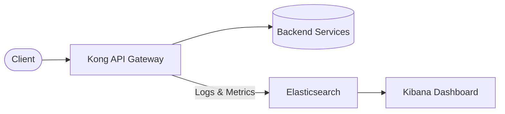
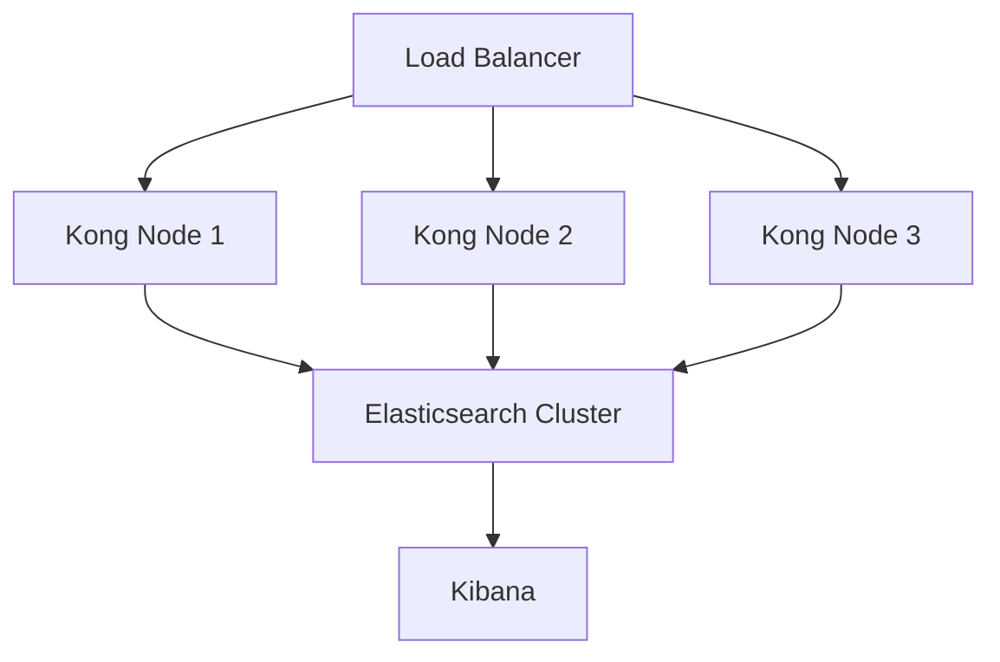

# Kong Elastic Integration

## Introduction

Kong Elastic is a powerful integration that connects [Kong API Gateway](https://konghq.com/) with [Elasticsearch](https://www.elastic.co/elasticsearch/), enabling advanced logging, monitoring, and analytics capabilities for your API traffic. This integration allows you to store, search, and visualize API request and response data, making it easier to troubleshoot issues, monitor performance, and gain insights into API usage patterns.

In this guide, we'll explore how to set up the Kong Elastic integration, configure it for different use cases, and leverage its capabilities to enhance your API management workflow.

## What is Kong?

Kong is an open-source API gateway and microservices management layer that sits in front of your APIs. It acts as a reverse proxy, routing client requests to the appropriate backend services while providing features like authentication, rate limiting, and logging.

## What is Elasticsearch?

Elasticsearch is a distributed, RESTful search and analytics engine capable of addressing a growing number of use cases. It centrally stores your data for lightning-fast search, fine‑tuned relevancy, and powerful analytics that scale with ease.

## How Kong and Elasticsearch Work Together

The integration between Kong and Elasticsearch allows API request and response data to be sent from Kong to Elasticsearch for storage and analysis. This is typically accomplished using the Kong Elasticsearch plugin.



## Setting Up Kong Elastic Integration

### Prerequisites

Before you begin, ensure you have:

- Kong Gateway installed and running
- Elasticsearch cluster set up and accessible
- Basic understanding of Kong plugins

### Step 1: Install the Kong Elasticsearch Plugin

If you're using Kong with Docker, you can include the plugin when starting your Kong container:

```bash
$ docker run -d --name kong \
  -e "KONG_DATABASE=postgres" \
  -e "KONG_PG_HOST=kong-database" \
  -e "KONG_PROXY_ACCESS_LOG=/dev/stdout" \
  -e "KONG_ADMIN_ACCESS_LOG=/dev/stdout" \
  -e "KONG_PROXY_ERROR_LOG=/dev/stderr" \
  -e "KONG_ADMIN_ERROR_LOG=/dev/stderr" \
  -e "KONG_PLUGINS=bundled,elasticsearch-log" \
  -p 8000:8000 \
  -p 8443:8443 \
  -p 8001:8001 \
  -p 8444:8444 \
  kong:latest
```

For a Kong installation from packages, you'll need to add the plugin to your `kong.conf` file:

```
plugins = bundled,elasticsearch-log
```

### Step 2: Enable the Elasticsearch Plugin

You can enable the plugin globally (for all services) or for a specific service, route, or consumer.

**Global Activation:**

```bash
$ curl -X POST http://localhost:8001/plugins/ \
  --data "name=elasticsearch-log" \
  --data "config.host=elasticsearch-host" \
  --data "config.port=9200" \
  --data "config.index=kong-logs"
```

**Specific Service Activation:**

```bash
$ curl -X POST http://localhost:8001/services/YOUR_SERVICE_NAME/plugins \
  --data "name=elasticsearch-log" \
  --data "config.host=elasticsearch-host" \
  --data "config.port=9200" \
  --data "config.index=kong-service-logs"
```

### Step 3: Configure the Plugin

The plugin has several configuration options to customize your integration:

| Parameter | Description | Default |
|-----------|-------------|---------|
| `host` | Elasticsearch server host | `localhost` |
| `port` | Elasticsearch server port | `9200` |
| `timeout` | Elasticsearch processing timeout | `10000` (ms) |
| `index` | Index name to write data to | `kong-logs` |
| `retry_count` | Number of retry attempts if a request fails | `5` |
| `queue_size` | Maximum buffer size to batch requests | `100` |
| `flush_timeout` | Time in seconds after which to flush the queue | `2` |

Example configuration with custom settings:

```bash
$ curl -X POST http://localhost:8001/plugins/ \
  --data "name=elasticsearch-log" \
  --data "config.host=elasticsearch-host" \
  --data "config.port=9200" \
  --data "config.timeout=30000" \
  --data "config.index=kong-api-logs" \
  --data "config.retry_count=3" \
  --data "config.queue_size=50" \
  --data "config.flush_timeout=5"
```

## Customizing Log Data

By default, the Elasticsearch plugin logs basic information about each request. However, you can customize the data being logged to include specific headers, response bodies, or other information.

### Logging Request Bodies

To log request bodies:

```bash
$ curl -X POST http://localhost:8001/plugins/ \
  --data "name=elasticsearch-log" \
  --data "config.host=elasticsearch-host" \
  --data "config.port=9200" \
  --data "config.index=kong-logs" \
  --data "config.log_bodies=true"
```

### Filtering Sensitive Information

You may want to exclude sensitive information like authorization headers or personally identifiable information (PII):

```bash
$ curl -X POST http://localhost:8001/plugins/ \
  --data "name=elasticsearch-log" \
  --data "config.host=elasticsearch-host" \
  --data "config.port=9200" \
  --data "config.index=kong-logs" \
  --data "config.header_filter=authorization,cookie"
```

## Real-World Application: API Analytics Dashboard

One of the most powerful applications of the Kong-Elasticsearch integration is creating an analytics dashboard to monitor your API usage. Here's how to set it up:

### Step 1: Configure Kong to Log Detailed Metrics

Enable the plugin with metrics logging:

```bash
$ curl -X POST http://localhost:8001/plugins/ \
  --data "name=elasticsearch-log" \
  --data "config.host=elasticsearch-host" \
  --data "config.port=9200" \
  --data "config.index=kong-metrics" \
  --data "config.log_bodies=false" \
  --data "config.include_metrics=true"
```

### Step 2: Set Up Kibana Dashboard

1. Access your Kibana instance
2. Create an index pattern for the `kong-metrics` index
3. Build visualizations for:
   - API request volume over time
   - Average response time by endpoint
   - Error rate by service
   - Geographic distribution of API calls
   - Top consumers by request count

### Example Dashboard Configuration

In Kibana, you might create a visualization like this to show request volume by service:

```json
{
  "aggs": {
    "2": {
      "terms": {
        "field": "service.name",
        "order": {
          "_count": "desc"
        },
        "size": 10
      }
    }
  },
  "size": 0,
  "fields": [
    {
      "name": "service.name",
      "type": "string",
      "esTypes": ["keyword"],
      "scripted": false
    }
  ],
  "script_fields": {},
  "stored_fields": ["*"],
  "runtime_mappings": {}
}
```

## Troubleshooting Common Issues

### Connection Problems

If Kong cannot connect to Elasticsearch:

1. Check that the Elasticsearch host and port are correct
2. Verify that network policies allow Kong to connect to Elasticsearch
3. Ensure Elasticsearch is running and healthy

```bash
# Test connection directly from Kong server
$ curl -X GET http://elasticsearch-host:9200/_cluster/health
```

### Data Not Appearing in Elasticsearch

If logs are not appearing in your Elasticsearch index:

1. Check that the plugin is properly configured and enabled
2. Look for errors in Kong's error logs
3. Verify that the index exists in Elasticsearch

```bash
# Check if the index exists
$ curl -X GET http://elasticsearch-host:9200/_cat/indices/kong-logs
```

### Performance Optimization

If you're experiencing performance issues:

1. Increase the `queue_size` to batch more requests
2. Adjust the `flush_timeout` to balance between real-time data and performance
3. Consider adding more resources to both Kong and Elasticsearch

## Advanced Configuration

### Custom Mappings

You can define custom mappings for your Kong logs in Elasticsearch to improve search and analytics capabilities:

```bash
$ curl -X PUT "http://elasticsearch-host:9200/kong-logs" \
-H "Content-Type: application/json" \
-d '{
  "mappings": {
    "properties": {
      "service": {
        "properties": {
          "name": { "type": "keyword" }
        }
      },
      "route": {
        "properties": {
          "name": { "type": "keyword" }
        }
      },
      "response": {
        "properties": {
          "status": { "type": "integer" },
          "size": { "type": "integer" },
          "latency": { "type": "integer" }
        }
      },
      "client_ip": { "type": "ip" },
      "started_at": { "type": "date" }
    }
  }
}'
```

### High Availability Setup

For production environments, consider a high-availability setup:



Configure each Kong node with the Elasticsearch plugin pointing to the Elasticsearch cluster.

## Summary

Kong Elastic integration provides a powerful solution for logging, monitoring, and analyzing API traffic. By following the steps outlined in this guide, you can:

1. Set up the Kong Elasticsearch plugin to log API requests
2. Configure the integration to meet your specific needs
3. Create analytics dashboards to visualize API usage patterns
4. Troubleshoot and optimize your Kong-Elasticsearch setup

This integration enables advanced capabilities such as real-time monitoring, historical analytics, and anomaly detection, helping you maintain reliable and performant API services.

## Additional Resources

- [Kong Plugin Documentation](https://docs.konghq.com/hub/kong-inc/elasticsearch-log/)
- [Elasticsearch Documentation](https://www.elastic.co/guide/en/elasticsearch/reference/current/index.html)
- [Kibana Visualization Guide](https://www.elastic.co/guide/en/kibana/current/dashboard.html)

## Practice Exercises

1. Set up Kong with the Elasticsearch plugin in a local development environment
2. Configure the plugin to log request and response bodies for a test API
3. Create a basic Kibana dashboard showing request volume and response times
4. Implement a custom mapping for your Kong logs in Elasticsearch
5. Set up alerts in Elasticsearch for high error rates or slow response times