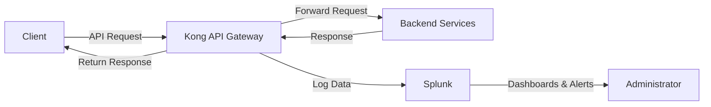

# Kong Splunk Integration

## Introduction

Kong is a popular open-source API gateway that manages, secures, and observes API traffic between clients and your backend services. Splunk is a powerful platform for searching, monitoring, and analyzing machine-generated data through a web-style interface. Integrating Kong with Splunk creates a robust solution for monitoring and analyzing API traffic, enabling better visibility into your API ecosystem.

This guide will walk you through the steps to integrate Kong with Splunk, allowing you to collect, analyze, and visualize API traffic data. By the end, you'll be able to set up comprehensive monitoring for your Kong-managed APIs.

## Prerequisites

Before we begin, make sure you have:

- A running Kong Gateway instance (OSS or Enterprise)
- Access to a Splunk instance
- Basic knowledge of Kong configuration
- Administrative access to both systems

## How Kong and Splunk Work Together

Kong can forward logs of API traffic to Splunk, which then indexes this data, making it searchable and visualizable. This integration enables real-time monitoring, alerting, and analysis of API performance and usage patterns.



## Integration Methods

There are two primary methods to integrate Kong with Splunk:

1. **HTTP Event Collector (HEC)**: Kong sends logs directly to Splunk's HTTP endpoint
2. **File-based logging + Splunk Forwarder**: Kong logs to files, which Splunk Universal Forwarder collects

Let's explore both methods in detail.

## Method 1: Using HTTP Event Collector

### Step 1: Set Up Splunk HTTP Event Collector

First, configure the HTTP Event Collector in Splunk:

1. Log in to your Splunk instance
2. Navigate to Settings > Data Inputs > HTTP Event Collector
3. Click "Global Settings" and set "All Tokens" to "Enabled"
4. Click "New Token" and follow the wizard:
   - Provide a name (e.g., "Kong API Logs")
   - Select an appropriate source type (e.g., `_json`)
   - Create a new index or select an existing one (e.g., "kong_logs")
5. Save the token value for later use

### Step 2: Configure Kong HTTP Log Plugin

Next, enable the HTTP Log plugin in Kong. You can do this globally or for specific services/routes.

For global configuration (affecting all APIs):

```bash
curl -X POST http://kong-admin-api:8001/plugins/ \
  --data "name=http-log" \
  --data "config.http_endpoint=https://your-splunk-instance:8088/services/collector" \
  --data "config.headers.Authorization=Splunk YOUR_TOKEN" \
  --data "config.headers.Content-Type=application/json" \
  --data "config.method=POST" \
  --data "config.timeout=10000" \
  --data "config.keepalive=60000" \
  --data "config.retry_count=5" \
  --data "config.queue_size=10000"
```

For a specific service:

```bash
curl -X POST http://kong-admin-api:8001/services/your-service-name/plugins/ \
  --data "name=http-log" \
  --data "config.http_endpoint=https://your-splunk-instance:8088/services/collector" \
  --data "config.headers.Authorization=Splunk YOUR_TOKEN" \
  --data "config.headers.Content-Type=application/json" \
  --data "config.method=POST" \
  --data "config.timeout=10000" \
  --data "config.keepalive=60000" \
  --data "config.retry_count=5" \
  --data "config.queue_size=10000"
```

### Step 3: Customize Log Format

By default, Kong's HTTP Log plugin sends basic information. You can enhance this by customizing the log format to include additional details. For example:

```bash
curl -X POST http://kong-admin-api:8001/plugins/ \
  --data "name=http-log" \
  --data "config.http_endpoint=https://your-splunk-instance:8088/services/collector" \
  --data "config.headers.Authorization=Splunk YOUR_TOKEN" \
  --data "config.headers.Content-Type=application/json" \
  --data "config.method=POST" \
  --data "config.timeout=10000" \
  --data "config.keepalive=60000" \
  --data "config.retry_count=5" \
  --data "config.queue_size=10000" \
  --data "config.content_type=application/json" \
  --data 'config.custom_fields_by_lua.event=return {time = os.time(), source = "kong-api-gateway", sourcetype = "kong_logs", host = "kong-instance", index = "kong_logs", event = { request_uri = ngx.var.request_uri, request_method = ngx.req.get_method(), response_status = ngx.status, latency = ngx.ctx.KONG_PROXY_LATENCY, upstream_latency = ngx.ctx.KONG_UPSTREAM_LATENCY, client_ip = ngx.var.remote_addr, service_name = ngx.ctx.service and ngx.ctx.service.name or "unknown", route_name = ngx.ctx.route and ngx.ctx.route.name or "unknown" } }'
```

## Method 2: Using File Logging + Splunk Forwarder

### Step 1: Configure Kong File Log Plugin

First, set up the File Log plugin in Kong:

```bash
curl -X POST http://kong-admin-api:8001/plugins/ \
  --data "name=file-log" \
  --data "config.path=/usr/local/kong/logs/api-logs.log" \
  --data 'config.custom_fields_by_lua.additional_details=return { service_name = ngx.ctx.service and ngx.ctx.service.name or "unknown", route_name = ngx.ctx.route and ngx.ctx.route.name or "unknown" }'
```

### Step 2: Install Splunk Universal Forwarder on Kong Server

Download and install the Splunk Universal Forwarder on your Kong server:

```bash
# For Debian/Ubuntu
wget -O splunkforwarder-latest.deb "https://download.splunk.com/products/universalforwarder/releases/latest/linux/splunkforwarder-latest.deb"
sudo dpkg -i splunkforwarder-latest.deb

# For RHEL/CentOS
wget -O splunkforwarder-latest.rpm "https://download.splunk.com/products/universalforwarder/releases/latest/linux/splunkforwarder-latest.rpm"
sudo rpm -i splunkforwarder-latest.rpm
```

### Step 3: Configure Splunk Forwarder

Configure the Splunk Forwarder to monitor Kong's log file:

```bash
cd /opt/splunkforwarder/bin
./splunk add forward-server your-splunk-instance:9997 -auth admin:password
./splunk add monitor /usr/local/kong/logs/api-logs.log -sourcetype kong_logs -index kong_logs
./splunk restart
```

## Creating Splunk Dashboards for Kong

Once your logs are flowing into Splunk, you can create dashboards to visualize your API traffic. Here's a simple search query to get you started:

```
index=kong_logs | stats count by request_method, response_status, service_name, route_name | sort count desc
```

### Sample Dashboard Panels

1. **API Traffic Volume Over Time**:
```
index=kong_logs | timechart span=5m count by service_name
```

2. **Error Rate by API**:
```
index=kong_logs response_status>=400 | stats count as errors by service_name | eval error_percentage=round((errors/total_requests)*100,2)
```

3. **Average Latency by Endpoint**:
```
index=kong_logs | stats avg(latency) as avg_latency by route_name | sort avg_latency desc
```

4. **Geographic Distribution of API Requests** (if IP location lookup is configured):
```
index=kong_logs | iplocation client_ip | geostats count by client_ip
```

## Real-World Use Case: API Performance Monitoring

Let's consider a practical scenario where you're running multiple microservices behind Kong Gateway and want to monitor their performance in real-time.

1. **Set up the integration** using one of the methods described above

2. **Create a Splunk dashboard** with panels for:
   - Request volume by service
   - Average response time
   - Error rate percentage
   - Top consumers by API key/client ID
   - Slow endpoints (latency > 500ms)

3. **Configure alerts** for anomalies:
   - Sudden spike in error rates
   - Unusual traffic patterns
   - Latency exceeding thresholds

4. **Generate regular reports** on API usage and performance

This setup provides actionable insights for both operations teams (for troubleshooting) and business stakeholders (for understanding API usage patterns).

## Troubleshooting Common Issues

### Logs Not Appearing in Splunk

1. **Check Kong Plugin Configuration**:
   - Verify the HTTP Log plugin is correctly configured
   - Ensure the Splunk endpoint URL is correct

2. **Verify Splunk HEC**:
   - Confirm the token is valid and enabled
   - Check Splunk's HEC input logs for errors

3. **Test Direct Connection**:
   - Use `curl` to send a test event to Splunk HEC:

```bash
curl -k https://your-splunk-instance:8088/services/collector \
  -H "Authorization: Splunk YOUR_TOKEN" \
  -d '{"event": "test event from Kong", "sourcetype": "kong_logs", "index": "kong_logs"}'
```

### High Log Volume Management

If you're processing a large volume of API requests, consider:

1. **Selective Logging**: Log only specific routes or services
2. **Log Sampling**: Configure Kong to log only a percentage of requests
3. **Splunk Indexer Scaling**: Ensure your Splunk environment can handle the volume

## Summary

Integrating Kong with Splunk provides powerful observability for your API ecosystem. By following this guide, you've learned how to:

1. Configure Kong to send logs to Splunk via HTTP Event Collector
2. Set up file-based logging with Splunk Forwarder
3. Create meaningful dashboards in Splunk for monitoring API traffic
4. Implement a real-world monitoring solution for your APIs

This integration enables you to gain valuable insights into API usage, performance, and potential issues, helping you maintain a reliable and efficient API infrastructure.

## Additional Resources

- [Kong HTTP Log Plugin Documentation](https://docs.konghq.com/hub/kong-inc/http-log/)
- [Splunk HTTP Event Collector Documentation](https://docs.splunk.com/Documentation/Splunk/latest/Data/UsetheHTTPEventCollector)
- [Kong Enterprise Vitals Dashboard](https://docs.konghq.com/enterprise/latest/vitals/overview/)
- [Splunk Dashboard Examples](https://splunkbase.splunk.com/app/1603/)

## Exercises

1. Set up the Kong Splunk integration in a test environment and verify logs are flowing correctly.
2. Create a custom dashboard in Splunk showing the top 10 API endpoints by request volume.
3. Configure an alert in Splunk to notify you when any API endpoint has an error rate exceeding 5%.
4. Extend the log format to include custom headers or request parameters that are important for your specific use case.