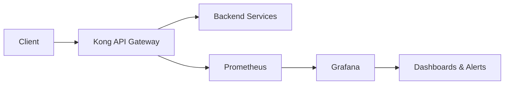

# Kong Grafana

## Introduction

Kong is a popular API gateway that manages the flow of requests between clients and your services. As your API traffic grows, monitoring becomes essential for understanding performance, identifying bottlenecks, and ensuring reliability. This is where Grafana comes in.

Grafana is an open-source analytics and visualization platform that allows you to query, visualize, and alert on metrics from various data sources. When integrated with Kong, Grafana provides powerful dashboards to monitor the health and performance of your API gateway.

In this guide, you'll learn how to integrate Kong with Grafana, set up dashboards, and use them to gain insights into your API traffic.

## Prerequisites

Before we begin, make sure you have:

- Kong Gateway installed and running
- Prometheus set up to collect metrics from Kong
- Grafana installed (version 7.x or higher)
- Basic understanding of HTTP, APIs, and metrics concepts

## How Kong and Grafana Work Together



The integration flow works as follows:

1. Kong processes API requests and generates metrics
2. Prometheus scrapes and stores these metrics
3. Grafana queries Prometheus and visualizes the data
4. You analyze the dashboards to monitor performance and make decisions

## Setting Up the Integration

### Step 1: Configure Kong to Expose Prometheus Metrics

First, we need to enable the Prometheus plugin in Kong. You can do this using the Kong Admin API:

```bash
curl -X POST http://localhost:8001/plugins/ \
    --data "name=prometheus" \
    --data "config.per_consumer=true"
```

This will enable metrics collection for all services in Kong. You can verify it's working by accessing:

```bash
curl http://localhost:8001/metrics
```

You should see Prometheus-formatted metrics like:

```
# HELP kong_http_status HTTP status codes
# TYPE kong_http_status counter
kong_http_status{code="200",service="example-service"} 30
kong_http_status{code="404",service="example-service"} 3
kong_http_status{code="500",service="example-service"} 1
```

### Step 2: Configure Prometheus to Scrape Kong Metrics

Add the following to your `prometheus.yml` configuration file:

```yaml
scrape_configs:
  - job_name: 'kong'
    scrape_interval: 5s
    static_configs:
      - targets: ['kong:8001']
```

Restart Prometheus for the changes to take effect.

### Step 3: Add Prometheus as a Data Source in Grafana

1. Log in to your Grafana instance
2. Go to Configuration > Data Sources
3. Click "Add data source"
4. Select "Prometheus"
5. Set the URL to your Prometheus server (e.g., `http://prometheus:9090`)
6. Click "Save & Test"

### Step 4: Import the Kong Dashboard

Grafana has pre-built dashboards for Kong that you can import:

1. Go to Create > Import
2. Enter dashboard ID `7424` (official Kong dashboard) or upload the JSON file
3. Select your Prometheus data source
4. Click "Import"

## Understanding the Kong Grafana Dashboard

The default Kong dashboard includes several panels:

### Request Rate Panel

Shows the number of requests processed by Kong per second:

```
rate(kong_http_requests_total[1m])
```

This helps you understand your traffic patterns and identify unusual spikes or drops.

### Latency Panels

Track various latency metrics:

- Request latency: Time taken by Kong to process requests
- Upstream latency: Time taken by your backend services
- Total latency: Combined processing time

These help you spot performance bottlenecks.

### Status Code Distribution

Visualizes HTTP status codes returned by your APIs:

```
sum(increase(kong_http_status{code=~"5.."}[1m])) by (service)
```

This helps you monitor error rates and identify problematic services.

### Top Consumers and Services

Shows which consumers and services are generating the most traffic, helping you understand usage patterns.

## Creating Custom Dashboards

While the default dashboard is useful, you might want to create custom visualizations for your specific needs.

### Example: Rate Limiting Dashboard

Let's create a simple panel to monitor rate limiting:

1. Create a new dashboard
2. Add a new panel
3. Use the following PromQL query:

```
sum(increase(kong_http_status{code="429"}[5m])) by (service)
```

4. Set visualization to "Time series"
5. Add titles and descriptions

This panel will show you which services are hitting rate limits.

## Real-World Use Cases

### Case 1: Troubleshooting API Performance Issues

Imagine you're receiving complaints about slow API responses. Using Grafana:

1. Check the "Latency Overview" panel to identify the spike in response times
2. Look at "Top Services by Latency" to identify which service is affected
3. Correlate with other metrics like CPU usage or database latency
4. Make informed decisions about scaling or optimizing the service

### Case 2: Monitoring API Usage for Billing

If you charge customers based on API usage:

1. Create a custom dashboard with queries like:
   ```
   sum(increase(kong_http_requests_total{consumer="$consumer"}[30d])) by (service)
   ```
2. Set up alerts for usage thresholds
3. Export data for billing purposes

### Case 3: Security Monitoring

Monitor suspicious patterns:

1. Track 401/403 errors by consumer
2. Look for unusual request patterns
3. Set up alerts for potential security incidents

## Advanced Techniques

### Setting Up Alerts

Grafana can alert you when metrics cross thresholds:

1. Edit a panel
2. Go to "Alert" tab
3. Define conditions, for example:
   - Alert when: 5xx errors > 10 per minute
   - For: 5 minutes
4. Configure notification channels (email, Slack, etc.)

### Using Variables for Dynamic Dashboards

Create variables to make your dashboard interactive:

1. Go to Dashboard Settings > Variables
2. Add a variable:
   - Name: `service`
   - Type: Query
   - Data source: Prometheus
   - Query: `label_values(kong_http_requests_total, service)`

Now you can filter your dashboard by service name using a dropdown.

## Troubleshooting Common Issues

### No Metrics Showing Up

If your dashboard is empty:

1. Verify Kong Prometheus plugin is enabled:
   ```bash
   curl http://localhost:8001/plugins/
   ```
2. Check Prometheus is scraping correctly:
   ```bash
   curl http://prometheus:9090/targets
   ```
3. Ensure your Grafana data source is configured properly

### Inconsistent Metrics

If metrics seem inaccurate:

1. Check time synchronization across servers
2. Verify Kong and Prometheus are in the same time zone
3. Adjust scrape intervals if needed

## Summary

Integrating Kong with Grafana provides powerful visualization capabilities for monitoring your API gateway. By following the steps in this guide, you can:

- Set up Kong to expose metrics
- Configure Prometheus to collect these metrics
- Create Grafana dashboards to visualize performance data
- Make data-driven decisions to improve your API infrastructure

This integration is essential for managing API performance, capacity planning, and ensuring a good experience for your API consumers.

## Additional Resources

- [Kong Prometheus Plugin Documentation](https://docs.konghq.com/hub/kong-inc/prometheus/)
- [Grafana Official Documentation](https://grafana.com/docs/)
- [PromQL Query Examples](https://prometheus.io/docs/prometheus/latest/querying/examples/)

## Exercises

1. Set up a local Kong and Grafana environment using Docker Compose
2. Create a custom dashboard showing the top 5 APIs by request volume
3. Configure an alert for when API latency exceeds 500ms for more than 5 minutes
4. Build a dashboard that compares performance between different versions of the same API