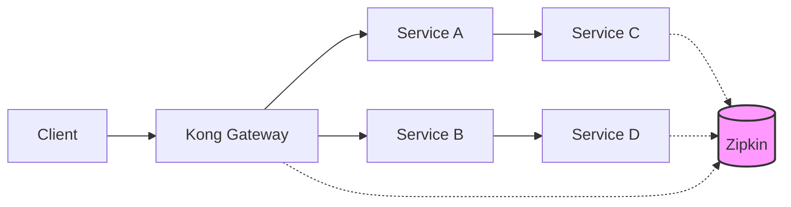

# Kong Zipkin Integration

## Introduction

In a modern microservices architecture, requests often travel through multiple services before completion. When issues arise, pinpointing where things went wrong can be challenging. This is where distributed tracing comes in, and Kong's integration with Zipkin provides a powerful solution.

Zipkin is an open-source distributed tracing system that helps collect timing data needed to troubleshoot latency problems in microservice architectures. The Kong Zipkin plugin allows you to trace requests as they flow through your Kong API Gateway and connected services, giving you visibility into your entire request path.

## What You'll Learn

- What distributed tracing is and why it matters
- How to set up the Kong Zipkin plugin
- How to configure tracing parameters
- How to visualize and analyze traces in Zipkin UI
- Best practices for effective request tracing

## Prerequisites

- A running Kong Gateway instance
- Basic understanding of APIs and HTTP requests
- Docker (for running Zipkin locally)

## Understanding Distributed Tracing

Before diving into the Kong Zipkin integration, let's understand the core concepts of distributed tracing:

### Key Concepts

- **Trace**: A complete request path through your system
- **Span**: A single operation within a trace (like an API call)
- **Annotation**: Timestamps marking events within a span
- **Tags**: Key-value pairs providing context to a span

Here's a visualization of how distributed tracing works:



## Setting Up Zipkin

Before configuring Kong, you need a running Zipkin instance. Here's how to start one using Docker:

```bash
docker run -d -p 9411:9411 --name zipkin openzipkin/zipkin
```

You can then access the Zipkin UI at http://localhost:9411.

## Installing and Configuring the Kong Zipkin Plugin

The Kong Zipkin plugin can be installed and configured in several ways:

### 1. Global Plugin Configuration (for all services)

```bash
curl -X POST http://localhost:8001/plugins/ \
    --data "name=zipkin" \
    --data "config.http_endpoint=http://zipkin:9411/api/v2/spans" \
    --data "config.sample_ratio=1"
```

### 2. Service-Specific Configuration

```bash
curl -X POST http://localhost:8001/services/your-service/plugins \
    --data "name=zipkin" \
    --data "config.http_endpoint=http://zipkin:9411/api/v2/spans" \
    --data "config.sample_ratio=0.5"
```

### 3. Route-Specific Configuration

```bash
curl -X POST http://localhost:8001/routes/your-route/plugins \
    --data "name=zipkin" \
    --data "config.http_endpoint=http://zipkin:9411/api/v2/spans" \
    --data "config.sample_ratio=0.25"
```

### 4. Using Kong declarative configuration (kong.yml)

```yaml
plugins:
  - name: zipkin
    config:
      http_endpoint: http://zipkin:9411/api/v2/spans
      sample_ratio: 1
      traceid_byte_count: 16
      header_type: b3
```

## Configuration Parameters Explained

The Kong Zipkin plugin supports several configuration parameters:

| Parameter | Description | Default |
|-----------|-------------|---------|
| `http_endpoint` | URL to which Zipkin data is sent | Required |
| `sample_ratio` | Percentage of requests to trace (0-1) | 0.001 |
| `traceid_byte_count` | Length of trace ID | 16 |
| `header_type` | Propagation header format (b3, w3c, jaeger) | b3 |
| `tags_header` | Add request header values as span tags | none |
| `default_service_name` | Default service name for spans | kong |

### Example: Setting Different Sampling Rates

You might want to adjust the sampling ratio based on traffic volume:

```bash
# High-traffic production environment (trace 0.1% of requests)
curl -X POST http://localhost:8001/plugins/ \
    --data "name=zipkin" \
    --data "config.http_endpoint=http://zipkin:9411/api/v2/spans" \
    --data "config.sample_ratio=0.001"

# Development environment (trace all requests)
curl -X POST http://localhost:8001/plugins/ \
    --data "name=zipkin" \
    --data "config.http_endpoint=http://zipkin:9411/api/v2/spans" \
    --data "config.sample_ratio=1"
```

## How Tracing Works with Kong Zipkin

When the Zipkin plugin is enabled, here's what happens:

1. Kong receives an incoming request
2. Based on the `sample_ratio`, Kong decides whether to trace this request
3. If tracing is enabled for the request:
   - Kong creates a new trace ID or uses an existing one from headers
   - Kong creates a "kong" span for the request processing time
   - Kong forwards trace headers to upstream services
4. The upstream service can continue the trace (if instrumented)
5. Kong sends all trace data to Zipkin when the request completes

## Visualizing Traces in Zipkin UI

Once you've configured the plugin and sent some traffic through Kong, you can see the traces in Zipkin UI:

1. Open your Zipkin UI (e.g., http://localhost:9411)
2. Use the search form to filter by service, operation, or time range
3. Click on a trace to see the detailed view

Here's what you'll see in the detailed view:

- A timeline of spans showing where time was spent
- Service dependencies graph
- Span details including tags and annotations
- Error information for failed requests

## Practical Example: Tracing a User Authentication Flow

Let's trace a complete user authentication flow through several services:

1. Configure the Kong Zipkin plugin for the auth route:

```bash
curl -X POST http://localhost:8001/routes/auth/plugins \
    --data "name=zipkin" \
    --data "config.http_endpoint=http://zipkin:9411/api/v2/spans" \
    --data "config.sample_ratio=1"
```

2. Send an authentication request:

```bash
curl -i -X POST http://localhost:8000/login \
    -H "Content-Type: application/json" \
    -d '{"username": "demo", "password": "password123"}'
```

3. Examine the trace in Zipkin UI to see:
   - Time spent in Kong routing
   - Authentication service processing time
   - Database queries execution time
   - Token generation time
   - Overall latency

## Adding Custom Span Tags

You can add custom tags to your spans using request headers:

1. Configure the plugin to use header tags:

```bash
curl -X PATCH http://localhost:8001/plugins/{plugin-id} \
    --data "config.tags_header=Kong-Trace-Tags"
```

2. Include tags in your request:

```bash
curl -i -X GET http://localhost:8000/api/products \
    -H "Kong-Trace-Tags: request_type=mobile,user_tier=premium"
```

These tags will appear in your Zipkin spans, making it easier to filter and analyze specific request types.

## Best Practices for Kong Zipkin Integration

To get the most out of Kong Zipkin integration:

1. **Use appropriate sampling rates**: 100% sampling is good for development but can be overwhelming in production
2. **Be strategic with tags**: Add meaningful tags that help with troubleshooting
3. **Propagate context to all services**: Ensure your services forward tracing headers
4. **Set up alerting**: Configure alerts for slow traces or error patterns
5. **Consider storage needs**: High-volume tracing generates significant data

## Troubleshooting Common Issues

### No Traces Appearing in Zipkin

- Verify the `http_endpoint` is correct and accessible from Kong
- Check if the sampling ratio is too low
- Ensure network connectivity between Kong and Zipkin

### Missing Spans in Traces

- Verify that all services are properly instrumented
- Check that header propagation is working correctly
- Ensure consistent trace ID usage across services

### High Latency When Tracing is Enabled

- Reduce the sampling ratio
- Check if Zipkin is properly scaled for your traffic volume
- Consider using a Zipkin collector to buffer spans

## Summary

The Kong Zipkin integration provides powerful distributed tracing capabilities for your microservices architecture. With proper configuration, you can gain valuable insights into request flows, identify bottlenecks, and diagnose issues across your entire system.

This integration is especially valuable as your architecture grows in complexity, allowing you to maintain visibility and troubleshoot effectively even with dozens of interconnected services.

## Additional Resources

- [Official Kong Zipkin Plugin Documentation](https://docs.konghq.com/hub/kong-inc/zipkin/)
- [Zipkin Official Documentation](https://zipkin.io/pages/documentation)
- [OpenTracing Specification](https://opentracing.io/specification/)

## Exercises

1. Set up Kong and Zipkin locally using Docker Compose
2. Configure the Zipkin plugin with different sampling rates and observe the results
3. Add custom span tags and use them to filter traces in the Zipkin UI
4. Create a multi-service setup and trace requests as they flow through the system
5. Simulate errors in your services and identify them in Zipkin traces