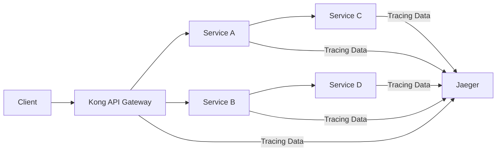

# Kong Jaeger

## Introduction

Kong Jaeger integration combines the power of Kong API Gateway with Jaeger's distributed tracing capabilities. This powerful combination allows developers to visualize request flows across microservices, identify performance bottlenecks, and troubleshoot issues in distributed systems.

In this guide, we'll explore how to set up and configure Kong with Jaeger, understand the core concepts, and see real-world examples of how this integration can help you monitor and improve your API infrastructure.

## What is Kong?

Kong is an open-source API gateway and microservices management layer that sits in front of your APIs. It handles API traffic and provides features like authentication, rate limiting, and logging through a plugin architecture.

## What is Jaeger?

Jaeger is an open-source distributed tracing system inspired by Google's Dapper paper. It's used for monitoring and troubleshooting microservices-based distributed systems by:

- Distributed context propagation
- Distributed transaction monitoring
- Root cause analysis
- Service dependency analysis
- Performance and latency optimization

## How Kong and Jaeger Work Together

Kong can be configured to send distributed tracing data to Jaeger, enabling you to visualize and analyze the journey of requests as they travel through your services.



## Prerequisites

Before we begin, make sure you have:

- Kong Gateway installed (version 2.0 or higher)
- Docker and Docker Compose (for running Jaeger)
- Basic understanding of API Gateways and microservices

## Setting Up Jaeger

First, let's set up Jaeger using Docker:

```bash
docker run -d --name jaeger \
  -e COLLECTOR_ZIPKIN_HOST_PORT=:9411 \
  -p 5775:5775/udp \
  -p 6831:6831/udp \
  -p 6832:6832/udp \
  -p 5778:5778 \
  -p 16686:16686 \
  -p 14268:14268 \
  -p 14250:14250 \
  -p 9411:9411 \
  jaegertracing/all-in-one:latest
```

This command starts Jaeger with all its components (agent, collector, query, and UI) in a single container.

## Enabling Kong Jaeger Plugin

Kong provides the OpenTelemetry plugin that supports sending traces to Jaeger. Here's how to enable it:

### 1. Install the OpenTelemetry Plugin

If you're using Kong Gateway Enterprise, the plugin is already included. For Kong open-source, you might need to install it:

```bash
luarocks install kong-plugin-opentelemetry
```

### 2. Add the Plugin to Kong Configuration

Edit your `kong.conf` file to include the plugin:

```
plugins = bundled,opentelemetry
```

### 3. Configure the Plugin

You can configure the plugin globally or for specific services/routes. Here's how to configure it globally:

```bash
curl -X POST http://localhost:8001/plugins/ \
  --data "name=opentelemetry" \
  --data "config.endpoint=http://jaeger:4318/v1/traces" \
  --data "config.batch_span_count=100" \
  --data "config.batch_flush_delay=2" \
  --data "config.resource_attributes.service.name=kong-gateway"
```

For a specific service:

```bash
curl -X POST http://localhost:8001/services/your-service/plugins \
  --data "name=opentelemetry" \
  --data "config.endpoint=http://jaeger:4318/v1/traces" \
  --data "config.batch_span_count=100" \
  --data "config.batch_flush_delay=2" \
  --data "config.resource_attributes.service.name=your-service"
```

## Understanding Configuration Options

Let's break down the key configuration parameters:

- `endpoint`: The URL where Jaeger collector is listening for OTLP traces
- `batch_span_count`: Maximum number of spans to include in a batch
- `batch_flush_delay`: Maximum time to wait before sending a batch
- `resource_attributes`: Custom attributes to add to all spans

## Example: Tracing a Request through Multiple Services

Let's see how to trace a request through multiple services using Kong and Jaeger.

### 1. Set Up Services

First, create some example services in Kong:

```bash
# Create a service for your API
curl -i -X POST http://localhost:8001/services/ \
  --data "name=api-service" \
  --data "url=http://api-backend:8000"

# Create a route for the service
curl -i -X POST http://localhost:8001/services/api-service/routes \
  --data "name=api-route" \
  --data "paths[]=/api"

# Enable the OpenTelemetry plugin for the service
curl -i -X POST http://localhost:8001/services/api-service/plugins \
  --data "name=opentelemetry" \
  --data "config.endpoint=http://jaeger:4318/v1/traces" \
  --data "config.batch_span_count=100" \
  --data "config.resource_attributes.service.name=api-service"
```

### 2. Make a Request

Now make a request through Kong:

```bash
curl -i http://localhost:8000/api/users
```

### 3. View Traces in Jaeger UI

Open your browser and navigate to `http://localhost:16686` to access the Jaeger UI.

1. Select "kong-gateway" from the Service dropdown
2. Click "Find Traces" to see your traces
3. Click on a trace to see its details

Here's what you might see in the Jaeger UI:

```
Trace: 7be2a4ebb857a39e
Service: kong-gateway
Duration: 235.42ms (Mar 9, 2025 12:34:56.789)

[kong-gateway] http.request (235.42ms)
├─ [api-service] process.request (150.21ms)
│  ├─ [db-service] database.query (65.32ms)
│  └─ [cache-service] cache.get (12.45ms)
└─ [kong-gateway] response.process (20.15ms)
```

## Advanced Configuration

### Sampling Configuration

You can configure sampling to reduce the number of traces:

```bash
curl -X PATCH http://localhost:8001/plugins/PLUGIN_ID \
  --data "config.sampler=parent_based_always_on" \
  --data "config.parent_based_sampling=true"
```

Common sampling strategies:
- `always_on`: Sample all traces
- `always_off`: Sample no traces
- `traceidratio`: Sample based on trace ID hash
- `parent_based_always_on`: Sample if parent is sampled

### Adding Custom Tags

You can add custom tags to spans for more context:

```bash
curl -X PATCH http://localhost:8001/plugins/PLUGIN_ID \
  --data "config.resource_attributes.deployment.environment=production" \
  --data "config.resource_attributes.service.version=1.0.0"
```

## Real-World Use Cases

### 1. Performance Monitoring

Track the performance of different services and endpoints to identify bottlenecks.

**Scenario**: You notice increased latency in your API responses.

**Solution**:
1. Check Jaeger traces to identify which service is causing the delay
2. Look at the span durations to pinpoint the slow operation
3. Optimize the identified component or add caching

### 2. Debugging Distributed Errors

Trace requests that result in errors to find where things went wrong.

**Scenario**: Users report getting occasional 500 errors.

**Solution**:
1. Filter traces in Jaeger for error status codes
2. Follow the trace to see which service failed
3. Examine the error message and tags attached to the failing span

### 3. Service Dependency Analysis

Understand how your services depend on each other.

**Scenario**: You need to refactor your microservices architecture.

**Solution**:
1. Use Jaeger's dependency graph to visualize service connections
2. Identify highly coupled services that might need redesign
3. Plan your refactoring based on actual usage patterns

## Troubleshooting

### No Traces Appearing in Jaeger

If you don't see any traces:

1. Check that Kong can reach the Jaeger endpoint:
   ```bash
   curl -i http://jaeger:4318/v1/traces
   ```

2. Verify the plugin is properly configured:
   ```bash
   curl -i http://localhost:8001/plugins
   ```

3. Check Jaeger logs for errors:
   ```bash
   docker logs jaeger
   ```

### High Cardinality Issues

If you have too many unique traces:

1. Adjust your sampling rate to reduce the number of traces
2. Be careful with adding too many custom tags that have high cardinality

## Best Practices

1. **Use Consistent Service Naming**: Adopt a consistent naming convention for services to make traces easier to follow.

2. **Add Relevant Tags**: Include useful tags such as environment, version, and customer ID, but avoid high-cardinality tags.

3. **Configure Appropriate Sampling**: Start with a higher sampling rate in development and lower it in production as needed.

4. **Correlate Logs with Traces**: Include trace IDs in your logs to easily correlate log entries with distributed traces.

5. **Monitor Trace Storage**: Be mindful of storage requirements, especially in high-traffic environments.

## Summary

Kong Jaeger integration provides powerful distributed tracing capabilities for your API infrastructure. By following this guide, you've learned:

- How to set up Jaeger and configure Kong to send traces
- Various configuration options and customizations
- Real-world use cases and troubleshooting techniques
- Best practices for effective distributed tracing

With this knowledge, you can now effectively monitor your microservices, identify issues quickly, and gain valuable insights into your system's performance.

## Additional Resources

- [Kong OpenTelemetry Plugin Documentation](https://docs.konghq.com/hub/kong-inc/opentelemetry/)
- [Jaeger Documentation](https://www.jaegertracing.io/docs/latest/)
- [OpenTelemetry Documentation](https://opentelemetry.io/docs/)

## Exercises

1. **Basic**: Set up Kong with Jaeger on your local development environment and trace some simple requests.

2. **Intermediate**: Configure custom tags and sampling strategies based on different endpoints.

3. **Advanced**: Create a dashboard that combines metrics from Kong with trace data from Jaeger to correlate API metrics with trace information.