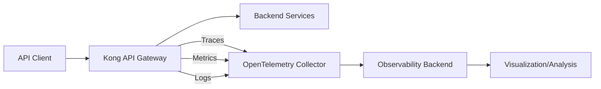

# Kong OpenTelemetry

## Introduction

OpenTelemetry is an open-source observability framework that helps developers instrument, generate, collect, and export telemetry data (metrics, logs, and traces) to help analyze software performance and behavior. When integrated with Kong API Gateway, OpenTelemetry provides powerful insights into API traffic, performance bottlenecks, and potential issues.

In this guide, we'll explore how to set up and configure Kong API Gateway with OpenTelemetry, allowing you to monitor and troubleshoot your API infrastructure effectively.

## What is OpenTelemetry?

OpenTelemetry (often abbreviated as OTel) is a Cloud Native Computing Foundation (CNCF) project that provides a collection of tools, APIs, and SDKs to instrument, generate, collect, and export telemetry data for analysis. The three main types of telemetry data are:

1. **Traces**: Records of requests as they flow through your system
2. **Metrics**: Numerical measurements collected at regular intervals
3. **Logs**: Timestamped records of discrete events



## Prerequisites

Before we start, make sure you have:

- Kong Gateway installed (version 2.8 or later)
- Basic understanding of Kong configuration
- Access to an OpenTelemetry backend (Jaeger, Zipkin, Prometheus, etc.)
- Kong Admin API access

## Installing the Kong OpenTelemetry Plugin

Kong integrates with OpenTelemetry through a plugin. Let's set it up:

### 1. Install the OpenTelemetry Plugin

If you're using Kong Gateway Enterprise, the plugin is included. For Kong Gateway OSS, you need to install it:

```bash
# Using luarocks
$ luarocks install kong-plugin-opentelemetry

# Or add it to your Kong configuration
$ export KONG_PLUGINS=bundled,opentelemetry
```

### 2. Configure the Plugin

You can enable the plugin globally or for specific services/routes:

```bash
# Enable globally
$ curl -X POST http://localhost:8001/plugins/ \
  --data "name=opentelemetry" \
  --data "config.endpoint=http://otel-collector:4318/v1/traces" \
  --data "config.headers.content-type=application/json"
```

Or add it to a specific service:

```bash
# Enable for a specific service
$ curl -X POST http://localhost:8001/services/your-service-name/plugins \
  --data "name=opentelemetry" \
  --data "config.endpoint=http://otel-collector:4318/v1/traces" \
  --data "config.headers.content-type=application/json"
```

## Configuration Options

The OpenTelemetry plugin offers several configuration options:

| Parameter | Description | Default |
|-----------|-------------|---------|
| `endpoint` | URL to your OpenTelemetry collector | Required |
| `headers` | Additional HTTP headers to add to the OpenTelemetry exporter requests | `{}` |
| `batch_span_count` | Maximum spans to batch before sending | `200` |
| `batch_flush_delay` | Maximum delay in seconds before sending spans | `3` |
| `sampler` | Trace sampling strategy (always_on, always_off, traceidratio) | `always_on` |
| `sampling_rate` | Trace sampling rate when using traceidratio sampler | `1.0` |

## Declarative Configuration (Kong.yml)

If you prefer declarative configuration, here's how to enable the OpenTelemetry plugin in your `kong.yml` file:

```yaml
_format_version: "2.1"
_transform: true

services:
- name: example-service
  url: http://example.com
  plugins:
  - name: opentelemetry
    config:
      endpoint: http://otel-collector:4318/v1/traces
      batch_span_count: 100
      batch_flush_delay: 2
      sampler: traceidratio
      sampling_rate: 0.5
      headers:
        content-type: application/json
```

## Collecting and Viewing Telemetry Data

Once the plugin is configured, Kong will automatically generate spans for each request that passes through the gateway. Here's what happens:

1. A request comes to Kong
2. Kong processes the request and forwards it to the upstream service
3. The OpenTelemetry plugin creates spans with details about the request
4. Spans are batched and sent to your OpenTelemetry collector
5. The collector processes and forwards the data to your observability backend

### Example: Viewing Traces in Jaeger

If you're using Jaeger as your tracing backend, you can access the Jaeger UI (typically at `http://localhost:16686`) to view and analyze traces:

1. Select "kong" from the service dropdown
2. Set your desired time range
3. Click "Find Traces"
4. Explore the trace data, including:
   - Request duration
   - HTTP status codes
   - Request paths
   - Error information

## Understanding Span Data

The Kong OpenTelemetry plugin generates the following span attributes for each request:

- `http.method`: The HTTP method used (GET, POST, etc.)
- `http.route`: The Kong route that matched the request
- `http.status_code`: The HTTP response status code
- `http.url`: The full URL of the request
- `kong.consumer`: The Kong consumer (if authenticated)
- `kong.service`: The Kong service that processed the request
- `error`: True if there was an error processing the request

## Advanced Configuration: Customizing Spans

For more detailed telemetry, you can customize the spans generated by Kong. Here's an example of adding custom attributes:

```lua
-- Custom plugin extending OpenTelemetry functionality
local opentelemetry = require("kong.plugins.opentelemetry.handler")
local CustomHandler = {}

function CustomHandler:access(conf)
  -- Add custom span attributes
  kong.ctx.plugin.opentelemetry_span:set_attribute("business.customer_id", kong.request.get_header("X-Customer-ID"))
  opentelemetry.access(self, conf)
end

return CustomHandler
```

## Practical Example: Monitoring API Latency

Let's walk through a real-world example of using Kong OpenTelemetry to monitor API latency:

1. **Set up Kong with OpenTelemetry**:

```bash
$ curl -X POST http://localhost:8001/plugins/ \
  --data "name=opentelemetry" \
  --data "config.endpoint=http://otel-collector:4318/v1/traces"
```

2. **Create a test service and route**:

```bash
$ curl -X POST http://localhost:8001/services/ \
  --data "name=example-api" \
  --data "url=https://httpbin.org"

$ curl -X POST http://localhost:8001/services/example-api/routes \
  --data "paths[]=/test"
```

3. **Generate some test traffic**:

```bash
$ for i in {1..10}; do curl -s http://localhost:8000/test/get > /dev/null; done
```

4. **Analyze the results in your tracing backend**:

In your tracing UI (like Jaeger), you'll see spans for each request showing:
- Total request duration
- Time spent in each Kong plugin
- Upstream service latency
- Any errors encountered

Example trace output from Jaeger:

```
Trace: 7f0c1de76ad2d481
  ├─ kong.request [192ms]
  │  ├─ kong.rewrite [2ms]
  │  ├─ kong.access [15ms]
  │  │  └─ opentelemetry.access [5ms]
  │  ├─ kong.upstream [170ms]
  │  │  └─ httpbin.org request [168ms]
  │  └─ kong.response [5ms]
```

## Troubleshooting Common Issues

### 1. Spans not appearing in your backend

If you're not seeing spans in your observability backend:

- Check that your OpenTelemetry collector endpoint is correct
- Verify the collector is running and accessible from Kong
- Examine Kong's error logs for any connection issues
- Test collector connectivity: `curl -v http://your-collector:4318/v1/traces`

### 2. Performance impact

If you notice performance degradation after enabling OpenTelemetry:

- Increase `batch_span_count` to reduce export frequency
- Use sampling to reduce the number of traces (set `sampler` to `traceidratio` and `sampling_rate` to less than 1.0)
- Ensure your collector has sufficient resources

## Best Practices

1. **Start with sampling**: In production environments, start with a lower sampling rate and increase as needed.
2. **Focus on critical paths**: Apply the plugin to your most important services first.
3. **Use context propagation**: Ensure your upstream services also use OpenTelemetry for end-to-end visibility.
4. **Monitor the collector**: Your OpenTelemetry collector should be monitored to avoid becoming a bottleneck.
5. **Regularly review your traces**: Use the trace data to identify and resolve performance issues proactively.

## Summary

Kong's OpenTelemetry integration provides powerful observability capabilities for your API infrastructure. By following this guide, you've learned how to:

- Set up the OpenTelemetry plugin in Kong
- Configure various sampling and batching options
- View and analyze trace data
- Troubleshoot common issues
- Apply best practices for production deployments

With these tools, you can gain deeper insights into your API performance, quickly identify bottlenecks, and ensure the reliability of your services.

## Additional Resources

- [OpenTelemetry Official Documentation](https://opentelemetry.io/docs/)
- [Kong Plugin Hub - OpenTelemetry](https://docs.konghq.com/hub/kong-inc/opentelemetry/)
- [Distributed Tracing: A Guide for Microservices](https://microservices.io/patterns/observability/distributed-tracing.html)

## Exercises

1. Set up Kong with OpenTelemetry and connect it to Jaeger
2. Create a simple API with multiple services and observe how requests flow through them
3. Experiment with different sampling rates and observe the impact on trace collection
4. Implement a custom plugin that adds business-specific attributes to spans
5. Use trace data to identify and fix a performance bottleneck in your API