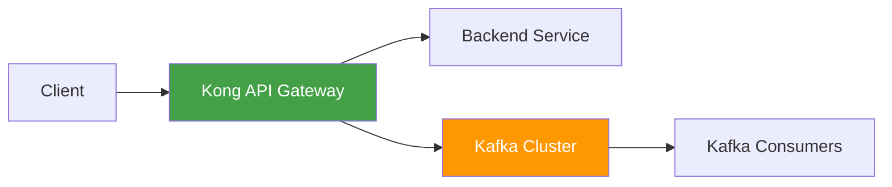
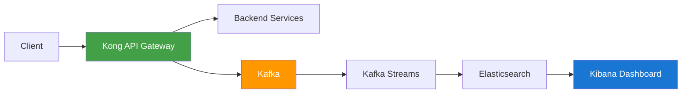
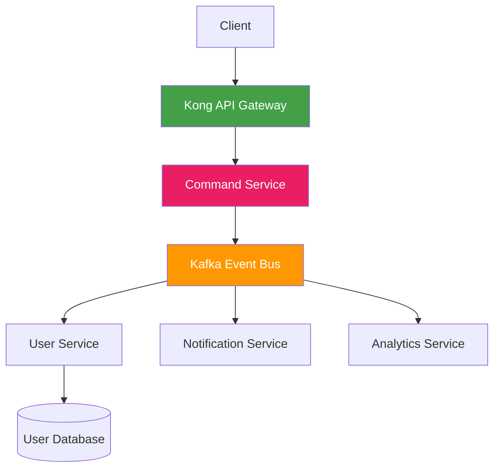

# Kong Kafka Integration

## Introduction

[Kong](https://konghq.com/) is a popular API gateway that helps manage, secure, and monitor API traffic. [Apache Kafka](https://kafka.apache.org/) is a distributed event streaming platform designed for high-throughput, fault-tolerant, real-time data streaming applications. The Kong Kafka integration allows you to connect your API gateway directly to your Kafka clusters, enabling powerful event-driven architectures and seamless data streaming capabilities.

In this guide, you'll learn how to set up and use the Kong Kafka integration, understand its key features, and explore real-world use cases. Whether you're building microservices, implementing real-time analytics, or creating event-driven applications, this integration can help streamline your workflow.

## Prerequisites

Before we begin, make sure you have:

- Kong Gateway installed (version 2.0 or higher)
- Apache Kafka cluster set up and running
- Basic understanding of API gateways and event streaming

## Understanding the Kong Kafka Plugin

The Kong Kafka plugin enables API gateway requests to be published to a Kafka topic. This creates a bridge between your API traffic and your event streaming platform, allowing for numerous possibilities:

- Real-time logging and analytics
- Event-driven processing of API requests
- Seamless microservice communication
- Buffering and queuing of requests



## Installing the Kong Kafka Plugin

### Step 1: Install the Plugin

If you're using Kong Enterprise, the Kafka plugin comes pre-installed. For Kong Community Edition, you'll need to install it manually:

```bash
# Using LuaRocks
luarocks install kong-plugin-kafka

# Add the plugin to your Kong configuration
export KONG_PLUGINS=bundled,kafka

# Restart Kong
kong restart
```

### Step 2: Configure the Plugin

You can configure the plugin globally or for specific services/routes:

```bash
# For a specific route
curl -X POST http://localhost:8001/routes/{route_id}/plugins \
    --data "name=kafka" \
    --data "config.bootstrap_servers=kafka-server:9092" \
    --data "config.topic=kong-log" \
    --data "config.timeout=10000" \
    --data "config.flush_timeout=1"
```

## Configuration Options

Here are the main configuration options for the Kong Kafka plugin:

| Option | Description | Default Value |
|--------|-------------|---------------|
| `bootstrap_servers` | List of Kafka broker addresses | `localhost:9092` |
| `topic` | The Kafka topic to publish to | `kong-log` |
| `timeout` | Socket timeout in milliseconds | `10000` |
| `keepalive` | Keep-alive timeout in milliseconds | `60000` |
| `producer_request_acks` | The number of acknowledgments the producer requires | `1` |
| `producer_request_timeout` | Producer request timeout in milliseconds | `2000` |
| `producer_request_limits_messages_per_request` | Maximum number of messages per request | `200` |
| `producer_request_limits_bytes_per_request` | Maximum size of each request in bytes | `1048576` |
| `producer_async` | Flag to enable asynchronous mode | `true` |
| `producer_async_flush_timeout` | Maximum time between producer flush operations | `1000` |
| `producer_async_buffering_limits_messages_in_memory` | Maximum number of messages in producer queue | `50000` |

## Basic Usage Examples

### Example 1: Logging API Requests to Kafka

This example shows how to configure Kong to log all API requests to a Kafka topic:

```bash
curl -X POST http://localhost:8001/services/my-service/plugins \
    --data "name=kafka" \
    --data "config.bootstrap_servers=kafka1:9092,kafka2:9092" \
    --data "config.topic=api-logs" \
    --data "config.timeout=10000" \
    --data "config.producer_async=true"
```

The log data will look something like this:

```json
{
  "request": {
    "method": "GET",
    "uri": "/users",
    "url": "http://example.com/users",
    "size": "86",
    "querystring": {},
    "headers": {
      "accept": "application/json",
      "host": "example.com",
      "user-agent": "curl/7.68.0"
    }
  },
  "response": {
    "status": 200,
    "size": "934",
    "headers": {
      "content-type": "application/json",
      "content-length": "934"
    }
  },
  "latencies": {
    "kong": 10,
    "proxy": 113,
    "request": 123
  },
  "client_ip": "192.168.1.1",
  "service": {
    "id": "5213dd9a-8f5c-4c73-9669-ddef78b38188",
    "name": "user-service"
  }
}
```

### Example 2: Event-Driven Architecture with Kong and Kafka

In this example, we'll create an event-driven pipeline that processes user registrations:

1. Set up the Kong route and Kafka plugin:

```bash
# Create a service for user registration
curl -X POST http://localhost:8001/services \
    --data "name=user-registration" \
    --data "url=http://user-service:3000/register"

# Create a route for the service
curl -X POST http://localhost:8001/services/user-registration/routes \
    --data "name=register" \
    --data "paths[]=/register"

# Add Kafka plugin to the route
curl -X POST http://localhost:8001/routes/register/plugins \
    --data "name=kafka" \
    --data "config.bootstrap_servers=kafka:9092" \
    --data "config.topic=user-registrations" \
    --data "config.producer_async=false"
```

2. Create a Kafka consumer in Node.js to process registrations:

```javascript
const { Kafka } = require('kafkajs');

// Initialize Kafka client
const kafka = new Kafka({
  clientId: 'user-processor',
  brokers: ['kafka:9092']
});

const consumer = kafka.consumer({ groupId: 'user-processing-group' });

// Connect and subscribe to the topic
async function run() {
  await consumer.connect();
  await consumer.subscribe({ topic: 'user-registrations', fromBeginning: true });
  
  // Process each message
  await consumer.run({
    eachMessage: async ({ topic, partition, message }) => {
      const userData = JSON.parse(message.value.toString());
      console.log('Processing new user registration:', userData.request.body);
      
      // Process the user registration
      // - Send welcome email
      // - Create user profile
      // - Update analytics
    },
  });
}

run().catch(console.error);
```

This creates an end-to-end flow where:
1. User registration requests hit the Kong API gateway
2. Kong forwards the request to the user service AND publishes it to Kafka
3. Kafka consumers process the registration event asynchronously
4. Multiple systems can act on the same event independently

## Advanced Usage: Custom Message Format

By default, Kong Kafka plugin sends a standardized log message. You can customize this using the `config.custom_fields_by_lua` option:

```bash
curl -X POST http://localhost:8001/routes/my-route/plugins \
    --data "name=kafka" \
    --data "config.bootstrap_servers=kafka:9092" \
    --data "config.topic=custom-events" \
    --data "config.custom_fields_by_lua.user_id=return kong.request.get_header('X-User-ID')" \
    --data "config.custom_fields_by_lua.timestamp=return os.time()" \
    --data "config.custom_fields_by_lua.route=return kong.router.get_route().id"
```

This will add custom fields to each Kafka message:

```json
{
  "user_id": "user-12345",
  "timestamp": 1647359120,
  "route": "5213dd9a-8f5c-4c73-9669-ddef78b38188",
  // ... standard Kong log fields
}
```

## Real-World Use Cases

### 1. Real-Time Analytics

Use Kong Kafka integration to stream API traffic data to an analytics platform:



This architecture allows you to:
- Track API usage in real-time
- Monitor performance metrics
- Detect anomalies and security issues
- Create customized dashboards

### 2. Rate Limiting with Feedback Loop

Implement a smart rate-limiting system that adapts based on backend service health:

1. Configure Kong with the Kafka plugin and rate-limiting plugin
2. Stream request data to Kafka
3. Process the stream to analyze traffic patterns
4. Dynamically update rate limits via Kong Admin API

```javascript
// Simplified example of a service that adjusts rate limits
const { Kafka } = require('kafkajs');
const axios = require('axios');

// Kafka setup
const kafka = new Kafka({
  clientId: 'rate-limit-adjuster',
  brokers: ['kafka:9092']
});

const consumer = kafka.consumer({ groupId: 'rate-limit-group' });

// Track service health
const serviceHealth = {
  'payment-service': { errorRate: 0, latency: 0 }
};

async function run() {
  await consumer.connect();
  await consumer.subscribe({ topic: 'api-logs', fromBeginning: false });
  
  await consumer.run({
    eachMessage: async ({ message }) => {
      const logData = JSON.parse(message.value.toString());
      const serviceName = logData.service.name;
      
      // Update health metrics
      if (serviceName in serviceHealth) {
        if (logData.response.status >= 500) {
          serviceHealth[serviceName].errorRate += 0.1;
        } else {
          serviceHealth[serviceName].errorRate = Math.max(0, serviceHealth[serviceName].errorRate - 0.01);
        }
        
        serviceHealth[serviceName].latency = 
          (serviceHealth[serviceName].latency * 0.9) + (logData.latencies.request * 0.1);
          
        // Adjust rate limits based on health
        if (serviceHealth[serviceName].errorRate > 0.5 || serviceHealth[serviceName].latency > 1000) {
          // Reduce rate limit
          await axios.patch('http://localhost:8001/plugins/' + getRateLimitPluginId(serviceName), {
            config: {
              second: 5
            }
          });
        } else if (serviceHealth[serviceName].errorRate < 0.1 && serviceHealth[serviceName].latency < 200) {
          // Increase rate limit
          await axios.patch('http://localhost:8001/plugins/' + getRateLimitPluginId(serviceName), {
            config: {
              second: 20
            }
          });
        }
      }
    },
  });
}

function getRateLimitPluginId(serviceName) {
  // In a real implementation, you would look up the plugin ID
  return 'rate-limit-plugin-id';
}

run().catch(console.error);
```

### 3. Event Sourcing Architecture

Use Kong and Kafka as part of an event sourcing architecture:



In this pattern:
1. API requests go through Kong to a lightweight command service
2. The command service validates and publishes events to Kafka
3. Multiple downstream services react to events independently
4. Each service maintains its own optimized data model

## Troubleshooting

### Common Issues and Solutions

1. **Connection Failures**

   *Problem*: Kong can't connect to Kafka brokers
   
   *Solution*: Check network connectivity and broker addresses
   
   ```bash
   # Test Kafka connectivity
   nc -zv kafka-server 9092
   
   # Check Kong error logs
   tail -f /usr/local/kong/logs/error.log
   ```

2. **Message Publication Errors**

   *Problem*: Messages fail to be published to Kafka
   
   *Solution*: Check topic existence and permissions
   
   ```bash
   # List topics
   kafka-topics.sh --list --bootstrap-server kafka:9092
   
   # Check if topic exists, create if needed
   kafka-topics.sh --create --bootstrap-server kafka:9092 --replication-factor 1 --partitions 1 --topic kong-log
   ```

3. **Performance Issues**

   *Problem*: Slow API responses when Kafka plugin is enabled
   
   *Solution*: Use asynchronous mode and tune performance settings
   
   ```bash
   curl -X PATCH http://localhost:8001/plugins/{plugin-id} \
       --data "config.producer_async=true" \
       --data "config.producer_async_flush_timeout=2000" \
       --data "config.producer_request_timeout=3000"
   ```

## Summary

The Kong Kafka integration creates a powerful bridge between your API gateway and your event streaming platform, enabling numerous architectural patterns and use cases:

- Real-time logging and analytics
- Event-driven architectures
- Asynchronous processing of API requests
- Feedback loops for adaptive system behavior
- Decoupled microservice communication

By leveraging this integration, you can build more scalable, resilient, and responsive applications while maintaining a clean separation of concerns between your API layer and your business logic.

## Additional Resources

To deepen your understanding of Kong Kafka integration, explore these resources:

- [Kong Kafka Plugin Documentation](https://docs.konghq.com/hub/kong-inc/kafka/)
- [Apache Kafka Documentation](https://kafka.apache.org/documentation/)
- [Event-Driven Architecture Patterns](https://microservices.io/patterns/data/event-driven-architecture.html)

## Exercises

1. **Basic Implementation**:
   Set up a Kong gateway with the Kafka plugin to log all API requests to a Kafka topic. Implement a simple consumer that counts requests by endpoint.

2. **Custom Formats**:
   Configure the Kong Kafka plugin to send custom message formats that include user IDs and API versions. Create a consumer that generates reports based on this data.

3. **Advanced Architecture**:
   Design and implement a feedback loop system that monitors API health metrics via Kafka and automatically adjusts Kong settings (rate limits, caching, etc.) based on observed patterns.

4. **Error Handling**:
   Enhance a Kong-Kafka setup to handle failover scenarios. What happens if Kafka is temporarily unavailable? Implement a solution using the retry settings and local buffering.