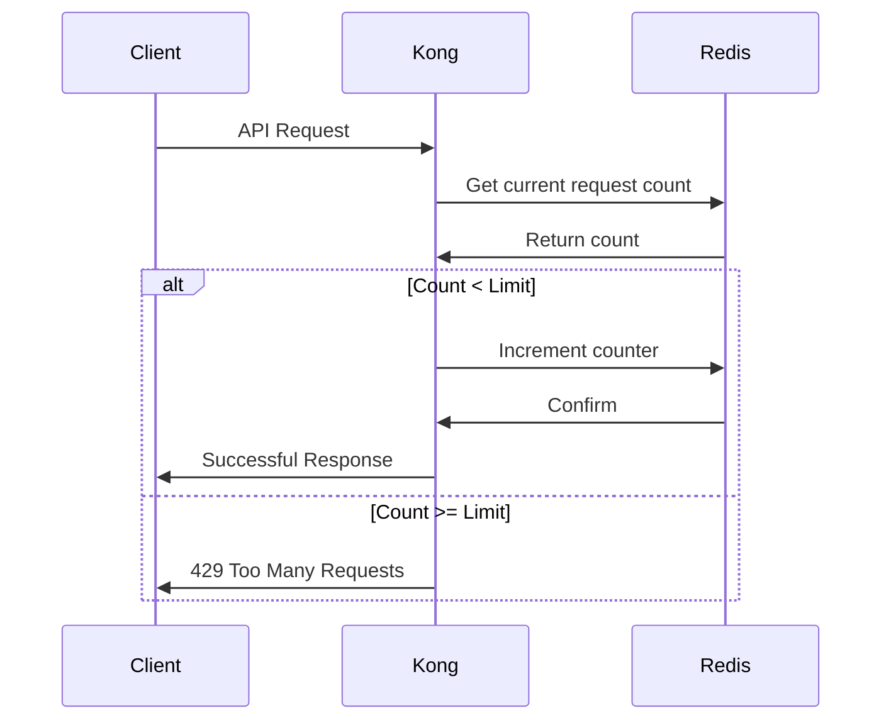
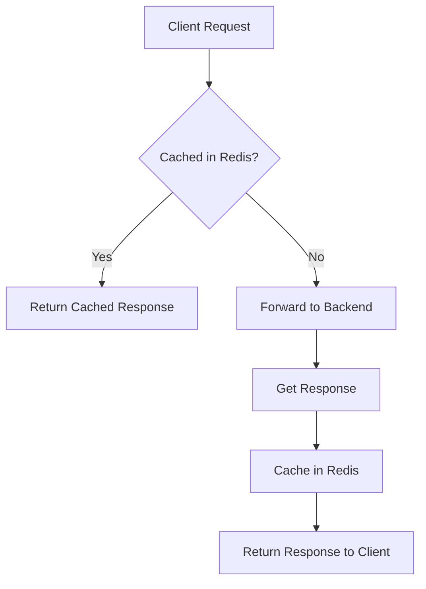

# Kong Redis Integration

## Introduction

Kong is a powerful, open-source API gateway that helps you manage, secure, and optimize your APIs. Redis is a popular in-memory data structure store that can be used as a database, cache, and message broker. When integrated with Kong, Redis enhances Kong's capabilities by providing distributed caching, rate limiting, session management, and more.

This guide will walk you through how to integrate Redis with Kong, the benefits of using them together, and provide practical examples for common use cases.

## What is Redis?

Redis (Remote Dictionary Server) is an open-source, in-memory data structure store that can be used as a database, cache, and message broker. It supports various data structures such as strings, hashes, lists, sets, and more. Redis is known for its exceptional performance, with operations running in microseconds, making it an ideal choice for applications requiring high-speed data access.

## Why Use Redis with Kong?

Kong can work standalone with its local storage, but integrating it with Redis offers several advantages:

1. **Distributed Caching**: Store and retrieve cached responses across multiple Kong nodes
2. **Rate Limiting**: Enforce global rate limits across your Kong cluster
3. **Session Management**: Maintain user sessions consistently across different services
4. **Shared Configuration**: Store and share configuration data between Kong instances
5. **High Availability**: Improve the reliability and fault tolerance of your API gateway

## Prerequisites

Before we begin, ensure you have:

- Kong Gateway installed (version 2.0 or higher)
- Redis server (version 5.0 or higher) installed and running
- Basic understanding of API gateways and caching concepts

## Installation and Configuration

### Step 1: Install Redis

If you haven't installed Redis yet, follow these instructions based on your operating system:

For Linux (Ubuntu/Debian):

```bash
sudo apt update
sudo apt install redis-server
```

For macOS (using Homebrew):

```bash
brew install redis
```

Verify your Redis installation:

```bash
redis-cli ping
```

You should receive a response of `PONG` if Redis is running correctly.

### Step 2: Configure Kong to Use Redis

Edit your Kong configuration file (`kong.conf`) to add Redis connection settings:

```
# Redis configuration
redis_host = 127.0.0.1
redis_port = 6379
redis_password = your_redis_password  # Optional
redis_database = 0
```

Restart Kong to apply the changes:

```bash
kong restart
```

## Common Redis Integrations with Kong

### 1. Rate Limiting with Redis

Rate limiting restricts how many requests a client can make to your API within a specified time period. Using Redis for rate limiting ensures consistent limits across all Kong nodes.

#### Configuration Example

```bash
curl -X POST http://localhost:8001/services/my-service/plugins \
  --data "name=rate-limiting" \
  --data "config.minute=100" \
  --data "config.policy=redis" \
  --data "config.redis_host=127.0.0.1" \
  --data "config.redis_port=6379" \
  --data "config.redis_password=your_redis_password" \
  --data "config.redis_database=0"
```

This configuration limits requests to 100 per minute for the service named "my-service" using Redis as the policy backend.

#### How It Works

When a request comes in, Kong:
1. Checks Redis for the current request count for the client
2. Increments the counter if below the limit
3. Rejects the request if the limit is exceeded
4. Updates the Redis counter with an expiration time



### 2. Caching with Redis

Kong can cache API responses in Redis to improve performance and reduce load on your backend services.

#### Configuration Example

```bash
curl -X POST http://localhost:8001/services/my-service/plugins \
  --data "name=proxy-cache" \
  --data "config.strategy=redis" \
  --data "config.redis_host=127.0.0.1" \
  --data "config.redis_port=6379" \
  --data "config.content_type=application/json" \
  --data "config.cache_ttl=300" \
  --data "config.cache_control=true"
```

This configuration caches JSON responses for 5 minutes (300 seconds) for the service named "my-service".

#### How It Works

1. When a request comes in, Kong generates a cache key based on the request
2. Kong checks Redis for a cached response using this key
3. If found, Kong returns the cached response without forwarding to the backend
4. If not found, Kong forwards the request to the backend, caches the response in Redis, and returns it to the client



### 3. Session Management with Redis

Kong can use Redis to store and manage user sessions across multiple Kong instances.

#### Configuration Example

```bash
curl -X POST http://localhost:8001/services/my-service/plugins \
  --data "name=session" \
  --data "config.storage=redis" \
  --data "config.redis_host=127.0.0.1" \
  --data "config.redis_port=6379" \
  --data "config.redis_timeout=2000" \
  --data "config.cookie_name=kong_session" \
  --data "config.cookie_lifetime=3600" \
  --data "config.cookie_secure=true"
```

This configuration stores session data in Redis with a cookie lifetime of 1 hour (3600 seconds).

#### Session Data Example

Redis stores session data in a hash structure:

```
HGETALL kong_session:a7d7e793-1314-4c72-8416-ba46c2050fd5
```

Output:
```
1) "id"
2) "a7d7e793-1314-4c72-8416-ba46c2050fd5"
3) "credential"
4) "{\"id\":\"user123\",\"username\":\"john_doe\"}"
5) "auth_time"
6) "1624352400"
7) "exp"
8) "1624356000"
```

## Real-World Scenarios

### Scenario 1: API Gateway for E-commerce Platform

In an e-commerce platform, you might want to:

1. Cache product catalog responses to improve performance
2. Implement rate limiting to prevent abuse of product search APIs
3. Maintain user sessions for shopping carts across multiple services

**Implementation:**

```bash
# Cache product catalog
curl -X POST http://localhost:8001/services/product-catalog/plugins \
  --data "name=proxy-cache" \
  --data "config.strategy=redis" \
  --data "config.redis_host=127.0.0.1" \
  --data "config.cache_ttl=600"

# Rate limit product search
curl -X POST http://localhost:8001/services/product-search/plugins \
  --data "name=rate-limiting" \
  --data "config.minute=60" \
  --data "config.policy=redis"

# Session management for shopping cart
curl -X POST http://localhost:8001/services/shopping-cart/plugins \
  --data "name=session" \
  --data "config.storage=redis" \
  --data "config.cookie_lifetime=7200"
```

### Scenario 2: Microservices Authentication

For a microservices architecture with centralized authentication:

```bash
# JWT authentication with Redis
curl -X POST http://localhost:8001/services/authentication/plugins \
  --data "name=jwt" \
  --data "config.secret_is_base64=false" \
  --data "config.key_claim_name=kid"

# Redis for blacklisting tokens
curl -X POST http://localhost:8001/plugins \
  --data "name=jwt-blacklist" \
  --data "config.storage=redis" \
  --data "config.redis_host=127.0.0.1" \
  --data "config.redis_port=6379"
```

## Advanced Redis with Kong

### Redis Sentinel Support

For high-availability Redis setups, Kong supports Redis Sentinel:

```
# In kong.conf
redis_sentinel_master = mymaster
redis_sentinel_role = master
redis_sentinel_addresses = 127.0.0.1:26379,127.0.0.1:26380,127.0.0.1:26381
```

### Redis Cluster Support

For horizontal scaling with Redis Cluster:

```
# In kong.conf
redis_cluster_addresses = 127.0.0.1:7001,127.0.0.1:7002,127.0.0.1:7003
```

### Custom Redis Timeouts

Optimize Redis connection settings:

```
# In kong.conf
redis_timeout = 2000  # in milliseconds
redis_connect_timeout = 1000  # in milliseconds
```

## Troubleshooting

### Common Issues

1. **Connection Errors**

   If Kong can't connect to Redis, check:
   
   ```bash
   # Verify Redis is running
   redis-cli ping
   
   # Check Redis logs
   sudo tail -f /var/log/redis/redis-server.log
   
   # Kong logs
   tail -f /usr/local/kong/logs/error.log
   ```

2. **Performance Issues**

   If experiencing slow responses:
   
   ```bash
   # Check Redis performance
   redis-cli --latency-history -h 127.0.0.1 -p 6379
   
   # Monitor Redis
   redis-cli monitor
   ```

3. **Memory Issues**

   If Redis is running out of memory:
   
   ```bash
   # Check Redis info
   redis-cli info memory
   
   # Configure Redis maxmemory policy in redis.conf
   maxmemory 2gb
   maxmemory-policy allkeys-lru
   ```

## Best Practices

1. **Security**:
   - Use Redis AUTH password
   - Enable SSL/TLS for Redis connections
   - Restrict Redis access with firewall rules

2. **Performance**:
   - Monitor Redis memory usage
   - Configure appropriate TTLs for cached data
   - Use Redis pipelines for batch operations

3. **High Availability**:
   - Set up Redis Sentinel or Redis Cluster
   - Configure Redis persistence (AOF or RDB)
   - Implement backup strategies for Redis data

## Summary

Redis integration with Kong provides powerful capabilities for building scalable and high-performance API gateways. By leveraging Redis for caching, rate limiting, and session management, you can significantly improve the reliability and performance of your Kong deployment.

Key takeaways:
- Redis provides distributed storage for Kong, enabling cluster-wide functionality
- Common use cases include rate limiting, caching, and session management
- Redis enhances Kong's scalability and high availability
- Proper configuration and monitoring are essential for optimal performance

## Additional Resources

- [Kong Documentation](https://docs.konghq.com/)
- [Redis Documentation](https://redis.io/documentation)
- [Kong Rate Limiting Plugin](https://docs.konghq.com/hub/kong-inc/rate-limiting/)
- [Kong Proxy Cache Plugin](https://docs.konghq.com/hub/kong-inc/proxy-cache/)
- [Kong Session Plugin](https://docs.konghq.com/hub/kong-inc/session/)

## Exercises

1. Set up a basic Kong and Redis integration on your local machine.
2. Implement rate limiting with Redis for a test API.
3. Configure response caching with different TTLs based on content types.
4. Create a session management system with Redis for user authentication.
5. Implement Redis Sentinel for high availability and test failover scenarios.