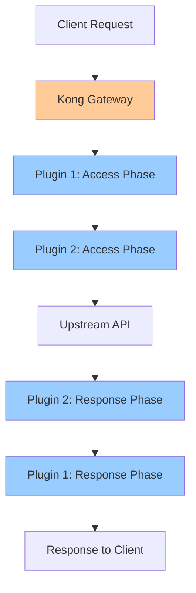

# Kong Plugin Development

## Introduction

Kong is a popular open-source API gateway that acts as a middleware layer between clients and your API services. One of Kong's most powerful features is its extensibility through plugins. Plugins allow you to add functionality to your API gateway without modifying the core codebase.

In this guide, we'll explore how to develop custom plugins for Kong. We'll cover the basic structure of a Kong plugin, the plugin development workflow, and create practical examples to demonstrate real-world applications.

## Prerequisites

Before we begin, you should have:

- Basic understanding of APIs and API gateways
- Familiarity with Lua programming language (Kong plugins are written in Lua)
- Kong Gateway installed locally (version 2.0 or later)
- Development environment set up with Lua

## Understanding Kong Plugins

Kong plugins intercept requests and responses to and from your API, allowing you to add functionality like authentication, rate limiting, transformations, logging, and more.

### Plugin Execution Lifecycle

Kong plugins follow a specific execution lifecycle:



Each plugin can implement functions that execute during different phases of the request/response cycle:

1. **init_worker**: Runs when Kong worker process starts
2. **certificate**: During SSL certificate serving
3. **rewrite**: Before any other plugin runs
4. **access**: Before the request is proxied to the upstream service
5. **header_filter**: After receiving headers from the upstream service
6. **body_filter**: After receiving the body from the upstream service
7. **log**: After the response has been sent to the client

## Creating Your First Kong Plugin

Let's create a basic plugin that adds a custom header to each request. We'll call it `add-header`.

### Step 1: Set Up the Plugin Structure

Kong plugins follow a specific directory structure:

```
kong-plugin-add-header/
├── kong/
│   └── plugins/
│       └── add-header/
│           ├── handler.lua
│           └── schema.lua
└── kong-plugin-add-header-0.1.0-1.rockspec
```

### Step 2: Create the Plugin Schema

The schema defines the configuration parameters for your plugin. Create a file named `schema.lua`:

```lua
local typedefs = require "kong.db.schema.typedefs"

return {
  name = "add-header",
  fields = {
    { consumer = typedefs.no_consumer },
    { protocols = typedefs.protocols_http },
    { config = {
        type = "record",
        fields = {
          { header_name = { type = "string", required = true, default = "X-Custom-Header" }, },
          { header_value = { type = "string", required = true, default = "Hello World" }, },
        },
      },
    },
  },
}
```

This schema defines two configuration parameters:
- `header_name`: The name of the header to add
- `header_value`: The value of the header

### Step 3: Create the Plugin Handler

The handler contains the logic for your plugin. Create a file named `handler.lua`:

```lua
local BasePlugin = require "kong.plugins.base_plugin"

local AddHeaderHandler = BasePlugin:extend()

AddHeaderHandler.PRIORITY = 1000
AddHeaderHandler.VERSION = "0.1.0"

function AddHeaderHandler:new()
  AddHeaderHandler.super.new(self, "add-header")
end

function AddHeaderHandler:access(conf)
  AddHeaderHandler.super.access(self)
  
  -- Add the header to the request
  kong.service.request.set_header(conf.header_name, conf.header_value)
end

return AddHeaderHandler
```

This handler implements the `access` phase to add a custom header to each request before it reaches the upstream service.

### Step 4: Create the LuaRocks Specification

Create a file named `kong-plugin-add-header-0.1.0-1.rockspec`:

```lua
package = "kong-plugin-add-header"
version = "0.1.0-1"
source = {
   url = "git://github.com/yourusername/kong-plugin-add-header",
   tag = "0.1.0"
}
description = {
   summary = "Kong plugin that adds a custom header to requests",
   detailed = [[
      A Kong plugin that adds a custom header to requests
      before they are proxied to the upstream service.
   ]],
   homepage = "https://github.com/yourusername/kong-plugin-add-header",
   license = "MIT"
}
dependencies = {
   "lua >= 5.1"
}
build = {
   type = "builtin",
   modules = {
      ["kong.plugins.add-header.handler"] = "kong/plugins/add-header/handler.lua",
      ["kong.plugins.add-header.schema"] = "kong/plugins/add-header/schema.lua"
   }
}
```

### Step 5: Install and Enable the Plugin

1. Install the plugin using LuaRocks:

```bash
luarocks install kong-plugin-add-header
```

2. Add the plugin to the `plugins` list in your Kong configuration file:

```yaml
plugins:
  - bundled
  - add-header
```

3. Restart Kong:

```bash
kong restart
```

### Step 6: Configure the Plugin

Now you can apply your plugin to a service or route:

```bash
curl -X POST http://localhost:8001/services/example-service/plugins \
  --data "name=add-header" \
  --data "config.header_name=X-Custom-Header" \
  --data "config.header_value=Hello from Kong"
```

## Advanced Plugin Development

Let's explore more advanced concepts in Kong plugin development.

### Plugin Configuration Validation

Kong uses a schema validator to ensure plugin configurations are correct. You can create custom validators for your plugin's configuration fields:

```lua
local function validate_custom_field(value)
  if value ~= "allowed_value" then
    return false, "custom field must be 'allowed_value'"
  end
  return true
end

return {
  name = "my-plugin",
  fields = {
    { config = {
        type = "record",
        fields = {
          { custom_field = { 
              type = "string", 
              required = true, 
              custom_validator = validate_custom_field 
            },
          },
        },
      },
    },
  },
}
```

### Plugin Priority

The `PRIORITY` constant in your handler determines the order in which your plugin runs relative to other plugins. Plugins with higher priority (larger numbers) execute first during the request phase and last during the response phase.

```lua
local MyPlugin = BasePlugin:extend()
MyPlugin.PRIORITY = 1000  -- Execute before most other plugins
```

Common priority values:
- Authentication plugins: 1000-1999
- Security plugins: 2000-2999
- Transformation plugins: 3000-3999
- Logging plugins: 4000-4999

### Implementing Multiple Phases

A real-world plugin might implement multiple phases:

```lua
function MyPlugin:access(conf)
  MyPlugin.super.access(self)
  -- Store the start time
  kong.ctx.plugin.start_time = ngx.now()
end

function MyPlugin:header_filter(conf)
  MyPlugin.super.header_filter(self)
  -- Add a custom response header
  kong.response.set_header("X-Response-Time", ngx.now() - kong.ctx.plugin.start_time)
end

function MyPlugin:log(conf)
  MyPlugin.super.log(self)
  -- Log the response time
  kong.log.info("Request processed in: ", ngx.now() - kong.ctx.plugin.start_time, " seconds")
end
```

## Real-World Plugin Example: Rate Limiting Based on Custom Header

Let's create a more practical plugin that implements rate limiting based on a custom header value.

### Schema Definition

```lua
local typedefs = require "kong.db.schema.typedefs"

return {
  name = "custom-ratelimiter",
  fields = {
    { consumer = typedefs.no_consumer },
    { protocols = typedefs.protocols_http },
    { config = {
        type = "record",
        fields = {
          { header_name = { type = "string", required = true, default = "X-API-Key" }, },
          { limit = { type = "number", required = true, default = 100 }, },
          { window_size = { type = "number", required = true, default = 60 }, }, -- in seconds
        },
      },
    },
  },
}
```

### Handler Implementation

```lua
local BasePlugin = require "kong.plugins.base_plugin"
local redis = require "resty.redis"

local CustomRateLimiterHandler = BasePlugin:extend()

CustomRateLimiterHandler.PRIORITY = 901  -- Run after authentication plugins
CustomRateLimiterHandler.VERSION = "0.1.0"

function CustomRateLimiterHandler:new()
  CustomRateLimiterHandler.super.new(self, "custom-ratelimiter")
end

local function get_redis_connection()
  local red = redis:new()
  red:set_timeout(2000) -- 2 seconds
  
  local ok, err = red:connect("127.0.0.1", 6379)
  if not ok then
    kong.log.err("Failed to connect to Redis: ", err)
    return nil, err
  end
  
  return red
end

function CustomRateLimiterHandler:access(conf)
  CustomRateLimiterHandler.super.access(self)
  
  -- Get the header value for rate limiting
  local header_value = kong.request.get_header(conf.header_name)
  
  if not header_value then
    kong.response.exit(401, { message = "Missing required header for rate limiting" })
    return
  end
  
  -- Create a unique identifier for the rate limit key
  local rate_limit_key = "ratelimit:" .. header_value
  
  -- Connect to Redis
  local red, err = get_redis_connection()
  if not red then
    kong.log.err("Failed to get Redis connection: ", err)
    return
  end
  
  -- Increment the counter
  local current_usage, err = red:incr(rate_limit_key)
  if not current_usage then
    kong.log.err("Failed to increment counter: ", err)
    return
  end
  
  -- Set expiry on the key if it's new
  if current_usage == 1 then
    red:expire(rate_limit_key, conf.window_size)
  end
  
  -- Get the TTL of the key
  local ttl, err = red:ttl(rate_limit_key)
  if not ttl then
    kong.log.err("Failed to get TTL: ", err)
    return
  end
  
  -- Return connection to connection pool
  red:set_keepalive(10000, 100)
  
  -- Add rate limit headers
  kong.response.set_header("X-RateLimit-Limit", conf.limit)
  kong.response.set_header("X-RateLimit-Remaining", math.max(0, conf.limit - current_usage))
  kong.response.set_header("X-RateLimit-Reset", ttl)
  
  -- Check if rate limit exceeded
  if current_usage > conf.limit then
    kong.response.exit(429, { message = "Rate limit exceeded" })
  end
end

return CustomRateLimiterHandler
```

### Testing the Custom Rate Limiter

Once you've installed the plugin, you can apply it to a route:

```bash
curl -X POST http://localhost:8001/routes/my-route/plugins \
  --data "name=custom-ratelimiter" \
  --data "config.header_name=X-API-Key" \
  --data "config.limit=5" \
  --data "config.window_size=60"
```

Now, if you make more than 5 requests with the same API key within 60 seconds, you'll receive a 429 "Rate limit exceeded" response.

Example request:

```bash
curl -i http://localhost:8000/my-api \
  -H "X-API-Key: user123"
```

Example response (after 5 requests):

```
HTTP/1.1 429 Too Many Requests
X-RateLimit-Limit: 5
X-RateLimit-Remaining: 0
X-RateLimit-Reset: 42
Content-Type: application/json
{
  "message": "Rate limit exceeded"
}
```

## Best Practices for Kong Plugin Development

1. **Focus on a Single Responsibility**: Each plugin should do one thing well, following the Single Responsibility Principle.

2. **Error Handling**: Implement proper error handling to prevent your plugin from crashing Kong.

3. **Performance Considerations**:
   - Minimize DB calls
   - Use local caching when possible
   - Avoid blocking operations
   - Be mindful of memory usage

4. **Testing**: Write unit and integration tests for your plugin using the Kong testing framework.

5. **Documentation**: Document your plugin's configuration options, behavior, and usage examples.

6. **Version Control**: Use semantic versioning for your plugins to track changes and ensure compatibility.

7. **Kong PDK**: Utilize the Kong Plugin Development Kit (PDK) to interact with Kong's internal APIs.

## Debugging Kong Plugins

To debug Kong plugins, enable the `lua_code_cache` and increase the log level:

```
lua_code_cache off;  # In your nginx.conf
log_level debug;     # In your Kong configuration
```

You can use `kong.log.debug()` to add debug information to your plugin:

```lua
kong.log.debug("Processing request with header: ", kong.request.get_header("X-Custom-Header"))
```

View logs with:

```bash
tail -f /usr/local/kong/logs/error.log
```

## Distributing Your Plugin

Once your plugin is ready for distribution, you have several options:

1. **LuaRocks**: The standard way to distribute Lua modules
2. **Custom Docker image**: Bundle Kong with your plugins
3. **Kong Hub**: Submit your plugin to the Kong Hub for wider distribution

### Publishing to LuaRocks

```bash
luarocks upload kong-plugin-your-plugin-0.1.0-1.rockspec
```

## Summary

In this guide, we've covered the fundamentals of Kong plugin development:

- The structure and architecture of Kong plugins
- Creating a basic plugin that adds a header
- Implementing a more complex rate limiting plugin
- Best practices for plugin development
- Debugging and distributing your plugins

Kong's plugin architecture makes it incredibly powerful and adaptable to various use cases. By creating custom plugins, you can extend Kong to meet specific requirements of your API infrastructure.

## Additional Resources

- [Kong Plugin Development Guide](https://docs.konghq.com/gateway/latest/plugin-development/)
- [Kong PDK Documentation](https://docs.konghq.com/gateway/latest/pdk/)
- [Lua Programming Language](https://www.lua.org/manual/5.1/)
- [OpenResty Documentation](https://openresty.org/en/getting-started.html)

## Exercises

1. Modify the add-header plugin to add multiple headers based on a configuration list.
2. Create a plugin that logs request information to a file.
3. Implement a plugin that transforms response bodies by replacing certain patterns.
4. Develop a plugin that implements basic authentication with a custom header.
5. Create a plugin that implements request throttling based on the client IP address.