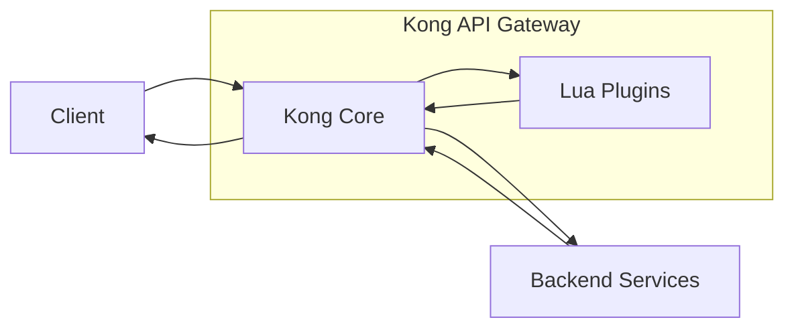

# Kong Lua

## Introduction

Kong is a popular open-source API Gateway that helps you manage, secure, and extend your APIs. One of Kong's most powerful features is its extensibility through custom plugins written in Lua. Lua is a lightweight, high-level scripting language designed for embedded use in applications, making it perfect for customizing Kong's behavior.

In this guide, we'll explore how to use Lua within Kong to create custom plugins, modify request/response cycles, and extend Kong's functionality to meet your specific API management needs.

## What is Lua?

Lua is a lightweight scripting language created in 1993 by a team at the Pontifical Catholic University of Rio de Janeiro in Brazil. It's designed to be embedded in other applications, which makes it perfect for extending Kong's functionality.

Key characteristics of Lua include:

- **Simplicity**: Easy to learn with a clean syntax
- **Efficiency**: Fast execution and small footprint
- **Portability**: Runs on various platforms
- **Embeddability**: Designed to be integrated into other applications

## Kong and Lua - How They Work Together

Kong's architecture is built around Lua, with the NGINX web server at its core. Each plugin in Kong is essentially a Lua module that intercepts requests and responses as they flow through the API Gateway.



The request/response lifecycle in Kong provides several phases where your Lua code can intervene:

1. **access**: Authentication, authorization, and request transformation
2. **header_filter**: Response header modification
3. **body_filter**: Response body modification
4. **log**: Logging after the response has been sent

## Setting Up Your Kong Lua Development Environment

Before writing Lua code for Kong, you'll need a proper development environment:

```bash
# Install Kong
$ curl -Lo kong.deb "https://download.konghq.com/gateway-2.x-ubuntu-$(lsb_release -cs)/pool/all/k/kong/kong_2.8.1_amd64.deb"
$ sudo apt install ./kong.deb

# Install development dependencies
$ sudo apt install luarocks

# Install Kong development kit
$ luarocks install kong
```

## Creating Your First Kong Lua Plugin

Let's create a simple "hello-world" plugin for Kong. Custom plugins live in Kong's plugin directory, usually at `/usr/local/share/lua/5.1/kong/plugins/`.

First, create a directory structure for your plugin:

```bash
$ mkdir -p /usr/local/share/lua/5.1/kong/plugins/hello-world
```

Now, create the following files:

1. **handler.lua** - The main plugin logic:

```lua
local HelloWorldHandler = {}

HelloWorldHandler.PRIORITY = 1000
HelloWorldHandler.VERSION = "1.0.0"

function HelloWorldHandler:access(conf)
  kong.response.set_header("X-Hello-World", "Welcome to Kong Lua!")
end

return HelloWorldHandler
```

2. **schema.lua** - Defines the configuration schema:

```lua
return {
  name = "hello-world",
  fields = {
    { config = {
        type = "record",
        fields = {
          { message = { type = "string", default = "Hello World!" } },
        },
      },
    },
  },
}
```

3. **Create a plugin.lua** file for Kong to recognize your plugin:

```lua
return {
  name = "hello-world",
  fields = {
    { config = {
        type = "record",
        fields = {
          { message = { type = "string", default = "Hello World!" } },
        },
      },
    },
  },
}
```

## Enabling and Using Your Plugin

Add your plugin to Kong's configuration in `kong.conf`:

```
plugins = bundled,hello-world
```

Restart Kong:

```bash
$ kong restart
```

Now, enable the plugin for a service or route:

```bash
$ curl -X POST http://localhost:8001/services/my-service/plugins \
  --data "name=hello-world" \
  --data "config.message=Welcome to Kong Lua!"
```

## Advanced Kong Lua Plugin Development

### Working with Request and Response Objects

Kong provides a rich API to interact with requests and responses:

```lua
-- Access request information
local headers = kong.request.get_headers()
local query_params = kong.request.get_query()
local body_data = kong.request.get_body()

-- Modify response
kong.response.set_header("X-Custom-Header", "Value")
kong.response.set_status(201)
```

### Handling Authentication

Let's create a simple key authentication plugin:

```lua
function AuthHandler:access(conf)
  -- Get the API key from the request
  local api_key = kong.request.get_header("x-api-key")
  
  -- Validate the key (in a real plugin, you'd check against a database)
  if not api_key or api_key ~= conf.expected_key then
    return kong.response.exit(401, { message = "Unauthorized" })
  end
  
  -- Set consumer information
  kong.service.request.set_header("X-Consumer-ID", "user-123")
end
```

### Rate Limiting Example

Rate limiting is a common use case for API gateways. Here's a simplified example:

```lua
local RateLimitHandler = {}

function RateLimitHandler:access(conf)
  -- Use Kong's rate-limiting library
  local counter = kong.db.rate_limiting_counters:increment(
    { service = { id = kong.router.get_service().id } },
    { minute = 1 },  -- increment the "per minute" counter
    conf.limit       -- maximum number of requests allowed
  )
  
  -- Check if limit exceeded
  if counter > conf.limit then
    return kong.response.exit(429, { message = "Rate limit exceeded" })
  end
  
  -- Add headers to response
  kong.response.set_header("X-RateLimit-Limit", conf.limit)
  kong.response.set_header("X-RateLimit-Remaining", math.max(0, conf.limit - counter))
end

return RateLimitHandler
```

## Debugging Kong Lua Plugins

When developing Kong plugins, debugging is essential. Here are some techniques to help you:

1. **Use print statements**: Output to Kong's error log:

```lua
kong.log.err("Debug: " .. inspect(some_variable))
```

2. **Enable verbose logging** in `kong.conf`:

```
log_level = debug
```

3. **Check logs** for errors and debug information:

```bash
$ tail -f /usr/local/kong/logs/error.log
```

## Real-World Applications

### API Analytics Plugin

Track API usage metrics and send them to a time-series database:

```lua
function AnalyticsHandler:log(conf)
  local consumer_id = kong.client.get_consumer() and kong.client.get_consumer().id or "anonymous"
  
  local data = {
    service = kong.router.get_service().name,
    route = kong.router.get_route().name,
    consumer = consumer_id,
    status = kong.response.get_status(),
    latency = kong.ctx.request.response_time,
    timestamp = os.time()
  }
  
  -- In a real plugin, you would send this to your analytics system
  -- This example just logs it
  kong.log.notice("Analytics: " .. require("cjson").encode(data))
end
```

### Request Transformation

Modify incoming requests to match your backend requirements:

```lua
function TransformHandler:access(conf)
  local body = kong.request.get_body()
  
  -- Transform request body
  if body and body.data then
    -- Convert camelCase to snake_case for backend system
    body.data_value = body.dataValue
    body.dataValue = nil
    
    -- Update the request body
    kong.service.request.set_body(body)
  end
end
```

### JWT Validation Plugin

Create a custom JWT validation plugin:

```lua
function JwtHandler:access(conf)
  local jwt_token = kong.request.get_header("Authorization")
  
  if not jwt_token then
    return kong.response.exit(401, { message = "Missing JWT token" })
  end
  
  -- Remove "Bearer " prefix if present
  jwt_token = jwt_token:gsub("Bearer ", "")
  
  -- In a real plugin, you would validate the JWT here
  local jwt_valid = validate_jwt(jwt_token, conf.secret_key)
  
  if not jwt_valid then
    return kong.response.exit(401, { message = "Invalid JWT token" })
  end
  
  -- JWT is valid, extract claims and add to headers
  local claims = decode_jwt(jwt_token)
  kong.service.request.set_header("X-User-ID", claims.sub)
end
```

## Common Patterns and Best Practices

### 1. Cache Expensive Operations

Use Kong's in-memory cache for expensive operations:

```lua
local function get_consumer_from_db(key)
  -- This would be an expensive database lookup
  -- For demonstration purposes, we'll just return a value
  return { id = "consumer-123", username = "john" }
end

function Handler:access(conf)
  local consumer_key = kong.request.get_header("consumer-key")
  
  -- Try to get from cache first
  local consumer, err = kong.cache:get(consumer_key, nil, get_consumer_from_db, consumer_key)
  
  if err then
    kong.log.err("Cache error: ", err)
    return kong.response.exit(500)
  end
  
  -- Use the consumer data
  kong.service.request.set_header("X-Consumer-ID", consumer.id)
end
```

### 2. Handling Errors Gracefully

Always handle errors and edge cases properly:

```lua
function Handler:access(conf)
  local ok, err = pcall(function()
    -- Your plugin logic here
    local result = some_function_that_might_fail()
    
    if not result then
      return kong.response.exit(400, { message = "Bad request" })
    end
  end)
  
  if not ok then
    kong.log.err("Plugin error: ", err)
    return kong.response.exit(500, { message = "Internal server error" })
  end
end
```

### 3. Plugin Configuration Validation

Always validate your plugin configuration:

```lua
-- In schema.lua
return {
  name = "my-plugin",
  fields = {
    { config = {
        type = "record",
        fields = {
          { api_key = { type = "string", required = true } },
          { timeout = { type = "number", default = 10000, between = { 1000, 60000 } } },
        },
      },
    },
  },
  entity_checks = {
    { at_least_one_of = { "config.api_key", "config.jwt_secret" } },
  },
}
```

## Summary

Kong Lua offers a powerful way to extend and customize Kong API Gateway to meet your specific requirements. By leveraging Lua's simplicity and efficiency, you can create plugins that enhance security, transform data, monitor performance, and much more.

Key takeaways:

1. Lua's lightweight design makes it perfect for extending Kong's functionality
2. Kong's plugin architecture allows for intervention at different stages of the request/response lifecycle
3. Custom plugins can be developed to handle authentication, rate limiting, analytics, and data transformation
4. Proper error handling and caching are essential for production-ready plugins

## Exercises

1. Create a simple Lua plugin that adds a custom header to all responses
2. Develop a plugin that logs request information to a file
3. Implement a basic authentication plugin using Lua
4. Create a request transformer that converts JSON fields from one format to another
5. Develop a rate limiting plugin based on IP address

## Additional Resources

- [Kong Documentation](https://docs.konghq.com/)
- [Lua Programming Language](https://www.lua.org/)
- [Kong Plugin Development Guide](https://docs.konghq.com/gateway/latest/plugin-development/)
- [OpenResty (NGINX + Lua)](https://openresty.org/)
- [Kong Plugin Hub](https://docs.konghq.com/hub/)