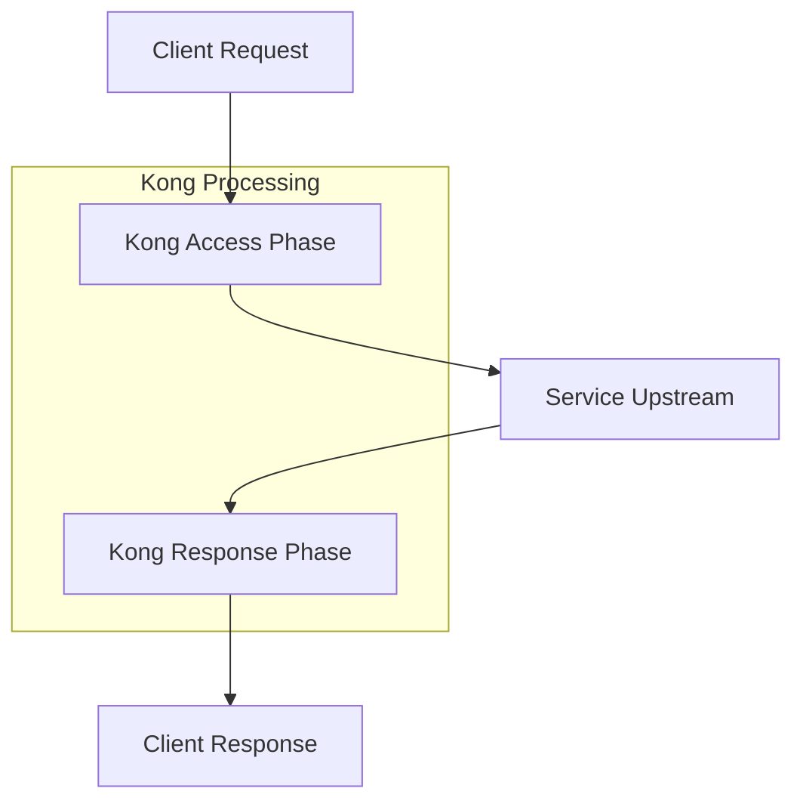

# Kong Hooks

## Introduction

Kong Hooks provide a powerful mechanism to customize the behavior of the Kong API Gateway at various stages of the request/response lifecycle. Hooks allow developers to inject custom logic at specific points (or "phases") during the processing of an API request, without having to create a full-fledged plugin. They are essentially event listeners that get triggered at predefined moments, enabling you to modify requests or responses, implement custom logic, or integrate with external systems.

If you've ever needed to make small adjustments to how Kong handles requests or responses, but found creating an entire plugin to be excessive, hooks are the perfect solution. They're simpler to implement, focused on specific phases of request processing, and ideal for quick customizations.

## Understanding Kong Request Lifecycle

Before diving into hooks, it's important to understand the request lifecycle within Kong:



Kong processes each API request through several phases:

1. **Access Phase**: When Kong first receives a request
2. **Upstream Phase**: When Kong sends the request to the backend service
3. **Response Phase**: When Kong receives a response from the backend
4. **Header Filter Phase**: Before sending headers back to client
5. **Body Filter Phase**: Before sending the response body back to client

Hooks allow you to tap into specific points within these phases.

## Types of Kong Hooks

Kong offers several types of hooks that correspond to different phases of request processing:

1. **request-transformers**: Modify incoming requests
2. **response-transformers**: Modify outgoing responses
3. **access-control**: Implement custom authentication or authorization
4. **logging**: Custom logging implementations
5. **error-handlers**: Custom error processing

## Basic Hook Structure

A Kong hook is typically structured as a Lua function that gets registered to a specific phase. Here's the basic structure:

```lua
local MyHook = {}

function MyHook:access(conf)
  -- Custom logic for the access phase
  kong.log.debug("Hook executed in access phase!")
  
  -- Example: Add a custom header
  kong.service.request.set_header("X-Custom-Hook", "true")
end

return MyHook
```

## Setting Up Your First Hook

Let's create a simple hook that adds a custom header to every request:

### Step 1: Create a Hook File

Create a file named `custom-header-hook.lua` in your Kong project:

```lua
local CustomHeaderHook = {}

function CustomHeaderHook:access(conf)
  -- Add a timestamp header to track when requests were processed
  kong.service.request.set_header("X-Request-Timestamp", os.time())
  kong.log.debug("Added timestamp header: " .. os.time())
end

return CustomHeaderHook
```

### Step 2: Register the Hook in Kong

Add your hook to Kong's configuration in `kong.conf`:

```
plugins = bundled,custom-header-hook
```

Or register it using the Admin API:

```bash
curl -X POST http://localhost:8001/plugins \
  --data "name=custom-header-hook" \
  --data "config.header_name=X-Request-Timestamp" \
  --data "config.header_value=dynamic"
```

## Hook Configuration

Hooks can accept configuration parameters, making them flexible and reusable. Here's how to define configuration parameters for your hook:

```lua
local RequestModifierHook = {}

-- Define the schema for configuration
RequestModifierHook.SCHEMA = {
  name = "request-modifier-hook",
  fields = {
    { header_name = { type = "string", required = true } },
    { header_value = { type = "string", required = true } }
  }
}

function RequestModifierHook:access(conf)
  -- Use the configuration parameters
  kong.service.request.set_header(conf.header_name, conf.header_value)
  kong.log.debug("Added header: " .. conf.header_name .. "=" .. conf.header_value)
end

return RequestModifierHook
```

## Hook Priority and Execution Order

When multiple hooks are registered for the same phase, Kong executes them based on their priority settings. Higher priority hooks execute first:

```lua
local HighPriorityHook = {}

-- Set a high priority (higher numbers = higher priority)
HighPriorityHook.PRIORITY = 1000

function HighPriorityHook:access(conf)
  kong.log.debug("This hook runs before hooks with lower priority")
end

return HighPriorityHook
```

## Practical Examples

Let's explore some practical applications of Kong Hooks:

### Example 1: Request Transformation Hook

This hook modifies incoming requests by adding correlation IDs for tracking:

```lua
local uuid = require "kong.tools.uuid"

local CorrelationHook = {}

function CorrelationHook:access(conf)
  -- Generate a correlation ID if one doesn't exist
  local correlation_id = kong.request.get_header("X-Correlation-ID")
  
  if not correlation_id then
    correlation_id = uuid()
    kong.service.request.set_header("X-Correlation-ID", correlation_id)
  end
  
  -- Store it in Kong context for access in other phases
  kong.ctx.shared.correlation_id = correlation_id
end

return CorrelationHook
```

### Example 2: Response Transformation Hook

This hook modifies outgoing responses by adding CORS headers:

```lua
local CorsHook = {}

function CorsHook:header_filter(conf)
  kong.response.set_header("Access-Control-Allow-Origin", conf.allow_origin or "*")
  kong.response.set_header("Access-Control-Allow-Methods", "GET, POST, PUT, DELETE, OPTIONS")
  kong.response.set_header("Access-Control-Allow-Headers", "Content-Type, Authorization")
  kong.response.set_header("Access-Control-Max-Age", "3600")
end

return CorsHook
```

### Example 3: Error Handling Hook

This hook provides custom error responses:

```lua
local cjson = require "cjson"

local ErrorHandlerHook = {}

function ErrorHandlerHook:header_filter(conf)
  local status = kong.response.get_status()
  
  -- Only process error responses (4xx and 5xx)
  if status >= 400 then
    kong.response.set_header("Content-Type", "application/json")
  end
end

function ErrorHandlerHook:body_filter(conf)
  local status = kong.response.get_status()
  
  -- Only process error responses (4xx and 5xx)
  if status >= 400 then
    local body = {
      error = true,
      status = status,
      message = conf.error_messages[tostring(status)] or "An error occurred",
      request_id = kong.ctx.shared.correlation_id or "unknown"
    }
    
    -- Replace the response body
    kong.response.set_raw_body(cjson.encode(body))
  end
end

return ErrorHandlerHook
```

### Example 4: Advanced Rate Limiting Hook

This hook implements a custom rate limiting strategy:

```lua
local redis = require "resty.redis"
local IPRateLimitHook = {}

function IPRateLimitHook:access(conf)
  -- Get client IP
  local client_ip = kong.client.get_ip()
  
  -- Connect to Redis
  local red = redis:new()
  red:set_timeout(conf.redis_timeout or 1000)
  local ok, err = red:connect(conf.redis_host, conf.redis_port)
  
  if not ok then
    kong.log.err("Failed to connect to Redis: ", err)
    return
  end
  
  -- Increment counter for this IP
  local key = "rate_limit:" .. client_ip
  local count, err = red:incr(key)
  
  if not count then
    kong.log.err("Redis error: ", err)
    return
  end
  
  -- Set expiry on first request
  if count == 1 then
    red:expire(key, conf.window_size or 60)
  end
  
  -- Check if rate limit exceeded
  if count > (conf.limit or 10) then
    return kong.response.exit(429, { message = "Rate limit exceeded" })
  end
  
  -- Return connection to pool
  local ok, err = red:set_keepalive()
  if not ok then
    kong.log.err("Failed to set keepalive: ", err)
  end
end

return IPRateLimitHook
```

## Debugging Hooks

Debugging Kong hooks can be challenging. Here are some tips:

1. **Use Kong's logging**: Add `kong.log.debug()` statements in your hooks
2. **Enable verbose logging** in Kong: Set `log_level = debug` in `kong.conf`
3. **Use the Kong Admin API** to check if your hook is registered:

```bash
curl -X GET http://localhost:8001/plugins
```

4. **Check HTTP headers** to verify your hooks are modifying requests/responses:

```bash
curl -v http://your-kong-gateway/your-api-endpoint
```

## Best Practices for Kong Hooks

1. **Keep hooks focused**: Each hook should do one thing well
2. **Be mindful of performance**: Hooks run on every request, so optimize for speed
3. **Handle errors gracefully**: Never let your hook crash Kong
4. **Use namespaces** for shared data: Use `kong.ctx.shared` for data that needs to be accessed across hooks
5. **Test thoroughly**: Verify your hooks under various conditions
6. **Document your hooks**: Include comments explaining the purpose and behavior

## Summary

Kong Hooks provide a lightweight, flexible approach to customizing Kong API Gateway behavior without creating full plugins. They allow you to inject logic at specific phases of request processing, making them perfect for simple customizations like adding headers, implementing CORS, or handling errors.

Key takeaways:
- Hooks are phase-specific event listeners in Kong
- They're simpler than plugins but powerful enough for many customization needs
- Common hook types include request transformers, response transformers, and access control
- Hooks can be configured with parameters to make them reusable
- Priority settings determine the execution order of multiple hooks

## Exercises

1. Create a hook that adds the current server time to every response
2. Implement a hook that logs basic request metrics (path, method, status code)
3. Build a hook that redirects specific URL patterns to new locations
4. Create a hook that implements basic IP-based access control
5. Develop a hook that modifies JSON response bodies to add a standard wrapper structure

## Additional Resources

- [Kong Documentation](https://docs.konghq.com/)
- [Kong Plugin Development Guide](https://docs.konghq.com/gateway/latest/plugin-development/)
- [Lua Programming Language](https://www.lua.org/manual/5.1/)
- [OpenResty Project](https://openresty.org/en/) (which Kong is built on)
- [Kong Community Forums](https://discuss.konghq.com/)