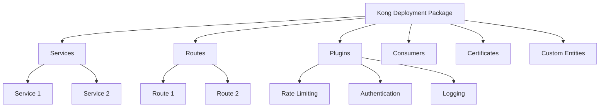

# Kong Deployment Package

## Introduction

A Kong Deployment Package is a standardized approach to organizing, versioning, and deploying Kong API Gateway configurations. Kong, a popular open-source API gateway, helps manage API traffic, implement security policies, and monitor service performance. However, as your API ecosystem grows, managing Kong configurations across different environments becomes challenging.

This guide introduces Kong Deployment Packages as a solution to this challenge, providing a structured way to bundle your Kong configurations for consistent deployment across development, testing, and production environments.

## What is a Kong Deployment Package?

A Kong Deployment Package is a versioned collection of configuration files that define everything needed to deploy your Kong gateway setup. Think of it as a "deployment unit" that includes:

- Service definitions
- Route configurations
- Plugin settings
- Consumer information
- Security policies
- Custom entities



## Package Structure

A typical Kong Deployment Package follows this directory structure:

```
kong-package/
├── manifest.yml            # Package metadata
├── services/               # API service definitions
│   ├── user-service.yml
│   └── payment-service.yml
├── routes/                 # Route configurations
│   ├── user-routes.yml
│   └── payment-routes.yml
├── plugins/                # Plugin configurations
│   ├── rate-limiting.yml
│   ├── key-auth.yml
│   └── cors.yml
├── consumers/              # Consumer configurations
│   ├── internal-apps.yml
│   └── partner-services.yml
└── scripts/                # Deployment scripts
    ├── deploy.sh
    └── rollback.sh
```

## Creating Your First Deployment Package

Let's walk through creating a basic Kong Deployment Package step by step:

### Step 1: Create the Package Directory Structure

First, create the directory structure for your package:

```bash
mkdir -p kong-package/{services,routes,plugins,consumers,scripts}
touch kong-package/manifest.yml
```

### Step 2: Define Your Manifest File

The manifest file contains metadata about your package:

```yaml
name: my-api-gateway
version: 1.0.0
description: Kong configuration for My API Gateway
author: Your Name
dependencies:
  kong: ">=2.8.0"
environments:
  - development
  - staging
  - production
```

### Step 3: Define Services

Create service definitions in the `services` directory. For example, in `services/user-service.yml`:

```yaml
name: user-service
url: http://user-service:8080
protocol: http
retries: 5
connect_timeout: 60000
write_timeout: 60000
read_timeout: 60000
```

### Step 4: Configure Routes

Set up route configurations in the `routes` directory. For example, in `routes/user-routes.yml`:

```yaml
name: user-api
service: user-service
protocols:
  - http
  - https
paths:
  - /users
  - /profiles
methods:
  - GET
  - POST
  - PUT
  - DELETE
strip_path: false
preserve_host: false
```

### Step 5: Add Plugin Configurations

Define plugin settings in the `plugins` directory. For example, in `plugins/rate-limiting.yml`:

```yaml
name: rate-limiting
config:
  minute: 60
  hour: 1000
  policy: local
enabled: true
```

### Step 6: Configure Consumers

Set up consumer configurations in the `consumers` directory. For example, in `consumers/internal-apps.yml`:

```yaml
username: internal-app-1
custom_id: int-app-001

  - internal
  - trusted
```

### Step 7: Create Deployment Scripts

Finally, add deployment scripts to manage the application of your configurations. In `scripts/deploy.sh`:

```bash
#!/bin/bash

KONG_ADMIN_URL=${KONG_ADMIN_URL:-"http://localhost:8001"}
ENVIRONMENT=${ENVIRONMENT:-"development"}

echo "Deploying Kong configuration to $ENVIRONMENT environment"

# Deploy services
for service_file in services/*.yml; do
  echo "Applying service: $service_file"
  # Your deployment logic here using curl or deck or kong-portal-cli
done

# Similar loops for routes, plugins, and consumers

echo "Deployment complete!"
```

## Deployment Tools

Several tools can help you apply your Kong Deployment Package:

### 1. decK

[decK](https://github.com/Kong/deck) is an official tool for declarative configuration management with Kong:

```bash
# Install decK
curl -sL https://github.com/Kong/deck/releases/download/v1.12.0/deck_1.12.0_linux_amd64.tar.gz | tar xz
sudo mv deck /usr/local/bin/

# Export current configuration for comparison
deck dump --kong-addr http://localhost:8001 --output-file kong-current.yaml

# Validate your configuration
deck validate --kong-addr http://localhost:8001 --state kong-package/

# Apply configuration
deck sync --kong-addr http://localhost:8001 --state kong-package/
```

### 2. Kong Portal CLI

For managing Kong Developer Portals:

```bash
# Install Portal CLI
npm install -g kong-portal-cli

# Deploy portal configuration
portal deploy --kong-addr http://localhost:8001
```

### 3. Custom Scripts

You can also use custom scripts with the Kong Admin API:

```bash
#!/bin/bash

# Add a service
curl -X POST http://localhost:8001/services \
  --data name=user-service \
  --data url=http://user-service:8080

# Add a route
curl -X POST http://localhost:8001/services/user-service/routes \
  --data 'paths[]=/users' \
  --data name=user-route

# Add a plugin
curl -X POST http://localhost:8001/plugins \
  --data name=rate-limiting \
  --data "config.minute=60" \
  --data "config.hour=1000"
```

## Environment-Specific Configurations

Often, you'll need different configurations per environment. Here's how to handle that:

### Using Environment Variables

You can use environment variables in your scripts:

```bash
# In your deploy.sh
if [ "$ENVIRONMENT" == "production" ]; then
  RATE_LIMIT=1000
else
  RATE_LIMIT=5000
fi

curl -X POST http://localhost:8001/plugins \
  --data name=rate-limiting \
  --data "config.minute=$RATE_LIMIT"
```

### Using Environment-Specific Directories

Alternatively, organize configurations by environment:

```
kong-package/
├── base/            # Common configurations
├── development/     # Development overrides
├── staging/         # Staging overrides
└── production/      # Production overrides
```

Then merge them during deployment:

```bash
# Merge base with environment-specific configs
cp -R kong-package/base/* kong-package/merged/
cp -R kong-package/$ENVIRONMENT/* kong-package/merged/
```

## Versioning and CI/CD Integration

### Versioning Your Package

Follow semantic versioning for your Kong Deployment Packages:

```yaml
# manifest.yml
name: my-api-gateway
version: 1.2.3  # Major.Minor.Patch
```

### Git Integration

Store your Kong Deployment Package in version control:

```bash
# Initialize Git repository
git init
git add .
git commit -m "Initial Kong Deployment Package"

# Create a version tag
git tag v1.0.0
git push origin v1.0.0
```

### CI/CD Pipeline Integration

Here's an example GitHub Actions workflow:

```yaml
name: Deploy Kong Configuration

on:
  push:
    tags:
      - 'v*'

jobs:
  deploy:
    runs-on: ubuntu-latest
    steps:
      - uses: actions/checkout@v2
      
      - name: Install decK
        run: |
          curl -sL https://github.com/Kong/deck/releases/download/v1.12.0/deck_1.12.0_linux_amd64.tar.gz | tar xz
          sudo mv deck /usr/local/bin/
      
      - name: Deploy to Development
        if: startsWith(github.ref, 'refs/tags/v') && contains(github.ref, '-dev')
        run: |
          deck sync --kong-addr ${{ secrets.DEV_KONG_ADMIN_URL }} --state ./
          
      - name: Deploy to Staging
        if: startsWith(github.ref, 'refs/tags/v') && contains(github.ref, '-staging')
        run: |
          deck sync --kong-addr ${{ secrets.STAGING_KONG_ADMIN_URL }} --state ./
          
      - name: Deploy to Production
        if: startsWith(github.ref, 'refs/tags/v') && !contains(github.ref, '-')
        run: |
          deck sync --kong-addr ${{ secrets.PROD_KONG_ADMIN_URL }} --state ./
```

## Testing Your Deployment Package

Before deploying to production, test your configuration:

### 1. Local Testing with Kong in Docker

```bash
# Start Kong in Docker
docker run -d --name kong-testing \
  -e "KONG_DATABASE=off" \
  -e "KONG_DECLARATIVE_CONFIG=/kong/declarative/kong.yml" \
  -e "KONG_PROXY_ACCESS_LOG=/dev/stdout" \
  -e "KONG_ADMIN_ACCESS_LOG=/dev/stdout" \
  -e "KONG_PROXY_ERROR_LOG=/dev/stderr" \
  -e "KONG_ADMIN_ERROR_LOG=/dev/stderr" \
  -e "KONG_ADMIN_LISTEN=0.0.0.0:8001" \
  -p 8000:8000 \
  -p 8001:8001 \
  kong:latest

# Apply your configuration
deck sync --kong-addr http://localhost:8001 --state ./kong-package/
```

### 2. Validation Tests

```bash
# Test that services are correctly configured
curl -i http://localhost:8001/services/user-service

# Test that routes work
curl -i http://localhost:8000/users

# Test that rate limiting is working
for i in {1..10}; do
  curl -i http://localhost:8000/users
done
```

## Real-World Example: E-Commerce API Gateway

Let's see a practical example of a Kong Deployment Package for an e-commerce platform:

### Service Definitions

```yaml
# services/product-service.yml
name: product-service
url: http://product-service:8080
protocol: http
retries: 5

# services/order-service.yml
name: order-service
url: http://order-service:8080
protocol: http
retries: 3

# services/payment-service.yml
name: payment-service
url: http://payment-service:8080
protocol: http
retries: 0  # No retries for payment operations
```

### Route Configurations

```yaml
# routes/product-routes.yml
name: product-api
service: product-service
protocols:
  - http
  - https
paths:
  - /products
  - /categories
methods:
  - GET

# routes/order-routes.yml
name: order-api
service: order-service
protocols:
  - https
paths:
  - /orders
methods:
  - GET
  - POST
  - PUT

# routes/payment-routes.yml
name: payment-api
service: payment-service
protocols:
  - https
paths:
  - /payments
methods:
  - POST
```

### Plugin Configurations

```yaml
# plugins/global-cors.yml
name: cors
config:
  origins:
    - https://mystore.com
  methods:
    - GET
    - POST
    - PUT
    - DELETE
  headers:
    - Authorization
    - Content-Type
  credentials: true
  max_age: 3600
enabled: true

# plugins/payment-auth.yml
name: key-auth
service: payment-service
config:
  key_names:
    - apikey
  hide_credentials: true
enabled: true

# plugins/rate-limiting.yml
name: rate-limiting
config:
  minute: 60
  hour: 1000
  policy: redis
  redis_host: redis.internal
  redis_port: 6379
enabled: true
```

## Best Practices

Based on our examples, here are some best practices for Kong Deployment Packages:

1. **Modular Configuration**: Break down your configuration into smaller, focused files
2. **Environment Isolation**: Keep environment-specific settings separate
3. **Version Control**: Always store your packages in Git or another VCS
4. **CI/CD Integration**: Automate deployment and testing
5. **Documentation**: Maintain clear documentation for each package
6. **Validation**: Always validate configurations before deployment
7. **Rollback Plan**: Have a clear rollback strategy for failed deployments
8. **Monitoring**: Include monitoring configurations in your package

## Troubleshooting Common Issues

### Configuration Not Applied

If your configuration isn't being applied:

1. Check the Kong Admin API for errors:
   ```bash
   curl http://localhost:8001/
   ```

2. Verify your configuration syntax:
   ```bash
   deck validate --kong-addr http://localhost:8001 --state ./kong-package/
   ```

3. Check Kong logs:
   ```bash
   docker logs kong-container
   ```

### Services Not Accessible

If your services aren't accessible:

1. Verify the service configuration:
   ```bash
   curl http://localhost:8001/services/your-service
   ```

2. Check if routes are correctly configured:
   ```bash
   curl http://localhost:8001/routes
   ```

3. Test direct access to your service to rule out Kong issues

## Summary

Kong Deployment Packages provide a structured approach to managing Kong API Gateway configurations across multiple environments. By organizing your configurations into a versioned, modular package, you can achieve consistent deployments, easier troubleshooting, and better collaboration within your team.

We've covered:
- The structure and components of a Kong Deployment Package
- How to create and organize your package files
- Deployment tools and strategies
- Environment-specific configurations
- Testing and validation approaches
- Real-world examples and best practices

## Additional Resources

- **Further Learning**:
  - [Kong Documentation](https://docs.konghq.com/)
  - [decK Documentation](https://docs.konghq.com/deck/)
  - [Kong Enterprise Documentation](https://docs.konghq.com/enterprise/)

- **Practice Exercises**:
  1. Create a basic Kong Deployment Package for a simple API
  2. Implement environment-specific configurations
  3. Set up a CI/CD pipeline for your Kong Deployment Package
  4. Create a package that implements authentication and rate limiting
  5. Design a package for a microservices architecture with service discovery