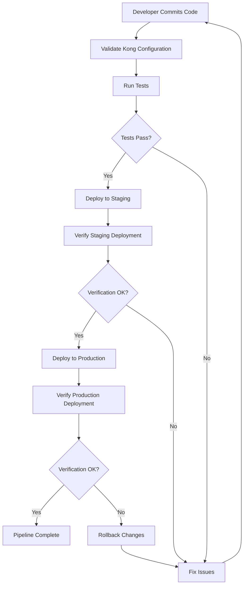

# Kong CI/CD Pipeline

## Introduction

Continuous Integration and Continuous Delivery (CI/CD) is essential for modern application development, and Kong API Gateway deployments are no exception. A well-structured CI/CD pipeline for Kong ensures that your API configurations are consistently tested, validated, and deployed across environments. This guide will walk you through setting up a robust Kong CI/CD pipeline, making your API management more efficient and less error-prone.

## What is a Kong CI/CD Pipeline?

A Kong CI/CD pipeline automates the process of testing, validating, and deploying Kong configurations. It enables developers to:

- Validate Kong configuration files before deployment
- Test API endpoints and plugins
- Deploy Kong configurations across different environments (development, staging, production)
- Roll back changes if issues are detected
- Maintain consistent configuration across your infrastructure

## Prerequisites

Before setting up a Kong CI/CD pipeline, ensure you have:

- A Kong API Gateway instance installed
- Basic understanding of CI/CD concepts
- Access to a CI/CD platform (GitHub Actions, Jenkins, GitLab CI, etc.)
- `decK` CLI tool for Kong configuration management
- Basic understanding of YAML for configuration files

## Setting up Your Kong CI/CD Pipeline

Let's build a comprehensive CI/CD pipeline for Kong using GitHub Actions as our example platform.

### Step 1: Organize Your Kong Configuration

First, structure your Kong configuration using `decK`. Create a `kong.yaml` file that defines your services, routes, and plugins:

```yaml
_format_version: "2.1"
_transform: true

services:
  - name: example-service
    url: http://example.com
    routes:
      - name: example-route
        paths:
          - /example
    plugins:
      - name: rate-limiting
        config:
          minute: 5
          policy: local
```

### Step 2: Create a GitHub Actions Workflow

Create a `.github/workflows/kong-pipeline.yml` file in your repository:

```yaml
name: Kong CI/CD Pipeline

on:
  push:
    branches: [ main ]
  pull_request:
    branches: [ main ]

jobs:
  validate:
    runs-on: ubuntu-latest
    steps:
      - uses: actions/checkout@v3
      
      - name: Install decK
        run: |
          curl -sL https://github.com/Kong/deck/releases/download/v1.16.0/deck_1.16.0_linux_amd64.tar.gz -o deck.tar.gz
          tar -xf deck.tar.gz
          sudo mv deck /usr/local/bin/
      
      - name: Validate Kong configuration
        run: deck validate -s kong.yaml
  
  test:
    needs: validate
    runs-on: ubuntu-latest
    steps:
      - uses: actions/checkout@v3
      
      - name: Set up test environment
        run: |
          docker run -d --name kong-test \
            -e "KONG_DATABASE=off" \
            -e "KONG_DECLARATIVE_CONFIG=/kong.yaml" \
            -v ${PWD}/kong.yaml:/kong.yaml \
            -p 8000:8000 \
            -p 8001:8001 \
            kong:latest
          
      - name: Wait for Kong to start
        run: sleep 10
      
      - name: Test endpoints
        run: |
          curl -i http://localhost:8000/example
          # Add more tests as needed
  
  deploy-staging:
    needs: test
    runs-on: ubuntu-latest
    if: github.ref == 'refs/heads/main'
    steps:
      - uses: actions/checkout@v3
      
      - name: Install decK
        run: |
          curl -sL https://github.com/Kong/deck/releases/download/v1.16.0/deck_1.16.0_linux_amd64.tar.gz -o deck.tar.gz
          tar -xf deck.tar.gz
          sudo mv deck /usr/local/bin/
      
      - name: Deploy to staging
        run: |
          deck sync -s kong.yaml --kong-addr http://staging-kong-admin:8001
        env:
          KONG_ADMIN_TOKEN: ${{ secrets.KONG_STAGING_TOKEN }}
  
  deploy-production:
    needs: deploy-staging
    runs-on: ubuntu-latest
    if: github.ref == 'refs/heads/main'
    environment: production
    steps:
      - uses: actions/checkout@v3
      
      - name: Install decK
        run: |
          curl -sL https://github.com/Kong/deck/releases/download/v1.16.0/deck_1.16.0_linux_amd64.tar.gz -o deck.tar.gz
          tar -xf deck.tar.gz
          sudo mv deck /usr/local/bin/
      
      - name: Deploy to production
        run: |
          deck sync -s kong.yaml --kong-addr http://production-kong-admin:8001
        env:
          KONG_ADMIN_TOKEN: ${{ secrets.KONG_PRODUCTION_TOKEN }}
```

## Pipeline Visualization

Let's visualize our Kong CI/CD pipeline to better understand the workflow:



## Advanced Pipeline Techniques

### Environment-Specific Configurations

Use environment variables or separate configuration files for different environments:

```yaml
_format_version: "2.1"
_transform: true

services:
  - name: example-service
    url: "{{ .Env.SERVICE_URL }}"
    routes:
      - name: example-route
        paths:
          - /example
    plugins:
      - name: rate-limiting
        config:
          minute: "{{ .Env.RATE_LIMIT }}"
          policy: local
```

Then in your CI pipeline:

```yaml
- name: Deploy to staging
  run: |
    export SERVICE_URL="http://staging-service:8000"
    export RATE_LIMIT="10"
    deck sync -s kong.yaml --kong-addr http://staging-kong-admin:8001
```

### Automated Testing with Inso

For more complex API testing, integrate Insomnia's CLI tool `inso` to run API tests:

```yaml
- name: Install Inso CLI
  run: npm install -g @insomnia/inso

- name: Run API tests
  run: inso run test "Kong API Tests"
```

### Implementing Canary Deployments

For safer production deployments, implement canary releases by gradually routing traffic:

```yaml
- name: Canary deployment to production
  run: |
    # First deploy with 10% traffic
    deck sync -s kong-canary.yaml --kong-addr http://production-kong-admin:8001
    
    # Wait and monitor metrics
    sleep 300
    
    # If all good, deploy to 100%
    deck sync -s kong.yaml --kong-addr http://production-kong-admin:8001
```

## Real-World Example: Migrating Kong Configuration

Let's walk through a real-world example of migrating a Kong configuration from development to production.

### 1. Export Current Configuration

First, export your current Kong configuration:

```bash
deck dump --kong-addr http://dev-kong:8001 -o kong-dev.yaml
```

This produces:

```yaml
_format_version: "2.1"
_transform: true

services:
  - name: user-service
    url: http://user-service:3000
    routes:
      - name: user-api
        paths:
          - /users
    plugins:
      - name: jwt
        config:
          secret_is_base64: false
          key_claim_name: kid
```

### 2. Modify for Production

Adapt the configuration for production:

```yaml
_format_version: "2.1"
_transform: true

services:
  - name: user-service
    url: http://user-service-prod:3000
    routes:
      - name: user-api
        paths:
          - /users
    plugins:
      - name: jwt
        config:
          secret_is_base64: false
          key_claim_name: kid
      - name: rate-limiting
        config:
          minute: 100
          policy: redis
          redis_host: redis-prod
```

### 3. Validate and Deploy

Run the validation and deployment through your CI/CD pipeline:

```bash
# Validate
deck validate -s kong-prod.yaml

# Perform a diff to see changes
deck diff --kong-addr http://prod-kong:8001 -s kong-prod.yaml

# Apply changes
deck sync --kong-addr http://prod-kong:8001 -s kong-prod.yaml
```

## Best Practices

1. **Version Control**: Always keep Kong configurations in version control
2. **Environment Separation**: Maintain separate configurations for different environments
3. **Diff Before Deploy**: Use `deck diff` to preview changes before applying them
4. **Automated Testing**: Write tests for your API endpoints and Kong plugins
5. **Gradual Rollout**: Implement canary deployments for high-risk changes
6. **Monitoring**: Integrate monitoring to detect issues after deployment
7. **Rollback Plan**: Always have a way to revert to previous configuration

## Troubleshooting Common Issues

### Configuration Validation Failures

If `deck validate` fails, check for:

- Syntax errors in your YAML
- Missing required fields
- Invalid plugin configurations

Example error and fix:

```
Error: validation failed: schema validation failed: spec.services[0].plugins[0].config.secret_is_base64: expected boolean, got string
```

Fix by ensuring proper types:

```yaml
plugins:
  - name: jwt
    config:
      secret_is_base64: false  # Not "false" as a string
```

### Deployment Failures

If `deck sync` fails, common issues include:

- Connectivity problems to Kong Admin API
- Missing credentials
- Conflicts with existing configuration

Try running with `--verbose` flag to get more details:

```bash
deck sync -s kong.yaml --kong-addr http://kong-admin:8001 --verbose
```

## Summary

A well-implemented Kong CI/CD pipeline dramatically improves the reliability and efficiency of your API gateway management. By automating the testing and deployment of Kong configurations, you reduce human error, ensure consistent configurations across environments, and enable more frequent, safer updates to your API gateway.

In this guide, we've covered the basics of setting up a Kong CI/CD pipeline, advanced techniques for enhancing your workflow, and real-world examples to help you get started. Remember that a good pipeline evolves with your needs—continuously refine your process to address new challenges as they arise.

## Additional Resources

- [Kong's Official Documentation](https://docs.konghq.com/)
- [decK Documentation](https://docs.konghq.com/deck/)
- [GitHub Actions Documentation](https://docs.github.com/en/actions)
- [Kong's Best Practices Guide](https://konghq.com/blog/kong-gateway-deployment-best-practices)

## Exercises

1. Set up a basic Kong CI/CD pipeline using the CI platform of your choice
2. Create a Kong configuration for a simple API and deploy it through your pipeline
3. Implement environment-specific configurations for development, staging, and production
4. Add automated tests for your API endpoints
5. Implement a rollback mechanism in case of deployment failures