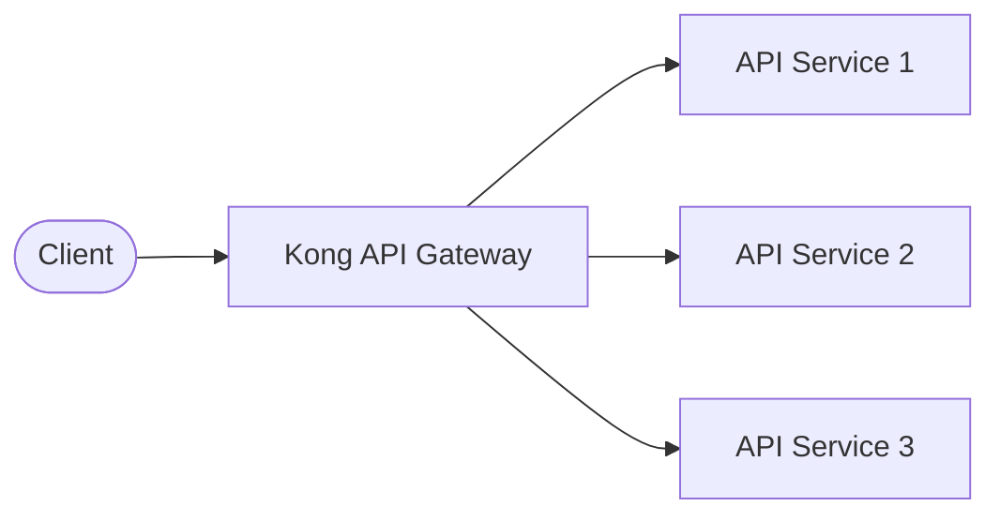
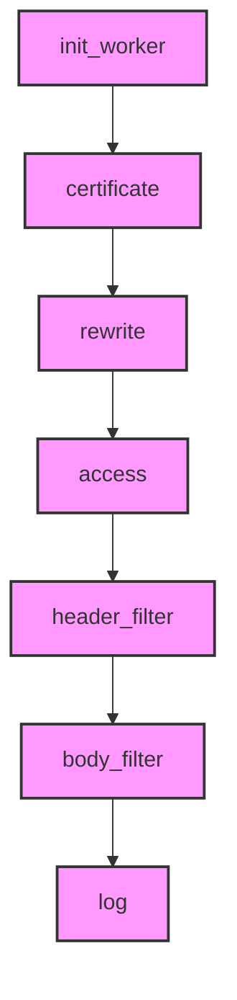

# Kong PDK: Building Custom Plugins for Kong Gateway

## Introduction

The Kong Plugin Development Kit (PDK) is a powerful toolkit that allows developers to create custom plugins for Kong API Gateway. Kong Gateway is one of the most popular API gateways, acting as a middleware that sits between clients and your APIs, managing traffic, authentication, and various other aspects of API consumption.

The PDK provides a set of Lua functions that developers can use to implement custom logic for request and response handling, enabling you to extend Kong's functionality to meet your specific requirements. Whether you need custom authentication, request transformation, logging, or any specialized functionality, the PDK gives you the tools to build it.

## What Is Kong Gateway?

Before diving into the PDK, let's understand what Kong Gateway is:



Kong Gateway serves as a central entry point for all API requests, performing essential functions like:

- **Traffic management** - Rate limiting, request throttling
- **Security** - Authentication, authorization
- **Transformations** - Request/response modifications
- **Monitoring** - Logging, analytics
- **Routing** - Directing requests to appropriate services

## Understanding the Plugin Development Kit

The PDK allows you to tap into Kong's request/response lifecycle and add custom behavior. A Kong plugin is essentially a Lua module that implements one or more of Kong's lifecycle handlers.

### PDK Core Concepts

1. **Plugin Configuration** - Define parameters that users can configure
2. **Phases/Handlers** - Implement logic at different points in the request/response lifecycle
3. **PDK Functions** - Use Kong's built-in utilities to simplify development

## Setting Up Your Development Environment

Before creating plugins, you'll need to set up your environment:

1. Install Kong Gateway (development version is recommended for plugin development)
2. Install Lua and LuaRocks (Lua's package manager)
3. Set up a project structure for your plugin

Basic requirements:

```bash
# Install Kong dependencies
sudo apt-get update
sudo apt-get install -y build-essential libpcre3-dev libyaml-dev

# Install Lua and LuaRocks
sudo apt-get install -y lua5.1 luarocks

# Install development tools
luarocks install luacheck  # For code linting
luarocks install busted    # For testing
```

## Creating Your First Plugin

Let's create a simple "hello-world" plugin that adds a custom header to responses.

### Plugin Structure

```
my-first-plugin/
├── kong/
│   └── plugins/
│       └── hello-world/
│           ├── handler.lua
│           └── schema.lua
└── my-first-plugin-0.1.0-1.rockspec
```

### Schema Definition (schema.lua)

The schema defines the configuration options your plugin accepts:

```lua
return {
  name = "hello-world",
  fields = {
    {
      config = {
        type = "record",
        fields = {
          {
            message = {
              type = "string",
              default = "Hello, World!",
              required = true,
            },
          },
        },
      },
    },
  },
}
```

### Handler Implementation (handler.lua)

The handler contains your plugin logic:

```lua
local kong = kong

-- Define the plugin
local HelloWorldHandler = {
  PRIORITY = 1000,
  VERSION = "0.1.0",
}

-- Execute the following when a response is being sent to the client
function HelloWorldHandler:header_filter(config)
  -- Add a custom header
  kong.response.set_header("X-Hello-World", config.message)
end

-- Return the handler
return HelloWorldHandler
```

### Package Specification (.rockspec file)

This file describes your plugin package:

```lua
package = "my-first-plugin"
version = "0.1.0-1"
source = {
  url = "*** please add URL ***",
}
description = {
  summary = "A hello world plugin for Kong",
  detailed = [[
    This plugin adds a hello world header to responses
    passing through Kong Gateway.
  ]],
  homepage = "*** please add homepage ***",
  license = "MIT"
}
dependencies = {
  "lua >= 5.1"
}
build = {
  type = "builtin",
  modules = {
    ["kong.plugins.hello-world.handler"] = "kong/plugins/hello-world/handler.lua",
    ["kong.plugins.hello-world.schema"] = "kong/plugins/hello-world/schema.lua",
  }
}
```

## The Plugin Lifecycle

Kong processes requests and responses through several phases. Your plugin can hook into these phases:



Each phase serves a specific purpose:

1. **init_worker** - Runs when the worker process starts
2. **certificate** - Handles SSL/TLS certificate operations
3. **rewrite** - Allows URI rewriting before matching a route
4. **access** - Authenticates or authorizes the request
5. **header_filter** - Processes response headers
6. **body_filter** - Processes response body
7. **log** - Logs information after the response has been sent

## Core PDK Functions

The PDK provides many utility functions organized in modules:

### Request Module

```lua
-- Get request information
local host = kong.request.get_host()
local method = kong.request.get_method()
local path = kong.request.get_path()
local headers = kong.request.get_headers()
local query_params = kong.request.get_query()
local body_data = kong.request.get_body()
```

### Response Module

```lua
-- Manipulate responses
kong.response.set_header("X-Custom-Header", "value")
kong.response.set_status(201)
kong.response.exit(200, { message = "Success" }, { ["Content-Type"] = "application/json" })
```

### Service Module

```lua
-- Control service request
kong.service.request.set_header("X-Upstream-Header", "value")
kong.service.request.set_path("/new-path")
```

### Client Module

```lua
-- Client information
local ip = kong.client.get_ip()
local consumer = kong.client.get_consumer()
```

## Real-World Example: Rate Limiting Plugin

Let's create a simple rate-limiting plugin that limits requests based on client IP addresses:

```lua
local RateLimiterHandler = {
  PRIORITY = 900,
  VERSION = "0.1.0",
}

-- Store request counts using Kong's shared dictionary
local cache = kong.cache

function RateLimiterHandler:access(config)
  -- Get client IP
  local client_ip = kong.client.get_ip()
  
  -- Create a unique key for this client
  local rate_limit_key = "rate_limit:" .. client_ip
  
  -- Get current request count
  local current_count, err = cache:get(rate_limit_key, nil, function() return 0 end)
  if err then
    kong.log.err("Failed to get rate limit counter: ", err)
    return
  end
  
  -- Increment the counter
  current_count = current_count + 1
  
  -- Check if limit exceeded
  if current_count > config.limit then
    return kong.response.exit(429, { message = "Rate limit exceeded" })
  end
  
  -- Store the updated counter with TTL
  local ok, err = cache:set(rate_limit_key, current_count, config.window_size)
  if not ok then
    kong.log.err("Failed to set rate limit counter: ", err)
  end
end

return RateLimiterHandler
```

And the corresponding schema:

```lua
return {
  name = "simple-rate-limiter",
  fields = {
    {
      config = {
        type = "record",
        fields = {
          {
            limit = {
              type = "number",
              default = 100,
              required = true,
            },
          },
          {
            window_size = {
              type = "number",
              default = 60,
              required = true,
            },
          },
        },
      },
    },
  },
}
```

## Testing Your Plugin

Kong provides tools for testing plugins. Here's a basic example using the `busted` framework:

```lua
-- spec/hello-world/01-integration_spec.lua
local helpers = require "spec.helpers"

describe("Plugin: hello-world", function()
  local proxy_client

  setup(function()
    local bp = helpers.get_db_utils()

    -- Configure Kong with our plugin
    local service = bp.services:insert {
      name = "test-service",
      url = helpers.mock_upstream_url,
    }

    bp.routes:insert {
      name = "test-route",
      service = { id = service.id },
      hosts = { "test.com" },
    }

    bp.plugins:insert {
      name = "hello-world",
      service = { id = service.id },
      config = {
        message = "Hello, Test!",
      },
    }

    -- Start Kong
    assert(helpers.start_kong({
      plugins = "hello-world",
      custom_plugins = "hello-world"
    }))
  end)

  teardown(function()
    helpers.stop_kong()
  end)

  before_each(function()
    proxy_client = helpers.proxy_client()
  end)

  after_each(function()
    if proxy_client then
      proxy_client:close()
    end
  end)

  it("adds the configured header", function()
    local res = assert(proxy_client:send {
      method = "GET",
      path = "/",
      headers = {
        ["Host"] = "test.com"
      }
    })

    assert.res_status(200, res)
    assert.equal("Hello, Test!", res.headers["X-Hello-World"])
  end)
end)
```

Run the test with:

```bash
# In the Kong directory
bin/busted spec/hello-world/01-integration_spec.lua
```

## Deploying Your Plugin

### Local Installation

```bash
# Build and install the plugin locally
luarocks make

# Add to Kong configuration (kong.conf)
plugins = bundled,hello-world
```

### Packaging as a Rock

```bash
# Create a distributable package
luarocks pack my-first-plugin 0.1.0-1
# Produces: my-first-plugin-0.1.0-1.all.rock

# Install on target systems
luarocks install my-first-plugin-0.1.0-1.all.rock
```

## Debugging Plugins

Kong provides several tools for debugging plugins:

```lua
-- Log debug information
kong.log.debug("Processing request with payload: ", kong.request.get_body())

-- Log at different levels
kong.log.info("Information message")
kong.log.warn("Warning message")
kong.log.err("Error message")
```

Enable debug logs in Kong's configuration:

```
log_level = debug  # In kong.conf
```

## Best Practices

1. **Performance**: Keep your plugins lightweight, especially in high-traffic phases
2. **Error Handling**: Always handle errors gracefully
3. **Testing**: Write comprehensive tests for your plugins
4. **Caching**: Use Kong's caching mechanisms for persistent data
5. **Configuration**: Provide sensible defaults in your schema
6. **Documentation**: Document your plugin thoroughly for users

## Advanced PDK Features

### Database Access

Kong provides functions to interact with its database:

```lua
local dao = kong.db.consumers
local consumer, err = dao:select({ id = consumer_id })
```

### Shared State

Use shared dictionaries for plugin state:

```lua
local kong_dict = ngx.shared.kong

-- Store data
kong_dict:set("my_key", "my_value", exptime)

-- Retrieve data
local value = kong_dict:get("my_key")
```

### Kong Cache

For more complex caching needs:

```lua
local value, err = kong.cache:get("key", { ttl = 60 }, function()
  -- Expensive operation to generate the value
  return computed_value
end)
```

## Summary

The Kong PDK provides a powerful framework for extending Kong Gateway with custom functionalities. By creating plugins, you can add any behavior you need to your API gateway, from security features to transformations and beyond.

In this guide, we've covered:
- What the Kong PDK is and why it's useful
- Setting up a development environment
- Creating basic and advanced plugins
- Testing and deploying plugins
- Best practices for plugin development

## Additional Resources

For further learning:

- Kong Plugin Development Documentation (official docs)
- Kong Plugin Development examples repository
- Lua programming tutorials
- Kong community forums

## Exercises

1. Create a simple plugin that logs request information to a file
2. Modify the hello-world plugin to add multiple custom headers
3. Build a plugin that transforms request or response JSON data
4. Create a plugin that authenticates requests using a custom token format
5. Implement a caching plugin that stores and serves responses for specific endpoints

With the Kong PDK, you now have the tools to customize and extend Kong Gateway to meet your specific API management needs. Happy coding!