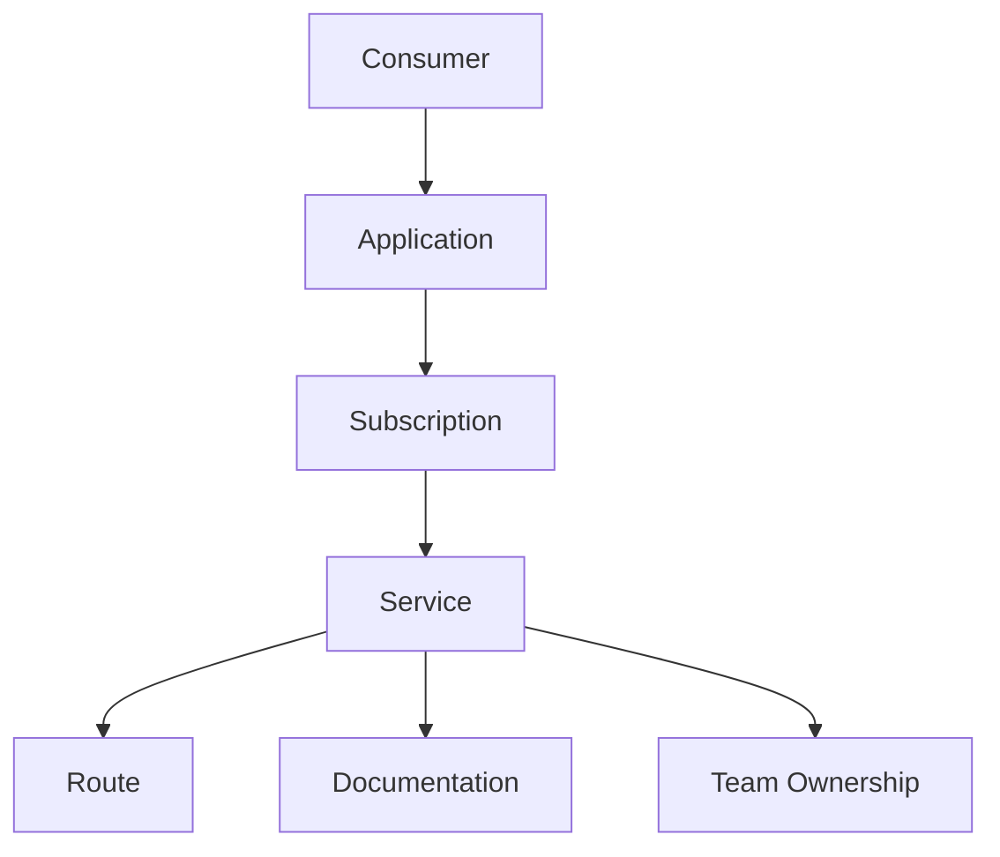

# Kong Custom Entities

## Introduction

Kong Gateway is a popular open-source API gateway that helps you manage, secure, and optimize your APIs. While Kong provides many built-in entities like Services, Routes, and Plugins, there are situations where you might need to create your own custom entities to model specific business requirements or extend Kong's functionality.

In this guide, we'll explore Kong Custom Entities - what they are, why you might need them, and how to implement them in your Kong Gateway. By the end, you'll understand how to design, create, and use custom entities to tailor Kong to your specific needs.

## What are Kong Custom Entities?

Custom entities in Kong allow you to define your own data structures and API endpoints within the Kong Admin API. These entities can represent business concepts specific to your organization or application domain that aren't covered by Kong's built-in entities.

Think of custom entities as extending Kong's database schema and API surface to include your own concepts, allowing you to:

1. Store application-specific data alongside Kong's configuration
2. Create relationships between your data and Kong's built-in entities
3. Apply Kong's authorization, validation, and error handling to your custom resources
4. Leverage Kong's clustering capabilities to distribute your custom data

## Why Use Custom Entities?

Here are some common scenarios where custom entities are useful:

- **API Documentation Management**: Store and manage documentation alongside the API configuration
- **Team Ownership**: Track which teams own which services and routes
- **Business-Specific Metadata**: Attach domain-specific attributes to APIs
- **Application Registration**: Create a registry of applications that consume your APIs
- **Custom Rate Limiting**: Implement specialized rate limiting based on your business rules

## Creating Custom Entities in Kong

Creating a custom entity in Kong typically involves the following steps:

1. Define your entity's schema (its fields and validation rules)
2. Create the database migrations to store your entity
3. Implement the API endpoints to interact with your entity
4. Package everything as a Kong plugin

Let's walk through each step with a practical example.

### Example: Creating a "Documentation" Custom Entity

Let's create a custom entity that allows us to attach documentation to Kong Services. This entity will store documentation content and metadata for each Service.

#### Step 1: Define the Schema

First, we need to define the schema for our custom entity. The schema specifies the fields, their types, and validation rules.

```lua
-- schema.lua
local typedefs = require "kong.db.schema.typedefs"

return {
  name = "documentation",
  primary_key = { "id" },
  cache_key = { "service_id" },
  fields = {
    { id = typedefs.uuid },
    { service_id = { type = "foreign", reference = "services", required = true } },
    { created_at = typedefs.auto_timestamp_s },
    { updated_at = typedefs.auto_timestamp_s },
    { title = { type = "string", required = true } },
    { content = { type = "string", required = true } },
    { format = { type = "string", default = "markdown", one_of = { "markdown", "html", "asciidoc" } } },
    { version = { type = "string", default = "1.0.0" } },
  },
}
```

#### Step 2: Create Database Migrations

Next, we need to create migrations to set up the necessary database tables:

```lua
-- migrations/000_base_documentation.lua
return {
  postgres = {
    up = [[
      CREATE TABLE IF NOT EXISTS "documentation" (
        "id" UUID PRIMARY KEY,
        "service_id" UUID REFERENCES "services" ("id") ON DELETE CASCADE,
        "created_at" TIMESTAMP WITH TIME ZONE,
        "updated_at" TIMESTAMP WITH TIME ZONE,
        "title" TEXT NOT NULL,
        "content" TEXT NOT NULL,
        "format" TEXT,
        "version" TEXT
      );
      
      CREATE INDEX IF NOT EXISTS "documentation_service_id_idx" ON "documentation" ("service_id");
    ]],
  },
  
  cassandra = {
    up = [[
      CREATE TABLE IF NOT EXISTS documentation (
        id uuid PRIMARY KEY,
        service_id uuid,
        created_at timestamp,
        updated_at timestamp,
        title text,
        content text,
        format text,
        version text
      );
      
      CREATE INDEX IF NOT EXISTS ON documentation(service_id);
    ]],
  },
}
```

#### Step 3: Implement the DAOs and API Endpoints

Now, we need to implement the data access objects (DAOs) and the API endpoints for our custom entity:

```lua
-- api.lua
local endpoints = require "kong.api.endpoints"

return {
  ["/documentation"] = {
    GET = endpoints.get_collection_endpoint(kong.db.documentation),
    POST = endpoints.post_collection_endpoint(kong.db.documentation),
  },
  
  ["/documentation/:documentation_id"] = {
    GET = endpoints.get_entity_endpoint(kong.db.documentation),
    PATCH = endpoints.patch_entity_endpoint(kong.db.documentation),
    DELETE = endpoints.delete_entity_endpoint(kong.db.documentation),
  },
  
  ["/services/:service_id/documentation"] = {
    GET = endpoints.get_collection_endpoint(
      kong.db.documentation,
      nil,
      function(request)
        return { service_id = request.params.service_id }
      end
    ),
    POST = endpoints.post_collection_endpoint(
      kong.db.documentation,
      nil,
      function(request)
        return { service_id = request.params.service_id }
      end
    ),
  },
}
```

#### Step 4: Package It as a Kong Plugin

Finally, we'll package everything as a Kong plugin:

```lua
-- handler.lua
local DocPlugin = {
  PRIORITY = 1000,
  VERSION = "1.0.0",
}

function DocPlugin:init_worker()
  -- No runtime code needed for this plugin
  -- It just provides the custom entity
end

return DocPlugin
```

```lua
-- init.lua
return {
  database_migrations = require "kong.plugins.documentation.migrations",
  daos = {
    "kong.plugins.documentation.schema",
  },
  api = require "kong.plugins.documentation.api",
  handler = require "kong.plugins.documentation.handler",
}
```

## Using Custom Entities

Once you've implemented and loaded your custom entity plugin, you can interact with it through the Kong Admin API:

### Creating a Documentation Entry

```bash
# Create a new documentation entry for a service
curl -X POST http://localhost:8001/documentation \
  -H "Content-Type: application/json" \
  -d '{
    "service_id": "5fd73c6a-1402-4e55-9dc6-b9b852c1d329",
    "title": "User API Documentation",
    "content": "# User API\n\nThis API allows you to manage users...",
    "format": "markdown",
    "version": "1.0.0"
  }'
```

#### Response:

```json
{
  "id": "a4407883-c166-43fd-80ca-3ca035b0cdb7",
  "service_id": "5fd73c6a-1402-4e55-9dc6-b9b852c1d329",
  "title": "User API Documentation",
  "content": "# User API\n\nThis API allows you to manage users...",
  "format": "markdown",
  "version": "1.0.0",
  "created_at": 1646956800,
  "updated_at": 1646956800
}
```

### Retrieving Documentation

```bash
# Get all documentation entries
curl -X GET http://localhost:8001/documentation

# Get documentation for a specific service
curl -X GET http://localhost:8001/services/5fd73c6a-1402-4e55-9dc6-b9b852c1d329/documentation

# Get a specific documentation entry
curl -X GET http://localhost:8001/documentation/a4407883-c166-43fd-80ca-3ca035b0cdb7
```

### Updating Documentation

```bash
# Update a documentation entry
curl -X PATCH http://localhost:8001/documentation/a4407883-c166-43fd-80ca-3ca035b0cdb7 \
  -H "Content-Type: application/json" \
  -d '{
    "content": "# Updated User API\n\nThis API allows you to manage users and profiles...",
    "version": "1.1.0"
  }'
```

### Deleting Documentation

```bash
# Delete a documentation entry
curl -X DELETE http://localhost:8001/documentation/a4407883-c166-43fd-80ca-3ca035b0cdb7
```

## Real-World Applications

Let's look at some real-world applications of custom entities in Kong:

### Application Registry

Create a custom entity to track client applications that consume your APIs:

```lua
-- schema for an application registry
return {
  name = "applications",
  primary_key = { "id" },
  fields = {
    { id = typedefs.uuid },
    { name = { type = "string", required = true } },
    { owner_email = { type = "string", required = true, format = "email" } },
    { status = { type = "string", default = "pending", one_of = { "pending", "approved", "rejected" } } },
    { created_at = typedefs.auto_timestamp_s },
    { updated_at = typedefs.auto_timestamp_s },
  },
}
```

This entity could be used in conjunction with Kong's authentication plugins to manage API access by applications.

### Team Ownership

Create a custom entity to track which teams own which services:

```lua
-- schema for team ownership
return {
  name = "team_ownership",
  primary_key = { "id" },
  fields = {
    { id = typedefs.uuid },
    { service_id = { type = "foreign", reference = "services", required = true } },
    { team_name = { type = "string", required = true } },
    { team_email = { type = "string", required = true, format = "email" } },
    { slack_channel = { type = "string" } },
    { pager_duty_id = { type = "string" } },
    { created_at = typedefs.auto_timestamp_s },
    { updated_at = typedefs.auto_timestamp_s },
  },
}
```

This would allow you to quickly look up who is responsible for a service when issues arise.

## Advanced Custom Entity Patterns

As you become more comfortable with custom entities, you can implement more advanced patterns:

### Entity Relationships

You can create relationships between your custom entities and Kong's built-in entities or between multiple custom entities.



### Custom Entity Logic

You can add custom business logic to your entities by overriding the standard CRUD methods in your DAOs.

```lua
function DocumentationDAO:insert(entity)
  -- Add custom validation or pre-processing
  if entity.format == "markdown" and not entity.content:match("^#") then
    return nil, "Markdown content must start with a heading"
  end
  
  -- Call the parent method
  return self.super.insert(self, entity)
end
```

### Webhooks for Entity Events

You can implement webhooks to notify external systems when your custom entities change:

```lua
function DocumentationDAO:update(primary_key, entity)
  local old_entity, err = self:select(primary_key)
  if err then
    return nil, err
  end
  
  local updated, err = self.super.update(self, primary_key, entity)
  if updated and not err then
    -- Notify external systems
    local event = {
      action = "update",
      entity_type = "documentation",
      old_entity = old_entity,
      new_entity = updated,
    }
    kong.worker_events.post("custom_entities", "changed", event)
  end
  
  return updated, err
end
```

## Best Practices for Custom Entities

When creating custom entities, keep these best practices in mind:

1. **Keep It Simple**: Start with the minimum fields needed and expand as required
2. **Think About Relationships**: Consider how your entity relates to Kong's built-in entities
3. **Plan for Scale**: Design your entity to work well with Kong's clustering and caching
4. **Version Your Migrations**: Use proper versioning for database migrations
5. **Handle Errors Gracefully**: Provide clear error messages and validation feedback
6. **Document Your Entity**: Create clear documentation on how to use your custom entity
7. **Test Thoroughly**: Test your entity with different database backends (PostgreSQL, Cassandra)

## Summary

Kong Custom Entities provide a powerful way to extend Kong Gateway with your own business concepts. By creating custom entities, you can:

- Store domain-specific data alongside your API configuration
- Create relationships between your data and Kong's entities
- Apply Kong's validation, authorization, and error handling to your resources
- Distribute your custom data across Kong clusters

In this guide, we've covered:
- What custom entities are and why you might need them
- How to define schemas and create database migrations
- How to implement API endpoints for your entities
- Real-world examples and use cases
- Advanced patterns and best practices

Custom entities allow you to tailor Kong to your specific business needs, making it not just an API gateway but a central hub for your API management ecosystem.

## Further Learning

To continue your journey with Kong Custom Entities, consider these next steps:

1. Explore Kong's source code to understand how built-in entities are implemented
2. Learn more about Kong's database abstractions and DAOs
3. Study the PDK (Plugin Development Kit) to create more advanced plugins
4. Experiment with creating entities that integrate with external systems
5. Join the Kong community to share your custom entities and learn from others

## Exercises

1. Create a simple "API Metadata" custom entity that allows you to attach arbitrary metadata to Kong Services.
2. Implement a "Service Deprecation" entity that tracks which APIs are deprecated and when they will be removed.
3. Build a "Feature Flag" entity that can be used to enable or disable features across your APIs.
4. Create a "Change Log" entity that records changes made to your API configuration.
5. Design an "SLA" entity that specifies performance metrics for different services and consumer tiers.