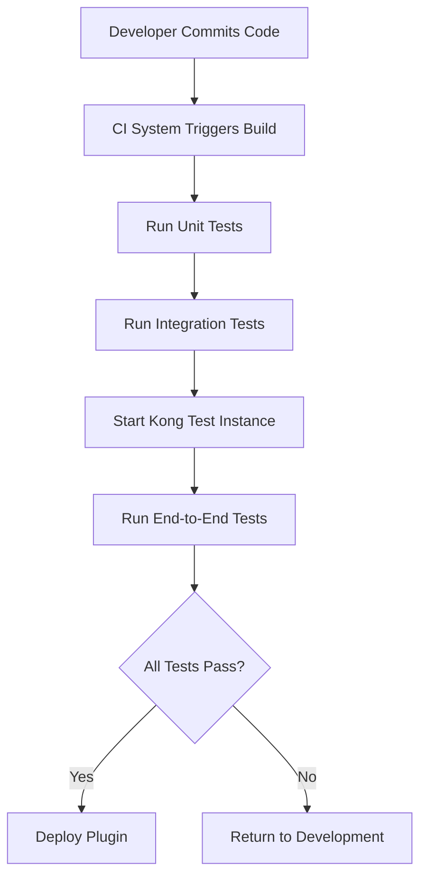

# Kong Plugins Testing

## Introduction

Testing is a critical part of the development lifecycle for Kong plugins. Well-tested plugins ensure reliability, security, and performance when deployed to production environments. This guide will walk you through the various testing strategies and tools available for Kong plugin development, from simple unit tests to comprehensive end-to-end tests.

Kong plugins extend the functionality of the Kong API Gateway and can be written in Lua. Proper testing helps catch bugs early, validates that your plugin behaves as expected, and ensures compatibility with future Kong versions.

## Testing Fundamentals for Kong Plugins

Testing Kong plugins generally falls into three categories:

1. **Unit Testing**: Testing individual functions in isolation
2. **Integration Testing**: Testing the plugin interacting with Kong's internal APIs
3. **End-to-End Testing**: Testing the plugin in a live Kong environment with real requests

Let's explore each approach in detail.

## Unit Testing with Busted

[Busted](https://olivinelabs.com/busted/) is a popular testing framework for Lua that works well for testing Kong plugins.

### Setting Up Your Testing Environment

First, you'll need to install the necessary tools:

```bash
# Install LuaRocks (Lua package manager)
sudo apt-get install luarocks

# Install Busted testing framework
luarocks install busted

# Install lua-cjson for JSON handling in tests
luarocks install lua-cjson
```

### Creating Your First Unit Test

Let's create a simple test for a hypothetical rate-limiting plugin:

```lua
-- spec/plugins/rate-limiting/unit_spec.lua

local rate_limiter = require "kong.plugins.rate-limiting.handler"

describe("Rate Limiting", function()
  
  local handler
  
  setup(function()
    handler = rate_limiter.new()
  end)
  
  describe("calculate_remaining()", function()
    it("returns correct remaining count", function()
      local limit = 10
      local current = 3
      local remaining = handler.calculate_remaining(limit, current)
      
      assert.equal(7, remaining)
    end)
    
    it("returns 0 when limit exceeded", function()
      local limit = 5
      local current = 7
      local remaining = handler.calculate_remaining(limit, current)
      
      assert.equal(0, remaining)
    end)
  end)
  
end)
```

### Running Unit Tests

Run your tests with the busted command:

```bash
# From your plugin's directory
busted spec/plugins/rate-limiting/unit_spec.lua
```

The output should show passing tests:

```
●●
2 successes / 0 failures / 0 errors / 0 pending : 0.001 seconds
```

## Integration Testing

Integration tests verify that your plugin interacts correctly with Kong's internal APIs and database.

### Mock the Kong PDK

Kong provides a Plugin Development Kit (PDK) that your plugins interact with. For integration tests, we can mock this interface:

```lua
-- spec/plugins/rate-limiting/integration_spec.lua

local helpers = require "spec.helpers"
local mock_kong = require "spec.mock_kong"

describe("Rate Limiting Integration", function()
  
  local handler, kong
  
  setup(function()
    -- Mock Kong PDK
    kong = mock_kong.new()
    
    -- Load handler with mocked Kong
    package.loaded["kong"] = kong
    handler = require("kong.plugins.rate-limiting.handler").new()
  end)
  
  teardown(function()
    -- Reset loaded modules
    package.loaded["kong"] = nil
    package.loaded["kong.plugins.rate-limiting.handler"] = nil
  end)
  
  describe("access()", function()
    it("allows requests under the limit", function()
      -- Setup mock responses
      kong.db.rate_limiting_metrics = {
        select = function() return { count = 5 } end,
        upsert = function() end
      }
      
      -- Set plugin config
      local conf = { limit = 10, window_size = 60 }
      
      -- Call the handler
      handler:access(conf)
      
      -- Verify Kong response wasn't terminated
      assert.is_nil(kong.response.exit_called)
      -- Verify headers were set
      assert.equal("5", kong.response.get_header("X-RateLimit-Remaining"))
    end)
    
    it("blocks requests over the limit", function()
      -- Setup mock to return count over limit
      kong.db.rate_limiting_metrics = {
        select = function() return { count = 12 } end,
        upsert = function() end
      }
      
      local conf = { limit = 10, window_size = 60 }
      
      -- Call the handler
      handler:access(conf)
      
      -- Verify Kong response was terminated with 429
      assert.equal(429, kong.response.exit_called)
    end)
  end)
  
end)
```

In this example, we're mocking Kong's database interface to simulate different rate-limiting scenarios.

## End-to-End Testing

End-to-end tests run against a real Kong instance with your plugin installed.

### Setting Up Kong for Testing

Kong provides a testing utility to spin up a test instance:

```lua
-- spec/plugins/rate-limiting/e2e_spec.lua

local helpers = require "spec.helpers"
local cjson = require "cjson"

describe("Rate Limiting E2E", function()
  
  local proxy_client
  
  setup(function()
    -- Start Kong with your plugin
    local bp = helpers.get_db_utils()
    
    -- Create a test route
    local route = bp.routes:insert({
      hosts = { "test.com" },
    })
    
    -- Add plugin to the route
    bp.plugins:insert {
      name = "rate-limiting",
      route = { id = route.id },
      config = {
        limit = 3,
        window_size = 60
      }
    }
    
    -- Start Kong
    assert(helpers.start_kong({
      plugins = "bundled,rate-limiting",
      custom_plugins = "rate-limiting"
    }))
    
    proxy_client = helpers.proxy_client()
  end)
  
  teardown(function()
    if proxy_client then proxy_client:close() end
    helpers.stop_kong()
  end)
  
  it("limits requests as configured", function()
    -- Make 3 requests that should succeed
    for i = 1, 3 do
      local res = proxy_client:get("/", {
        headers = { host = "test.com" }
      })
      assert.res_status(200, res)
      
      -- Check rate limit headers
      local remaining = assert.response(res).has.header("X-RateLimit-Remaining")
      local limit = assert.response(res).has.header("X-RateLimit-Limit")
      
      assert.equal("3", limit)
      assert.equal(tostring(3-i), remaining)
    end
    
    -- Fourth request should be blocked
    local res = proxy_client:get("/", {
      headers = { host = "test.com" }
    })
    assert.res_status(429, res)
    
    -- Verify response body contains error message
    local body = assert.response(res).has.jsonbody()
    assert.equal("API rate limit exceeded", body.message)
  end)
  
end)
```

### Running End-to-End Tests

```bash
# From your Kong installation directory
bin/busted spec/plugins/rate-limiting/e2e_spec.lua
```

## Testing Advanced Scenarios

### Testing Authentication Plugins

Testing authentication plugins requires simulating valid and invalid credentials:

```lua
-- Example test for an API key authentication plugin
it("authenticates with valid key", function()
  -- Setup test user with API key
  local consumer = bp.consumers:insert({ username = "test-user" })
  bp.keyauth_credentials:insert({
    key = "test-key",
    consumer = { id = consumer.id }
  })
  
  -- Request with valid key
  local res = proxy_client:get("/", {
    headers = { 
      host = "test.com",
      apikey = "test-key"
    }
  })
  
  assert.res_status(200, res)
  -- Verify consumer was identified
  local header_consumer = assert.response(res).has.header("X-Consumer-ID")
  assert.equal(consumer.id, header_consumer)
end)

it("rejects invalid key", function()
  local res = proxy_client:get("/", {
    headers = { 
      host = "test.com",
      apikey = "invalid-key"
    }
  })
  
  assert.res_status(401, res)
end)
```

### Testing Request/Response Transformation

For plugins that modify requests or responses:

```lua
it("transforms the response body", function()
  -- Setup test plugin that adds a field to JSON responses
  bp.plugins:insert {
    name = "response-transformer",
    route = { id = route.id },
    config = {
      add = {
        json = {"added:true"}
      }
    }
  }
  
  local res = proxy_client:get("/json-endpoint", {
    headers = { host = "test.com" }
  })
  
  assert.res_status(200, res)
  local body = assert.response(res).has.jsonbody()
  assert.equal(true, body.added)
end)
```

## Testing Plugin Configuration

It's important to test how your plugin handles different configurations:

```lua
-- Test various configurations
for _, config in ipairs({
  { limit = 5, window_size = 30 },
  { limit = 10, window_size = 60 },
  { limit = 100, window_size = 3600 }
}) do
  it("respects limit=" .. config.limit .. " window=" .. config.window_size, function()
    -- Update plugin config
    bp.plugins:update({
      id = plugin.id,
      config = config
    })
    
    -- Test the new configuration
    -- ...
  end)
end
```

## Testing Workflow with Continuous Integration

Here's a typical workflow for testing Kong plugins in a CI environment:



## Test Coverage

To ensure comprehensive testing, aim to cover:

1. **Happy Path**: Normal operation scenarios
2. **Edge Cases**: Unusual but valid inputs
3. **Error Handling**: How your plugin responds to errors
4. **Performance**: How your plugin behaves under load
5. **Security**: Testing for potential vulnerabilities

## Debugging Tests

When tests fail, you can enable debug output to get more information:

```bash
# Enable verbose output
KONG_LOG_LEVEL=debug bin/busted spec/plugins/rate-limiting/e2e_spec.lua
```

You can also use the `print()` function in your tests to output values for debugging:

```lua
it("debug test", function()
  local res = proxy_client:get("/")
  local body = cjson.decode(res:read_body())
  print("Response body: " .. cjson.encode(body))
  assert.res_status(200, res)
end)
```

## Best Practices for Testing Kong Plugins

1. **Start with Unit Tests**: Begin with simple unit tests for your core functionality.
2. **Mock External Dependencies**: Use mocks for Kong PDK, databases, and external services.
3. **Test Configuration Validation**: Ensure your plugin validates configuration correctly.
4. **Test for Backward Compatibility**: Make sure your tests pass on multiple Kong versions.
5. **Use Descriptive Test Names**: Write clear test descriptions that document what's being tested.
6. **Include Performance Tests**: Test how your plugin behaves under high load.
7. **Automate Testing**: Set up CI/CD pipelines to run tests automatically.

## Example: Testing a Header Validation Plugin

Let's walk through a complete example of testing a plugin that validates request headers:

### 1. Plugin Implementation

```lua
-- kong/plugins/header-validator/handler.lua
local HeaderValidator = {
  PRIORITY = 1000,
  VERSION = "1.0.0"
}

function HeaderValidator:access(conf)
  local headers = kong.request.get_headers()
  
  -- Check for required headers
  for _, header_name in ipairs(conf.required_headers) do
    if not headers[header_name] then
      return kong.response.exit(400, { 
        message = "Missing required header: " .. header_name 
      })
    end
  end
  
  -- Validate header format if specified
  if conf.validate_content_type and headers["content-type"] then
    if not string.match(headers["content-type"], "^application/json") then
      return kong.response.exit(415, { 
        message = "Content-Type must be application/json" 
      })
    end
  end
end

return HeaderValidator
```

### 2. Plugin Schema

```lua
-- kong/plugins/header-validator/schema.lua
return {
  name = "header-validator",
  fields = {
    { config = {
        type = "record",
        fields = {
          { required_headers = {
              type = "array",
              elements = { type = "string" },
              default = {}
          }},
          { validate_content_type = {
              type = "boolean",
              default = false
          }}
        }
    }}
  }
}
```

### 3. Unit Tests

```lua
-- spec/plugins/header-validator/unit_spec.lua
local handler = require "kong.plugins.header-validator.handler"

describe("Header Validator: unit", function()
  
  local plugin_handler
  
  setup(function()
    plugin_handler = handler.new()
  end)
  
  it("initializes correctly", function()
    assert.equal("header-validator", handler.NAME)
    assert.equal("1.0.0", handler.VERSION)
  end)
  
end)
```

### 4. Integration Tests

```lua
-- spec/plugins/header-validator/integration_spec.lua
local handler = require "kong.plugins.header-validator.handler"

describe("Header Validator: integration", function()
  
  local plugin_handler, kong
  
  setup(function()
    -- Mock Kong PDK
    kong = {
      request = {
        get_headers = function() end
      },
      response = {
        exit = function() end
      }
    }
    
    -- Inject the mock into the global environment
    _G.kong = kong
    plugin_handler = handler.new()
  end)
  
  teardown(function()
    _G.kong = nil
  end)
  
  describe("access()", function()
    
    it("allows requests with required headers", function()
      -- Configure what get_headers returns
      kong.request.get_headers = function()
        return { ["x-api-key"] = "test-key" }
      end
      
      -- Spy on the exit function
      local exit_spy = spy.on(kong.response, "exit")
      
      -- Call the handler
      plugin_handler:access({ required_headers = {"x-api-key"} })
      
      -- Verify exit wasn't called
      assert.spy(exit_spy).was_not_called()
    end)
    
    it("blocks requests missing required headers", function()
      -- Return empty headers
      kong.request.get_headers = function()
        return {}
      end
      
      -- Spy on the exit function
      local exit_spy = spy.on(kong.response, "exit")
      
      -- Call the handler
      plugin_handler:access({ required_headers = {"x-api-key"} })
      
      -- Verify exit was called with 400
      assert.spy(exit_spy).was_called_with(400, { 
        message = "Missing required header: x-api-key" 
      })
    end)
    
    it("validates content-type when configured", function()
      -- Return invalid content-type
      kong.request.get_headers = function()
        return { ["content-type"] = "text/plain" }
      end
      
      local exit_spy = spy.on(kong.response, "exit")
      
      -- Call with content-type validation enabled
      plugin_handler:access({ 
        required_headers = {}, 
        validate_content_type = true 
      })
      
      -- Verify exit was called with 415
      assert.spy(exit_spy).was_called_with(415, { 
        message = "Content-Type must be application/json" 
      })
    end)
    
  end)
  
end)
```

### 5. End-to-End Tests

```lua
-- spec/plugins/header-validator/e2e_spec.lua
local helpers = require "spec.helpers"
local cjson = require "cjson"

describe("Header Validator: e2e", function()
  
  local proxy_client
  local bp
  
  setup(function()
    -- Get the database utilities
    bp = helpers.get_db_utils()
    
    -- Create a test route
    local route = bp.routes:insert({
      hosts = { "test.com" },
    })
    
    -- Add plugin to the route
    bp.plugins:insert {
      name = "header-validator",
      route = { id = route.id },
      config = {
        required_headers = {"x-api-key"},
        validate_content_type = true
      }
    }
    
    -- Start Kong
    assert(helpers.start_kong({
      plugins = "bundled,header-validator",
      custom_plugins = "header-validator"
    }))
    
    proxy_client = helpers.proxy_client()
  end)
  
  teardown(function()
    if proxy_client then proxy_client:close() end
    helpers.stop_kong()
  end)
  
  it("allows requests with valid headers", function()
    local res = proxy_client:get("/", {
      headers = { 
        host = "test.com", 
        ["x-api-key"] = "valid-key",
        ["content-type"] = "application/json"
      }
    })
    
    assert.res_status(200, res)
  end)
  
  it("blocks requests without required headers", function()
    local res = proxy_client:get("/", {
      headers = { 
        host = "test.com"
        -- Missing x-api-key
      }
    })
    
    assert.res_status(400, res)
    local body = assert.response(res).has.jsonbody()
    assert.equal("Missing required header: x-api-key", body.message)
  end)
  
  it("blocks requests with invalid content-type", function()
    local res = proxy_client:get("/", {
      headers = { 
        host = "test.com",
        ["x-api-key"] = "valid-key",
        ["content-type"] = "text/plain"
      }
    })
    
    assert.res_status(415, res)
    local body = assert.response(res).has.jsonbody()
    assert.equal("Content-Type must be application/json", body.message)
  end)
  
end)
```

## Summary

Testing Kong plugins is essential for ensuring they work correctly in production environments. By following a comprehensive testing strategy that includes unit tests, integration tests, and end-to-end tests, you can develop plugins with confidence.

The key points to remember:

1. **Use the Right Tools**: Busted for testing, Kong helpers for spinning up test instances
2. **Test Different Levels**: Unit test isolated functions, integration test interaction with Kong, end-to-end test real-world behavior
3. **Mock Dependencies**: Use mock objects to simulate Kong's PDK and external services
4. **Test Edge Cases**: Make sure your plugin handles unusual inputs and error conditions
5. **Automate Testing**: Incorporate tests into your CI/CD pipeline

By implementing these testing practices, you'll create more robust, reliable Kong plugins that enhance your API gateway capabilities.

## Additional Resources

- [Kong Plugin Development Guide](https://docs.konghq.com/gateway/latest/plugin-development/)
- [Busted Documentation](https://olivinelabs.com/busted/)
- [Kong PDK Reference](https://docs.konghq.com/gateway/latest/pdk/)
- [Kong Testing Framework](https://docs.konghq.com/gateway/latest/plugin-development/tests/)

## Exercises

1. Create a simple "request-logger" plugin that logs request information, along with unit tests.
2. Extend the header validation plugin to support regex pattern matching for header values.
3. Write tests for a rate-limiting plugin that uses different storage backends (memory, Redis).
4. Create a plugin that transforms responses by adding CORS headers, with comprehensive tests.
5. Implement a plugin that validates JWT tokens, with tests for various token scenarios.