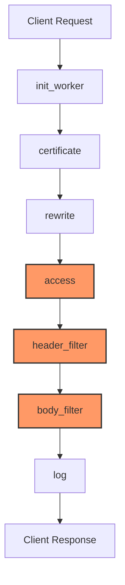

# Kong Debugging

## Introduction

Debugging is an essential skill for any developer, and when working with Kong Gateway, having robust debugging techniques becomes even more crucial. Kong Gateway is a popular API gateway that manages API traffic between clients and services. When issues arise in your Kong configuration, plugins, or custom code, knowing how to effectively debug can save hours of development time.

This guide will walk you through the fundamentals of debugging in Kong, providing you with the tools and methods to identify, isolate, and resolve common issues. Whether you're developing custom plugins, configuring routes, or troubleshooting API connectivity problems, these debugging techniques will help you become more proficient in Kong development.

## Kong Logging Basics

### Understanding Kong's Log System

Kong provides extensive logging capabilities that serve as your first line of defense when debugging issues. By default, Kong logs errors to the following locations:

- **Unix/Linux**: `/usr/local/kong/logs/`
- **Docker containers**: Output to stdout/stderr
- **Windows**: In the Kong installation directory

Let's examine how to configure and use Kong's logging system effectively.

### Configuring Log Levels

You can configure Kong's log level in your `kong.conf` file:

```bash
# Available levels are:
# debug, info, notice, warn, error, crit
log_level = debug
```

For debugging purposes, setting the log level to `debug` provides the most detailed information:

```bash
# Update kong.conf
log_level = debug

# Then restart Kong
kong restart
```

### Reading Kong Logs

Let's look at a typical debug log entry:

```
2023/05/22 15:30:45 [debug] 12345#0: *123 [kong] handler.lua:123 [my-custom-plugin] processing request, client: 192.168.1.1, server: kong
```

Breaking this down:
- `2023/05/22 15:30:45`: Timestamp
- `[debug]`: Log level
- `12345#0`: Process ID
- `*123`: Connection ID
- `[kong]`: Component identifier
- `handler.lua:123`: Source file and line number
- `[my-custom-plugin]`: Plugin name (if applicable)
- `processing request`: Log message
- `client: 192.168.1.1, server: kong`: Connection details

## Debugging Kong Plugins

### Using `ngx.log()` for Debugging

When developing custom plugins, the `ngx.log()` function is your best friend. It allows you to output debug information at various stages of the request lifecycle.

Here's how to use it:

```lua
-- In your plugin code
local function some_function()
  -- Local variables
  local my_var = "test value"
  
  -- Log the value
  ngx.log(ngx.DEBUG, "my_var value: ", my_var)
  
  -- You can log tables too with inspect
  local inspect = require "inspect"
  local complex_table = { foo = "bar", nested = { value = 123 } }
  ngx.log(ngx.DEBUG, "complex table: ", inspect(complex_table))
end
```

Different log levels available:
- `ngx.DEBUG` (most verbose)
- `ngx.INFO`
- `ngx.NOTICE`
- `ngx.WARN`
- `ngx.ERR`
- `ngx.CRIT` (least verbose)

### Tracing Request Flow

To debug issues related to request processing, it's helpful to trace the flow through each phase of Kong's request lifecycle:

```lua
-- In your plugin's access.lua
function MyPlugin:access(conf)
  ngx.log(ngx.DEBUG, "Starting access phase for request: ", ngx.var.request_uri)
  
  -- Your access phase code
  local start_time = ngx.now()
  local result = some_function()
  local elapsed = ngx.now() - start_time
  
  ngx.log(ngx.DEBUG, "Access phase completed in ", elapsed, "s with result: ", result)
end
```

Let's visualize the Kong request lifecycle for better understanding:



## Kong Debugging Tools

### Using Kong Admin API

The Kong Admin API is a powerful tool for debugging configuration issues. You can inspect the current configuration of routes, services, plugins, and more.

Basic usage examples:

```bash
# List all services
curl -X GET http://localhost:8001/services

# Get details of a specific route
curl -X GET http://localhost:8001/routes/my-route

# List all plugins configured for a service
curl -X GET http://localhost:8001/services/my-service/plugins
```

Let's look at a sample output and how to interpret it:

```json
{
  "id": "5fd73c6a-8dfc-4838-a143-1226d3c33456",
  "name": "rate-limiting",
  "created_at": 1622548800,
  "route": null,
  "service": {
    "id": "6f08a57a-e20c-4b77-8600-e5fc7d6f9234"
  },
  "consumer": null,
  "config": {
    "minute": 5,
    "hour": 100,
    "policy": "local"
  },
  "protocols": ["http", "https"],
  "enabled": true,
  "tags": ["api-v1"]
}
```

This output shows a rate-limiting plugin configured at the service level, limiting requests to 5 per minute and 100 per hour.

### Kong Debug Plugin

For more advanced debugging, Kong provides a debug plugin that can be enabled for specific routes or services:

```bash
# Create a debug plugin for a specific route
curl -X POST http://localhost:8001/routes/my-route/plugins \
  --data "name=request-transformer" \
  --data "config.add.headers=X-Debug-Info:true" \
  --data "config.add.headers=X-Kong-Route-Id:$(curl -s http://localhost:8001/routes/my-route | jq -r '.id')"
```

This adds debugging headers to responses that can help you understand how Kong processed the request.

## Common Debugging Scenarios

### Debugging Authentication Issues

Authentication problems are common when working with Kong. Here's a systematic approach to debugging:

1. Check that the authentication plugin is properly configured:

```bash
# Get authentication plugin configuration
curl -X GET http://localhost:8001/routes/my-route/plugins | grep -A 20 "key-auth"
```

2. Verify that credentials are correctly stored:

```bash
# List consumers
curl -X GET http://localhost:8001/consumers

# List credentials for a specific consumer
curl -X GET http://localhost:8001/consumers/my-consumer/key-auth
```

3. Add debug logs in your custom authentication logic:

```lua
function MyAuthPlugin:access(conf)
  ngx.log(ngx.DEBUG, "Auth plugin checking credential: ", credential_name)
  
  local credential = get_credential(credential_name)
  if not credential then
    ngx.log(ngx.ERR, "Failed to find credential: ", credential_name)
    return kong.response.exit(401, { message = "Invalid authentication credentials" })
  end
  
  ngx.log(ngx.DEBUG, "Authentication successful for consumer: ", credential.consumer.id)
end
```

### Debugging Performance Issues

When your Kong gateway experiences performance problems, follow these steps:

1. Enable detailed access logs:

```bash
# In kong.conf
log_level = debug
```

2. Use the Kong Prometheus plugin to collect metrics:

```bash
# Enable the Prometheus plugin globally
curl -X POST http://localhost:8001/plugins/ \
  --data "name=prometheus" 
```

3. Analyze latency in specific phases of request processing:

```lua
function MyPlugin:access(conf)
  local start = ngx.now()
  
  -- Your code here
  
  local duration = ngx.now() - start
  ngx.log(ngx.DEBUG, "Access phase took ", duration, " seconds")
  
  -- Store timing info for later phases
  ngx.ctx.my_plugin = ngx.ctx.my_plugin or {}
  ngx.ctx.my_plugin.access_time = duration
end

function MyPlugin:header_filter(conf)
  local start = ngx.now()
  
  -- Your code here
  
  local duration = ngx.now() - start
  ngx.log(ngx.DEBUG, "Header filter phase took ", duration, " seconds")
end
```

### Debugging Transformation Issues

When working with request/response transformations, debugging can be tricky. Here's how to debug effectively:

1. Log the request/response body at different stages:

```lua
function MyPlugin:access(conf)
  -- Read request body
  kong.service.request.enable_buffering()
  local body, err = kong.service.request.get_raw_body()
  
  ngx.log(ngx.DEBUG, "Original request body: ", body)
  
  -- Apply transformations
  body = transform_body(body)
  
  ngx.log(ngx.DEBUG, "Transformed request body: ", body)
  
  -- Set the modified body
  kong.service.request.set_raw_body(body)
end

function MyPlugin:body_filter(conf)
  local chunk, eof = ngx.arg[1], ngx.arg[2]
  
  -- Store chunks until we have the complete response
  kong.ctx.plugin.response_chunks = kong.ctx.plugin.response_chunks or {}
  if chunk then
    table.insert(kong.ctx.plugin.response_chunks, chunk)
  end
  
  -- On the last chunk, process the full response
  if eof then
    local response_body = table.concat(kong.ctx.plugin.response_chunks)
    ngx.log(ngx.DEBUG, "Original response body: ", response_body)
    
    -- Apply transformations
    response_body = transform_response(response_body)
    
    ngx.log(ngx.DEBUG, "Transformed response body: ", response_body)
    
    -- Send the modified response
    ngx.arg[1] = response_body
  else
    ngx.arg[1] = nil
  end
end
```

## Debugging Real-World Examples

### Example 1: Debugging a Rate Limiting Issue

Let's say users are reporting that they're being rate-limited unexpectedly. Here's how to debug:

```bash
# First, check the rate limiting configuration
curl -X GET http://localhost:8001/services/my-service/plugins | grep -A 20 "rate-limiting"
```

Example output:
```json
{
  "id": "a52568cb-5493-4ae9-9fd3-12345abcdef",
  "name": "rate-limiting",
  "config": {
    "minute": 5,
    "policy": "redis",
    "redis_host": "redis.example.com"
  }
}
```

Now, add custom logging to track rate limiting decisions:

```lua
-- In a custom plugin
function MyDebugPlugin:access(conf)
  -- Get consumer identification
  local consumer_id = (kong.client.get_consumer() or {}).id or "anonymous"
  
  -- Get remaining requests from Redis
  local redis = require "resty.redis"
  local red = redis:new()
  red:connect(redis_host, redis_port)
  
  local key = "ratelimit:" .. consumer_id .. ":minute"
  local remaining, err = red:get(key)
  
  ngx.log(ngx.DEBUG, "Rate limit remaining for consumer ", consumer_id, ": ", remaining)
  
  -- Add header for debugging
  kong.response.set_header("X-RateLimit-Remaining-Minute", remaining)
end
```

### Example 2: Debugging a Custom Authentication Plugin

If your custom authentication plugin isn't working as expected:

```lua
-- In your auth plugin
function MyAuthPlugin:access(conf)
  -- Log authorization header
  local auth_header = kong.request.get_header("Authorization")
  ngx.log(ngx.DEBUG, "Auth header: ", auth_header)
  
  -- Parse token
  local token = auth_header:sub(8) -- Remove "Bearer " prefix
  ngx.log(ngx.DEBUG, "Token: ", token)
  
  -- Verify token (simplified example)
  local jwt = require "resty.jwt"
  local jwt_obj = jwt:verify(conf.jwt_secret, token)
  
  if not jwt_obj.verified then
    ngx.log(ngx.ERR, "JWT verification failed: ", jwt_obj.reason)
    return kong.response.exit(401, { message = "Invalid token" })
  end
  
  ngx.log(ngx.DEBUG, "JWT verified successfully for subject: ", jwt_obj.payload.sub)
  
  -- Set consumer for rate limiting plugins, etc.
  kong.client.authenticate(jwt_obj.payload.sub, jwt_obj.payload.consumer)
end
```

## Debugging in Different Environments

### Local Development Environment

For local development, Docker Compose is a great way to set up a Kong environment:

```yaml
# docker-compose.yml
version: '3'
services:
  kong:
    image: kong:latest
    environment:
      KONG_DATABASE: 'off'
      KONG_DECLARATIVE_CONFIG: /etc/kong/kong.yml
      KONG_LOG_LEVEL: debug
    volumes:
      - ./kong.yml:/etc/kong/kong.yml
    ports:
      - "8000:8000"
      - "8001:8001"
```

You can use this setup to quickly test your plugins and configurations.

### Production Debugging

In production, be careful with debug logs as they can impact performance. For safer debugging:

1. Use targeted debugging for specific consumers or routes:

```bash
# Create a route-specific plugin that only applies to requests with a debug header
curl -X POST http://kong-admin:8001/routes/my-route/plugins \
  --data "name=request-termination" \
  --data "config.status_code=200" \
  --data "config.echo=true" \
  --data "config.content_type=application/json" \
  --data 'config.trigger_condition={"http.headers.X-Kong-Debug":["true"]}' \
  --data 'config.body={"route": "my-route", "headers": "$(headers)", "query": "$(query)"}'
```

2. Use Kong's traffic control features to redirect a small percentage of traffic to a debug instance:

```bash
# Create a canary release
curl -X POST http://kong-admin:8001/services/my-service/plugins \
  --data "name=canary" \
  --data "config.percentage=5" \
  --data "config.upstream_host=debug-backend.example.com"
```

## Advanced Debugging Techniques

### Custom Error Handlers

Create custom error handlers to provide more detailed information when things go wrong:

```lua
-- In your plugin
function MyPlugin:init_worker()
  kong.log.debug("Initializing custom error handler")
  
  -- Register error handler
  kong.response.register_error_handler("my_plugin", function(err)
    return {
      message = "An error occurred: " .. err.message,
      code = err.code,
      debug_info = debug.traceback(),
      timestamp = ngx.time(),
      request_id = kong.ctx.req_id,
    }
  end)
end

function MyPlugin:access(conf)
  local ok, err = pcall(function()
    -- Your code that might error
    local result = some_risky_function()
    
    if not result then
      error({ message = "Failed to get result", code = "RESULT_ERROR" })
    end
  end)
  
  if not ok then
    return kong.response.exit(500, err, { ["Content-Type"] = "application/json" })
  end
end
```

### Timing Analysis

To identify performance bottlenecks, implement detailed timing analysis:

```lua
-- In your plugin
function MyPlugin:access(conf)
  local timings = {}
  
  local function time_function(name, func, ...)
    local start = ngx.now()
    local result = { func(...) }
    local duration = (ngx.now() - start) * 1000 -- convert to ms
    
    timings[name] = duration
    ngx.log(ngx.DEBUG, name, " took ", duration, "ms")
    
    return unpack(result)
  end
  
  -- Use the timing function
  time_function("database_query", query_database, params)
  time_function("api_call", make_api_call, endpoint)
  
  -- Store timings for log phase
  ngx.ctx.my_plugin_timings = timings
end

function MyPlugin:log(conf)
  local timings = ngx.ctx.my_plugin_timings or {}
  
  -- Log all timings
  for name, duration in pairs(timings) do
    ngx.log(ngx.INFO, "Timing for ", name, ": ", duration, "ms")
  end
  
  -- Identify slow operations
  for name, duration in pairs(timings) do
    if duration > 100 then -- 100ms threshold
      ngx.log(ngx.WARN, "Slow operation detected: ", name, " took ", duration, "ms")
    end
  end
end
```

## Debugging Cheat Sheet

Here's a quick reference for common debugging tasks:

| Task | Command/Code |
|------|--------------|
| View Kong logs | `tail -f /usr/local/kong/logs/error.log` |
| Check Kong status | `kong health` |
| List all plugins | `curl -X GET http://localhost:8001/plugins` |
| Test a route | `curl -i -X GET http://localhost:8000/my-route` |
| Check Kong configuration | `kong config parse kong.conf` |
| Validate declarative config | `kong config parse kong.yml` |
| Add debug header | `curl -H "X-Kong-Debug: 1" http://localhost:8000/my-route` |
| Log request details | `ngx.log(ngx.DEBUG, "Request: ", ngx.var.request_uri)` |

## Summary

Effective debugging is crucial for Kong development. In this guide, we've covered:

1. **Kong Logging Basics** - Understanding and configuring logs
2. **Debugging Kong Plugins** - Using `ngx.log()` and tracing request flow
3. **Kong Debugging Tools** - Leveraging Admin API and debug plugins
4. **Common Debugging Scenarios** - Authentication, performance, and transformations
5. **Real-World Examples** - Rate limiting and custom authentication
6. **Environment-Specific Debugging** - Local and production considerations
7. **Advanced Techniques** - Custom error handlers and timing analysis

By applying these techniques, you'll be able to identify and resolve issues in your Kong setup more efficiently.

## Additional Resources

- [Kong Documentation](https://docs.konghq.com/)
- [OpenResty Debugging Guide](https://openresty.org/en/debugging.html)
- [Lua Programming Guide](https://www.lua.org/pil/)

## Exercises

1. **Basic Logging**: Add debug logs to each phase of a simple Kong plugin and trace a request through the system.

2. **Performance Analysis**: Create a custom plugin that measures the time spent in each phase and reports on slow operations.

3. **Error Handling**: Implement a custom error handler that provides detailed debug information for a specific plugin error.

4. **Authentication Debugging**: Debug an authentication issue by adding logging at key decision points in an authentication plugin.

5. **API Monitoring**: Create a plugin that logs detailed information about API calls including headers, timing, and response codes.