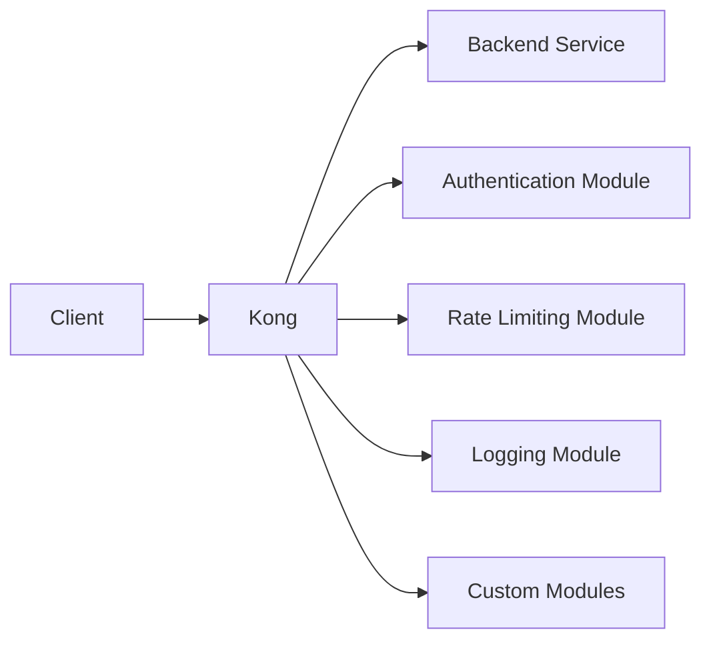

# Kong Modules

## Introduction

Kong is a popular open-source API gateway that helps you manage, secure, and extend your APIs. One of Kong's most powerful features is its modular architecture, which allows developers to extend Kong's functionality through **modules** (also known as plugins).

In this guide, we'll explore what Kong modules are, how they work, and how to create your own custom modules to enhance your API gateway capabilities.

## What Are Kong Modules?

Kong modules are extensions that add functionality to the Kong API gateway. They allow you to modify the request/response lifecycle by hooking into various phases of API processing. Think of modules as middleware for your API gateway.



## Key Concepts

Before diving into development, let's understand some key concepts:

### Module Lifecycle

Kong modules interact with requests and responses through a well-defined lifecycle:

1. **Access Phase**: Executes before Kong proxies the request to the upstream service
2. **Certificate Phase**: Handles SSL/TLS certificate operations
3. **Rewrite Phase**: Modifies the request before it's proxied
4. **Header Filter Phase**: Processes response headers from the upstream service
5. **Body Filter Phase**: Processes the response body
6. **Log Phase**: Logs information after the response has been sent to the client

### Module Configuration

Modules in Kong are configured through:

- **Schema**: Defines the configuration options for your module
- **daos.lua**: Database access objects for storing configuration
- **handler.lua**: Contains the module's logic
- **api.lua**: Exposes a REST API for your module

## Creating Your First Kong Module

Let's build a simple "hello-world" module that adds a custom header to all responses.

### 1. Set Up Your Module Structure

Kong modules follow a standard directory structure:

```
kong-hello-world/
├── kong/
│   └── plugins/
│       └── hello-world/
│           ├── handler.lua
│           └── schema.lua
└── kong-plugin-hello-world-0.1.0-1.rockspec
```

### 2. Define the Schema

The schema file defines the configuration parameters your module accepts:

```lua
-- schema.lua
return {
  name = "hello-world",
  fields = {
    { consumer = typedefs.no_consumer },
    { protocols = typedefs.protocols_http },
    { config = {
        type = "record",
        fields = {
          {
            message = {
              type = "string",
              default = "Hello, World!",
              required = true,
            },
          },
        },
      },
    },
  },
}
```

### 3. Implement the Handler

The handler contains the module's logic:

```lua
-- handler.lua
local HelloWorldHandler = {
  VERSION = "0.1.0",
  PRIORITY = 1000,
}

function HelloWorldHandler:header_filter(conf)
  kong.response.set_header("X-Hello-World", conf.message)
end

return HelloWorldHandler
```

### 4. Create the Plugin Specification

The rockspec file defines your module as a Lua package:

```lua
-- kong-plugin-hello-world-0.1.0-1.rockspec
package = "kong-plugin-hello-world"
version = "0.1.0-1"
source = {
  url = "http://github.com/your-username/kong-hello-world",
  tag = "0.1.0"
}
description = {
  summary = "A Hello World plugin for Kong",
  license = "MIT"
}
dependencies = {
  "lua >= 5.1"
}
build = {
  type = "builtin",
  modules = {
    ["kong.plugins.hello-world.handler"] = "kong/plugins/hello-world/handler.lua",
    ["kong.plugins.hello-world.schema"] = "kong/plugins/hello-world/schema.lua",
  }
}
```

## Installing Your Module

To install your custom module, follow these steps:

1. Package your module:
   ```bash
   luarocks make
   ```

2. Update your Kong configuration to load the plugin:
   ```bash
   # In kong.conf
   plugins = bundled,hello-world
   ```

3. Restart Kong:
   ```bash
   kong restart
   ```

## Enabling Your Module

You can enable your module globally or for specific services/routes:

### Global Activation

```bash
curl -X POST http://localhost:8001/plugins \
     -d name=hello-world \
     -d config.message="Hello, Kong learner!"
```

### Route-Specific Activation

```bash
curl -X POST http://localhost:8001/routes/{route_id}/plugins \
     -d name=hello-world \
     -d config.message="Hello, Route-specific Kong learner!"
```

## Real-World Module Examples

Let's explore some practical examples of Kong modules to solve common API management challenges:

### Example 1: Rate Limiting Module

A rate limiting module helps protect your backend services from being overwhelmed by too many requests:

```lua
-- handler.lua (simplified)
local RateLimitingHandler = {
  VERSION = "1.0.0",
  PRIORITY = 900,
}

function RateLimitingHandler:access(conf)
  -- Get the consumer identifier
  local identifier = get_identifier()
  
  -- Check rate limit
  local current = increment_counter(identifier, conf)
  
  -- If over limit, reject the request
  if current > conf.limit then
    return kong.response.exit(429, { message = "Rate limit exceeded" })
  end
end

return RateLimitingHandler
```

### Example 2: Request Transformation Module

This module modifies incoming requests before they reach your backend:

```lua
-- handler.lua (simplified)
local TransformHandler = {
  VERSION = "1.0.0",
  PRIORITY = 800,
}

function TransformHandler:access(conf)
  -- Get the original request body
  local body = kong.request.get_body()
  
  -- Apply transformations
  if conf.add_fields then
    for k, v in pairs(conf.add_fields) do
      body[k] = v
    end
  end
  
  -- Set the modified body
  kong.service.request.set_body(body)
end

return TransformHandler
```

## Common Module Types

Kong modules typically fall into the following categories:

1. **Authentication**: Validates user credentials (OAuth, JWT, Basic Auth)
2. **Security**: Protects against attacks (CORS, IP Restriction, Bot Detection)
3. **Traffic Control**: Manages API traffic (Rate Limiting, Request Termination)
4. **Analytics**: Collects usage data (Datadog, Prometheus)
5. **Transformation**: Modifies requests/responses (Request Transformer, Response Transformer)
6. **Logging**: Records request/response information (HTTP Log, TCP Log, File Log)

## Debugging Kong Modules

When developing modules, debugging is essential. Here are some techniques:

1. Enable verbose logging in Kong:
   ```bash
   # In kong.conf
   log_level = debug
   ```

2. Use `kong.log.debug()` statements in your code:
   ```lua
   kong.log.debug("Processing request with config: ", kong.log.serialize(conf))
   ```

3. Check Kong logs:
   ```bash
   tail -f /usr/local/kong/logs/error.log
   ```

## Best Practices

When developing Kong modules:

1. **Keep it simple**: Each module should do one thing well
2. **Follow the Kong coding style**: Use the same patterns as built-in modules
3. **Write tests**: Use Kong's test framework to ensure your module works as expected
4. **Document thoroughly**: Provide clear documentation for users
5. **Consider performance**: Optimize for minimal impact on request latency
6. **Handle errors gracefully**: Don't crash the Kong server with uncaught exceptions

## Summary

Kong modules provide a powerful way to extend and customize your API gateway. By understanding the module lifecycle and development process, you can create custom solutions for your specific API management needs.

In this guide, we've covered:
- What Kong modules are and how they work
- The module lifecycle and key concepts
- How to create, install, and configure your own modules
- Real-world examples of useful modules
- Best practices for module development

## Additional Resources

To deepen your knowledge of Kong modules, consider exploring:

- [Kong Plugin Development Guide](https://docs.konghq.com/gateway/latest/plugin-development/)
- [Kong Plugin Development Kit (PDK) Reference](https://docs.konghq.com/gateway/latest/pdk/)
- Kong's source code for built-in plugins on [GitHub](https://github.com/Kong/kong/tree/master/kong/plugins)

## Exercises

To practice your Kong module development skills:

1. Modify the "hello-world" module to add multiple custom headers based on configuration
2. Create a module that logs request details to a file
3. Develop a module that implements a simple caching mechanism for responses
4. Build a module that transforms JSON responses by adding or removing specific fields