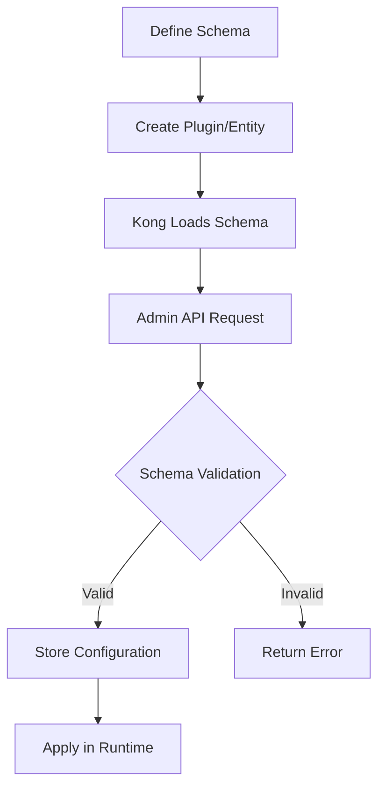

# Kong Schema

## Introduction

Kong Schema is a powerful validation framework used in Kong Gateway to define, validate, and transform configuration data. Whether you're developing custom plugins, services, or routes in Kong, understanding schemas is essential for ensuring your configurations are valid and consistent.

In this guide, we'll explore how Kong Schema works, how to define your own schemas, and how to leverage them in your Kong development projects.

## What is Kong Schema?

Kong Schema is a declarative validation framework that allows you to:

1. Define the structure and constraints of your configuration data
2. Validate input against your schema definition
3. Transform and normalize data to ensure consistency
4. Provide helpful error messages when validation fails

Think of a schema as a blueprint that describes what your data should look like, including field types, required fields, and validation rules.

## Basic Schema Structure

A Kong schema is defined as a Lua table with specific fields that describe the structure and validation rules for your configuration.

Here's a simple example of a Kong schema:

```lua
local schema = {
  name = "my-custom-plugin",
  fields = {
    { config = {
        type = "record",
        fields = {
          { api_key = { type = "string", required = true } },
          { timeout = { type = "number", default = 60, between = { 1, 3600 } } },
          { retry_count = { type = "integer", default = 3 } }
        }
      }
    }
  }
}
```

This schema defines a configuration with three fields:
- `api_key`: A required string
- `timeout`: A number with a default value of 60, constrained between 1 and 3600
- `retry_count`: An integer with a default value of 3

## Schema Field Types

Kong Schema supports various field types to represent different kinds of data:

| Type | Description | Example |
|------|-------------|---------|
| `string` | Text data | `{ name = { type = "string" } }` |
| `number` | Floating-point numbers | `{ score = { type = "number" } }` |
| `integer` | Whole numbers | `{ count = { type = "integer" } }` |
| `boolean` | True/false values | `{ enabled = { type = "boolean" } }` |
| `record` | Nested structure | `{ config = { type = "record", fields = {...} } }` |
| `array` | List of values | `{ tags = { type = "array", elements = { type = "string" } } }` |
| `set` | Unique list of values | `{ methods = { type = "set", elements = { type = "string" } } }` |
| `map` | Key-value pairs | `{ headers = { type = "map", keys = { type = "string" }, values = { type = "string" } } }` |

## Validation Rules

Kong Schema provides several validation rules you can apply to fields:

### Required Fields

Use the `required` attribute to make a field mandatory:

```lua
{ api_key = { type = "string", required = true } }
```

### Default Values

Specify default values for fields that aren't provided:

```lua
{ timeout = { type = "number", default = 60 } }
```

### Value Constraints

Apply constraints to limit valid values:

```lua
-- Between constraint for numbers
{ age = { type = "integer", between = { 0, 120 } } }

-- One_of constraint for strings
{ color = { type = "string", one_of = { "red", "green", "blue" } } }

-- Regex pattern matching
{ username = { type = "string", match = "^[a-zA-Z0-9_]+$" } }
```

### Custom Validators

For complex validation logic, you can define custom validators:

```lua
{
  custom_field = {
    type = "string",
    custom_validator = function(value)
      if value:find("forbidden") then
        return nil, "value cannot contain 'forbidden'"
      end
      return true
    end
  }
}
```

## Working with Schemas

### Creating a Schema

To create a schema in Kong, you first define the schema structure as a Lua table:

```lua
local typedefs = require "kong.db.schema.typedefs"

local schema = {
  name = "my-plugin",
  fields = {
    { consumer = typedefs.no_consumer },
    { protocols = typedefs.protocols_http },
    { config = {
        type = "record",
        fields = {
          { request_header = { type = "string", required = true } },
          { response_header = { type = "string", required = true } },
          { ttl = { type = "integer", default = 600, between = { 0, 86400 } } }
        }
      }
    }
  }
}
```

### Validating Data Against a Schema

To validate data against your schema, use the Kong Schema validation functions:

```lua
local schema = require "kong.db.schema"
local my_plugin_schema = require "kong.plugins.my-plugin.schema"

local ok, err = schema.new(my_plugin_schema):validate({
  config = {
    request_header = "X-Request-ID",
    response_header = "X-Response-ID",
    ttl = 300
  }
})

if not ok then
  -- Handle validation error
  print("Validation failed:", err)
else
  -- Data is valid
  print("Validation succeeded!")
end
```

## Schema Entities in Kong

Kong uses schemas to validate different entities in its ecosystem:

### Plugin Schemas

Plugin schemas define the configuration format for Kong plugins:

```lua
-- In kong/plugins/my-plugin/schema.lua
local typedefs = require "kong.db.schema.typedefs"

return {
  name = "my-plugin",
  fields = {
    { consumer = typedefs.no_consumer },
    { protocols = typedefs.protocols_http },
    { config = {
        type = "record",
        fields = {
          -- plugin-specific configuration fields
          { some_field = { type = "string", required = true } }
        }
      }
    }
  }
}
```

### Entity Schemas

Kong uses schemas to define core entities like Services, Routes, and Consumers:

```lua
-- Example of a service schema structure
local service_schema = {
  name = "services",
  primary_key = { "id" },
  fields = {
    { id = typedefs.uuid },
    { name = typedefs.name },
    { protocol = { type = "string", one_of = { "http", "https", "grpc", "grpcs", "tcp", "udp", "tls" } } },
    { host = typedefs.host },
    { port = typedefs.port },
    { path = typedefs.path },
    -- other fields...
  }
}
```

## A Practical Example: Creating a Rate Limiting Plugin

Let's look at how you might use Kong Schema to create a custom rate limiting plugin:

```lua
-- In kong/plugins/my-ratelimiter/schema.lua
local typedefs = require "kong.db.schema.typedefs"

return {
  name = "my-ratelimiter",
  fields = {
    { protocols = typedefs.protocols_http },
    { config = {
        type = "record",
        fields = {
          { limit = { 
              type = "integer", 
              required = true, 
              default = 100,
              between = { 1, 10000 }
          } },
          { window_size = { 
              type = "integer", 
              required = true, 
              default = 60,
              between = { 1, 3600 }
          } },
          { window_type = { 
              type = "string", 
              required = true, 
              default = "sliding",
              one_of = { "fixed", "sliding" }
          } },
          { response_code = { 
              type = "integer", 
              default = 429, 
              between = { 100, 599 }
          } },
          { exempted_paths = { 
              type = "array", 
              elements = { type = "string" },
              default = { "/health", "/status" }
          } }
        }
      }
    }
  },
  entity_checks = {
    -- Ensure window_size is at least 5 seconds when using sliding window
    { conditional = {
        if_field = "config.window_type", if_match = { eq = "sliding" },
        then_field = "config.window_size", then_match = { gt = 5 }
      }
    }
  }
}
```

This schema:
1. Defines configuration options for our rate limiter
2. Sets reasonable defaults and constraints
3. Includes additional entity-level validation with `entity_checks`

## Schema Workflow Diagram

Here's a visual representation of how Kong Schema fits into the Kong development workflow:



## Advanced Schema Features

### Entity Checks

Beyond field-level validation, Kong Schema supports entity-level validation through `entity_checks`:

```lua
local schema = {
  name = "example",
  fields = {
    { config = {
        type = "record",
        fields = {
          { mode = { type = "string", one_of = { "http", "tcp" } } },
          { http_port = { type = "integer" } },
          { tcp_port = { type = "integer" } }
        }
      }
    }
  },
  entity_checks = {
    -- Ensure http_port is set when mode is http
    { conditional = {
        if_field = "config.mode", if_match = { eq = "http" },
        then_field = "config.http_port", then_match = { required = true }
      }
    },
    -- Ensure tcp_port is set when mode is tcp
    { conditional = {
        if_field = "config.mode", if_match = { eq = "tcp" },
        then_field = "config.tcp_port", then_match = { required = true }
      }
    }
  }
}
```

### Transformation Functions

Schemas can include functions to transform data during validation:

```lua
{
  path = {
    type = "string",
    -- Ensure path starts with a slash
    func = function(value)
      if value and not value:match("^/") then
        return "/" .. value
      end
      return value
    end
  }
}
```

### Type Definitions

Kong provides common type definitions in `kong.db.schema.typedefs` for consistency:

```lua
local typedefs = require "kong.db.schema.typedefs"

local schema = {
  fields = {
    { service = typedefs.service_reference },
    { host = typedefs.host },
    { port = typedefs.port },
    { client_id = { type = "string", uuid = true } }
  }
}
```

## Best Practices

When working with Kong Schema, follow these guidelines:

1. **Use Descriptive Names**: Choose clear field names that reflect their purpose.

2. **Set Reasonable Defaults**: Provide sensible default values whenever possible.

3. **Add Constraints**: Use validation rules to prevent invalid configurations.

4. **Include Helpful Error Messages**: Customize error messages to guide users.

5. **Use entity_checks Wisely**: Use entity-level validation for complex relationships between fields.

6. **Reuse Typedefs**: Leverage Kong's built-in type definitions for consistency.

7. **Document Your Schema**: Add comments to explain the purpose of fields and validation rules.

## Example: Complete Plugin Schema

Here's a complete example of a plugin schema with various validation features:

```lua
local typedefs = require "kong.db.schema.typedefs"

return {
  name = "request-transformer",
  fields = {
    { protocols = typedefs.protocols_http },
    { config = {
        type = "record",
        fields = {
          { add = {
              type = "record",
              fields = {
                { headers = { type = "array", elements = { type = "string" }, default = {} } },
                { querystring = { type = "array", elements = { type = "string" }, default = {} } },
                { body = { type = "array", elements = { type = "string" }, default = {} } }
              }
            }
          },
          { remove = {
              type = "record",
              fields = {
                { headers = { type = "array", elements = { type = "string" }, default = {} } },
                { querystring = { type = "array", elements = { type = "string" }, default = {} } },
                { body = { type = "array", elements = { type = "string" }, default = {} } }
              }
            }
          },
          { rename = {
              type = "record",
              fields = {
                { headers = { type = "map", keys = { type = "string" }, values = { type = "string" }, default = {} } },
                { querystring = { type = "map", keys = { type = "string" }, values = { type = "string" }, default = {} } },
                { body = { type = "map", keys = { type = "string" }, values = { type = "string" }, default = {} } }
              }
            }
          },
          { replace = {
              type = "record",
              fields = {
                { headers = { type = "map", keys = { type = "string" }, values = { type = "string" }, default = {} } },
                { querystring = { type = "map", keys = { type = "string" }, values = { type = "string" }, default = {} } },
                { body = { type = "map", keys = { type = "string" }, values = { type = "string" }, default = {} } }
              }
            }
          }
        }
      }
    }
  },
  entity_checks = {
    -- Ensure at least one operation is specified
    { at_least_one_of = { "config.add", "config.remove", "config.rename", "config.replace" } }
  }
}
```

## Summary

Kong Schema is a powerful validation framework that helps ensure your Kong configurations are valid and consistent. By defining schemas for your plugins and other Kong entities, you can:

- Validate configuration data before it's used
- Provide clear error messages for invalid configurations
- Transform and normalize data to ensure consistency
- Document the expected structure of your configuration

Whether you're developing custom plugins or working with Kong's built-in features, understanding Kong Schema is essential for effective Kong development.

## Additional Resources

- Practice creating your own custom plugin with a well-defined schema
- Explore the Kong Schema implementation in the Kong source code
- Examine the schemas of existing Kong plugins to understand best practices

## Exercises

1. Create a basic schema for a plugin that adds a custom header to requests
2. Extend the schema to support multiple header configurations
3. Add validation to ensure header names follow RFC specifications
4. Implement entity-level checks to validate relationships between fields
5. Write tests to verify your schema correctly validates inputs

By mastering Kong Schema, you'll be able to develop robust, well-validated plugins and configurations for your Kong Gateway deployment.