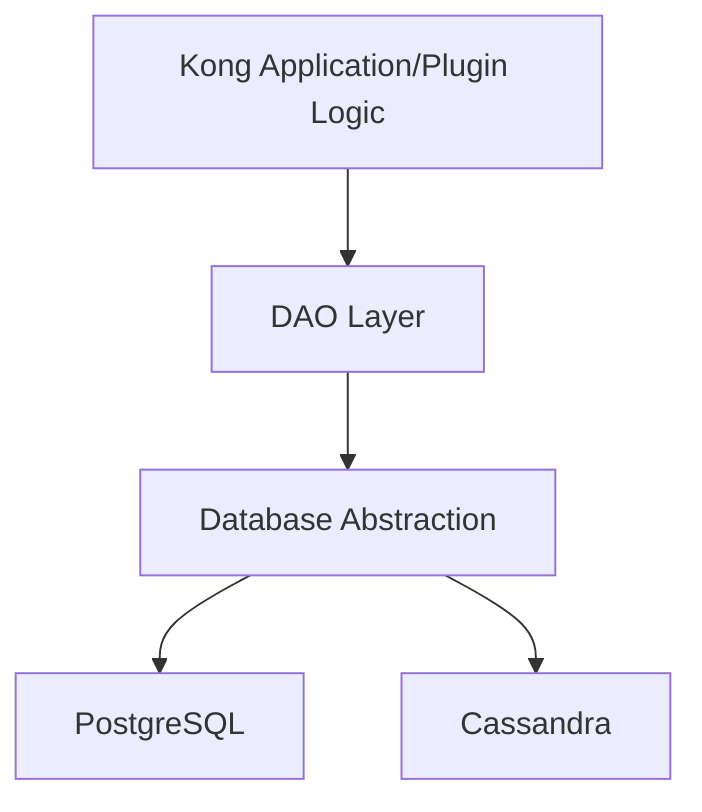

# Kong DAO

## Introduction

Data Access Objects (DAOs) are a fundamental component of the Kong API Gateway's architecture that provide an abstraction layer for interacting with the underlying database. In Kong's ecosystem, DAOs serve as the bridge between your application logic and the database, providing a clean, consistent interface for creating, reading, updating, and deleting resources.

If you're developing plugins, custom entities, or working with Kong's internals, understanding DAOs is essential. This guide will walk you through what Kong DAOs are, how they work, and how to implement them effectively in your Kong projects.

## Understanding Kong's DAO Layer

Kong uses a Data Access Object (DAO) pattern to abstract the database operations from the business logic. This design pattern allows Kong to support multiple database backends (PostgreSQL, Cassandra) while providing a consistent API for developers.



The DAO layer in Kong handles:

1. Schema validation
2. Entity relationships
3. CRUD operations
4. Query building
5. Caching strategies

## Basic DAO Structure

A Kong DAO typically consists of:

1. A schema definition
2. A DAO factory creation
3. Method implementations for interacting with the database

Here's a simple example of how a DAO is structured in Kong:

```lua
-- Define the schema for your entity
local ENTITY = {
  primary_key = { "id" },
  table = "my_custom_entities",
  cache_key = { "name" },
  fields = {
    id = { type = "id", auto = true },
    name = { type = "string", required = true, unique = true },
    created_at = { type = "timestamp", auto = true },
    config = { type = "record", fields = {
      setting_one = { type = "string", default = "default_value" },
      setting_two = { type = "number", default = 42 }
    }}
  }
}

-- Create the DAO factory
return {
  [ENTITY.table] = ENTITY
}
```

## Creating Your First Kong DAO

Let's walk through creating a custom DAO for a simple entity in Kong. Imagine we want to create a "Product" entity for an e-commerce API gateway plugin.

### Step 1: Define Your Schema

First, create a new Lua file for your schema definition:

```lua
-- product_schema.lua
local PRODUCT = {
  primary_key = { "id" },
  table = "products",
  cache_key = { "sku" },
  fields = {
    id = { type = "id", auto = true },
    name = { type = "string", required = true },
    sku = { type = "string", required = true, unique = true },
    price = { type = "number", required = true },
    category_id = { type = "foreign", reference = "categories", required = true },
    description = { type = "string" },
    created_at = { type = "timestamp", auto = true },
    updated_at = { type = "timestamp", auto = true }
  }
}

return { [PRODUCT.table] = PRODUCT }
```

### Step 2: Register Your DAO with Kong

To make Kong aware of your DAO, you need to register it in your plugin's `daos.lua` file:

```lua
-- daos.lua
return {
  require "kong.plugins.my_ecommerce_plugin.product_schema"
}
```

### Step 3: Using Your DAO in Your Plugin

Now you can use your DAO within your plugin's code:

```lua
-- handler.lua
local ProductDao = kong.db.products

-- Handler example
function MyPlugin:access(conf)
  -- Find a product by SKU
  local product, err = ProductDao:select_by_sku(ngx.req.get_uri_args().sku)
  
  if err then
    return kong.response.exit(500, { message = "Database error: " .. err })
  end
  
  if not product then
    return kong.response.exit(404, { message = "Product not found" })
  end
  
  -- Do something with the product
  kong.service.request.set_header("X-Product-Price", product.price)
  kong.service.request.set_header("X-Product-Category", product.category_id)
}
```

## CRUD Operations with Kong DAOs

Kong DAOs provide standard CRUD operations out of the box. Here's how to use them:

### Creating Records

```lua
-- Create a new product
local product, err = kong.db.products:insert({
  name = "Awesome Widget",
  sku = "AW-12345",
  price = 99.99,
  category_id = "electronics",
  description = "This widget is truly awesome!"
})

if err then
  kong.log.err("Failed to create product: ", err)
  return kong.response.exit(500)
end

kong.log.info("Created product with id: ", product.id)
```

### Reading Records

```lua
-- Get by primary key
local product, err = kong.db.products:select({ id = "123" })

-- Get by unique field using custom method
local product, err = kong.db.products:select_by_sku("AW-12345")

-- Get multiple records with filtering
local products, err = kong.db.products:page({ category_id = "electronics" })
```

### Updating Records

```lua
local product, err = kong.db.products:update(
  { id = "123" },  -- Primary key
  { price = 79.99, description = "Now with 20% discount!" }  -- Fields to update
)
```

### Deleting Records

```lua
local ok, err = kong.db.products:delete({ id = "123" })
```

## Relationship Handling

Kong DAOs can handle relationships between entities. Let's see how to work with them:

### One-to-Many Relationships

Assuming products belong to categories, you can navigate the relationship:

```lua
-- Get category for a product
local product, err = kong.db.products:select({ id = "123" })
if product then
  local category, err = kong.db.categories:select({ id = product.category_id })
  kong.log.debug("Product is in category: ", category.name)
end

-- Get all products for a category (reverse lookup)
local products, err = kong.db.products:page({ category_id = "electronics" })
```

### Many-to-Many Relationships

For many-to-many relationships, you typically need an intermediate table:

```lua
-- Assuming a product_tags table linking products and tags
local product_tags, err = kong.db.product_tags:page({ product_id = "123" })

for _, product_tag in ipairs(product_tags) do
  local tag, err = kong.db.tags:select({ id = product_tag.tag_id })
  kong.log.debug("Product has tag: ", tag.name)
end
```

## Advanced DAO Features

### Custom Queries

You can extend Kong DAOs with custom query methods:

```lua
-- Inside your plugin's init_worker phase
function MyPlugin:init_worker()
  -- Add a custom method to the products DAO
  kong.db.products.find_by_price_range = function(self, min_price, max_price)
    return self:page({
      price = { between = { min_price, max_price } }
    })
  end
end

-- Later in your code
local affordable_products = kong.db.products:find_by_price_range(0, 50)
```

### Transactions

For operations that need to maintain data integrity across multiple changes:

```lua
-- Start a transaction
local transaction, err = kong.db.new_transaction()
if err then
  kong.log.err("Failed to create transaction: ", err)
  return kong.response.exit(500)
end

-- Perform multiple operations
local product, err = transaction.products:insert({ name = "New Product", sku = "NP-123", price = 123.45, category_id = "misc" })
if err then
  transaction:rollback()
  kong.log.err("Failed to add product: ", err)
  return kong.response.exit(500)
end

local inventory, err = transaction.inventory:insert({ product_id = product.id, quantity = 100 })
if err then
  transaction:rollback()
  kong.log.err("Failed to add inventory: ", err)
  return kong.response.exit(500)
end

-- Commit the transaction
local ok, err = transaction:commit()
if not ok then
  kong.log.err("Failed to commit transaction: ", err)
  return kong.response.exit(500)
end
```

### Caching Strategies

Kong DAOs have built-in caching to improve performance. Here's how it works:

```lua
-- Entities are automatically cached based on their cache_key
local product = kong.db.products:select_by_sku("AW-12345") -- First time: DB query
local product = kong.db.products:select_by_sku("AW-12345") -- Second time: From cache

-- Invalidate cache when updating
kong.db.products:update({ id = "123" }, { price = 79.99 }) -- Automatically invalidates cache

-- Manual cache invalidation for complex scenarios
kong.core_cache:invalidate("products:" .. product.id)
```

## Real-World Examples

### Example 1: Rate Limiting Plugin with Custom DAO

Let's look at how you might implement a specialized rate limiting plugin with a custom DAO:

```lua
-- rate_limit_schema.lua
local RATE_LIMIT = {
  primary_key = { "id" },
  table = "custom_rate_limits",
  cache_key = { "api_key", "path" },
  fields = {
    id = { type = "id", auto = true },
    api_key = { type = "string", required = true },
    path = { type = "string", required = true },
    requests_count = { type = "integer", default = 0 },
    period_start = { type = "timestamp", auto = true }
  }
}

return { [RATE_LIMIT.table] = RATE_LIMIT }
```

Using this DAO in your rate-limiting plugin:

```lua
-- access.lua
local function check_rate_limit(conf)
  local api_key = kong.request.get_header("apikey")
  local path = kong.request.get_path()
  
  local rate_limit, err = kong.db.custom_rate_limits:select_by_api_key_and_path(api_key, path)
  
  if err then
    kong.log.err("Error fetching rate limit: ", err)
    return kong.response.exit(500)
  end
  
  -- Create a new rate limit record if none exists
  if not rate_limit then
    rate_limit, err = kong.db.custom_rate_limits:insert({
      api_key = api_key,
      path = path,
      requests_count = 1
    })
    
    if err then
      kong.log.err("Error creating rate limit: ", err)
      return kong.response.exit(500)
    end
    
    return true -- First request is always allowed
  end
  
  -- Check if period has expired and reset if needed
  local now = ngx.time()
  local period_start = rate_limit.period_start
  
  if (now - period_start) > conf.period_in_seconds then
    -- Reset the counter for a new period
    local updated, err = kong.db.custom_rate_limits:update(
      { id = rate_limit.id },
      { requests_count = 1, period_start = now }
    )
    
    if err then
      kong.log.err("Error resetting rate limit: ", err)
      return kong.response.exit(500)
    end
    
    return true -- First request of new period is allowed
  end
  
  -- Check if limit has been reached
  if rate_limit.requests_count >= conf.limit then
    return false -- Limit reached, request is not allowed
  end
  
  -- Increment the counter
  local updated, err = kong.db.custom_rate_limits:update(
    { id = rate_limit.id },
    { requests_count = rate_limit.requests_count + 1 }
  )
  
  if err then
    kong.log.err("Error updating rate limit counter: ", err)
    return kong.response.exit(500)
  end
  
  return true -- Request is allowed
end

-- In your plugin's access phase
function plugin:access(conf)
  local allowed = check_rate_limit(conf)
  
  if not allowed then
    return kong.response.exit(429, { message = "Rate limit exceeded" })
  end
end
```

### Example 2: Authentication Plugin with User DAO

Here's how you might implement a custom authentication plugin using DAOs:

```lua
-- user_schema.lua
local USER = {
  primary_key = { "id" },
  table = "api_users",
  cache_key = { "username" },
  fields = {
    id = { type = "id", auto = true },
    username = { type = "string", required = true, unique = true },
    password_hash = { type = "string", required = true },
    roles = { type = "array", elements = { type = "string" } },
    active = { type = "boolean", default = true },
    created_at = { type = "timestamp", auto = true }
  }
}

return { [USER.table] = USER }
```

Using this DAO for authentication:

```lua
local function authenticate(conf)
  -- Get credentials from request
  local username, password = get_credentials_from_request()
  
  if not username or not password then
    return nil, "Missing credentials"
  end
  
  -- Find the user
  local user, err = kong.db.api_users:select_by_username(username)
  
  if err then
    return nil, "Database error: " .. err
  end
  
  if not user then
    return nil, "User not found"
  end
  
  if not user.active then
    return nil, "User account is inactive"
  end
  
  -- Verify password (in real code, use a proper password verification function)
  if not verify_password(password, user.password_hash) then
    return nil, "Invalid password"
  end
  
  return user -- Authentication successful
end

-- In your plugin's access phase
function plugin:access(conf)
  local user, err = authenticate(conf)
  
  if err then
    return kong.response.exit(401, { message = err })
  end
  
  -- Set headers based on authenticated user
  kong.service.request.set_header("X-User-ID", user.id)
  kong.service.request.set_header("X-User-Roles", table.concat(user.roles, ","))
end
```

## Best Practices for Working with Kong DAOs

When working with Kong DAOs, consider these best practices:

1. **Schema Design**: Be thoughtful about your schema design. Choose appropriate field types and constraints. Consider which fields should be indexed for performance.

2. **Error Handling**: Always check for errors when performing DAO operations. Kong uses a Lua convention of returning both a result and an error, so remember to check both.

3. **Transactions**: Use transactions when making multiple related changes to ensure data consistency.

4. **Caching**: Take advantage of Kong's caching system, but be careful about cache invalidation when updating related entities.

5. **Performance**: Be mindful of database performance. Avoid unnecessary queries, and use batch operations when possible.

6. **Migrations**: Always include database migrations when adding or changing DAOs. Kong uses a migration system to handle schema changes safely.

7. **Testing**: Write tests specifically for your DAO operations to ensure they work as expected across different database backends.

## Common Pitfalls and How to Avoid Them

### Incorrect Schema Definition

```lua
-- Incorrect: Missing required fields
local ENTITY = {
  primary_key = { "id" },
  -- table name is missing!
  fields = {
    id = { type = "id", auto = true }
    -- missing comma
    name = { type = "string" }
  }
}

-- Correct:
local ENTITY = {
  primary_key = { "id" },
  table = "my_entities",
  fields = {
    id = { type = "id", auto = true },
    name = { type = "string" }
  }
}
```

### Not Handling Errors Properly

```lua
-- Incorrect: Not checking for errors
local user = kong.db.users:select({ id = user_id })
-- What if there's an error?

-- Correct:
local user, err = kong.db.users:select({ id = user_id })
if err then
  kong.log.err("Database error: ", err)
  return kong.response.exit(500, { message = "Internal server error" })
end

if not user then
  return kong.response.exit(404, { message = "User not found" })
end
```

### Cache Invalidation Issues

```lua
-- Incorrect: Forgetting to invalidate related caches
kong.db.products:update({ id = product_id }, { category_id = new_category_id })
-- The category's product list cache is now stale!

-- Correct: Manually invalidate related caches
kong.db.products:update({ id = product_id }, { category_id = new_category_id })
kong.core_cache:invalidate("categories:products:" .. old_category_id)
kong.core_cache:invalidate("categories:products:" .. new_category_id)
```

## Summary

Kong DAOs provide a powerful abstraction for working with databases in Kong plugins and custom applications. They offer:

- A consistent API across different database backends
- Built-in validation and type checking
- Automatic caching for improved performance
- Support for complex relationships between entities
- Transaction support for data integrity

By mastering Kong DAOs, you'll be able to create more complex and powerful plugins that can efficiently store and retrieve data, making your Kong API Gateway even more versatile and useful in your architecture.

## Additional Resources

Here are some resources to further your understanding of Kong DAOs:

1. Practice exercises:
   - Create a simple plugin that uses a DAO to track API usage statistics
   - Implement a custom authentication system using DAOs
   - Build a caching layer for external API responses

2. Try working with different database backends to ensure your DAOs work consistently
   - Test with both PostgreSQL and Cassandra if possible
   - Verify that your migrations work properly across backends

3. Explore Kong's source code to understand how core DAOs are implemented
   - The plugins directory is particularly useful to see real-world implementations
   - The DAO factory code shows how Kong manages database connections and transactions

By using these principles and patterns, you'll be able to create robust, performant plugins that integrate seamlessly with Kong's database layer.