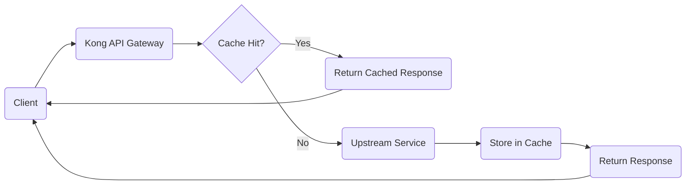

# Kong Cache

## Introduction

Kong Cache is a powerful feature of the Kong API Gateway that allows you to store and reuse frequently accessed data, significantly improving the performance of your API ecosystem. By reducing the need to repeatedly process the same requests or fetch the same data, caching helps decrease latency, reduce load on your upstream services, and enhance the overall user experience.

In this guide, we'll explore how Kong's caching mechanisms work, how to implement them in your API gateway setup, and best practices for optimizing your caching strategy.

## Understanding Caching in Kong

Kong provides several types of caching mechanisms:

1. **Proxy Cache**: Caches entire responses from upstream services
2. **Entity Cache**: Caches Kong configuration entities
3. **Plugin-specific Cache**: Some plugins maintain their own cache for specific operations
4. **Database Cache**: Caches database query results

Let's visualize how Kong caching works in a typical API request flow:



## Setting Up Proxy Caching

The Proxy Cache plugin is one of the most commonly used caching mechanisms in Kong. Let's walk through how to set it up:

### 1. Enable the Proxy Cache Plugin

You can enable the proxy cache plugin for a specific service or route using the Admin API:

```bash
curl -X POST http://localhost:8001/services/my-service/plugins \
    --data "name=proxy-cache" \
    --data "config.content_type=application/json" \
    --data "config.cache_ttl=300" \
    --data "config.strategy=memory"
```

Or via declarative configuration (in `kong.yml`):

```yaml
services:
- name: my-service
  url: http://my-upstream-service.com
  plugins:
  - name: proxy-cache
    config:
      content_type:
      - application/json
      cache_ttl: 300
      strategy: memory
```

### 2. Understanding Cache Configuration Options

Let's break down the key configuration parameters:

- **content_type**: Specifies which response MIME types should be cached
- **cache_ttl**: Time-to-live in seconds for cached items (how long they remain valid)
- **strategy**: Storage strategy (`memory` or `redis`)
- **response_code**: HTTP response codes to cache (defaults to `[200, 301, 404]`)

### 3. Cache Keys

Kong determines whether a request matches a cached item using a cache key. By default, this key is generated based on:

- Request method
- Request URL
- Query parameters

You can customize the cache key generation by specifying which parameters to include:

```bash
curl -X POST http://localhost:8001/services/my-service/plugins \
    --data "name=proxy-cache" \
    --data "config.cache_key_generator=|METHOD|scheme://host|path|hash_cookie:session_id"
```

## Practical Example: Caching API Responses

Let's walk through a common scenario: caching responses from a product catalog API.

### Scenario

We have a product catalog API that receives many requests for the same products. The data changes infrequently, making it an ideal candidate for caching.

### Implementation

1. First, create a service for your product API:

```bash
curl -X POST http://localhost:8001/services \
    --data "name=product-catalog" \
    --data "url=http://product-api.internal:3000"
```

2. Create a route to expose this service:

```bash
curl -X POST http://localhost:8001/services/product-catalog/routes \
    --data "name=catalog-route" \
    --data "paths[]=/products"
```

3. Enable caching with specific settings for product data:

```bash
curl -X POST http://localhost:8001/services/product-catalog/plugins \
    --data "name=proxy-cache" \
    --data "config.content_type=application/json" \
    --data "config.cache_ttl=3600" \
    --data "config.strategy=memory" \
    --data "config.cache_control=true"
```

4. Test the cache:

```bash
# First request (cache miss)
curl -i http://localhost:8000/products/123

# Second request (cache hit)
curl -i http://localhost:8000/products/123
```

On the second request, you should see a response header `X-Cache-Status: Hit`, indicating the response came from cache.

## Cache Invalidation

Cached data eventually becomes stale. There are several ways to handle this:

### 1. TTL-based Expiration

The simplest approach is to set an appropriate TTL value. After this time period, Kong will automatically invalidate the cached entry.

### 2. Manual Invalidation

You can manually invalidate cache entries using the Admin API:

```bash
# Invalidate all cached objects
curl -X DELETE http://localhost:8001/proxy-cache

# Invalidate a specific cached object
curl -X DELETE http://localhost:8001/proxy-cache/{cache-key}
```

### 3. Cache-Control Headers

If you enable `config.cache_control=true`, Kong will respect the `Cache-Control` headers sent by your upstream service. This gives your backend application fine-grained control over caching behavior.

## Advanced Caching Strategies

### Redis Cache Storage

For production environments, memory-based caching might not be sufficient. Kong supports Redis as a caching backend:

```bash
curl -X POST http://localhost:8001/services/my-service/plugins \
    --data "name=proxy-cache" \
    --data "config.strategy=redis" \
    --data "config.redis_host=redis-server" \
    --data "config.redis_port=6379" \
    --data "config.redis_timeout=2000"
```

### Selective Caching

You might want to cache responses only for certain clients or requests. You can use the `cache_by_header` and `request_method` parameters to achieve this:

```bash
curl -X POST http://localhost:8001/services/my-service/plugins \
    --data "name=proxy-cache" \
    --data "config.request_method=GET" \
    --data "config.cache_by_header=Authorization"
```

### Response-specific Caching

For finer control, you can cache based on response headers:

```bash
curl -X POST http://localhost:8001/services/my-service/plugins \
    --data "name=proxy-cache" \
    --data "config.vary_headers=User-Agent,Accept-Language"
```

This will create different cache entries for different user agents or accepted languages.

## Kong Internal Entity Caching

Apart from proxy caching, Kong also caches configuration entities internally. This caching mechanism is managed through settings in `kong.conf`:

```
db_cache_ttl = 3600      # TTL for database cache entries in seconds
db_cache_size = 128000   # Size limit of the database cache in bytes
```

Adjusting these values can help optimize Kong's performance based on your specific workload.

## Troubleshooting Cache Issues

### Common Problems and Solutions

1. **Cache not being hit:**
   - Verify the request matches all cache key components
   - Check TTL settings aren't too short
   - Ensure content types match configured values

2. **Stale data being served:**
   - Implement proper cache invalidation strategies
   - Set appropriate TTL values
   - Consider using cache-control headers

3. **High memory usage:**
   - Switch from memory to Redis storage
   - Adjust cache size limits
   - Be more selective about what gets cached

### Debugging Cache Behavior

Kong adds an `X-Cache-Status` header to responses which can have the following values:

- `Miss`: The request could be cached but wasn't found in the cache
- `Hit`: The request was served from cache
- `Refresh`: The resource was found in cache but was refreshed from the origin
- `Bypass`: The request bypassed the cache

You can use this header to debug and verify your caching behavior.

## Best Practices

1. **Identify cacheable resources** - Not all endpoints benefit equally from caching
2. **Set appropriate TTL values** - Balance freshness against performance
3. **Use Redis for production** - More resilient than in-memory caching
4. **Monitor cache performance** - Track hit ratios and response times
5. **Implement proper invalidation strategies** - Prevent serving stale data
6. **Be mindful of private data** - Don't cache personalized or sensitive information
7. **Use cache-control headers** - Let your upstream services influence caching behavior

## Code Example: Complete Kong Cache Implementation

Here's a comprehensive example using declarative configuration:

```yaml
_format_version: "2.1"
services:
- name: product-catalog
  url: http://product-api.internal:3000
  routes:
  - name: products-route
    paths:
    - /products
    - /categories
  plugins:
  - name: proxy-cache
    config:
      content_type:
      - application/json
      cache_ttl: 3600
      strategy: redis
      redis_host: redis.internal
      redis_port: 6379
      response_code:
      - 200
      - 301
      cache_control: true
      vary_headers:
      - Accept-Language
      request_method:
      - GET
```

## Summary

Kong Cache provides a powerful way to improve API performance, reduce backend load, and enhance user experience. By understanding the different caching mechanisms, configuration options, and best practices outlined in this guide, you'll be able to implement an effective caching strategy for your Kong API Gateway.

Remember these key points:
- Proxy Cache is ideal for caching upstream API responses
- Cache keys determine what constitutes a unique request
- Redis provides a more robust storage option for production environments
- Proper cache invalidation is crucial for serving fresh data
- Kong's internal entity caching affects gateway performance

## Exercises

1. Set up a basic proxy cache for a test API and measure the performance improvement.
2. Experiment with different cache key configurations to understand their impact.
3. Implement Redis-based caching and compare it with memory-based caching.
4. Create a cache invalidation mechanism triggered by upstream data changes.
5. Develop a monitoring solution to track cache hit ratios and performance metrics.

## Additional Resources

- [Kong Proxy Cache Plugin Documentation](https://docs.konghq.com/hub/kong-inc/proxy-cache/)
- [Redis Documentation](https://redis.io/documentation)
- [HTTP Caching Specification](https://tools.ietf.org/html/rfc7234)
- [Kong Admin API Documentation](https://docs.konghq.com/gateway/latest/admin-api/)