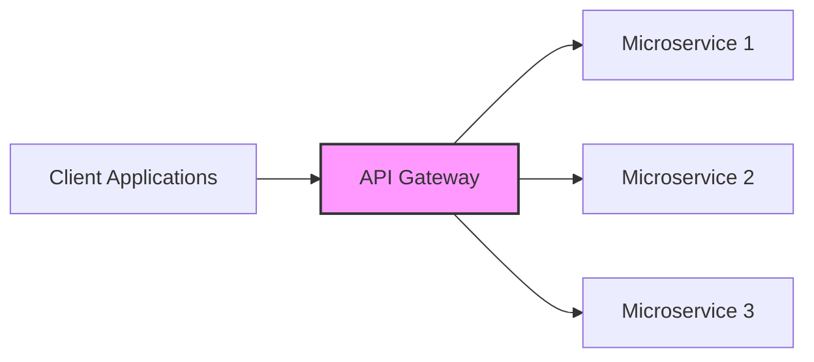
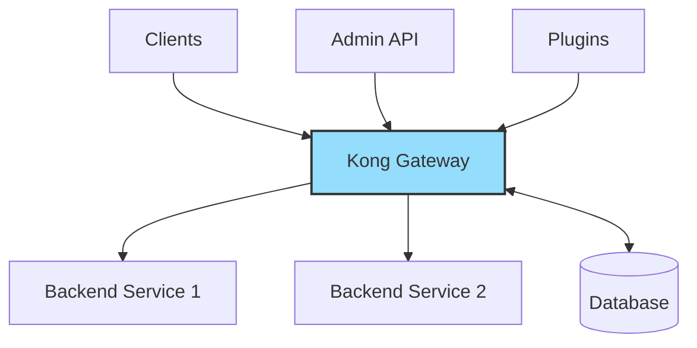

# Kong API Gateway

## Introduction

Kong API Gateway is a popular, open-source API gateway and microservices management layer that sits between your clients and your upstream services (APIs, microservices). It acts as a gateway (or proxy) for your API requests, allowing you to add functionality to your APIs without modifying the APIs themselves.

Think of Kong as a traffic controller for your API requests. It receives all incoming requests, applies any necessary transformations or rules, and then routes these requests to the appropriate backend services. On the way back, it can also modify the responses before returning them to the clients.

## What is an API Gateway?

Before diving into Kong specifically, let's understand what an API gateway is and why you might need one.

An API gateway is a server that acts as an API front-end, receiving API requests, enforcing throttling and security policies, passing requests to the backend service, and then passing the response back to the requester. It provides a single entry point for multiple APIs or microservices.



## Key Benefits of Using Kong API Gateway

1. **Centralized management**: Manage all your APIs from a single location
2. **Enhanced security**: Add authentication, rate limiting, and other security features
3. **Traffic control**: Implement load balancing, circuit breaking, and request routing
4. **Monitoring and analytics**: Gain insights into API usage and performance
5. **Plugin ecosystem**: Extend functionality through plugins without modifying underlying services

## Kong Architecture

Kong has a simple but powerful architecture:

1. **Kong Gateway**: The core proxy that processes API requests and responses
2. **Kong Database** (optional): Stores Kong's configuration data
3. **Kong Admin API**: Used to configure and manage Kong
4. **Plugins**: Add-ons that extend Kong's functionality

Kong can run in two modes:
- **DB-less mode**: Configuration is stored in memory and loaded from a YAML file
- **DB mode**: Configuration is stored in PostgreSQL or Cassandra



## Getting Started with Kong

### Installation

Let's start with a simple Docker installation:

```bash
# Pull the Kong Docker image
docker pull kong:latest

# Create a Docker network
docker network create kong-net

# Start Kong in DB-less mode
docker run -d --name kong \
  --network=kong-net \
  -e "KONG_DATABASE=off" \
  -e "KONG_PROXY_ACCESS_LOG=/dev/stdout" \
  -e "KONG_ADMIN_ACCESS_LOG=/dev/stdout" \
  -e "KONG_PROXY_ERROR_LOG=/dev/stderr" \
  -e "KONG_ADMIN_ERROR_LOG=/dev/stderr" \
  -e "KONG_ADMIN_LISTEN=0.0.0.0:8001, 0.0.0.0:8444 ssl" \
  -p 8000:8000 \
  -p 8443:8443 \
  -p 8001:8001 \
  -p 8444:8444 \
  kong:latest
```

After running the above command, Kong will be available at:
- Proxy: http://localhost:8000 (This handles your API requests)
- Admin API: http://localhost:8001 (This is for configuring Kong)

### Core Concepts

To use Kong effectively, you need to understand its key components:

1. **Services**: Your upstream APIs/microservices that Kong will proxy requests to
2. **Routes**: Define how requests are sent to Services
3. **Consumers**: Users of your APIs who can be authenticated
4. **Plugins**: Add functionality to Services, Routes, or globally

### Basic Configuration with Kong Admin API

Let's set up a simple API proxy using Kong's Admin API:

#### 1. Create a Service

First, we'll create a service that points to a mock API endpoint:

```bash
curl -i -X POST \
  --url http://localhost:8001/services/ \
  --data 'name=example-service' \
  --data 'url=https://mockbin.org'
```

Output:
```json
HTTP/1.1 201 Created
Content-Type: application/json
Connection: keep-alive

{
  "host": "mockbin.org",
  "created_at": 1631289321,
  "connect_timeout": 60000,
  "id": "3a7e8f1b-a79d-42e2-9449-acf3dc9bc6d6",
  "protocol": "https",
  "name": "example-service",
  "read_timeout": 60000,
  "port": 443,
  "path": null,
  "updated_at": 1631289321,
  "retries": 5,
  "write_timeout": 60000,
  "tags": null,
  "client_certificate": null
}
```

#### 2. Create a Route

Now, let's create a route to access this service:

```bash
curl -i -X POST \
  --url http://localhost:8001/services/example-service/routes \
  --data 'name=example-route' \
  --data 'paths[]=/example'
```

Output:
```json
HTTP/1.1 201 Created
Content-Type: application/json
Connection: keep-alive

{
  "id": "69cb9c3c-8507-4328-b6e4-a9b21e1a6614",
  "name": "example-route",
  "protocols": ["http", "https"],
  "paths": ["/example"],
  "service": { "id": "3a7e8f1b-a79d-42e2-9449-acf3dc9bc6d6" },
  "created_at": 1631289498,
  "updated_at": 1631289498
}
```

#### 3. Test the Proxy

Now we can test our API gateway by sending a request to the route we created:

```bash
curl -i http://localhost:8000/example/request
```

Output:
```
HTTP/1.1 200 OK
Content-Type: application/json
Connection: keep-alive

{
  "method": "GET",
  "url": "https://mockbin.org/request",
  "headers": {
    "host": "mockbin.org",
    "connection": "keep-alive",
    "user-agent": "curl/7.68.0",
    "accept": "*/*"
  }
}
```

Congratulations! You've just set up your first API gateway with Kong. Kong received your request at `/example/request`, forwarded it to the mockbin.org service, and returned the response.

## Working with Kong Plugins

One of Kong's most powerful features is its plugin system. Plugins allow you to add functionality to your APIs without modifying your backend services.

### Adding Rate Limiting

Let's add a rate limiting plugin to our service:

```bash
curl -i -X POST \
  --url http://localhost:8001/services/example-service/plugins \
  --data 'name=rate-limiting' \
  --data 'config.minute=5' \
  --data 'config.policy=local'
```

Output:
```json
HTTP/1.1 201 Created
Content-Type: application/json
Connection: keep-alive

{
  "id": "ec08a784-f25b-47ee-b8f6-a7e80f271abf",
  "name": "rate-limiting",
  "created_at": 1631289912,
  "route": null,
  "service": { "id": "3a7e8f1b-a79d-42e2-9449-acf3dc9bc6d6" },
  "consumer": null,
  "config": {
    "minute": 5,
    "policy": "local",
    "fault_tolerant": true,
    "hide_client_headers": false,
    "redis_timeout": 2000,
    "limit_by": "consumer",
    "hour": null,
    "second": null,
    "day": null,
    "month": null,
    "year": null
  },
  "protocols": ["grpc", "grpcs", "http", "https"],
  "enabled": true,
  "tags": null
}
```

Now, if you make more than 5 requests in a minute, Kong will block additional requests until the next minute begins.

### Testing Rate Limiting

Let's test our rate limit by making multiple requests:

```bash
for i in {1..7}; do
  echo "Request $i:"
  curl -i http://localhost:8000/example/request | grep "RateLimit"
  sleep 1
done
```

Output (after 6 requests):
```
Request 6:
X-RateLimit-Limit-Minute: 5
X-RateLimit-Remaining-Minute: 0
Request 7:
HTTP/1.1 429 Too Many Requests
X-RateLimit-Limit-Minute: 5
X-RateLimit-Remaining-Minute: 0
Retry-After: 54
```

### Popular Kong Plugins

Kong offers many plugins for various purposes:

1. **Authentication**:
   - Basic Authentication
   - Key Authentication
   - OAuth 2.0
   - JWT
   - LDAP

2. **Security**:
   - CORS
   - IP Restriction
   - Bot Detection
   - WAF (Web Application Firewall)

3. **Traffic Control**:
   - Rate Limiting
   - Request Termination
   - Request Transformer
   - Response Transformer

4. **Analytics & Monitoring**:
   - Prometheus
   - Datadog
   - StatsD
   - Log plugins

## Real-World Use Case: API Authentication

Let's implement a common real-world scenario: securing an API with key authentication.

### 1. Add the Key Authentication Plugin

```bash
curl -i -X POST \
  --url http://localhost:8001/services/example-service/plugins \
  --data 'name=key-auth' \
  --data 'config.key_names=apikey'
```

### 2. Create a Consumer

```bash
curl -i -X POST \
  --url http://localhost:8001/consumers/ \
  --data "username=example-user"
```

### 3. Create an API Key for the Consumer

```bash
curl -i -X POST \
  --url http://localhost:8001/consumers/example-user/key-auth \
  --data 'key=your-secret-api-key'
```

### 4. Test Authenticated Requests

Without an API key, you'll get an error:

```bash
curl -i http://localhost:8000/example/request
```

Output:
```
HTTP/1.1 401 Unauthorized
Content-Type: application/json
WWW-Authenticate: Key realm="kong"

{"message":"No API key found in request"}
```

With an API key, you'll get a success response:

```bash
curl -i http://localhost:8000/example/request \
  -H 'apikey: your-secret-api-key'
```

Output:
```
HTTP/1.1 200 OK
Content-Type: application/json
Connection: keep-alive

{
  "method": "GET",
  "url": "https://mockbin.org/request",
  "headers": {
    "host": "mockbin.org",
    "connection": "keep-alive",
    "apikey": "your-secret-api-key",
    "user-agent": "curl/7.68.0",
    "accept": "*/*"
  }
}
```

## Advanced Kong Features

### Kong Manager

Kong offers a web-based UI called Kong Manager for those who prefer not to use the Admin API directly. This provides a visual interface for configuring and managing Kong.

### Kong Declarative Configuration (DB-less mode)

For environments where you want to use Kong without a database, you can use declarative configuration:

```yaml
# kong.yml
_format_version: "2.1"

services:
- name: example-service
  url: https://mockbin.org
  routes:
  - name: example-route
    paths:
    - /example
  plugins:
  - name: rate-limiting
    config:
      minute: 5
      policy: local

consumers:
- username: example-user
  keyauth_credentials:
  - key: your-secret-api-key
```

Load the configuration with:

```bash
docker run -d --name kong \
  --network=kong-net \
  -e "KONG_DATABASE=off" \
  -e "KONG_DECLARATIVE_CONFIG=/kong/kong.yml" \
  -v "$(pwd)/kong.yml:/kong/kong.yml" \
  -p 8000:8000 \
  -p 8001:8001 \
  kong:latest
```

### Service Discovery and Load Balancing

Kong can automatically discover backend services and load balance traffic between multiple instances:

```bash
curl -i -X POST \
  --url http://localhost:8001/upstreams \
  --data 'name=example-upstream'

curl -i -X POST \
  --url http://localhost:8001/upstreams/example-upstream/targets \
  --data 'target=service1:8000'
  
curl -i -X POST \
  --url http://localhost:8001/upstreams/example-upstream/targets \
  --data 'target=service2:8000'

curl -i -X POST \
  --url http://localhost:8001/services \
  --data 'name=load-balanced-service' \
  --data 'host=example-upstream'
```

## Kong Enterprise Features

Kong also offers an Enterprise version with additional features:

- **Developer Portal**: For API documentation and developer onboarding
- **Role-Based Access Control (RBAC)**: Fine-grained control over Kong Admin API
- **Enterprise-grade plugins**: Additional security, governance, and analytics features
- **Kong Immunity**: AI-powered security and anomaly detection
- **Kong Vitals**: Enhanced monitoring and analytics
- **24/7 Enterprise Support**

## Best Practices

1. **Use HTTPS everywhere**: Always secure your API gateway with TLS
2. **Implement proper authentication**: Choose the right authentication method for your use case
3. **Rate limit all endpoints**: Protect your services from abuse and DDoS attacks
4. **Monitor and analyze traffic**: Use monitoring plugins to gain insights
5. **Use declarative configuration**: Makes it easier to version control and deploy your Kong setup
6. **Keep Kong updated**: Regularly update to get security patches and new features
7. **Start with a staging environment**: Test configurations before applying to production

## Summary

Kong API Gateway is a powerful tool for managing your APIs and microservices. It allows you to:

- Centralize API management
- Enhance security with authentication and rate limiting
- Control and monitor API traffic
- Extend functionality through plugins
- Scale and load balance your microservices

By acting as a gateway between clients and your services, Kong helps you build more robust, secure, and scalable API ecosystems without modifying your existing backend services.

## Additional Resources

### Practice Exercises

1. Set up Kong with a database (PostgreSQL)
2. Implement OAuth 2.0 authentication for your API
3. Create a service with multiple routes and different rate limits
4. Set up upstream services with load balancing
5. Configure Kong in DB-less mode using declarative configuration

### Further Reading

- Kong's official documentation
- API Gateway patterns in microservices architecture
- Advanced Kong plugin development
- API security best practices
- Service mesh vs. API gateway approaches