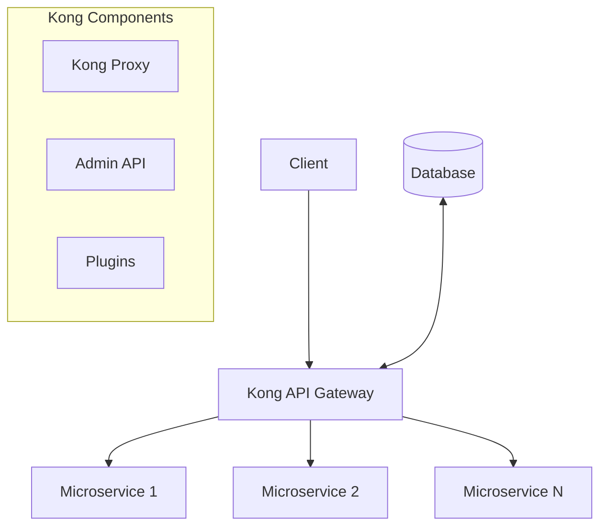
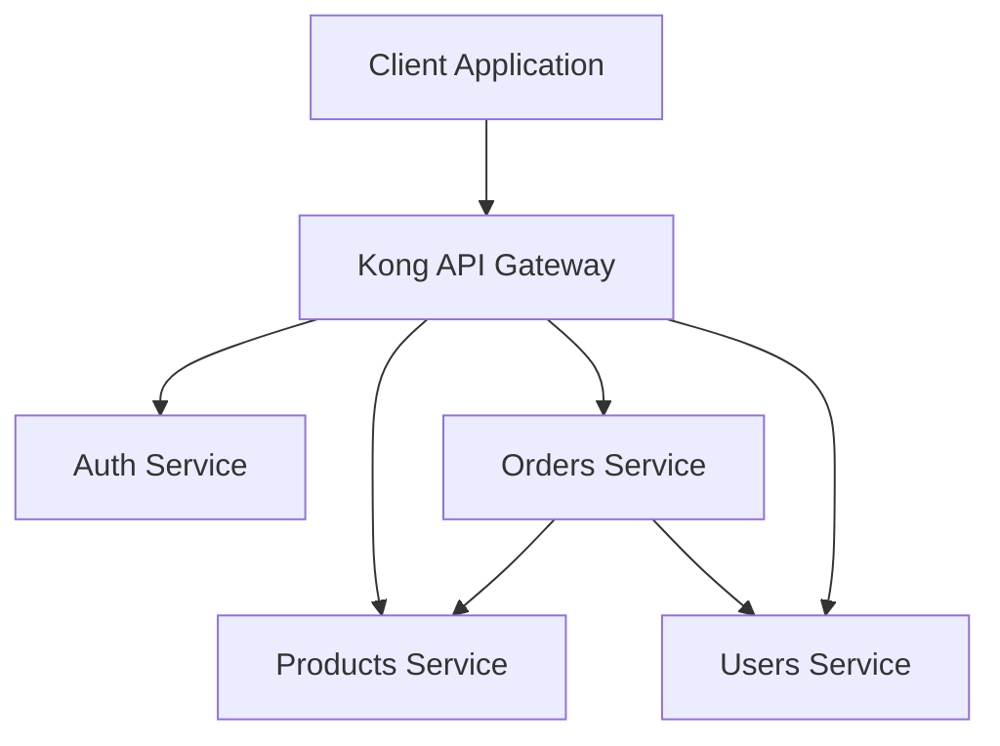
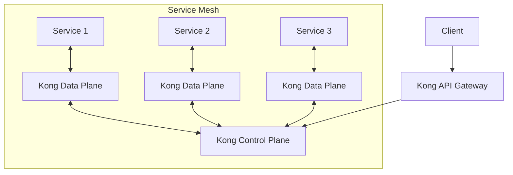

# Kong Microservices

## Introduction

Microservices architecture has revolutionized how we build scalable applications by breaking down monolithic systems into smaller, independently deployable services. However, managing communication between these services can become complex. This is where **Kong** comes into play.

**Kong** is an open-source API gateway and microservices management layer that sits in front of your microservices architecture, acting as a centralized entry point for all client requests. It handles cross-cutting concerns like authentication, rate limiting, and logging, allowing your microservices to focus on their specific business logic.

## What is Kong?

Kong is built on top of NGINX and provides a robust, scalable platform for managing APIs and microservices. It offers:

- **API Gateway functionality**: Routes client requests to appropriate services
- **Plugin ecosystem**: Extends functionality through plugins (authentication, logging, etc.)
- **Declarative configuration**: Define your API routes and plugins in YAML/JSON
- **Service discovery**: Automatically discover and register services
- **Developer portal**: Document and share APIs with consumers

## Kong Architecture

Kong follows a modular architecture that consists of several key components:



The main components include:

1. **Kong Proxy**: Handles all inbound API traffic and routes it to the appropriate microservice
2. **Admin API**: Provides a RESTful interface for configuring Kong
3. **Plugins**: Modular components that add functionality to Kong
4. **Database**: Stores Kong's configuration (PostgreSQL or Cassandra)

## Getting Started with Kong

Let's set up a basic Kong environment and configure it for a simple microservices architecture.

### Installation

We'll use Docker to quickly set up Kong:

```bash
# Create a Docker network
docker network create kong-net

# Start the database
docker run -d --name kong-database \
  --network=kong-net \
  -p 5432:5432 \
  -e "POSTGRES_USER=kong" \
  -e "POSTGRES_DB=kong" \
  -e "POSTGRES_PASSWORD=kongpass" \
  postgres:13

# Prepare the database
docker run --rm --network=kong-net \
  -e "KONG_DATABASE=postgres" \
  -e "KONG_PG_HOST=kong-database" \
  -e "KONG_PG_PASSWORD=kongpass" \
  kong:latest kong migrations bootstrap

# Start Kong
docker run -d --name kong \
  --network=kong-net \
  -e "KONG_DATABASE=postgres" \
  -e "KONG_PG_HOST=kong-database" \
  -e "KONG_PG_PASSWORD=kongpass" \
  -e "KONG_PROXY_ACCESS_LOG=/dev/stdout" \
  -e "KONG_ADMIN_ACCESS_LOG=/dev/stdout" \
  -e "KONG_PROXY_ERROR_LOG=/dev/stderr" \
  -e "KONG_ADMIN_ERROR_LOG=/dev/stderr" \
  -e "KONG_ADMIN_LISTEN=0.0.0.0:8001, 0.0.0.0:8444 ssl" \
  -p 8000:8000 \
  -p 8443:8443 \
  -p 8001:8001 \
  -p 8444:8444 \
  kong:latest
```

After running these commands, Kong will be available at:
- **Proxy**: http://localhost:8000 (incoming API requests)
- **Admin API**: http://localhost:8001 (management interface)

### Configuring Services and Routes

Let's set up a simple service and route configuration:

```bash
# Create a service
curl -i -X POST \
  --url http://localhost:8001/services/ \
  --data 'name=user-service' \
  --data 'url=http://user-microservice:3000/api/users'

# Create a route for the service
curl -i -X POST \
  --url http://localhost:8001/services/user-service/routes \
  --data 'name=user-route' \
  --data 'paths[]=/users'
```

Now, any requests to `http://localhost:8000/users` will be routed to your user microservice at `http://user-microservice:3000/api/users`.

## Working with Kong Plugins

One of Kong's most powerful features is its plugin ecosystem. Let's explore a few essential plugins:

### Authentication with Key Authentication Plugin

```bash
# Enable key-auth plugin
curl -i -X POST \
  --url http://localhost:8001/services/user-service/plugins/ \
  --data 'name=key-auth'

# Create a consumer
curl -i -X POST \
  --url http://localhost:8001/consumers/ \
  --data 'username=app-consumer'

# Provision key credentials
curl -i -X POST \
  --url http://localhost:8001/consumers/app-consumer/key-auth/ \
  --data 'key=your-secret-key'
```

Now, clients need to include the `apikey` header in their requests:

```bash
# Access the API with authentication
curl -i -X GET \
  --url http://localhost:8000/users \
  --header 'apikey: your-secret-key'
```

### Rate Limiting

```bash
# Add rate limiting to prevent abuse
curl -i -X POST \
  --url http://localhost:8001/services/user-service/plugins/ \
  --data 'name=rate-limiting' \
  --data 'config.minute=5' \
  --data 'config.policy=local'
```

This configuration limits clients to 5 requests per minute.

## Building a Microservices Architecture with Kong

Let's design a simple e-commerce system using microservices architecture with Kong as the API gateway:



### Example: Setting Up Multiple Services

```bash
# Create services for each microservice
curl -i -X POST --url http://localhost:8001/services/ --data 'name=auth-service' --data 'url=http://auth-service:3000/api'
curl -i -X POST --url http://localhost:8001/services/ --data 'name=product-service' --data 'url=http://product-service:3001/api'
curl -i -X POST --url http://localhost:8001/services/ --data 'name=order-service' --data 'url=http://order-service:3002/api'
curl -i -X POST --url http://localhost:8001/services/ --data 'name=user-service' --data 'url=http://user-service:3003/api'

# Create routes for each service
curl -i -X POST --url http://localhost:8001/services/auth-service/routes --data 'name=auth-route' --data 'paths[]=/auth'
curl -i -X POST --url http://localhost:8001/services/product-service/routes --data 'name=product-route' --data 'paths[]=/products'
curl -i -X POST --url http://localhost:8001/services/order-service/routes --data 'name=order-route' --data 'paths[]=/orders'
curl -i -X POST --url http://localhost:8001/services/user-service/routes --data 'name=user-route' --data 'paths[]=/users'
```

## Kong Declarative Configuration with Kong.yml

While the Admin API is powerful, using declarative configuration with a `kong.yml` file is often preferable for version-controlled environments:

```yaml
_format_version: "2.1"
_transform: true

services:
  - name: auth-service
    url: http://auth-service:3000/api
    routes:
      - name: auth-route
        paths:
          - /auth
    plugins:
      - name: key-auth
      
  - name: product-service
    url: http://product-service:3001/api
    routes:
      - name: product-route
        paths:
          - /products
    plugins:
      - name: rate-limiting
        config:
          minute: 5
          policy: local
          
  - name: order-service
    url: http://order-service:3002/api
    routes:
      - name: order-route
        paths:
          - /orders
          
  - name: user-service
    url: http://user-service:3003/api
    routes:
      - name: user-route
        paths:
          - /users

consumers:
  - username: app-consumer
    keyauth_credentials:
      - key: your-secret-key
```

To apply this configuration:

```bash
# Export the configuration to kong.yml
curl -X GET http://localhost:8001/config > kong.yml

# Or apply an existing kong.yml
curl -X POST http://localhost:8001/config \
  -F config=@kong.yml
```

## Implementing a Real-World Microservice

Let's create a simple Node.js microservice that will be managed by Kong:

```javascript
// product-service.js
const express = require('express');
const app = express();
const port = 3001;

app.use(express.json());

// In-memory product database
const products = [
  { id: 1, name: 'Smartphone', price: 699.99 },
  { id: 2, name: 'Laptop', price: 1299.99 },
  { id: 3, name: 'Wireless Headphones', price: 199.99 }
];

// Get all products
app.get('/api/products', (req, res) => {
  res.json(products);
});

// Get product by ID
app.get('/api/products/:id', (req, res) => {
  const product = products.find(p => p.id === parseInt(req.params.id));
  if (!product) return res.status(404).json({ message: 'Product not found' });
  res.json(product);
});

// Create new product
app.post('/api/products', (req, res) => {
  const product = {
    id: products.length + 1,
    name: req.body.name,
    price: req.body.price
  };
  products.push(product);
  res.status(201).json(product);
});

app.listen(port, () => {
  console.log(`Product service listening at http://localhost:${port}`);
});
```

To run this microservice in Docker:

```bash
# Dockerfile
FROM node:14-alpine
WORKDIR /app
COPY package*.json ./
RUN npm install
COPY . .
EXPOSE 3001
CMD ["node", "product-service.js"]
```

Then register it with Kong:

```bash
curl -i -X POST \
  --url http://localhost:8001/services/ \
  --data 'name=product-service' \
  --data 'url=http://product-service:3001/api'

curl -i -X POST \
  --url http://localhost:8001/services/product-service/routes \
  --data 'name=product-route' \
  --data 'paths[]=/products'
```

## Kong Enterprise Features

Kong has an Enterprise version with additional features:

- **Dev Portal**: Interactive API documentation
- **Kong Manager**: GUI for Kong administration
- **Role-Based Access Control (RBAC)**: Fine-grained access control
- **Kong Immunity**: AI-powered traffic analysis
- **Kong Vitals**: Real-time monitoring and analytics

## Advanced Kong Features

### Service Mesh with Kong Mesh

Kong also offers Kong Mesh, a service mesh solution based on Kuma:



### Kong Plugins for Observability

```bash
# Enable Prometheus plugin for metrics
curl -i -X POST \
  --url http://localhost:8001/plugins/ \
  --data 'name=prometheus'

# Enable OpenTelemetry for distributed tracing
curl -i -X POST \
  --url http://localhost:8001/plugins/ \
  --data 'name=opentelemetry'
  --data 'config.endpoint=http://otel-collector:4318/v1/traces'
```

## Best Practices for Kong Microservices

1. **Use declarative configuration** for version control and GitOps workflows
2. **Implement proper authentication** to secure all endpoints
3. **Apply rate limiting** to prevent API abuse
4. **Monitor your services** with Kong's observability plugins
5. **Implement circuit breakers** for fault tolerance
6. **Design modular services** that follow single responsibility principle
7. **Version your APIs** to support backward compatibility
8. **Use health checks** to ensure service availability
9. **Implement proper logging** for troubleshooting
10. **Automate deployments** using CI/CD pipelines

## Summary

Kong provides a powerful platform for managing microservices architecture. We've covered:

- Installing and configuring Kong
- Setting up services and routes
- Implementing authentication and rate limiting
- Creating a declarative configuration
- Building a real-world microservice
- Advanced Kong features
- Best practices for working with Kong

By leveraging Kong, you can focus on developing your microservices while Kong handles the cross-cutting concerns like security, observability, and traffic management.

## Further Learning Resources

To deepen your understanding of Kong and microservices architecture:

- **Kong Documentation**: Explore the official Kong documentation
- **Kong University**: Kong's learning platform with courses and certifications
- **GitHub**: Kong's repositories contain examples and sample projects
- **Kong Nation**: Community forum for discussing Kong-related topics

## Exercises

1. Set up a local Kong environment using Docker Compose with two microservices.
2. Configure key authentication and rate limiting for your microservices.
3. Create a declarative configuration file for your Kong setup.
4. Implement a simple microservice and register it with Kong.
5. Configure the Prometheus plugin and visualize metrics with Grafana.