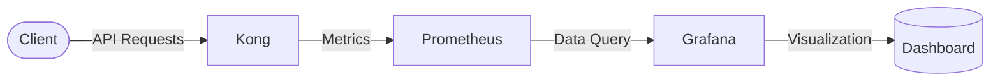

# Kong Monitoring Dashboard

## Introduction

Monitoring is a critical aspect of managing API gateways in production environments. Kong, a popular open-source API gateway, generates valuable metrics that can help you understand its performance, identify bottlenecks, and troubleshoot issues. In this tutorial, we'll explore how to set up a comprehensive monitoring dashboard for Kong API Gateway, allowing you to visualize important metrics and ensure your API infrastructure is running smoothly.

A monitoring dashboard provides a centralized view of your Kong instance's health and performance, making it easier to:

- Track API request rates and response times
- Monitor error rates and status codes
- Identify performance bottlenecks
- Set up alerts for potential issues
- Make data-driven decisions about scaling and optimization

## Prerequisites

Before setting up your Kong monitoring dashboard, ensure you have the following:

- A running Kong instance (either Community or Enterprise edition)
- Basic familiarity with Kong configuration
- Docker and Docker Compose (for the example setup)
- Basic understanding of monitoring concepts

## Monitoring Architecture

Kong can be monitored using various tools, but a common setup involves:

1. **Prometheus**: To collect and store metrics from Kong
2. **Grafana**: To visualize the metrics in customizable dashboards

Here's a simple architecture diagram of our monitoring setup:



## Setting Up Prometheus for Kong

### Step 1: Enable the Prometheus Plugin in Kong

First, we need to enable the Prometheus plugin in Kong to expose metrics. You can do this using Kong's admin API:

```bash
curl -X POST http://localhost:8001/plugins/ \
    --data "name=prometheus" \
    --data "config.status_code_metrics=true" \
    --data "config.latency_metrics=true" \
    --data "config.upstream_health_metrics=true" \
    --data "config.bandwidth_metrics=true"
```

This command enables the Prometheus plugin with several metric types:
- Status code metrics (counts of different HTTP response codes)
- Latency metrics (request and response processing times)
- Upstream health metrics (health of backend services)
- Bandwidth metrics (request and response sizes)

### Step 2: Set Up Prometheus

Create a `prometheus.yml` configuration file:

```yaml
global:
  scrape_interval: 15s
  evaluation_interval: 15s

scrape_configs:
  - job_name: 'kong'
    static_configs:
      - targets: ['kong:8001']
    metrics_path: /metrics
```

This configuration tells Prometheus to scrape metrics from Kong's admin API every 15 seconds.

## Setting Up Grafana

### Step 1: Create a Docker Compose File

Create a `docker-compose.yml` file for setting up Prometheus and Grafana:

```yaml
version: '3'
services:
  prometheus:
    image: prom/prometheus
    ports:
      - "9090:9090"
    volumes:
      - ./prometheus.yml:/etc/prometheus/prometheus.yml
    networks:
      - monitoring

  grafana:
    image: grafana/grafana
    ports:
      - "3000:3000"
    environment:
      - GF_SECURITY_ADMIN_PASSWORD=admin
    volumes:
      - grafana-storage:/var/lib/grafana
    networks:
      - monitoring
    depends_on:
      - prometheus

networks:
  monitoring:

volumes:
  grafana-storage:
```

### Step 2: Start the Monitoring Stack

Run the following command to start Prometheus and Grafana:

```bash
docker-compose up -d
```

### Step 3: Configure Grafana

1. Access Grafana at `http://localhost:3000` (default credentials: admin/admin)
2. Add Prometheus as a data source:
   - Go to Configuration > Data Sources > Add data source
   - Select Prometheus
   - Set the URL to `http://prometheus:9090`
   - Click "Save & Test"

## Creating a Kong Dashboard in Grafana

Now that we have our monitoring stack set up, let's create a comprehensive dashboard for Kong metrics.

### Step 1: Import a Pre-built Dashboard

Grafana has a marketplace with pre-built dashboards. You can import a Kong dashboard:

1. Go to Dashboards > Import
2. Enter dashboard ID `7424` (a popular Kong dashboard)
3. Select your Prometheus data source
4. Click "Import"

Alternatively, you can create your own custom dashboard with the following panels:

### Step 2: Create Custom Dashboard Panels

#### Request Rate Panel

```json
{
  "title": "Request Rate",
  "type": "graph",
  "datasource": "Prometheus",
  "targets": [
    {
      "expr": "sum(rate(kong_http_requests_total[1m]))",
      "legendFormat": "Requests/sec"
    }
  ]
}
```

#### Latency Panel

```json
{
  "title": "Request Latency",
  "type": "graph",
  "datasource": "Prometheus",
  "targets": [
    {
      "expr": "histogram_quantile(0.95, sum(rate(kong_latency_bucket[1m])) by (le))",
      "legendFormat": "P95 Latency"
    },
    {
      "expr": "histogram_quantile(0.50, sum(rate(kong_latency_bucket[1m])) by (le))",
      "legendFormat": "P50 Latency"
    }
  ]
}
```

#### HTTP Status Codes Panel

```json
{
  "title": "HTTP Status Codes",
  "type": "graph",
  "datasource": "Prometheus",
  "targets": [
    {
      "expr": "sum(rate(kong_http_status{code=~\"2..\"}[1m]))",
      "legendFormat": "2xx"
    },
    {
      "expr": "sum(rate(kong_http_status{code=~\"4..\"}[1m]))",
      "legendFormat": "4xx"
    },
    {
      "expr": "sum(rate(kong_http_status{code=~\"5..\"}[1m]))",
      "legendFormat": "5xx"
    }
  ]
}
```

## Key Metrics to Monitor

When monitoring Kong, pay attention to these key metrics:

### 1. Request Volume

Track the total number of requests processed by Kong:

```
sum(rate(kong_http_requests_total[1m]))
```

This metric helps you understand traffic patterns and plan for capacity.

### 2. Error Rates

Monitor error rates by HTTP status code:

```
sum(rate(kong_http_status{code=~"5.."}[1m])) / sum(rate(kong_http_requests_total[1m]))
```

A sudden increase in error rates could indicate issues with your backend services.

### 3. Latency

Track request latency at different percentiles:

```
histogram_quantile(0.95, sum(rate(kong_latency_bucket[1m])) by (le))
```

High latency could indicate performance issues that need attention.

### 4. Connection Pool Usage

For Kong Enterprise, monitor connection pool usage:

```
kong_upstream_target_active
```

This helps identify if you need to adjust connection pool settings.

## Setting Up Alerts

Proactive monitoring involves setting up alerts for critical conditions. Here's how to configure alerts in Grafana:

1. Create a new alert rule:
   - Go to the panel where you want to add an alert
   - Click Edit > Alert
   - Define the condition (e.g., when error rate > 5% for 5 minutes)
   - Set notification channels (email, Slack, etc.)

Example alert conditions:

- High error rate: `sum(rate(kong_http_status{code=~"5.."}[5m])) / sum(rate(kong_http_requests_total[5m])) > 0.05`
- High latency: `histogram_quantile(0.95, sum(rate(kong_latency_bucket[5m])) by (le)) > 500`
- Low request rate: `sum(rate(kong_http_requests_total[5m])) < 10`

## Real-world Example: Monitoring an E-commerce API Gateway

Let's consider a practical example of monitoring Kong for an e-commerce platform:

### Scenario

An e-commerce site uses Kong to manage traffic to various microservices:
- Product catalog service
- Shopping cart service
- Payment processing service
- User authentication service

### Monitoring Approach

1. **Service-specific dashboards**:
   Create separate dashboard sections for each service to track service-specific metrics.

2. **Business-critical path monitoring**:
   Set up dedicated monitoring for the checkout process, as it's critical for revenue.

3. **Traffic patterns by time**:
   Monitor request patterns during peak shopping hours vs. off-hours.

### Implementation Example

Configure Kong to add service-specific tags to metrics:

```bash
curl -X POST http://localhost:8001/services/product-catalog/plugins \
    --data "name=prometheus" \
    --data "config.status_code_metrics=true" \
    --data "config.latency_metrics=true" \
    --data "config.service_identifier=product-catalog"
```

Then, create Grafana queries to filter by service:

```
sum(rate(kong_http_requests_total{service="product-catalog"}[1m]))
```

## Troubleshooting Common Issues

### Problem: High Latency

**Possible causes:**
- Backend service performance issues
- Network problems
- Kong configuration issues (e.g., too many plugins)

**Diagnosis steps:**
1. Check if latency is specific to certain routes or services
2. Compare Kong proxy latency vs. upstream latency
3. Review Kong error logs

### Problem: High Error Rates

**Possible causes:**
- Backend service failures
- Rate limiting kicking in
- Authentication issues

**Diagnosis steps:**
1. Check specific HTTP status codes (401, 429, 502, etc.)
2. Look for patterns in error distribution across services
3. Correlate with any recent changes

## Best Practices for Kong Monitoring

1. **Monitor at multiple levels**:
   - Kong gateway metrics
   - Underlying infrastructure (CPU, memory, network)
   - Backend services health

2. **Set appropriate retention periods**:
   - High-resolution metrics: 24 hours
   - Aggregated metrics: 30-90 days

3. **Create role-specific dashboards**:
   - Operations team: Focus on health and performance
   - Development team: Focus on service-specific metrics
   - Management: Focus on SLA compliance and trends

4. **Automate responses to common issues**:
   - Set up auto-scaling based on request volume
   - Configure automatic service failover

## Advanced Topics

### Kong Vitals (Enterprise Feature)

Kong Enterprise includes a built-in monitoring solution called Kong Vitals, which provides:

- Pre-built dashboards in the Kong Manager UI
- Health metrics for nodes, services, and routes
- Anomaly detection capabilities

### Distributed Tracing

For more detailed request tracking, integrate Kong with distributed tracing systems:

```bash
curl -X POST http://localhost:8001/plugins/ \
    --data "name=zipkin" \
    --data "config.http_endpoint=http://zipkin:9411/api/v2/spans" \
    --data "config.sample_ratio=1"
```

This allows you to trace requests as they flow through various services.

## Summary

In this tutorial, we've learned how to:

1. Set up Prometheus and Grafana for monitoring Kong API Gateway
2. Configure the Prometheus plugin in Kong to expose metrics
3. Create custom dashboards to visualize key performance indicators
4. Set up alerts for proactive monitoring
5. Troubleshoot common issues using monitoring data

Effective monitoring is essential for running Kong in production environments. By implementing a comprehensive monitoring dashboard, you can ensure optimal performance, quickly identify issues, and make data-driven decisions about your API infrastructure.

## Additional Resources

- [Kong Prometheus Plugin Documentation](https://docs.konghq.com/hub/kong-inc/prometheus/)
- [Grafana Dashboard Examples](https://grafana.com/grafana/dashboards/)
- [Prometheus Query Language Documentation](https://prometheus.io/docs/prometheus/latest/querying/basics/)

## Exercises

1. Set up a monitoring dashboard for your local Kong instance following the steps in this tutorial.
2. Create a custom Grafana dashboard panel to monitor the rate of specific HTTP status codes (e.g., 429 Too Many Requests).
3. Configure alerts for high latency and error rates.
4. Simulate a backend service failure and observe how it appears in your monitoring dashboard.
5. Add service-specific monitoring for at least two different Kong services.