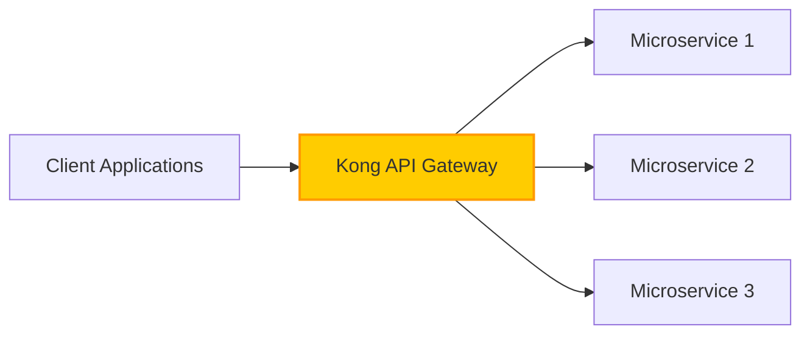
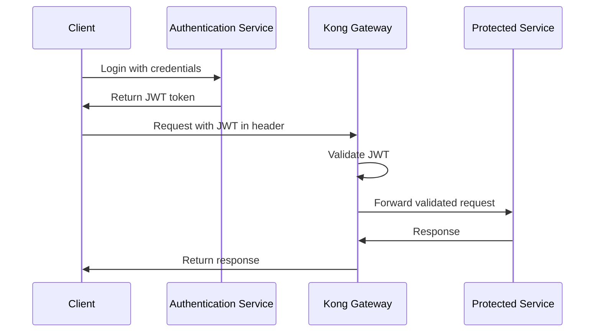
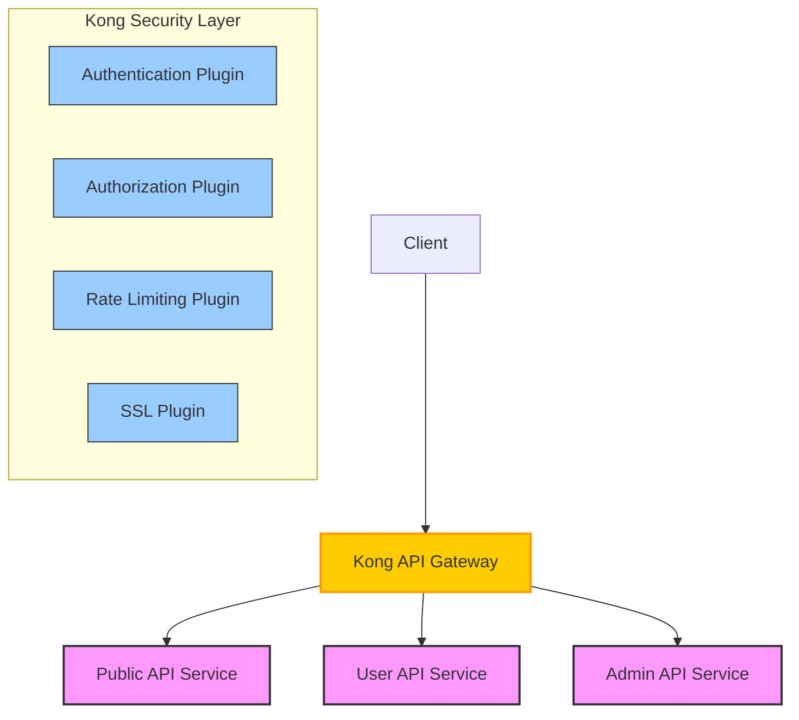

# Kong Security Layer

## Introduction

When building modern applications with microservices, securing your APIs becomes a critical concern. Rather than implementing security controls in each service, Kong Gateway allows you to centralize security at the API gateway level. This approach, called a **security layer**, provides consistent protection across all your services and simplifies security management.

In this guide, we'll explore how to implement a comprehensive security layer using Kong Gateway, allowing you to protect your microservices architecture with industry-standard security controls.

## What is Kong Gateway?

Before diving into security, let's briefly understand what Kong Gateway is:

Kong is an open-source API gateway built for microservices and distributed architectures. It sits in front of your APIs and microservices, routing client requests to the appropriate services while providing critical cross-cutting concerns like:

- Authentication
- Authorization
- Rate limiting
- Request/response transformation
- Logging and monitoring



## Kong Security Plugins

Kong uses a plugin architecture to extend its functionality. Here are the key security plugins we'll cover:

1. **Authentication plugins** - Verify the identity of clients
2. **Authorization plugins** - Control access to protected resources
3. **Traffic control** - Protect against abuse and attacks
4. **Data protection** - Ensure data integrity and privacy

Let's explore each category in detail.

## Authentication in Kong

Authentication verifies the identity of clients making requests to your APIs. Kong offers several authentication methods:

### Key Authentication

The simplest form of authentication using API keys.

#### Configuration

```bash
# Create a consumer
curl -X POST http://localhost:8001/consumers/ \
    --data "username=my-user"

# Create an API key for the consumer
curl -X POST http://localhost:8001/consumers/my-user/key-auth \
    --data "key=my-secret-key"

# Enable key-auth plugin on a service or route
curl -X POST http://localhost:8001/services/my-service/plugins \
    --data "name=key-auth"
```

#### Usage

Clients must include the key in their requests:

```bash
# Making a request with the API key
curl -X GET http://localhost:8000/my-api \
    --header "apikey: my-secret-key"
```

### JWT Authentication

For more secure authentication using JSON Web Tokens.

#### Configuration

```bash
# Create a consumer
curl -X POST http://localhost:8001/consumers/ \
    --data "username=jwt-user"

# Create JWT credentials
curl -X POST http://localhost:8001/consumers/jwt-user/jwt \
    --data "algorithm=HS256" \
    --data "secret=my-jwt-secret"

# Enable JWT plugin on a service
curl -X POST http://localhost:8001/services/my-service/plugins \
    --data "name=jwt"
```

#### Example JWT Token Flow



### OAuth 2.0 Authentication

For delegated authentication scenarios:

```bash
# Enable OAuth 2.0 plugin
curl -X POST http://localhost:8001/services/my-service/plugins \
    --data "name=oauth2" \
    --data "config.enable_authorization_code=true" \
    --data "config.scopes=email,profile" \
    --data "config.mandatory_scope=true"
```

## Authorization with Kong

After authenticating users, you need to control what they can access:

### ACL (Access Control List)

Define groups and restrict access based on group membership:

```bash
# Create an ACL group
curl -X POST http://localhost:8001/consumers/my-user/acls \
    --data "group=admin"

# Enable ACL plugin to allow only the admin group
curl -X POST http://localhost:8001/services/my-service/plugins \
    --data "name=acl" \
    --data "config.allow=admin"
```

### Role-Based Access Control with Kong Enterprise

For more advanced scenarios, Kong Enterprise provides RBAC:

```bash
# Using the Kong Admin API to configure RBAC
curl -X POST http://localhost:8001/rbac/roles/ \
    --data "name=api-reader" \
    --data "comment=Can read API data"
```

## Traffic Control for Security

Protecting your APIs from abuse and attacks:

### Rate Limiting

Prevent abuse by limiting request frequency:

```bash
# Add rate limiting plugin
curl -X POST http://localhost:8001/services/my-service/plugins \
    --data "name=rate-limiting" \
    --data "config.minute=5" \
    --data "config.policy=local"
```

This configuration limits clients to 5 requests per minute.

#### Example Rate Limiting Behavior

```
// First 5 requests
HTTP/1.1 200 OK

// 6th request within same minute
HTTP/1.1 429 Too Many Requests
X-RateLimit-Limit-Minute: 5
X-RateLimit-Remaining-Minute: 0
```

### IP Restriction

Block or allow specific IP addresses:

```bash
# Allow only specific IPs
curl -X POST http://localhost:8001/services/my-service/plugins \
    --data "name=ip-restriction" \
    --data "config.allow=192.168.1.1,192.168.1.2"
```

### Bot Detection

Protect against malicious bots:

```bash
# Enable bot detection
curl -X POST http://localhost:8001/services/my-service/plugins \
    --data "name=bot-detection" \
    --data "config.deny=curl"
```

## Data Protection

Securing the data flowing through your APIs:

### SSL/TLS Encryption

Force HTTPS for all traffic:

```bash
# Enable SSL plugin
curl -X POST http://localhost:8001/services/my-service/plugins \
    --data "name=ssl" \
    --data "config.only_https=true"
```

### Request Transformer

Sanitize incoming data to prevent injection attacks:

```bash
# Configure request transformer
curl -X POST http://localhost:8001/services/my-service/plugins \
    --data "name=request-transformer" \
    --data "config.remove.headers=x-forwarded-proto" \
    --data "config.replace.headers[1].x-forwarded-proto=https"
```

## Real-World Example: Building a Secure API Gateway

Let's put everything together with a practical example of securing a microservices architecture:

### Scenario

You have three microservices:
- Public API (no authentication required)
- User API (requires authentication)
- Admin API (requires authentication + admin role)

### Step 1: Set up Services and Routes

```bash
# Create services
curl -X POST http://localhost:8001/services/ \
    --data "name=public-api" \
    --data "url=http://public-service:3000"

curl -X POST http://localhost:8001/services/ \
    --data "name=user-api" \
    --data "url=http://user-service:3000"

curl -X POST http://localhost:8001/services/ \
    --data "name=admin-api" \
    --data "url=http://admin-service:3000"

# Create routes
curl -X POST http://localhost:8001/services/public-api/routes \
    --data "name=public" \
    --data "paths[]=/public"

curl -X POST http://localhost:8001/services/user-api/routes \
    --data "name=user" \
    --data "paths[]=/user"

curl -X POST http://localhost:8001/services/admin-api/routes \
    --data "name=admin" \
    --data "paths[]=/admin"
```

### Step 2: Apply Security Plugins

```bash
# Rate limiting for all APIs
curl -X POST http://localhost:8001/services/public-api/plugins \
    --data "name=rate-limiting" \
    --data "config.minute=60"

curl -X POST http://localhost:8001/services/user-api/plugins \
    --data "name=rate-limiting" \
    --data "config.minute=30"

curl -X POST http://localhost:8001/services/admin-api/plugins \
    --data "name=rate-limiting" \
    --data "config.minute=20"

# JWT auth for user and admin APIs
curl -X POST http://localhost:8001/services/user-api/plugins \
    --data "name=jwt"

curl -X POST http://localhost:8001/services/admin-api/plugins \
    --data "name=jwt"

# ACL for admin API
curl -X POST http://localhost:8001/services/admin-api/plugins \
    --data "name=acl" \
    --data "config.allow=admin"
```

### Step 3: Create Consumers and Credentials

```bash
# Create regular user
curl -X POST http://localhost:8001/consumers/ \
    --data "username=regular-user"

# Create JWT credentials for regular user
curl -X POST http://localhost:8001/consumers/regular-user/jwt \
    --data "algorithm=HS256" \
    --data "secret=user-secret"

# Create admin user
curl -X POST http://localhost:8001/consumers/ \
    --data "username=admin-user"

# Create JWT credentials for admin user
curl -X POST http://localhost:8001/consumers/admin-user/jwt \
    --data "algorithm=HS256" \
    --data "secret=admin-secret"

# Add admin user to the admin group
curl -X POST http://localhost:8001/consumers/admin-user/acls \
    --data "group=admin"
```

### Complete Architecture



## Best Practices for Kong Security

1. **Layer your security**: Combine multiple security plugins for defense in depth.
2. **Use HTTPS everywhere**: Encrypt all traffic between clients and Kong, and between Kong and your services.
3. **Implement proper rate limiting**: Protect against DDoS attacks and abusive clients.
4. **Regular auditing**: Monitor plugin configurations and access logs regularly.
5. **Keep Kong updated**: Regularly update to the latest stable version to benefit from security patches.
6. **Use strong authentication methods**: Prefer JWT or OAuth2 over simple API keys for sensitive APIs.
7. **Separate concerns**: Use different Kong workspaces or instances for different environments (dev, staging, production).

## Troubleshooting Security Issues

Common issues you might encounter:

### Authentication Failures

If clients can't authenticate:

1. Check the request headers match the expected format for the authentication plugin
2. Verify the consumer and credentials exist in Kong
3. Check Kong's logs for more details:

```bash
# Check Kong's error logs
tail -f /usr/local/kong/logs/error.log
```

### Rate Limiting Issues

If you're seeing unexpected rate limiting behavior:

1. Check the Redis connection if using a Redis policy
2. Verify the rate limiting configuration with:

```bash
# Get plugin configuration
curl -X GET http://localhost:8001/services/my-service/plugins
```

## Summary

In this guide, we've explored how to implement a comprehensive security layer with Kong Gateway:

- We learned about various authentication methods (API keys, JWT, OAuth2)
- We configured authorization controls using ACL
- We implemented traffic protection with rate limiting and IP restrictions
- We secured data with SSL and request transformations
- We built a complete example securing three different types of APIs

By centralizing security at the API gateway level with Kong, you can ensure consistent protection across all your microservices while reducing the complexity of your individual services.

## Exercises

1. Set up a local Kong instance and secure a demo API with JWT authentication.
2. Configure rate limiting with different tiers for anonymous users vs. authenticated users.
3. Implement a complete security solution for a sample microservices architecture with at least three services requiring different levels of protection.
4. Use the Kong Admin API to create a script that automatically configures your security plugins.

## Additional Resources

- [Kong Documentation](https://docs.konghq.com/)
- [Kong Security Plugins Overview](https://docs.konghq.com/hub/#security)
- [Kong Gateway OSS vs. Enterprise](https://konghq.com/products/kong-gateway)
- [API Security Best Practices](https://owasp.org/www-project-api-security/)