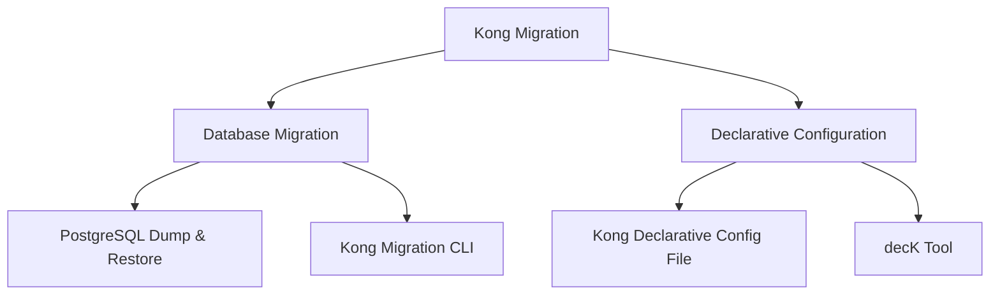

# Kong Migration Project

## Introduction

The Kong Migration Project is designed to help you safely and efficiently move your Kong API Gateway configurations between different environments. Kong is a popular open-source API gateway that manages API traffic, but as your applications grow, you'll need to transfer configurations across development, testing, and production environments. This guide will walk you through the entire migration process, making it accessible even if you're new to Kong or API gateways.

## What is Kong?

[Kong](https://konghq.com/) is an API gateway built on NGINX that sits in front of your APIs, acting as a traffic manager. It offers features like:

- Request routing
- Authentication
- Rate limiting
- Analytics
- Load balancing
- And much more through plugins

## Why Migration Matters

As your API infrastructure grows, you'll need to:

- Move configurations from development to testing to production
- Back up your Kong configurations
- Share setups between team members
- Scale your infrastructure across multiple data centers

A proper migration strategy ensures these transitions happen smoothly without disrupting your services.

## Migration Approaches

There are two main approaches to Kong migrations:



Let's explore each method in detail.

## Approach 1: Database Migration

Kong stores its configuration in a database (PostgreSQL or Cassandra). One migration strategy involves directly transferring the database.

### Using PostgreSQL Dump & Restore

If you're using PostgreSQL with Kong:

```bash
# On the source environment
pg_dump -U kong -d kong > kong_backup.sql

# On the target environment
psql -U kong -d kong < kong_backup.sql
```

**Note:** This approach requires careful handling of database versions and Kong versions across environments.

### Using Kong Migration CLI

Kong provides migration tools to handle database schema changes:

```bash
# Check current database schema status
kong migrations status

# Run migrations up to the latest version
kong migrations up

# Finish the migrations process
kong migrations finish
```

## Approach 2: Declarative Configuration (Recommended for Beginners)

The recommended approach for beginners is using Kong's declarative configuration, which allows you to define your entire Kong configuration in a single YAML file.

### Step 1: Export Your Current Configuration

First, export your existing Kong configuration:

```bash
# Export current configuration to kong.yaml
kong config db_export kong.yaml
```

This creates a YAML file containing all your services, routes, plugins, and consumers.

### Example Output File

Here's a simplified example of what the exported YAML might look like:

```yaml
_format_version: "3.0"
services:
- name: example-service
  url: http://example-api.com
  routes:
  - name: example-route
    paths:
    - /example
  plugins:
  - name: rate-limiting
    config:
      minute: 5
      policy: local
consumers:
- username: example-user
  custom_id: user-123
  keyauth_credentials:
  - key: secret-api-key
```

### Step 2: Modify the Configuration (if needed)

You can edit the YAML file to adjust settings for the target environment:

```yaml
_format_version: "3.0"
services:
- name: example-service
  url: http://production-api.com  # Changed from http://example-api.com
  routes:
  - name: example-route
    paths:
    - /example
```

### Step 3: Import Configuration to the Target Environment

Upload your configuration to the target Kong instance:

```bash
# Apply the configuration
kong config db_import kong.yaml
```

### Step 4: Verify the Migration

Check if your services and routes were properly imported:

```bash
# List all services
curl http://localhost:8001/services

# List all routes
curl http://localhost:8001/routes
```

## Using decK for Advanced Migration

For more complex migrations, Kong's [decK](https://github.com/Kong/deck) tool provides powerful capabilities:

```bash
# Install decK
# On macOS
brew install kong/deck/deck

# On Linux
curl -sL https://github.com/Kong/deck/releases/latest/download/deck_`uname -s`_`uname -m`.tar.gz | tar xz -C /tmp/
sudo cp /tmp/deck /usr/local/bin/

# Export Kong configuration
deck dump --output-file kong.yaml

# Validate configuration
deck validate --state kong.yaml

# Import configuration to target Kong instance
deck sync --state kong.yaml
```

decK can detect differences between environments and synchronize configurations, making it ideal for CI/CD pipelines.

## Real-World Project: Migrating from Development to Production

Let's walk through a complete example of migrating a simple API from development to production.

### Scenario

You've built an e-commerce API with the following components:
- Product catalog service
- User authentication
- Rate limiting for public endpoints

### Step 1: Export Development Configuration

```bash
# Using decK
deck dump --output-file ecommerce-dev.yaml
```

### Step 2: Review and Modify for Production

Open `ecommerce-dev.yaml` and make necessary changes:

```yaml
_format_version: "3.0"
services:
- name: product-catalog
  url: https://prod-catalog-api.example.com  # Updated URL
  retries: 5  # Increased for production reliability
  routes:
  - name: product-route
    paths:
    - /products
    - /categories
  plugins:
  - name: rate-limiting
    config:
      minute: 60  # Increased limit for production
      policy: redis  # Changed from local to redis for clustering
      redis_host: redis.production  # Added production Redis details
```

### Step 3: Apply to Production

```bash
# Using decK to apply to production Kong
deck sync --state ecommerce-dev.yaml --kong-addr https://kong-admin-prod.example.com
```

### Step 4: Verify Services

```bash
# Test the product API endpoint
curl -i https://api.example.com/products

# Verify rate limiting headers
curl -i -H "apikey: YOUR_API_KEY" https://api.example.com/products
```

## Best Practices for Kong Migration

1. **Version Control**: Store your Kong configuration YAML files in Git or another version control system.

2. **Environment Variables**: Use environment variables for sensitive information:

```yaml
services:
- name: auth-service
  url: "${AUTH_SERVICE_URL}"
```

3. **Incremental Migration**: For large setups, migrate one service at a time to minimize risk.

4. **Backup Before Migration**: Always backup your current Kong database before migration:

```bash
deck dump --output-file kong-backup-$(date +%Y%m%d).yaml
```

5. **Testing After Migration**: Create automated tests to verify your Kong setup works as expected after migration.

6. **Documentation**: Document your Kong setup and migration process for your team.

## Debugging Migration Issues

If you encounter problems during migration:

1. **Check Kong Logs**:

```bash
tail -f /usr/local/kong/logs/error.log
```

2. **Verify Kong Configuration**:

```bash
curl http://localhost:8001 | jq
```

3. **Compare Configurations**:

```bash
deck diff --state kong.yaml --kong-addr http://localhost:8001
```

4. **Check Kong Status**:

```bash
kong health
```

## Summary

In this guide, we've covered:

1. What Kong API Gateway is and why migration matters
2. Different approaches to Kong migration
3. Step-by-step instructions for exporting and importing Kong configurations
4. A real-world example of migrating from development to production
5. Best practices for Kong migration projects
6. Debugging techniques for migration issues

By following this guide, you'll be able to safely migrate your Kong configurations between environments, ensuring your API infrastructure remains consistent and reliable.

## Exercises

1. Set up a local Kong instance and create two services and routes.
2. Export the configuration using both `kong config db_export` and `deck dump`.
3. Clear your Kong database and restore the configuration using the exported files.
4. Create a migration plan for moving a hypothetical microservice architecture from staging to production.
5. Research how to use environment variables with decK to manage environment-specific values.

## Additional Resources

- [Kong Documentation](https://docs.konghq.com/)
- [decK GitHub Repository](https://github.com/Kong/deck)
- [Kong GitHub Repository](https://github.com/Kong/kong)
- [Kong Nation Community](https://discuss.konghq.com/)