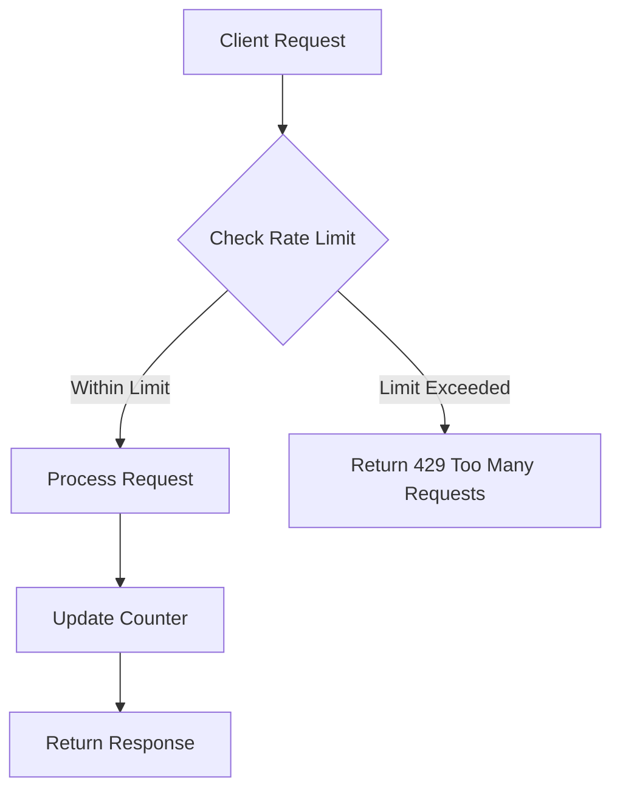

# Kong Rate Limiting

## Introduction

Rate limiting is a crucial technique in API management that helps control the flow of incoming requests to your services. Kong, a popular API gateway, provides powerful rate limiting capabilities that allow you to protect your backend services from being overwhelmed with too many requests, prevent abuse, and ensure fair usage among clients.

In this guide, we'll explore the Kong Rate Limiting plugin - what it is, why it's important, and how to implement it in your Kong gateway. Whether you're managing a high-traffic API or just getting started with API management, understanding rate limiting in Kong will help you build more resilient services.

## What is Rate Limiting?

Rate limiting restricts how many requests a client can make to your API within a specified time period. When the limit is reached, subsequent requests are typically blocked until the time window resets.



Kong's rate limiting plugin allows you to define various rules for how requests are counted and limited, giving you fine-grained control over your API traffic.

## Why Use Rate Limiting?

Rate limiting serves several important purposes:

1. **Prevents Service Overload**: Protects your backend services from traffic spikes
2. **Defends Against Attacks**: Helps mitigate certain types of DDoS attacks
3. **Ensures Fair Usage**: Prevents any single client from consuming too many resources
4. **Manages Costs**: Helps control infrastructure costs by limiting request volume
5. **Enforces Tiered Access**: Enables different rate limits for different subscription tiers

## Kong Rate Limiting Plugin

Kong provides a powerful rate limiting plugin that can be applied at various levels:

- Globally across all services
- On specific services
- On specific routes
- For specific consumers (authenticated users/applications)

### Basic Configuration

To enable rate limiting on a service or route, you can use the Kong Admin API or declarative configuration. Here's a basic example using the Admin API:

```bash
# Apply rate limiting to a service
curl -X POST http://localhost:8001/services/my-service/plugins \
  --data "name=rate-limiting" \
  --data "config.minute=100" \
  --data "config.hour=1000"
```

This configuration limits requests to:
- 100 requests per minute
- 1000 requests per hour

### Configuration in Kong YAML (Declarative)

If you're using declarative configuration with Kong, you can define rate limiting in your `kong.yml` file:

```yaml
services:
- name: my-api
  url: http://my-api.internal:8000
  plugins:
  - name: rate-limiting
    config:
      minute: 100
      hour: 1000
      policy: local
```

## Configuration Options

Kong's rate limiting plugin offers various configuration options:

### Time Windows

You can specify limits for different time windows:

- `second`: Requests per second
- `minute`: Requests per minute
- `hour`: Requests per hour
- `day`: Requests per day
- `month`: Requests per month

### Storage Policies

Kong supports different strategies for storing and counting rate limit information:

1. **local**: Stores counters locally in-memory on the node
2. **cluster**: Uses Kong's cluster-wide storage (Cassandra or PostgreSQL)
3. **redis**: Uses an external Redis server for counter storage
4. **redis-sentinel**: Uses Redis Sentinel for higher availability

Example with Redis:

```bash
curl -X POST http://localhost:8001/services/my-service/plugins \
  --data "name=rate-limiting" \
  --data "config.minute=100" \
  --data "config.policy=redis" \
  --data "config.redis_host=redis-server" \
  --data "config.redis_port=6379"
```

### Limiting by Consumer or Client IP

You can choose how Kong identifies clients for rate limiting:

- `consumer`: Limits by authenticated consumer
- `credential`: Limits by credential (e.g., API key)
- `ip`: Limits by client IP address
- `service`: Applies a single limit to the entire service (regardless of consumer or IP)

Example limiting by consumer:

```bash
curl -X POST http://localhost:8001/services/my-service/plugins \
  --data "name=rate-limiting" \
  --data "config.minute=100" \
  --data "config.limit_by=consumer"
```

## Response Headers

When rate limiting is enabled, Kong adds several headers to API responses:

- `X-RateLimit-Limit-<window>`: The configured request limit for the current window
- `X-RateLimit-Remaining-<window>`: The remaining number of requests allowed
- `X-RateLimit-Reset`: The time (in seconds) until the next window reset

For example:

```
HTTP/1.1 200 OK
X-RateLimit-Limit-Minute: 100
X-RateLimit-Remaining-Minute: 95
X-RateLimit-Reset: 55
```

Clients can use these headers to adapt their request rate and avoid hitting limits.

## Handling Rate Limit Violations

When a client exceeds the rate limit, Kong responds with:

- HTTP status code `429 Too Many Requests`
- A simple error message in the response body
- Rate limit headers showing when the client can try again

Example response:

```
HTTP/1.1 429 Too Many Requests
Content-Type: application/json
Retry-After: 30
X-RateLimit-Limit-Minute: 100
X-RateLimit-Remaining-Minute: 0
X-RateLimit-Reset: 30

{
  "message": "API rate limit exceeded"
}
```

## Advanced Use Cases

### Tiered Rate Limiting

You can implement different rate limits for different consumers by creating consumer groups or using plugins scoped to specific consumers:

```bash
# Higher limit for premium consumer
curl -X POST http://localhost:8001/consumers/premium-user/plugins \
  --data "name=rate-limiting" \
  --data "config.minute=1000"

# Default limit for service
curl -X POST http://localhost:8001/services/my-service/plugins \
  --data "name=rate-limiting" \
  --data "config.minute=100"
```

### Combining with Other Plugins

Rate limiting works well with other Kong plugins:

- **Request Transformer**: Modify requests before they count against limits
- **Response Transformer**: Customize rate limit violation responses
- **Key Authentication**: Identify consumers for tiered rate limiting
- **Proxy Cache**: Cache responses to reduce the need for rate limiting

## Practical Example: API with Multiple Tiers

Let's walk through a complete example of setting up a REST API with multiple service tiers:

1. First, create a service for your API:

```bash
curl -X POST http://localhost:8001/services \
  --data "name=product-api" \
  --data "url=http://internal-product-service:8000"
```

2. Create a route for the service:

```bash
curl -X POST http://localhost:8001/services/product-api/routes \
  --data "name=product-route" \
  --data "paths[]=/products"
```

3. Set up basic authentication:

```bash
curl -X POST http://localhost:8001/services/product-api/plugins \
  --data "name=basic-auth" \
  --data "config.hide_credentials=true"
```

4. Create different consumers for different tiers:

```bash
# Create free tier consumer
curl -X POST http://localhost:8001/consumers \
  --data "username=free-tier"

# Add credentials
curl -X POST http://localhost:8001/consumers/free-tier/basic-auth \
  --data "username=free" \
  --data "password=password"

# Create premium tier consumer
curl -X POST http://localhost:8001/consumers \
  --data "username=premium-tier"

# Add credentials
curl -X POST http://localhost:8001/consumers/premium-tier/basic-auth \
  --data "username=premium" \
  --data "password=password"
```

5. Apply different rate limits for each tier:

```bash
# Free tier: 10 req/min
curl -X POST http://localhost:8001/consumers/free-tier/plugins \
  --data "name=rate-limiting" \
  --data "config.minute=10"

# Premium tier: 1000 req/min
curl -X POST http://localhost:8001/consumers/premium-tier/plugins \
  --data "name=rate-limiting" \
  --data "config.minute=1000"
```

6. Test the tiers:

```bash
# Free tier (limit: 10/min)
for i in {1..15}; do
  curl -i -u free:password http://localhost:8000/products
done

# Premium tier (limit: 1000/min)
for i in {1..15}; do
  curl -i -u premium:password http://localhost:8000/products
done
```

The free tier will receive a 429 error after 10 requests, while the premium tier can continue making requests.

## Troubleshooting Rate Limiting

### Common Issues

1. **Rate limiting not working**:
   - Check if the plugin is properly configured
   - Verify the plugin is applied to the correct service/route
   - Check if `limit_by` is configured correctly

2. **Unexpected 429 responses**:
   - Review your rate limit settings
   - Check if you're using Kong behind a load balancer (might need to configure trusted IPs)
   - Verify the time on Kong nodes is synchronized

3. **Inconsistent limits in a cluster**:
   - Use `cluster` or `redis` policy instead of `local` for consistent counting

### Debugging

Enable verbose logging to troubleshoot rate limiting issues:

```bash
curl -X PATCH http://localhost:8001/services/my-service/plugins/{plugin-id} \
  --data "config.debug=true"
```

## Summary

Kong's rate limiting plugin provides a flexible and powerful way to control traffic to your APIs. By implementing rate limiting, you can protect your services from overload, ensure fair usage among clients, and create tiered access plans for different types of consumers.

Key points to remember:

- Rate limiting restricts the number of requests within a time window
- Kong offers multiple time windows (second, minute, hour, day, month)
- Different storage policies support various deployment scenarios
- You can limit by consumer, credential, IP, or service
- Response headers help clients adapt to limits
- Combine with authentication plugins for tiered access

## Additional Resources

To learn more about Kong rate limiting:

- Kong Rate Limiting Plugin Documentation
- Kong Enterprise Rate Limiting Advanced Plugin (for enterprise users)
- Kong Vitals (for monitoring rate limiting effects)

## Exercises

1. Set up a basic Kong gateway with rate limiting on a simple API
2. Implement different rate limits for authenticated vs. unauthenticated users
3. Create a tiered API with free, basic, and premium access levels
4. Configure Redis as a storage backend for rate limiting in a multi-node Kong cluster
5. Build a client application that respects rate limit headers and implements backoff strategies