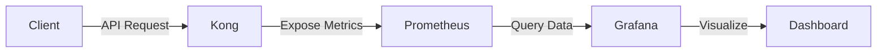

# Kong Traffic Analytics

## Introduction

Kong is a popular open-source API gateway that helps you manage, secure, and optimize your API traffic. One of its most powerful features is the ability to collect and analyze traffic data, which is essential for understanding how your APIs are being used, identifying performance bottlenecks, and making data-driven decisions to improve your services.

In this guide, we'll explore Kong Traffic Analytics - a comprehensive approach to monitoring and analyzing API traffic through the Kong gateway. By the end of this tutorial, you'll understand how to set up traffic analytics in Kong, interpret the data, and use these insights to optimize your API infrastructure.

## Why Traffic Analytics Matters

Before diving into implementation, let's understand why traffic analytics is crucial for API management:

1. **Performance Monitoring**: Track response times, request rates, and error rates to ensure optimal API performance
2. **Troubleshooting**: Quickly identify and resolve issues by analyzing traffic patterns
3. **Capacity Planning**: Use historical data to predict future resource needs
4. **Business Insights**: Understand which APIs are most used and valuable to your organization
5. **Security**: Detect unusual traffic patterns that might indicate security threats

## Setting Up Kong for Traffic Analytics

### Prerequisites

Before we begin, make sure you have:

- Kong Gateway installed (version 2.0 or later)
- Basic understanding of Kong configuration
- Admin access to your Kong instance

### Traffic Analytics Methods in Kong

Kong offers several approaches to analytics:

1. **Built-in Metrics**: Basic metrics available through Kong's Admin API
2. **Plugins**: Enhanced analytics through plugins like Prometheus, StatsD, or DataDog
3. **Kong Enterprise**: Advanced analytics dashboard with Kong Enterprise edition
4. **Log Processing**: Custom analytics by processing Kong access logs

Let's explore each of these methods:

## Method 1: Using Kong's Built-in Metrics

Kong provides basic traffic information through its Admin API. This is the simplest way to get started with analytics.

### Accessing Basic Metrics

```bash
# Get basic node status information
curl -s http://kong:8001/status

# Get information about all services
curl -s http://kong:8001/services

# Get information about all routes
curl -s http://kong:8001/routes
```

The output will look something like this:

```json
{
  "database": {
    "reachable": true
  },
  "server": {
    "connections_accepted": 12,
    "connections_active": 2,
    "connections_handled": 12,
    "connections_reading": 0,
    "connections_waiting": 1,
    "connections_writing": 1,
    "total_requests": 25
  }
}
```

While basic, these metrics give you a quick overview of your Kong gateway's health and usage.

## Method 2: Using Plugins for Enhanced Analytics

Kong's plugin architecture allows for more sophisticated analytics. Let's explore some popular options:

### The Prometheus Plugin

Prometheus is a powerful monitoring and alerting toolkit that integrates well with Kong.

#### Installation and Configuration

```bash
# Enable the Prometheus plugin globally
curl -X POST http://kong:8001/plugins \
  --data "name=prometheus"
```

Alternatively, you can enable it for a specific service:

```bash
# Enable Prometheus for a specific service
curl -X POST http://kong:8001/services/my-service/plugins \
  --data "name=prometheus"
```

Once enabled, Kong exposes metrics at the `/metrics` endpoint:

```bash
# Access Prometheus metrics
curl http://kong:8001/metrics
```

Sample output:

```
# HELP kong_http_status HTTP status codes
# TYPE kong_http_status counter
kong_http_status{code="200",service="users-api"} 5
kong_http_status{code="404",service="users-api"} 1
kong_http_status{code="500",service="orders-api"} 2

# HELP kong_latency Latency added by Kong
# TYPE kong_latency histogram
kong_latency_bucket{type="kong",service="users-api",le="1"} 2
kong_latency_bucket{type="kong",service="users-api",le="2"} 3
...
```

#### Visualizing Prometheus Data with Grafana

For a complete analytics solution, you can connect Prometheus to Grafana for visualization:

```yaml
# prometheus.yml configuration
scrape_configs:
  - job_name: 'kong'
    scrape_interval: 5s
    static_configs:
      - targets: ['kong:8001']
```

Here's a simple diagram of how this setup works:



### The StatsD Plugin

StatsD is another popular option for collecting and aggregating metrics.

#### Configuration

```bash
# Enable the StatsD plugin
curl -X POST http://kong:8001/plugins \
  --data "name=statsd" \
  --data "config.host=statsd-server" \
  --data "config.port=8125" \
  --data "config.metrics=request_count,request_size,response_size,latency,status_count,unique_users,request_per_user,upstream_latency"
```

This setup sends metrics to your StatsD server, which can then forward them to various visualization tools.

## Method 3: Kong Enterprise Analytics

If you're using Kong Enterprise, you have access to a built-in analytics dashboard called Kong Vitals.

### Key Features of Kong Vitals

- Real-time traffic visualization
- Status code distribution
- Cache performance metrics
- Consumer activity analysis
- API traffic heatmaps

While we can't provide a hands-on example (as it requires a Kong Enterprise license), the configuration is typically as simple as:

```bash
# Enable Vitals in Kong Enterprise
curl -X PATCH http://kong:8001/vitals/config \
  --data "enabled=true" \
  --data "statsd_prefix=kong"
```

## Method 4: Custom Analytics with Log Processing

For maximum flexibility, you can process Kong access logs to build custom analytics.

### Configuring Enhanced Logging

First, let's configure Kong to produce detailed JSON logs:

```bash
# Update Kong configuration to use JSON format
echo 'log_format = json' >> /etc/kong/kong.conf
```

Then restart Kong:

```bash
kong restart
```

Now, you can use tools like Elastic Stack (ELK) to process these logs:

```yaml
# Logstash configuration example
input {
  file {
    path => "/usr/local/kong/logs/access.log"
    codec => "json"
  }
}

filter {
  # Process and enhance log data
  mutate {
    add_field => { "api_name" => "%{service_name}" }
  }
  date {
    match => ["started_at", "ISO8601"]
  }
}

output {
  elasticsearch {
    hosts => ["elasticsearch:9200"]
    index => "kong-analytics-%{+YYYY.MM.dd}"
  }
}
```

With this setup, you can build powerful custom dashboards in Kibana:


## Real-World Examples

Let's look at some practical applications of Kong Traffic Analytics:

### Example 1: Identifying Performance Bottlenecks

Imagine you're running an e-commerce platform with multiple microservices. Customers are reporting slow checkout times.

Using Kong Traffic Analytics, you notice that the `payment-service` has abnormally high latency during peak hours:

```javascript
// Kong Prometheus metrics reveal:
kong_upstream_latency_bucket{service="payment-service",le="500"} 200
kong_upstream_latency_bucket{service="payment-service",le="1000"} 550
kong_upstream_latency_bucket{service="payment-service",le="2000"} 920
```

This data indicates that most requests to the payment service take between 500ms and 2000ms, which is too slow. With this information, you can:

1. Scale up the payment service resources
2. Implement caching for certain payment operations
3. Optimize database queries in the payment service

### Example 2: Rate Limiting Based on Analytics

After analyzing your traffic patterns, you notice that a small number of consumers are generating an unexpectedly high number of requests:

```javascript
// Daily requests per consumer:
User A: 50,000 requests
User B: 45,000 requests
User C: 2,500 requests
Average user: ~3,000 requests
```

Based on this data, you can implement dynamic rate limiting:

```bash
# Configure rate limiting plugin with reasonable thresholds
curl -X POST http://kong:8001/plugins \
  --data "name=rate-limiting" \
  --data "config.minute=60" \
  --data "config.hour=3600" \
  --data "config.policy=local"
```

This ensures fair API usage and protects your services from being overwhelmed.

### Example 3: Business Decision Making

Your company offers both free and premium API tiers. Using traffic analytics, you can evaluate the adoption and usage of different features:

```javascript
// Feature usage across tiers:
{
  "features": {
    "basic-search": {
      "free_tier": 45000,
      "premium_tier": 12000
    },
    "advanced-search": {
      "free_tier": 100,  // Limited in free tier
      "premium_tier": 25000
    }
  }
}
```

This data might suggest that:
1. The "advanced-search" feature is valuable and driving premium subscriptions
2. You might consider limiting the "basic-search" feature in the free tier to encourage upgrades

## Building a Simple Analytics Dashboard

Let's create a simple Node.js application that displays Kong analytics:

```javascript
const express = require('express');
const axios = require('axios');
const app = express();
const port = 3000;

// Kong Admin API URL
const KONG_ADMIN_URL = 'http://kong:8001';

app.get('/dashboard', async (req, res) => {
  try {
    // Get Kong status
    const statusResponse = await axios.get(`${KONG_ADMIN_URL}/status`);
    
    // Get all services
    const servicesResponse = await axios.get(`${KONG_ADMIN_URL}/services`);
    
    // Get all routes
    const routesResponse = await axios.get(`${KONG_ADMIN_URL}/routes`);
    
    // Compile dashboard data
    const dashboardData = {
      serverStatus: statusResponse.data.server,
      services: servicesResponse.data.data,
      routes: routesResponse.data.data,
      timestamp: new Date().toISOString()
    };
    
    res.json(dashboardData);
  } catch (error) {
    console.error('Error fetching Kong data:', error);
    res.status(500).send('Error generating dashboard');
  }
});

app.listen(port, () => {
  console.log(`Kong Analytics Dashboard running on port ${port}`);
});
```

## Best Practices for Kong Traffic Analytics

1. **Start Simple**: Begin with basic metrics before implementing complex analytics
2. **Sample Rate**: For high-traffic APIs, consider sampling to reduce overhead
3. **Retention Policy**: Define how long to store analytics data based on your needs
4. **Alerting**: Set up alerts for anomalies or performance thresholds
5. **Regular Review**: Schedule time to review analytics and make adjustments
6. **Privacy Compliance**: Ensure your analytics comply with regulations like GDPR
7. **Documentation**: Document your analytics setup for team knowledge sharing

## Troubleshooting Common Issues

| Issue | Possible Cause | Solution |
|-------|---------------|----------|
| Missing metrics | Plugin not properly configured | Verify plugin settings and Kong logs |
| High memory usage | Too many metrics being collected | Increase resources or reduce metrics collection |
| Inaccurate data | Clock synchronization issues | Ensure NTP is properly configured |
| Slow admin API | Too many simultaneous queries | Implement caching and rate limiting on the admin API |

## Summary

Kong Traffic Analytics provides valuable insights into your API traffic, helping you optimize performance, troubleshoot issues, and make data-driven decisions. In this guide, we've covered:

- The importance of traffic analytics for API management
- Different methods of implementing analytics in Kong
- Real-world examples and applications
- Best practices for effective analytics

By implementing proper traffic analytics in Kong, you can ensure your APIs are performing optimally and meeting the needs of your users.

## Additional Resources

- [Kong Documentation](https://docs.konghq.com/)
- [Prometheus Plugin](https://docs.konghq.com/hub/kong-inc/prometheus/)
- [StatsD Plugin](https://docs.konghq.com/hub/kong-inc/statsd/)
- [ELK Stack Documentation](https://www.elastic.co/guide/index.html)

## Exercises

1. Set up the Prometheus plugin and create a basic Grafana dashboard showing request rates and latencies.
2. Implement log processing with ELK stack and create a visualization of HTTP status codes per service.
3. Write a script that queries Kong's Admin API and sends alerts when error rates exceed a threshold.
4. Design a custom dashboard that combines metrics from Kong with business KPIs from your application.
5. Implement a dynamic rate limiting strategy based on real-time traffic patterns.